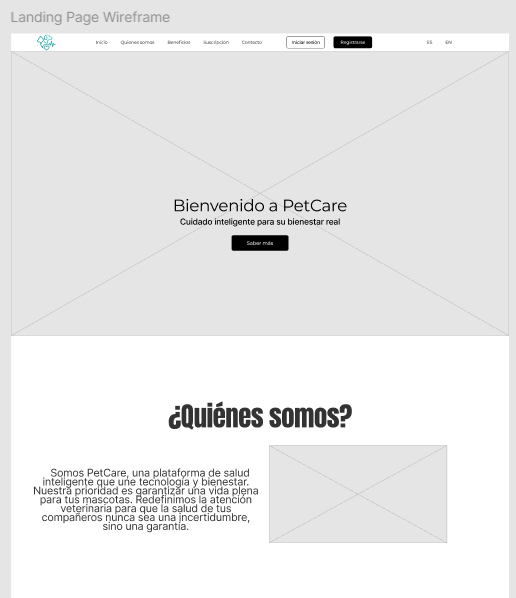
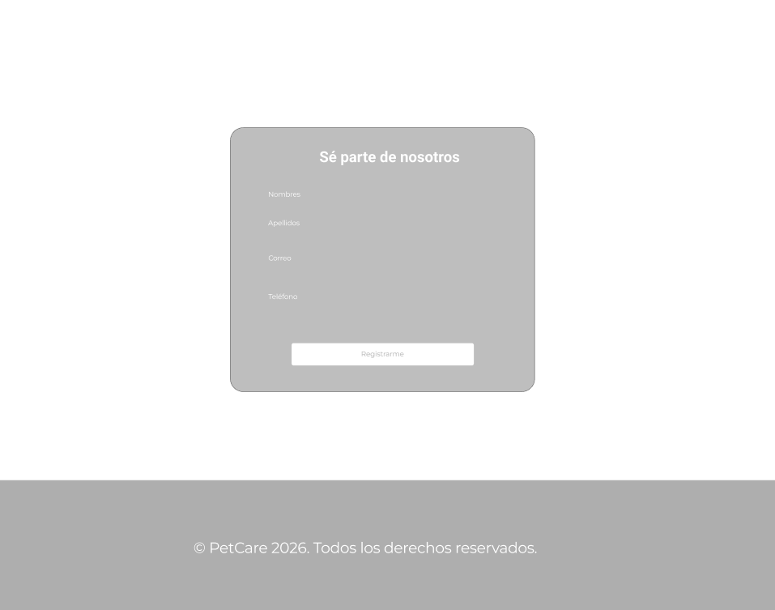
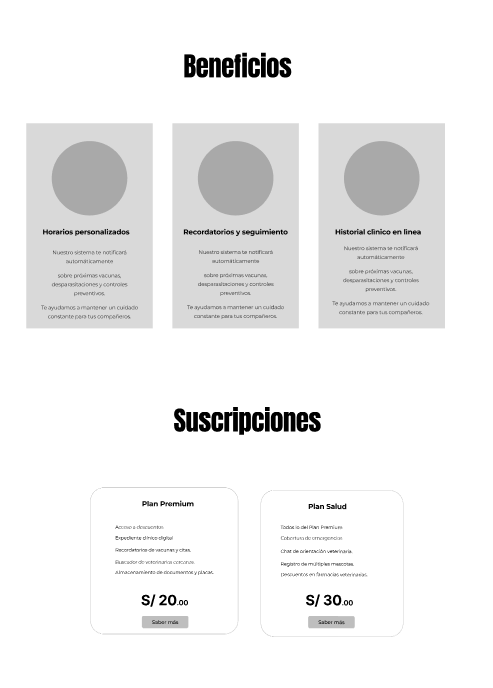

</img> 

<h3>Universidad Peruana de Ciencias Aplicadas</h3>
<h4>Facultad de Ingeniería</h4>
<h4>Carrera de Ingeniería de Software</h4>
<h4>Periodo 202610</h4>
<h4>1ASI0729 Desarrollo de Aplicaciones Open Source</h4>
<h4>NRC 11863</h4>
<h4>Docente: Ivan Robles Fernández</h4>
<h4>Informe del Trabajo Final</h4>
<h4>Startup: Co-Designers</h4>
<h4>Producto: </h4>

| **Código** | **Apellidos y Nombres**               |
| :--------: | :------------------------------------ |
| U20 | Mauricio Silva, Ghiou Justinn     |
| U20241E107 | Tuncar Vila, Ghorghet Saul|
| U20 |  Mejia Aliaga, Katherine Maryory     |
| U20 | Huaman De La Cruz, Jean Pool   |
| U20 | Campoblanco Guzman, Diego Roberto |

### Abril 2026

## Registro de Versiones del Informe

| Versión |  Fecha   |                                       Autor                                        |                                                  Descripción de modificación                                                   |
| :-----: | :------: | :--------------------------------------------------------------------------------: | :----------------------------------------------------------------------------------------------------------------------------: |
|   TB1   | 22/04/2026 | Todos | Avance del trabajo: Completando el contenido del Documento |
|   TP1   |            |       |                                                            |
|   TB2   |            |       |                                                            |
|   TF1   |            |       |                                                            |

## Project Report Collaboration Insights
A continuación, se detallan los repositorios utilizados a lo largo del proyecto:

#### Link del repositorio del Reporte:

- 

#### Link del repositorio de la Landing Page:

- 

#### Link del repositorio del Frontend:

- 

#### Link del repositorio del Backend:

- 

### **Entrega TB1:**
[text]

##### Participación por integrante:

- 

# Contenido

## Índice

- [Registro de versiones del informe](#registro-de-versiones-del-informe)

- [Project Report Collaboration Insights](#project-report-collaboration-insights)

- [Contenido](#contenido)

- [Student Outcome](#student-outcome-1)

- [Capítulo I: Introducción](#capitulo-i-introduccion)
  - [1.1. StartUp Profile](#11-startup-profile)
    - [1.1.1. Descripción de la StartUp](#111-descripción-de-la-startup)
    - [1.1.2. Perfiles de Integrantes del equipo](#112-perfiles-de-integrantes-del-equipo)
  - [1.2. Solution Profile](#12-solution-profile)
    - [1.2.1. Antecedentes y Problemática](#121-antecedentes-y-problemática)
    - [1.2.2. Lean UX Process](#122-lean-ux-process)
      - [1.2.2.1. Lean UX Problem Statements](#1221-lean-ux-problem-statements)
      - [1.2.2.2. Lean UX Assumptions](#1222-lean-ux-assumptions)
      - [1.2.2.3. Lean UX Hypothesis Statements](#1223-lean-ux-hyphotesis-statements)
      - [1.2.2.4. Lean UX Canvas](#1224-lean-ux-canvas)
  - [1.3. Segmentos objetivo](#13-segmentos-objetivo)
- [Capítulo II: Requirements Elicitation & Analysis]()
  - [2.1. Competidores](#21-competidores)
    - [2.1.1. Análisis competitivo](#211-análisis-competitivo)
    - [2.1.2. Estrategias y tácticas frente a competidores](#212-estrategias-y-tácticas-frente-a-competidores)
  - [2.2. Entrevistas](#22-entrevistas)
    - [2.2.1. Diseño de entrevistas](#221-diseño-de-entrevistas)
    - [2.2.2. Registro de entrevistas](#222-registro-de-entrevistas)
    - [2.2.3. Análisis de entrevistas](#223-análisis-de-entrevistas)
  - [2.3. Needfinding](#23-needfinding)
    - [2.3.1. User Persona](#231-user-persona)
    - [2.3.2. User Task Matrix](#232-user-task-matrix)
    - [2.3.3. User Journey Mapping](#233-user-journey-mapping)
    - [2.3.4. Empathy Mapping](#234-empathy-mapping)
  - [2.4 Big Picture Event Storming](#24-big-picture-event-storming)
  - [2.5 Ubiquitous Language](#25-ubiquitous-language)
- [Capítulo III: Requirements Specification]()
  - [3.1. User Stories](#31-user-stories)
  - [3.2. Impact Mapping](#32-impact-mapping)
  - [3.3. Product Backlog](#33-product-backlog)
- [Capítulo IV: Product Design]()
  - [4.1. Style Guidelines](#41-style-guidelines)
    - [4.1.1. General Style Guidelines](#411-general-style-guidelines)
    - [4.1.2. Web Style Guidelines](#412-web-style-guidelines)
  - [4.2. Information Architecture](#42-information-architecture)
    - [4.2.1. Organization Systems](#421-organization-systems)
    - [4.2.2. Labeling Systems](#422-labeling-systems)
    - [4.2.3. SEO Tags and Meta Tags](#423-seo-tags-and-meta-tags)
    - [4.2.4. Searching Systems](#424-searching-systems)
    - [4.2.5. Navigation Systems](#425-navigation-systems)
  - [4.3. Landing Page UI Design](#43-landing-page-ui-design)
    - [4.3.1. Landing Page Wireframe](#431-landing-page-wireframe)
    - [4.3.2. Landing Page Mock-up](#432-landing-page-mock-up)
  - [4.4. Web Applications UX/UI Design](#44-web-applications-uxui-design)
    - [4.4.1. Web Applications Wireframes](#441-web-applications-wireframes)
    - [4.4.2. Web Applications Wireflow Diagrams](#442-web-applications-wireflow-diagrams)
    - [4.4.3. Web Applications Mock-ups](#443-web-applications-mock-ups)
    - [4.4.4. Web Applications User Flow Diagrams](#444-web-applications-user-flow-diagrams)
  - [4.5. Web Applications Prototyping](#45-web-applications-prototyping)
  - [4.6. Domain-Driven Software Architecture](#46-domain-driven-software-architecture)
    - [4.6.1. Design-Level Event Storming](#461-design-level-event-storming)
    - [4.6.2. Software Architecture Context Diagram](#462-software-architecture-context-diagram)
    - [4.6.3. Software Architecture Container Diagrams](#463-software-architecture-container-diagrams)
    - [4.6.4. Software Architecture Components Diagrams](#464-software-architecture-components-diagrams)
  - [4.7. Software Object-Oriented Design](#47-software-object-oriented-design)
    - [4.7.1. Class Diagrams](#471-class-diagrams)
  - [4.8. Database Design](#48-database-design)
    - [4.8.1. Database Diagram](#481-database-diagram)
- [Capítulo V: Product Implementation, Validation & Deployment]()
  - [5.1. Software Configuration Management](#51-software-configuration-management)
    - [5.1.1. Software Development Environment Configuration](#511-software-development-environment-configuration)
    - [5.1.2. Source Code Management](#512-source-code-management)
    - [5.1.3. Source Code Style Guide & Conventions](#513-source-code-style-guide--conventions)
    - [5.1.4. Software Deployment Configuration](#514-software-deployment-configuration)
  - [5.2. Landing Page, Services & Applications Implementation](#52-landing-page-services--applications-implementation)
    - [5.2.1. Sprint 1](#521-sprint-1)
      - [5.2.1.1. Sprint Planning 1](#5211-sprint-planning-1)
      - [5.2.1.2. Aspect Leaders and Collaborators](#5212-aspect-leaders-and-collaborators)
      - [5.2.1.3. Sprint Backlog 1](#5213-sprint-backlog-1)
      - [5.2.1.4. Development Evidence for Sprint Review](#5214-development-evidence-for-sprint-review)
      - [5.2.1.5. Execution Evidence for Sprint Review](#5215-execution-evidence-for-sprint-review)
      - [5.2.1.6. Services Documentation Evidence for Sprint Review](#5216-services-documentation-evidence-for-sprint-review)
      - [5.2.1.7. Software Deployment Evidence for Sprint Review](#5217-software-deployment-evidence-for-sprint-review)
      - [5.2.1.8. Team Collaboration Insights during Sprint](#5218-team-collaboration-insights-during-sprint)
    - [5.2.2. Sprint 2](#522-sprint-2)
      - [5.2.2.1. Sprint Planning 2](#5221-sprint-planning-2)
      - [5.2.2.2. Aspect Leaders and Collaborators](#5222-aspect-leaders-and-collaborators)
      - [5.2.2.3. Sprint Backlog 2](#5223-sprint-backlog-2)
      - [5.2.2.4. Development Evidence for Sprint Review](#5224-development-evidence-for-sprint-review)
      - [5.2.2.5. Execution Evidence for Sprint Review](#5225-execution-evidence-for-sprint-review)
      - [5.2.2.6. Services Documentation Evidence for Sprint Review](#5226-services-documentation-evidence-for-sprint-review)
      - [5.2.2.7. Software Deployment Evidence for Sprint Review](#5227-software-deployment-evidence-for-sprint-review)
      - [5.2.2.8. Team Collaboration Insights during Sprint](#5228-team-collaboration-insights-during-sprint)
    - [5.2.3. Sprint 3](#523-sprint-3)
      - [5.2.3.1. Sprint Planning 3](#5231-sprint-planning-3)
      - [5.2.3.2. Aspect Leaders and Collaborators](#5232-aspect-leaders-and-collaborators)
      - [5.2.3.3. Sprint Backlog 3](#5233-sprint-backlog-3)
      - [5.2.3.4. Development Evidence for Sprint Review](#5234-development-evidence-for-sprint-review)
      - [5.2.3.5. Execution Evidence for Sprint Review](#5235-execution-evidence-for-sprint-review)
      - [5.2.3.6. Services Documentation Evidence for Sprint Review](#5236-services-documentation-evidence-for-sprint-review)
      - [5.2.3.7. Software Deployment Evidence for Sprint Review](#5237-software-deployment-evidence-for-sprint-review)
      - [5.2.3.8. Team Collaboration Insights during Sprint](#5238-team-collaboration-insights-during-sprint)
    - [5.2.4. Sprint 4](#524-sprint-4)
      - [5.2.4.1. Sprint Planning 4](#5241-sprint-planning-4)
      - [5.2.4.2. Aspect Leaders and Collaborators](#5242-aspect-leaders-and-collaborators)
      - [5.2.4.3. Sprint Backlog 4](#5243-sprint-backlog-4)
      - [5.2.4.4. Development Evidence for Sprint Review](#5244-development-evidence-for-sprint-review)
      - [5.2.4.5. Execution Evidence for Sprint Review](#5245-execution-evidence-for-sprint-review)
      - [5.2.4.6. Services Documentation Evidence for Sprint Review](#5246-services-documentation-evidence-for-sprint-review)
      - [5.2.4.7. Software Deployment Evidence for Sprint Review](#5247-software-deployment-evidence-for-sprint-review)
      - [5.2.4.8. Team Collaboration Insights during Sprint](#5248-team-collaboration-insights-during-sprint)
  - [5.3. Validation Interviews]()
    - [5.3.1. Diseño de Entrevistas](#531-diseño-de-entrevistas)
    - [5.3.2. Registro de Entrevistas](#532-registro-de-entrevistas)
    - [5.3.3. Evaluaciones según heuristicas](#533-evaluaciones-segun-heuristicas)
  - [5.4. Video About-the-Product](#54-video-about-the-product)
- [Conclusiones](#conclusiones)
  - [Conclusiones y recomendaciones](#conclusiones-y-recomendaciones)
- [Bibliografía](#bibliografía)
- [Anexos](#anexos)

## Student Outcome

Objetivo general, ABET – EAC - Student Outcome 3: Capacidad de comunicarse efectivamente con un rango de audiencias.
| Criterio Especifico | Acciones realizadas | Conclusiones |
|--|--|--|
| Comunica oralmente con efectividad a diferentes rangos de audiencia. | Justinn Mauricio  TB1:  TP1:   TB2:   TF1:     Ghorghet Tuncar  TB1:  TP1:   TB2:   TF1:     Katherine Mejia   TB1:   TP1:   TB2:    TF1:    Jean Huaman   TB1:   TP1:   TB2:   TF1:    Diego Campoblanco   TB1:   TP1:   TB2:   TF1:  |	 |
| Comunica por escrito con efectividad a diferentes rangos de audiencia | Justinn Mauricio  TB1:  TP1:   TB2:   TF1:     Ghorghet Tuncar  TB1:  TP1:   TB2:   TF1:     Katherine Mejia  TB1:   TP1:   TB2:   TF1:    Jean Huaman   TB1:   TP1:   TB2:   TF1:    Diego Campoblanco   TB1:   TP1:   TB2:   TF1:  |

# Capitulo I: Introducción

## 1.1. StartUp Profile

### 1.1.1. Descripción de la StartUp

---

## Misión

---

## Visión

### 1.1.2. Perfiles de integrantes del equipo
| **Nombre Completo del integrante**    |	**Descripcion de la carrera** | **Fotografia** | **Conocimientos y habilidades**
| :------------------------------------ |:------------------------------------ |:------------------------------------ |:------------------------------------ |
| xxx |xxxxx|  | xx
| Tuncar Vila, Ghorghet Saul|Ingeniería de Software Universidad Peruana de Ciencias Aplicadas|  | Soy Ghorghet Saul Tuncar Vila, tengo 20 años de edad, estudio ingeniería de software en la UPC y estoy comprometido a seguir aprendiendo tecnologías que me ayuden en mi crecimiento como profesional. Me considero una persona empática, responsable, organizada y perfeccionista. Me apasiona aprender cada tema a profundidad y disfruto ayudando a los demás mientras doy lo mejor de mi en cada actividad.
| xxxx   |xxxx|  | xxxxxxx
| Cuarto Integrante |xxxxx| .jpg"> | xxxxxxxx

## 1.2 *Solution Profile*
### 1.2.1 Antecedentes y problemática

## "5W" & "2H"

| Elemento | Pregunta | Definición para ElectroCorp |
| :--- | :--- | :--- |
| ("Who") Quién | ¿A quién afecta el problema / Quién es el usuario? | |
| ("What") Qué | ¿Cuál es el problema / Qué se ofrece? |  |
| ("Where") Dónde | ¿Dónde ocurre el problema / Dónde se usará? |  |
| ("When") Cuándo | ¿Cuándo ocurre / Cuándo se usará? |  |
| ("Why") Por qué | ¿Por qué es importante resolverlo? |  |
| ("How") Cómo | ¿Cómo se va a resolver? | |
| ("How much") Cuánto | ¿Cuánto costará / Cuál es el impacto? | |

## Objetivos
Objetivo General:

Objetivos Específicos

## Restricciones

### 1.2.2 Lean UX Process
#### 1.2.2.1 Lean UX Problem Statements

#### 1.2.2.1 Lean UX Assumptions

#### 1.2.2.1 Lean UX Hypothesis Statements

#### 1.2.2.1 Lean UX Canvas

<table>  
<tr>  
<td>  
<h2>Business Problem</h2>  
xxxx
</td>  
<td>  
<h2>Solutions</h2>  
xxx
</td>  
<td>  
<h2>Business Outcomes</h2>  
xxx
</td>  
</tr>  
<tr>  
<td>  
<h2>Users</h2>  
xxx
</td>  
<td></td>  
<td>  
<h2>User Outcomes & Benefits</h2>  
xxx
</td>  
</tr>  
<tr>  
<td>  
<h2>Hypotheses</h2>  
xxx
</td>  
<td>  
<h2>What’s the most important thing we need to learn first?</h2>  
xxx
</td>  
<td>  
<h2>What’s the least amount of work we need to do to learn the next most important thing?</h2>  
xxx
</td>  
</tr>  
</table>

## 1.3 Segmentos objetivo

# Capitulo II: Requirements Elicitation & Analysis
## 2.1 Competidores

### 2.1.1 Análisis Competitivo

<table border="1" cellpadding="5" cellspacing="0">
  <tr>
    <th colspan="6"><b>Competitive Analysis Landscape</b></th>
  </tr>
  <tr>
    <td>¿Por qué llevar a cabo este análisis?</td>
    <td colspan="5"> xx</td>
  </tr>
  <tr>
    <td colspan="2">Nombre y logo de competidor</td>
    <td><b>xxx </b></td>
    <td><b>xxx</b>  </td>
    <td><b>xxx</b>  </td>
    <td><b>xx</b>  </td>
  </tr>
  <tr>
    <td rowspan="2"><b>Perfil</b></td>
    <td><b>Overview</b></td>
    <td> xxx </td>
    <td> xxx</td>
    <td>xxx</td>
    <td>xxx</td>
  </tr>
  <tr>
    <td><b>Ventaja competitiva ¿Qué valor ofrece a los clientes?</b></td>
    <td> xxx </td>
    <td> xxx</td>
    <td> xxx</td>
    <td>xxx</td>
  </tr>
  <tr>
    <td rowspan="2"><b>Perfil de Marketing</b></td>
    <td><b>Mercado objetivo</b></td>
    <td>xxx</td>
    <td>xxx</td>
    <td>xxx</td>
    <td>xxx</td>
  </tr>
  <tr>
    <td><b>Estrategias de marketing</b></td>
    <td>xxxx</td>
    <td>xxx.</td>
    <td>xxx</td>
    <td>
xxx</td>
  </tr>
  <tr>
    <td rowspan="3"><b>Perfil de Producto</b></td>
    <td><b>Productos y Servicios</b></td>
    <td>xxx </td>
    <td>xxx</td>
    <td>xxx</td>
    <td>xxx</td>
  </tr>
  <tr>
    <td><b>Precios y Costos</b></td>
    <td> xxx</td>
    <td> xxx</td>
    <td>xxx</td>
    <td>xxx</td>
  </tr>
  <tr>
    <td><b>Canales de distribución (Web y/o móvil)</b></td>
    <td>xxx</td>
    <td>xxx</td>
    <td>
xxx</td>
    <td>
xxx</td>
  </tr>
  <tr>
    <td rowspan="5"><b>Análisis SWOT</b></td>
    <td colspan="5">Realice esto para su startup y sus competidores. Sus fortalezas deberían apoyar sus oportunidades y contribuir a lo que ustedes definen como su posible ventaja competitiva.</td>
  </tr>
  <tr>
    <td><b>Fortalezas</b></td>
    <td>xxx</td>
    <td>xxxx</td>
    <td>
xxx</td>
    <td>
xxx</td>
  </tr>
  <tr>
    <td><b>Debilidades</b></td>
    <td>xxx</td>
    <td>xxx</td>
    <td>
xxx</td>
    <td>
xxx</td>
  </tr>
  <tr>
    <td><b>Oportunidades</b></td>
    <td>xxx</td>
    <td>
xxx</td>
    <td>
xxx</td>
  <td>
xxx</td>
  </tr>
  <tr>
    <td><b>Amenazas</b></td>
    <td>xxx</td>
    <td>
xxx</td>
    <td>
-xxx</td>
    <td>
xxx</td>
  </tr>
</table>

### **2.1.2 Estrategias y tácticas frente a competidores**

## 2.2 Entrevistas
### 2.2.1. Diseño de entrevistas

##### Preguntas Generales

##### Preguntas Específicas

###### Segmento 1:
###### Segmento 2: 

### 2.2.2. Registro de entrevistas 
URL del video:

Segmento 1:

| N | Datos |Descripción |Imagen referencial
|--|--|--|--|
|1  | Nombre:   Edad:  Distrito: | |
|2  | Nombre:  Apellido:  Edad:  Distrito: ||
|3  | Nombre:   Apellido:    Edad:   Distrito:   | |

Segmento 2:

| N | Datos |Descripción |Imagen referencial
|--|--|--|--|
|1  | Nombre:   Apellido:   Edad:   Distrito:  | |
|2  | Nombre:  Apellido:  Edad:  Distrito: ||
|3  | Nombre:   Apellido:    Edad:   Distrito:   | | 

### 2.2.3. Análisis de entrevistas 
## 2.3. Needfinding
### 2.3.1. User Personas 
### 2.3.2. User Task Matrix 
### 2.3.3. User Journey Mapping 
### 2.3.4. Empathy Mapping
## 2.4. Big Picture Event Storming
## 2.5. Ubiquitous Language
# Capitulo III: Requirements Specification
## 3.1. User Stories
## 3.2. Impact Mapping
## 3.3. Product Backlog
# Capitulo IV: Product Design
## 4.1. Style Guidelines
Definiremos los lineamientos de diseño del sistema para  mantener una presentación consistente y enfocada.
### 4.1.1. General Style Guidelines

#### Branding: 
Es una plataforma de gestión de salud para mascotas donde se integra historial clínico, búsqueda de veterinarias y agendamiento de citas. El objetivo principal del sistema es la prevención de la salud de las mascotas, centralizando la información médica y facilitando la toma de decisiones del usuario.
#### Usuarios:
- Dueños de mascotas que requieren un seguimiento de la salud de sus mascota o que buscan facilidades para cuidar la salud de sus mascotas
- Clínicas veterinarias que ofrecen servicios de atención médica y buscan una plataforma que les facilite agendar citas, llevar un historial clínico y la comunicación con sus pacientes.

#### Personalidad del sistema
El sistema se define con una personalidad confiable, profesional y amable
Ya que, el sistema maneja información delicada relacionada con la salud de las mascotas, por lo que es importante que transmita seguridad y confianza.

#### Principios de diseño
- Claridad: la información médica debe ser fácil de entender.
- Confianza: el sistema debe transmitir seguridad en las recomendaciones.
- Eficiencia: el tiempo para encontrar veterinarias o agendar citas debe ser el menor posible.
- Accesibilidad: asegurar la comprensión para todo tipo de usuarios, creando así un sistema inclusivo.

#### Typography:

| Uso | Fuente | Ejemplo |
|-----|--------|--------|
| Encabezados (H1, H2) | Anton | TÍTULO PRINCIPAL |
| Subtítulos / botones | Antonio | Subtítulo / Acción |
| Texto general | Sans-serif del sistema | Párrafo estándar 

Se utilizan tipografías sans-serif debido a su alta legibilidad en interfaces digitales. La diferencia entre fuentes permite establecer una jerarquía visual, facilitando la lectura de la información. 

#### Colors

| Color | Hex | Uso |
|------|-----|-----|
| Azul principal | #1A3458 | Botones principales, navegación, headers |
| Azul claro | #F2F6FF | Fondos, secciones y cards |
| Negro | #000000 | Texto principal sobre fondos claros |
| Blanco | #FFFFFF | Texto sobre fondos oscuros, íconos |
| Escala de grises | #333333 – #DDDDDD | Bordes, placeholders, elementos secundarios |

La paleta se basa en tonos azules debido a su relación con la confianza y seguridad, aspectos fundamentales en un sistema relacionado con salud. Los grises se utilizan para mantener la jerarquía visual.

#### Spacing

- Sistema basado en una cuadrícula de 8px.
- Márgenes y paddings consistentes en toda la interfaz.
- Bordes redondeados de 8px en botones y tarjetas.
- Sombras suaves para elementos elevados como cards y modales.

El uso de un sistema de espaciado consistente reduce la carga cognitiva del usuario y mejora la coherencia visual en toda la interfaz.

### 4.1.2. Web Style Guidelines

### Layout

La interfaz web sigue una estructura tipo dashboard, orientada a la gestión de información de salud de mascotas. Se prioriza el acceso rápido a funcionalidades clave como búsqueda de veterinarias, historial clínico y agendamiento de citas.

Se utiliza una navegación persistente (navbar superior o sidebar) que permite al usuario acceder a las principales secciones sin perder el contexto de la vista actual.

El contenido principal se organiza mediante cards y secciones claramente delimitadas, facilitando la lectura y comprensión de la información.

### Components

Los componentes principales del sistema incluyen:

- **Cards:** utilizadas para mostrar veterinarias, mascotas, citas y resúmenes de información relevante.  
- **Formularios:** empleados para registro de usuarios, mascotas, agendamiento de citas y actualización de datos clínicos.  
- **Listas estructuradas:** para la visualización del historial clínico (vacunas, enfermedades, tratamientos).  
Estos componentes permiten organizar la información de manera jerárquica y mantener consistencia en toda la interfaz.

### Navigation

La navegación está diseñada para ser clara y accesible en todo momento. Se prioriza el acceso directo a las siguientes secciones:

- Perfil de usuario y mascota  
- Historial clínico  
- Búsqueda de veterinarias  
- Agenda de citas  

Se reduce la cantidad de pasos necesarios para completar acciones clave, mejorando la eficiencia del usuario dentro del sistema.

### Interactions

El sistema proporciona retroalimentación visual constante para mejorar la experiencia del usuario:

- Estados de carga durante procesos como búsqueda con IA o envío de formularios  
- Indicadores visuales en botones (hover, activo, deshabilitado)  
- Confirmaciones después de acciones importantes (registro, agendamiento, actualización de datos)  
- Mensajes informativos en caso de errores o ausencia de resultados  

Esto permite al usuario comprender el estado del sistema en todo momento.

### Responsive Design

El sistema está diseñado bajo un enfoque responsive para adaptarse a distintos dispositivos:

- **Mobile:** estructura de una sola columna, priorizando acciones principales y navegación simplificada.  
- **Tablet:** distribución en dos columnas para mejorar el uso del espacio sin saturar la interfaz.  
- **Desktop:** layout completo tipo dashboard, permitiendo visualizar mayor cantidad de información de forma organizada.  

Se mantiene la consistencia visual y funcional en todos los tamaños de pantalla.

## 4.2. Information Architecture
### 4.2.1. Organization Systems

### 1. Organización Visual del Contenido

* **Organización Secuencial (Step-by-Step to Accomplish):** Se usará en el proceso de agendamiento de citas veterinarias y en la vinculación del collar IoT. Esto guiará a los usuarios paso a paso (selección de clínica -> selección de mascota -> selección de horario -> confirmación/pago) para completar la reserva o configuración de manera eficiente, asegurando que se realice mediante una serie de pasos consecuentes y ordenados sin abrumar al usuario.
* **Organización Jerárquica (Visual Hierarchy):** Se aplicará en los paneles principales (Dashboards) de ambos usuarios. Para el dueño de la mascota, la información más crítica (alertas de salud del IoT y citas próximas) se mostrará en la parte superior con mayor peso visual, desglosándose hacia abajo hacia información secundaria (consejos de salud o configuración de cuenta). Para el veterinario, la jerarquía priorizará las emergencias y la agenda del día sobre el inventario.
* **Organización Matricial (Matrix):** Se utilizará en el sistema inteligente de búsqueda de clínicas. Dado que los usuarios tienen múltiples necesidades, este sistema les permitirá cruzar y organizar los resultados bajo dos o más dimensiones simultáneamente (por ejemplo, ordenar por "Precio" y filtrar por "Distancia" o "Especialidad"), dándole al usuario el control de cómo visualizar las opciones.

### 2. Esquemas de Categorización de Contenido

* **Según Audiencia (Grupos de Usuarios):** Será el esquema principal de división estructural de la plataforma. El contenido y las interfaces estarán estrictamente separados en dos grandes grupos: el Portal para Dueños de Mascotas (enfocado en búsqueda, prevención y agendamiento) y el Portal para Veterinarios/Clínicas (enfocado en gestión de pacientes, historias clínicas y agenda de trabajo).
* **Cronológico:** Se aplicará fundamentalmente en el Historial Clínico de la mascota y en el Registro de Datos IoT. Los veterinarios y dueños verán las vacunas, cirugías, enfermedades y ritmo cardíaco/temperatura ordenadas desde el evento más reciente hasta el más antiguo, facilitando el seguimiento temporal de la salud del animal.
* **Por Tópicos (Topical):** Se utilizará para organizar el catálogo de Servicios Veterinarios. La información de las clínicas estará agrupada por especialidades temáticas claras (Ej. Odontología, Oncología, Baño y Corte, Emergencias 24h), lo que facilitará al motor de Inteligencia Artificial recomendar la clínica adecuada según el síntoma de la mascota.
* **Alfabético:** Se empleará en listas de referencia estáticas dentro de la aplicación, como el menú de selección de Razas de animales, el listado de especies al registrar una nueva mascota, o un glosario de términos médicos básicos en los resultados de sus exámenes.

### 4.2.2. Labeling Systems
Mis Mascotas: En esta sección se mostrarán los perfiles individuales de cada animal registrado por el usuario, consolidando su información básica, raza, edad y características principales.

Veterinarias: En esta sección se mostrará el directorio inteligente de clínicas y especialistas disponibles, detallando sus servicios, equipos (ej. rayos X, emergencias 24h) y ubicación.

Historial Clínico: En esta sección se mostrará el registro médico completo y centralizado de la mascota (vacunas, cirugías, tratamientos previos) para una consulta rápida tanto por el dueño como por el especialista.

Citas: En esta sección se mostrarán los turnos médicos agendados, el historial de visitas pasadas y el calendario de disponibilidad para organizar la atención de forma ordenada.

Monitoreo IoT: En esta sección se mostrarán en tiempo real los signos vitales recolectados por el collar inteligente (temperatura, frecuencia cardíaca) y las alertas tempranas de prevención de enfermedades.

Reseñas: En esta sección se mostrarán las calificaciones y comentarios de otros usuarios sobre las clínicas veterinarias, ayudando al dueño a tomar decisiones basadas en experiencias previas.

Perfil: En esta sección el usuario (ya sea el dueño de la mascota o el médico veterinario) podrá gestionar su información personal, los datos de su clínica, métodos de pago y configuraciones de la cuenta.

### 4.2.3. SEO Tags and Meta Tags 
### SEO Tags and Meta Tags

A continuación se mostrarán las etiquetas que representarán el contenido de la Landing Page y de la aplicación web para que los buscadores las indexen correctamente y los usuarios las encuentren con mayor facilidad.

#### **Landing Page:**
* **Meta Tags de Título:** PetCare - Prevención y Salud para tu Mascota.
* **Meta Tags de Descripción:** Landing Page oficial de PetCare. Descubre la plataforma que conecta dueños de mascotas con los mejores especialistas mediante Inteligencia Artificial e IoT.
* **Meta Tags de Palabras Clave:** Cuidado de mascotas, collares IoT, prevención veterinaria, veterinarias especializadas, bienestar animal.
* **Meta Tag de Autor:** Equipo PetCare.

#### **Aplicación Web:**
* **Meta Tags de Título:** PetCare App - Gestión Veterinaria Inteligente.
* **Meta Tags de Descripción:** Aplicación web oficial de PetCare. Centraliza el historial clínico de tu mascota, recibe alertas tempranas de salud y agenda citas veterinarias en segundos.
* **Meta Tags de Palabras Clave:** Plataforma veterinaria, historial clínico digital, inteligencia artificial veterinaria, agendar cita veterinaria, veterinarias 24 horas Lima, monitoreo IoT para mascotas, gestión de clínicas.
* **Meta Tag de Autor:** Equipo PetCare.

### 4.2.4. Searching Systems
### Searching Systems

Para evitar que los usuarios de PetCare se sientan abrumados por el volumen de información de las clínicas, historiales, citas y datos biométricos, la plataforma ofrecerá herramientas de búsqueda adaptadas a las necesidades específicas de cada segmento de usuario, tanto para dueños de mascotas como para veterinarios.

#### **Filtros de Búsqueda:**

**Para el Dueño de Mascota en búsqueda de clínicas:**
* **Ubicación y Distancia:** Rango de las veterinarias disponibles en kilómetros o "Usar mi ubicación actual".
* **Especialidad y Servicios:** Oncología, Traumatología, Baño/Corte, Rayos X, Ecografía.
* **Disponibilidad:** Atención 24/7, Emergencias, Abierto ahora.
* **Presupuesto:** Rango de precios para consultas generales ($ - $$$).
* **Calificación:** Filtrar por clínicas con 4 o más estrellas basadas en reseñas.

**Para el Médico Veterinario durante búsqueda interna:**
* **Estado de la Cita:** Pendiente, Confirmada, Completada, Cancelada.
* **Rango de Fechas:** Selector de calendario para buscar atenciones pasadas o futuras.

### 4.2.5. Navigation Systems

**Landing Page:**
* **Barra de navegación global:** Ubicada en la parte superior, contendrá enlaces directos (Inicio, Beneficios, Cómo Funciona, Planes) que desplazarán al usuario hacia la sección correspondiente dentro de la misma página.
* **Botones de Llamado a la Acción (CTA):** Botones llamativos y estratégicamente ubicados con textos como "Regístrate ahora" o "Iniciar Sesión", que servirán como puente para llevar al visitante hacia la aplicación principal.

**En la Aplicación Web/Móvil:**
* **Menú de navegación principal:** Para los **dueños de mascotas**, se implementará una barra de navegación inferior con iconos rápidos hacia las funciones más usadas: Inicio, Buscar Clínicas, Mis Mascotas y Citas.
* Para los **veterinarios**, se utilizará un menú lateral fijo que facilite la gestión administrativa: Dashboard, Agenda, Pacientes y Configuraciones.
* **Navegación contextual:** Se usarán enlaces internos dentro de los elementos visuales. Por ejemplo, si un usuario está viendo su próxima cita, podrá hacer clic en el nombre de la clínica para navegar directamente al perfil de la veterinaria o ver su ubicación en el mapa.

## 4.3. Landing Page UI Design
### 4.3.1. Landing Page Wireframe
</img> 
</img> 
</img> 
### 4.3.2. Landing Page Mock-up
## 4.4. Web Applications UX/UI Design
### 4.4.1. Web Applications Wireframes
### 4.4.2. Web Applications Wireflow Diagrams
### 4.4.2. Web Applications Mock-ups
### 4.4.3. Web Applications User Flow Diagrams
## 4.5. Web Applications Prototyping
## 4.6. Domain-Driven Software Architecture

### 4.6.1. Design-Level Event Storming
En esta sección se presenta el proceso de Design-Level Event Storming, el cual permitió identificar, analizar y organizar los eventos clave del dominio del sistema PetCare.

A través de esta técnica, se logró construir una visión más clara del comportamiento del sistema, facilitando la comprensión de los flujos principales, las interacciones entre los actores y la definición de los límites del dominio. Esto sirvió como base para una aproximación más estructurada y refinada del diseño a nivel general de la arquitectura del sistema.

 

### 4.6.2. Software Architecture Context Diagram
 

### 4.6.3. Software Architecture Container Diagrams
 

### 4.6.4. Software Architecture Components Diagrams
 

## 4.7. Software Object-Oriented Design
### 4.7.1. Class Diagrams
## 4.8. Database Design
### 4.8.1. Database Diagrams.
# Capitulo V: Product Implementation, Validation & Deployment
## 5.1. Software Configuration Management
### 5.1.1. Software Development Environment Configuration
### 5.1.2. Source Code Management
### 5.1.3. Source Code Style Guide & Conventions
### 5.1.4. Software Deployment Configuration
## 5.2. Landing Page, Services & Applications Implementation
### 5.2.X. Sprint n 
#### 5.2.X.1. Sprint Planning n
#### 5.2.X.2. Aspect Leaders and Collaborators
#### 5.2.X.3. Sprint Backlog n. 
#### 5.2.X.4. Development Evidence for Sprint Review
#### 5.2.X.5. Execution Evidence for Sprint Review
#### 5.2.X.6. Services Documentation Evidence for Sprint Review
#### 5.2.X.7. Software Deployment Evidence for Sprint Review
#### 5.2.X.8. Team Collaboration Insights during Sprint.
## 5.3. Validation Interviews
### 5.3.1. Diseño de Entrevistas
### 5.3.2. Registro de Entrevistas
### 5.3.3. Evaluaciones según heurísticas
## 5.4. Video About-the-Product.
# Conclusiones
## Conclusiones y recomendaciones
## Video About-the-Team.
# Bibliografía 
# Anexos
