

</img> 

<h3>Universidad Peruana de Ciencias Aplicadas</h3>
<h4>Facultad de Ingeniería</h4>
<h4>Carrera de Ingeniería de Software</h4>
<h4>Periodo 202610</h4>
<h4>1ASI0729 Desarrollo de Aplicaciones Open Source</h4>
<h4>NRC 11863</h4>
<h4>Docente: Ivan Robles Fernández</h4>
<h4>Informe del Trabajo Final</h4>
<h4>Startup: Co-Designers</h4>
<h4>Producto: </h4>

| **Código** | **Apellidos y Nombres**               |
| :--------: | :------------------------------------ |
| U20 | Mauricio Silva, Ghiou Justinn     |
| U20241E107 | Tuncar Vila, Ghorghet Saul|
| U20 |  Mejia Aliaga, Katherine Maryory     |
| U20 | Huaman De La Cruz, Jean Pool   |
| U20 | Campoblanco Guzman, Diego Roberto |

### Abril 2026

## Registro de Versiones del Informe

| Versión |  Fecha   |                                       Autor                                        |                                                  Descripción de modificación                                                   |
| :-----: | :------: | :--------------------------------------------------------------------------------: | :----------------------------------------------------------------------------------------------------------------------------: |
|   TB1   | 22/04/2026 | Todos | Avance del trabajo: Completando el contenido del Documento |
|   TP1   |            |       |                                                            |
|   TB2   |            |       |                                                            |
|   TF1   |            |       |                                                            |

## Project Report Collaboration Insights
A continuación, se detallan los repositorios utilizados a lo largo del proyecto:

#### Link del repositorio del Reporte:

- 

#### Link del repositorio de la Landing Page:

- 

#### Link del repositorio del Frontend:

- 

#### Link del repositorio del Backend:

- 

### **Entrega TB1:**
[text]

##### Participación por integrante:

- 

# Contenido

## Índice

- [Registro de versiones del informe](#registro-de-versiones-del-informe)

- [Project Report Collaboration Insights](#project-report-collaboration-insights)

- [Contenido](#contenido)

- [Student Outcome](#student-outcome-1)

- [Capítulo I: Introducción](#capitulo-i-introduccion)
  - [1.1. StartUp Profile](#11-startup-profile)
    - [1.1.1. Descripción de la StartUp](#111-descripción-de-la-startup)
    - [1.1.2. Perfiles de Integrantes del equipo](#112-perfiles-de-integrantes-del-equipo)
  - [1.2. Solution Profile](#12-solution-profile)
    - [1.2.1. Antecedentes y Problemática](#121-antecedentes-y-problemática)
    - [1.2.2. Lean UX Process](#122-lean-ux-process)
      - [1.2.2.1. Lean UX Problem Statements](#1221-lean-ux-problem-statements)
      - [1.2.2.2. Lean UX Assumptions](#1222-lean-ux-assumptions)
      - [1.2.2.3. Lean UX Hypothesis Statements](#1223-lean-ux-hyphotesis-statements)
      - [1.2.2.4. Lean UX Canvas](#1224-lean-ux-canvas)
  - [1.3. Segmentos objetivo](#13-segmentos-objetivo)
- [Capítulo II: Requirements Elicitation & Analysis]()
  - [2.1. Competidores](#21-competidores)
    - [2.1.1. Análisis competitivo](#211-análisis-competitivo)
    - [2.1.2. Estrategias y tácticas frente a competidores](#212-estrategias-y-tácticas-frente-a-competidores)
  - [2.2. Entrevistas](#22-entrevistas)
    - [2.2.1. Diseño de entrevistas](#221-diseño-de-entrevistas)
    - [2.2.2. Registro de entrevistas](#222-registro-de-entrevistas)
    - [2.2.3. Análisis de entrevistas](#223-análisis-de-entrevistas)
  - [2.3. Needfinding](#23-needfinding)
    - [2.3.1. User Persona](#231-user-persona)
    - [2.3.2. User Task Matrix](#232-user-task-matrix)
    - [2.3.3. User Journey Mapping](#233-user-journey-mapping)
    - [2.3.4. Empathy Mapping](#234-empathy-mapping)
  - [2.4 Big Picture Event Storming](#24-big-picture-event-storming)
  - [2.5 Ubiquitous Language](#25-ubiquitous-language)
- [Capítulo III: Requirements Specification]()
  - [3.1. User Stories](#31-user-stories)
  - [3.2. Impact Mapping](#32-impact-mapping)
  - [3.3. Product Backlog](#33-product-backlog)
- [Capítulo IV: Product Design]()
  - [4.1. Style Guidelines](#41-style-guidelines)
    - [4.1.1. General Style Guidelines](#411-general-style-guidelines)
    - [4.1.2. Web Style Guidelines](#412-web-style-guidelines)
  - [4.2. Information Architecture](#42-information-architecture)
    - [4.2.1. Organization Systems](#421-organization-systems)
    - [4.2.2. Labeling Systems](#422-labeling-systems)
    - [4.2.3. SEO Tags and Meta Tags](#423-seo-tags-and-meta-tags)
    - [4.2.4. Searching Systems](#424-searching-systems)
    - [4.2.5. Navigation Systems](#425-navigation-systems)
  - [4.3. Landing Page UI Design](#43-landing-page-ui-design)
    - [4.3.1. Landing Page Wireframe](#431-landing-page-wireframe)
    - [4.3.2. Landing Page Mock-up](#432-landing-page-mock-up)
  - [4.4. Web Applications UX/UI Design](#44-web-applications-uxui-design)
    - [4.4.1. Web Applications Wireframes](#441-web-applications-wireframes)
    - [4.4.2. Web Applications Wireflow Diagrams](#442-web-applications-wireflow-diagrams)
    - [4.4.3. Web Applications Mock-ups](#443-web-applications-mock-ups)
    - [4.4.4. Web Applications User Flow Diagrams](#444-web-applications-user-flow-diagrams)
  - [4.5. Web Applications Prototyping](#45-web-applications-prototyping)
  - [4.6. Domain-Driven Software Architecture](#46-domain-driven-software-architecture)
    - [4.6.1. Design-Level Event Storming](#461-design-level-event-storming)
    - [4.6.2. Software Architecture Context Diagram](#462-software-architecture-context-diagram)
    - [4.6.3. Software Architecture Container Diagrams](#463-software-architecture-container-diagrams)
    - [4.6.4. Software Architecture Components Diagrams](#464-software-architecture-components-diagrams)
  - [4.7. Software Object-Oriented Design](#47-software-object-oriented-design)
    - [4.7.1. Class Diagrams](#471-class-diagrams)
  - [4.8. Database Design](#48-database-design)
    - [4.8.1. Database Diagram](#481-database-diagram)
- [Capítulo V: Product Implementation, Validation & Deployment]()
  - [5.1. Software Configuration Management](#51-software-configuration-management)
    - [5.1.1. Software Development Environment Configuration](#511-software-development-environment-configuration)
    - [5.1.2. Source Code Management](#512-source-code-management)
    - [5.1.3. Source Code Style Guide & Conventions](#513-source-code-style-guide--conventions)
    - [5.1.4. Software Deployment Configuration](#514-software-deployment-configuration)
  - [5.2. Landing Page, Services & Applications Implementation](#52-landing-page-services--applications-implementation)
    - [5.2.1. Sprint 1](#521-sprint-1)
      - [5.2.1.1. Sprint Planning 1](#5211-sprint-planning-1)
      - [5.2.1.2. Aspect Leaders and Collaborators](#5212-aspect-leaders-and-collaborators)
      - [5.2.1.3. Sprint Backlog 1](#5213-sprint-backlog-1)
      - [5.2.1.4. Development Evidence for Sprint Review](#5214-development-evidence-for-sprint-review)
      - [5.2.1.5. Execution Evidence for Sprint Review](#5215-execution-evidence-for-sprint-review)
      - [5.2.1.6. Services Documentation Evidence for Sprint Review](#5216-services-documentation-evidence-for-sprint-review)
      - [5.2.1.7. Software Deployment Evidence for Sprint Review](#5217-software-deployment-evidence-for-sprint-review)
      - [5.2.1.8. Team Collaboration Insights during Sprint](#5218-team-collaboration-insights-during-sprint)
    - [5.2.2. Sprint 2](#522-sprint-2)
      - [5.2.2.1. Sprint Planning 2](#5221-sprint-planning-2)
      - [5.2.2.2. Aspect Leaders and Collaborators](#5222-aspect-leaders-and-collaborators)
      - [5.2.2.3. Sprint Backlog 2](#5223-sprint-backlog-2)
      - [5.2.2.4. Development Evidence for Sprint Review](#5224-development-evidence-for-sprint-review)
      - [5.2.2.5. Execution Evidence for Sprint Review](#5225-execution-evidence-for-sprint-review)
      - [5.2.2.6. Services Documentation Evidence for Sprint Review](#5226-services-documentation-evidence-for-sprint-review)
      - [5.2.2.7. Software Deployment Evidence for Sprint Review](#5227-software-deployment-evidence-for-sprint-review)
      - [5.2.2.8. Team Collaboration Insights during Sprint](#5228-team-collaboration-insights-during-sprint)
    - [5.2.3. Sprint 3](#523-sprint-3)
      - [5.2.3.1. Sprint Planning 3](#5231-sprint-planning-3)
      - [5.2.3.2. Aspect Leaders and Collaborators](#5232-aspect-leaders-and-collaborators)
      - [5.2.3.3. Sprint Backlog 3](#5233-sprint-backlog-3)
      - [5.2.3.4. Development Evidence for Sprint Review](#5234-development-evidence-for-sprint-review)
      - [5.2.3.5. Execution Evidence for Sprint Review](#5235-execution-evidence-for-sprint-review)
      - [5.2.3.6. Services Documentation Evidence for Sprint Review](#5236-services-documentation-evidence-for-sprint-review)
      - [5.2.3.7. Software Deployment Evidence for Sprint Review](#5237-software-deployment-evidence-for-sprint-review)
      - [5.2.3.8. Team Collaboration Insights during Sprint](#5238-team-collaboration-insights-during-sprint)
    - [5.2.4. Sprint 4](#524-sprint-4)
      - [5.2.4.1. Sprint Planning 4](#5241-sprint-planning-4)
      - [5.2.4.2. Aspect Leaders and Collaborators](#5242-aspect-leaders-and-collaborators)
      - [5.2.4.3. Sprint Backlog 4](#5243-sprint-backlog-4)
      - [5.2.4.4. Development Evidence for Sprint Review](#5244-development-evidence-for-sprint-review)
      - [5.2.4.5. Execution Evidence for Sprint Review](#5245-execution-evidence-for-sprint-review)
      - [5.2.4.6. Services Documentation Evidence for Sprint Review](#5246-services-documentation-evidence-for-sprint-review)
      - [5.2.4.7. Software Deployment Evidence for Sprint Review](#5247-software-deployment-evidence-for-sprint-review)
      - [5.2.4.8. Team Collaboration Insights during Sprint](#5248-team-collaboration-insights-during-sprint)
  - [5.3. Validation Interviews]()
    - [5.3.1. Diseño de Entrevistas](#531-diseño-de-entrevistas)
    - [5.3.2. Registro de Entrevistas](#532-registro-de-entrevistas)
    - [5.3.3. Evaluaciones según heuristicas](#533-evaluaciones-segun-heuristicas)
  - [5.4. Video About-the-Product](#54-video-about-the-product)
- [Conclusiones](#conclusiones)
  - [Conclusiones y recomendaciones](#conclusiones-y-recomendaciones)
- [Bibliografía](#bibliografía)
- [Anexos](#anexos)

## Student Outcome

Objetivo general, ABET – EAC - Student Outcome 3: Capacidad de comunicarse efectivamente con un rango de audiencias.
| Criterio Especifico | Acciones realizadas | Conclusiones |
|--|--|--|
| Comunica oralmente con efectividad a diferentes rangos de audiencia. | Justinn Mauricio  TB1:  TP1:   TB2:   TF1:     Ghorghet Tuncar  TB1:  TP1:   TB2:   TF1:     Katherine Mejia   TB1:   TP1:   TB2:    TF1:    Jean Huaman   TB1:   TP1:   TB2:   TF1:    Diego Campoblanco   TB1:   TP1:   TB2:   TF1:  |	 |
| Comunica por escrito con efectividad a diferentes rangos de audiencia | Justinn Mauricio  TB1:  TP1:   TB2:   TF1:     Ghorghet Tuncar  TB1:  TP1:   TB2:   TF1:     Katherine Mejia  TB1:   TP1:   TB2:   TF1:    Jean Huaman   TB1:   TP1:   TB2:   TF1:    Diego Campoblanco   TB1:   TP1:   TB2:   TF1:  |

# Capitulo I: Introducción

## 1.1. StartUp Profile

### 1.1.1. Descripción de la StartUp

---

## Misión

---

## Visión

### 1.1.2. Perfiles de integrantes del equipo
| **Nombre Completo del integrante**    |	**Descripcion de la carrera** | **Fotografia** | **Conocimientos y habilidades**
| :------------------------------------ |:------------------------------------ |:------------------------------------ |:------------------------------------ |
| xxx |xxxxx|  | xx
| Tuncar Vila, Ghorghet Saul|Ingeniería de Software Universidad Peruana de Ciencias Aplicadas|  | Soy Ghorghet Saul Tuncar Vila, tengo 20 años de edad, estudio ingeniería de software en la UPC y estoy comprometido a seguir aprendiendo tecnologías que me ayuden en mi crecimiento como profesional. Me considero una persona empática, responsable, organizada y perfeccionista. Me apasiona aprender cada tema a profundidad y disfruto ayudando a los demás mientras doy lo mejor de mi en cada actividad.
| xxxx   |xxxx|  | xxxxxxx
| Cuarto Integrante |xxxxx| .jpg"> | xxxxxxxx

## 1.2 *Solution Profile*
### 1.2.1 Antecedentes y problemática

## "5W" & "2H"

| Elemento | Pregunta | Definición para ElectroCorp |
| :--- | :--- | :--- |
| ("Who") Quién | ¿A quién afecta el problema / Quién es el usuario? | |
| ("What") Qué | ¿Cuál es el problema / Qué se ofrece? |  |
| ("Where") Dónde | ¿Dónde ocurre el problema / Dónde se usará? |  |
| ("When") Cuándo | ¿Cuándo ocurre / Cuándo se usará? |  |
| ("Why") Por qué | ¿Por qué es importante resolverlo? |  |
| ("How") Cómo | ¿Cómo se va a resolver? | |
| ("How much") Cuánto | ¿Cuánto costará / Cuál es el impacto? | |

## Objetivos
Objetivo General:

Objetivos Específicos

## Restricciones

### 1.2.2 Lean UX Process
#### 1.2.2.1 Lean UX Problem Statements
-Los dueños de mascotas tienen dificultades para poder organizar y dar seguimiento al historial medico de sus mascotas, especialmente en procedimientos frecuentes como  baños, vacunas y controles, debido a la gran cantidad de informacion que deben gestionar. Ademas, al presentarse un emergencia con sus mascotas no saben a que veterinaria acudir por que no tiene informacion previa de que procedimientos ofrecen ni de los precios y el horario de atencion, perdiendo tiempo valioso. Por otro lado, los dueños de mascotas no conocen que metodo de pago manejan cada veterinaria, ni los tiempos de respuesta para agendar una cita, los cuales en su mayoria de casos son de varios dias, provocando demora en la atencion.

-La mayoria de veterinarias cuentan con una gestion de datos de sus usuarios muy poco eficiente, basados en registros fisicos como tarjetas o historial medico en papel, difucultando identificar a sus clientes mas frecuentes, saber que procedimientos que se realizan con mayor frecuencia y mas datos valioso para el negocio. Asimismo, cuentan con dificultad para captar nuevos clientes, debido a la falta de visibilidad de su informacion sobre los servicios que ofrecen, años de experiencia, reseñas de sus usuarios, horarios de atencion y ubicaciones. Ademas, tienen limitaciones para hacer un seguimiento personalizado de cada mascota, lo que puede afectar en la calidad de atención, especialmente en situaciones de emergencia o en la deteccion de patrones para determinar la causa de algunas enermedades. Por otro lado, no tienen control suficiente de la gestion de vacunas, medicamentos o productos que utilizen, perjudicando a la veterinaria y a los usuarios. Finalmente, no cuentan con un registro organizado de los pagos realizados por consultas o procedimientos, teniendo problemas en su gestion administrativa.  El dominio de este proyecto se centra en el sector salud y cuidado de mascotas, especificamente en la gestion de los servicios veterinarios y el buen manejo de informacion clinica de las mascotas. Los segmentos identificados son los dueños de mascotas que buscan un seguimiento y buen cuidado de las salud de sus mascotas y las veterinarias que nesecitan optimizar la gestion de sus recursos, servicios y tener mayor rango de visibilidad del publico. Actualemnte no existe una plataforma que este centrada en la gestion del historial medico de las mascotas con informacion detallada de las veterinarias, incluyendo servicios, horarios, precios, metodos de pago y la opcion de agendar citas. La vision del proyecto es desarrollar una plataforma digital que conecte a dueños de mascotas con veterinarias, logrando optimizar la gestion de informacion, mejorando la toma de decisiones y garantizando el facil el acceso a un buen servicio de salud de forma rapida, eficiente y confiable.
#### 1.2.2.1 Lean UX Assumptions

Para los dueños de mascotas: 
-Se interesan por la salud y el buen cuidado de sus mascotas. 
-Prefieren obtener informacion de las veterinarias de forma digital sin acudir presencialmente. 
-Nesecitan una forma digitalizada de organizar y dar seguimiento del historial medico de sus mascotas. 
-Quieren una atencion rapida y que cumpla con las fechas y horas establecidas.  Para las veterinarias: -Buscan mejorar la gestion de la informacion de sus clientes y de las mascotas. -Prefieren digtilizar sus procesos para optimizar tiempo y reducir errores. -Nesecitan una manera rapida y organizada de registrar y dar seguimiento al historial clinico de las mascotas. -Buscan ampliar su rango de visibilidad para atraer nuevos clientes. -Quieren mostrar informacion de sus servicios, precios, horarios y ubicacion sin tener que enviar la informacion manualmente a cada cliente. -Nesecitan herramientas que les permitan gestionar citas, pagos y la atencion al cliente. -Buscan mejorar la calidad de atencion mediante un seguimiento mucho mas personalizado de cada mascota.

#### 1.2.2.1 Lean UX Hypothesis Statements
-Creemos que con nuestra aplicación los dueños de mascotas podrán organizar y dar seguimiento al historial médico de sus mascotas de manera más eficiente. Sabremos que hemos tenido éxito cuando veamos que al menos el 70% de los usuarios registrados utilizan la función de historial médico de forma recurrente. Mediremos esto mediante las estadísticas de uso dentro de la plataforma.  
-Creemos que con nuestra aplicación los usuarios podrán encontrar veterinarias de forma más rápida y eficiente. Sabremos que hemos tenido éxito cuando al menos el 60% de los usuarios seleccionen una veterinaria desde la plataforma. Mediremos esto mediante las estadísticas de búsqueda y selección registradas en la base de datos.  -Creemos que con nuestra aplicación se reducirá el tiempo para agendar citas veterinarias. Sabremos que hemos tenido éxito cuando el tiempo promedio de agendamiento disminuya en al menos un 40% en comparación con métodos tradicionales. Mediremos esto mediante los tiempos registrados en el sistema de agendamiento  -Creemos que con nuestra aplicación las veterinarias podrán mejorar la gestión de sus clientes y servicios. Sabremos que hemos tenido éxito cuando al menos el 70% de las veterinarias registradas utilicen activamente la plataforma. Mediremos esto mediante las estadísticas de uso dentro del sistema.  -Creemos que con nuestra aplicación las veterinarias aumentarán su visibilidad y captación de clientes. Sabremos que hemos tenido éxito cuando las citas agendadas a través de la plataforma aumenten en un 50%. Mediremos esto mediante los registros de citas en la base de datos.

#### 1.2.2.1 Lean UX Canvas

<table>  
<tr>  
<td>  
<h2>Business Problem</h2>  
- Las Veterinarias y los dueños de mascotas tienen dificultades para gestionar la informacion de los procesos y actividades relacionadas con el cuidado de las mascotas. Actualmente no existe una plataforma intermediaria que facilite la conexion entre los dueños de mascotas y las veterinarias, lo que genera desorganizacion, perdida de tiempo y limita el acceso a los servicios veterinarios.
</td>  
<td>  
<h2>Solutions</h2>  
-Plataforma centrada en conectar a dueños de mascotas con las veterinarias   -Sistema de registro y gestion del historial medico de las mascotas.  -Busqueda de veterinarias y que contengan informacion detallada de servicios, precios, horarios y ubicacion.  -Sistema de agendamiento de citas en linea.  -Apartado de gestion para veterinaria de clientes, mascotas, productos y servicos que brindan.  -Sistema de recordatorio para las citas, vacunas, controles y tratamientos. 
</td>  
<td>  
<h2>Business Outcomes</h2>  
-la cantidad de usuarios registrados en la plataforma aumentara en un 30% durante los primero 5 meses despues del lanzamiento. KPI: Porcentaje de crecimiento mensual de usuarios registrados. Metodo de medicion: Analisis de la base de datos de usuarios registrados en la plataforma.  -El numero de citas en la veterinaria agendadas por medio de la plataforma aumentara en un 40% en los proximos 7 meses. KPI: Numero de citas agendadas por mes. Metodos de medicion: Comparacion del resgistro de citas actuales con las anteriores, dentro del sistema.  -La cantidad de veterinarias registradas aumentara en un 25% durante el primer año. KPI: Numero de veterinarias activas a la actualidad. Metodo de medicion: Comparacion en la base de datos de la cantidad de veterinarias actuales con las antiguas.  - El uso de la plataforma por parte de los usuarios aumentara un 35% en los primeros 6 meses. KPI: Cantidad de usuarios navegando en la plataforma. Metodo de medicion: Registro de los usuarios activos mediante herramientas de analitica, que monitorean la actividad dentro de la plataforma.
</td>  
</tr>  
<tr>  
<td>  
<h2>Users</h2>  
- Dueños de mascotas Personas que tienen una o varias mascotas y buscan mejorar su cuidado mediante un seguimiento mas preciso de su salud.  -veterinarias: Centros de atencion que buscan captar mas clientes, optimizar la gestion de su negocio y brindar una mejor experiencia a sus clientes.
</td>  
<td></td>  
<td>  
<h2>User Outcomes & Benefits</h2>  
-Dueños de las mascotas: Podran organizar y dar seguimiento al historial medico de sus mascotas de manera mas eficiente. Podran acceder rapidamente a informacion de veterinarias, ayudando a tomar una mejor desicion. Recibira una atencion mas rapida, organizada y personalizada.  -Veterinarias: Mejoraran la gestion de sus clientes, los servicios que brindan, productos que ofrecen y los pagos realizados. Aumentaran su visibilidad y captacion de nuevos clientes.
</td>  
</tr>  
<tr>  
<td>  
<h2>Hypotheses</h2>  
-Los dueños de mascotas nesecitan llevar un registro del historial medico de sus mascotas. Los usuarios consideran util revisar el historial medico de forma frecuente. -Los usuarios utilizaran la funcion de historial medico frecuentemente si es facil de acceder. -La gestion digital del historial medico es mas eficiente que metodos manuales como papel o memorizar. -Los usuarios tienen dificultades para encontrar veterinarias que cumplan con sus nesecidades. -Los usuarios prefieren buscar las veterinarias dentro de la plataforma por que esta enfocada en ello. -Los usuarios confiaran en la informacion de las veterinarias mostradas en la paltaforma. -El proceso actual que se usa para agendar citas es lento o poco eficiente. -Los usuarios prefieren agendar citas desde una plataforma digital en lugar de realizar llamadas o ir presencialmente. -Un sistema digital reduce el tiempo que se tardan en agendar una cita. -Los usuarios completaran el proceso de agendamiento sin abandonar la plataforma por que sera intuitiva, facil de realizar y sin muchos clicks. -Las veterinarias estan dispuestas a adoptar plataformas digitales para la mejora de su negocio. -El uso de una plataforma mejora la organizacion interna de las veterinarias. -Las veterinarias usaran de forma continua la plataforma si ven beneficios notables. -Las veterinarias buscan aumentar su visibilidad frente a nuevos clientes. -Los usuarios confiaran en las veterianrias que esten en la plataforma.
</td>  
<td>  
<h2>What’s the most important thing we need to learn first?</h2>  
-Lo mas importante que nesecitamos aprender primero es si los dueños de mascotas estaran dispuestos a utilizar una plataforma digital para gestionar el historial medico de sus mascotas. Tambien si las veterinarias estan dispuestas a colocar informacion en la plataforma, como ubicacion y reseña de usarios. Por ultimo, en que meses del año es donde las veterinarias concentran una mayor demanda de servicios.
</td>  
<td>  
<h2>What’s the least amount of work we need to do to learn the next most important thing?</h2>  
-Realizar encuestas para obtener los datos más importantes que debemos saber de nuestros usuarios y así mejorar la forma en la que interactúan con la plataforma. 

</td>  
</tr>  
</table>

## 1.3 Segmentos Objetivo
# Capitulo II: Requirements Elicitation & Analysis
## 2.1 Competidores
En esta sección se identificarán los principales referentes del mercado para posteriormente realizar un análisis competitivo que permitirá conocer el posicionamiento de PetCare y el valor agregado que ofrecerá dentro del sector de servicios veterinarios digitales.

Según la investigación realizada, se encontraron diversas plataformas web y aplicaciones móviles orientadas al cuidado de mascotas, servicios veterinarios y gestión sanitaria animal. Sin embargo, se han seleccionado tres competidores directos e indirectos que presentan mayor similitud con la propuesta de valor de nuestra startup.

* **DIMU** 
DIMU es una plataforma peruana orientada al ecosistema pet care que conecta a dueños de mascotas con distintos servicios como veterinarias, cuidado animal y atención especializada. Su modelo de negocio se basa en la intermediación digital entre usuarios y proveedores de servicios. Es un competidor directo debido a que participa en el mismo mercado objetivo. Sin embargo, PetCare se diferencia al integrar monitoreo de salud mediante dispositivos IoT e historial clínico digital en una sola plataforma.

* **RVM** 
RVM es una plataforma enfocada en el registro virtual de mascotas, control de vacunas e historial clínico veterinario. Su propuesta está centrada en la organización sanitaria y seguimiento médico de las mascotas. Representa un competidor directo en la gestión de información clínica. No obstante, PetCare amplía esta propuesta al incluir búsqueda de veterinarias, promociones, marketplace y monitoreo en tiempo real.

* **Rover** 
Rover es una plataforma internacional reconocida por conectar dueños de mascotas con cuidadores, paseadores y hospedajes temporales. Su modelo de negocio funciona mediante comisiones por servicios contratados dentro de la plataforma. Es considerado un competidor indirecto, ya que participa dentro del mercado digital pet care, aunque su enfoque principal no está en la salud veterinaria. A diferencia de Rover, PetCare prioriza la atención médica animal, historial clínico y monitoreo inteligente mediante IoT.

### 2.1.1 Análisis Competitivo

<table border="1" cellpadding="5" cellspacing="0">
  <tr>
    <th colspan="6"><b>Competitive Analysis Landscape</b></th>
  </tr>
  <tr>
    <td>¿Por qué llevar a cabo este análisis?</td>
    <td colspan="5">
      El análisis competitivo se realiza para identificar a los principales competidores en el mercado de servicios veterinarios digitales, comprender sus fortalezas, debilidades y estrategias, y definir una propuesta de valor diferenciada para PetCare. Además, permite reconocer oportunidades de innovación como la integración de tecnología IoT en el cuidado de mascotas.
    </td>
  </tr>
  <tr>
    <td colspan="2">Nombre y logo de competidor</td>
    <td align="center">
  <b>PetCare</b> 
  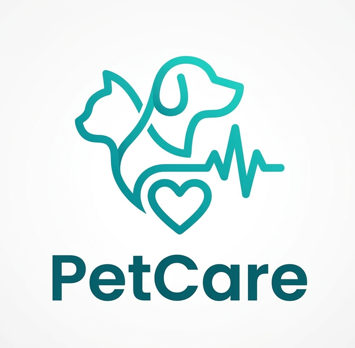
</td>

<td align="center">
  <b>DIMU</b> 
  
</td>

<td align="center">
  <b>RVM</b> 
  
</td>

<td align="center">
  <b>Rover</b> 
  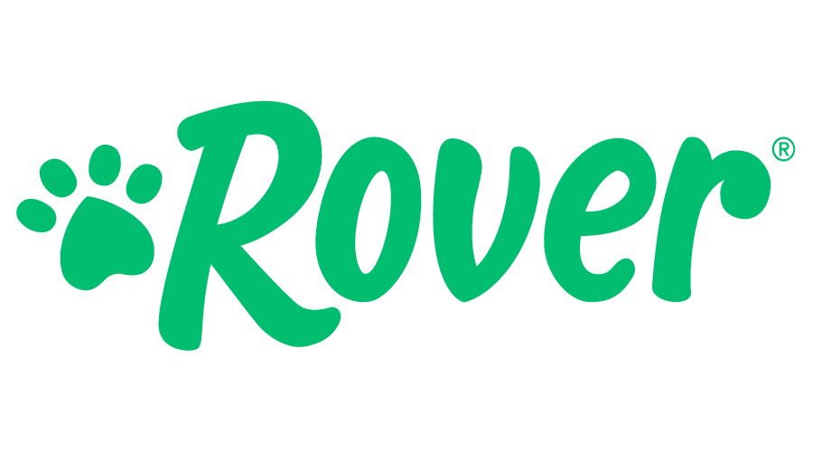
</td>
  </tr>
  <tr>
    <td rowspan="2"><b>Perfil</b></td>
    <td><b>Overview</b></td>
    <td>Plataforma web que conecta dueños de mascotas con veterinarios, integrando historial clínico, gestión de citas y monitoreo de salud mediante IoT.</td>
    <td>Aplicación peruana que conecta usuarios con servicios para mascotas, permitiendo agendar citas y encontrar veterinarias.</td>
    <td>Plataforma digital que permite el registro de mascotas, historial clínico y seguimiento de vacunas.</td>
    <td>Plataforma internacional que conecta dueños con cuidadores de mascotas y servicios.</td>
  </tr>
  <tr>
    <td><b>Ventaja competitiva ¿Qué valor ofrece a los clientes?</b></td>
    <td>Integración de IoT, historial clínico y marketplace en una sola plataforma.</td>
    <td>Facilidad de uso y posicionamiento en el mercado local.</td>
    <td>Gestión organizada del historial y control de vacunas.</td>
    <td>Amplia red de servicios y reconocimiento global.</td>
  </tr>
  <tr>
    <td rowspan="2"><b>Perfil de Marketing</b></td>
    <td><b>Mercado objetivo</b></td>
    <td>Dueños de mascotas y veterinarias en Perú.</td>
    <td>Dueños de mascotas en Perú.</td>
    <td>Dueños de mascotas que buscan control de salud de sus animales.</td>
    <td>Dueños de mascotas a nivel internacional.</td>
  </tr>
  <tr>
    <td><b>Estrategias de marketing</b></td>
    <td>Marketing digital, suscripciones y posicionamiento de veterinarias.</td>
    <td>Marketing digital y alianzas con veterinarias.</td>
    <td>Promoción de control sanitario y registro digital.</td>
    <td>Publicidad online, SEO y expansión global.</td>
  </tr>
  <tr>
    <td rowspan="3"><b>Perfil de Producto</b></td>
    <td><b>Productos y Servicios</b></td>
    <td>Marketplace veterinario, historial clínico, monitoreo IoT, promociones.</td>
    <td>Agenda de citas, listado de veterinarias.</td>
    <td>Registro de mascotas, historial clínico, control de vacunas.</td>
    <td>Servicios de cuidado, paseo y alojamiento de mascotas.</td>
  </tr>
  <tr>
    <td><b>Precios y Costos</b></td>
    <td>Modelo con plan gratuito y plan de suscripción para funciones avanzadas.</td>
    <td>Gratuito con posibles comisiones.</td>
    <td>Gratuito o con servicios adicionales.</td>
    <td>Pago por servicio con comisión.</td>
  </tr>
  <tr>
    <td><b>Canales de distribución (Web y/o móvil)</b></td>
    <td>Web y app móvil.</td>
    <td>App móvil.</td>
    <td>Web.</td>
    <td>Web y app móvil.</td>
  </tr>
  <tr>
    <td rowspan="5"><b>Análisis SWOT</b></td>
    <td colspan="5">
      Este análisis permite identificar fortalezas, debilidades, oportunidades y amenazas de PetCare frente a sus competidores para definir estrategias competitivas.
    </td>
  </tr>
  <tr>
    <td><b>Fortalezas</b></td>
    <td>Uso de IoT y plataforma integral.</td>
    <td>Posicionamiento local.</td>
    <td>Especialización en historial clínico.</td>
    <td>Reconocimiento internacional.</td>
  </tr>
  <tr>
    <td><b>Debilidades</b></td>
    <td>Nueva en el mercado.</td>
    <td>No incluye IoT.</td>
    <td>No tiene marketplace de servicios.</td>
    <td>No enfocado en salud veterinaria.</td>
  </tr>
  <tr>
    <td><b>Oportunidades</b></td>
    <td>Crecimiento del mercado pet y tecnología.</td>
    <td>Expansión digital en Perú.</td>
    <td>Digitalización de registros veterinarios.</td>
    <td>Expansión global.</td>
  </tr>
  <tr>
    <td><b>Amenazas</b></td>
    <td>Competencia creciente.</td>
    <td>Nuevas startups.</td>
    <td>Limitaciones tecnológicas.</td>
    <td>Competidores especializados.</td>
  </tr>
</table>

### 2.1.2 Estrategias y tácticas frente a competidores   
En esta sección, se llevará a cabo el análisis de las estrategias y tácticas que serán usadas con el objetivo de buscar provecho a las debilidades de la competencia y afrontar sus fortalezas. Además, gracias al análisis FODA, se lograron identificar las oportunidades y amenazas de mercado presentes, debido a la evaluación de las fortalezas que ofrece nuestro software y las debilidades frente a empresas con mayor posicionamiento y trayectoria dentro del sector veterinario digital. De esa manera, este enfoque nos permite concebir estrategias adecuadas para nuestros segmentos objetivos dentro del mercado pet care.

**Estrategia de Diferenciación:**

* Con el propósito de satisfacer las necesidades de los dueños de mascotas, PetCare propone una plataforma integral orientada al bienestar animal y al acceso rápido a servicios veterinarios confiables. A diferencia de otras alternativas que únicamente funcionan como directorios o plataformas de registro, PetCare se diferencia gracias a la integración de historial clínico digital, recordatorios de vacunas, agendamiento de citas y monitoreo inteligente mediante dispositivos IoT. Ello permitirá que los usuarios administren la salud de sus mascotas desde un solo entorno digital.

* En vista de enriquecer la experiencia de las veterinarias afiliadas, PetCare busca posicionarse como una herramienta comercial y tecnológica. Mientras otras plataformas solo muestran información básica, nuestra solución permitirá promociones, recomendaciones destacadas y posicionamiento dentro de las búsquedas internas. De esa manera, la plataforma ayudará a generar mayor visibilidad y captación de nuevos clientes para los negocios veterinarios asociados.

**Estrategia de Liderazgo en Costos:**

* Como resultado de la búsqueda de accesibilidad para los usuarios, se ofrecerá un modelo freemium. Ello permitirá que los dueños de mascotas accedan inicialmente a funciones esenciales como búsqueda de veterinarias, información básica y consultas generales, sin necesidad de asumir costos inmediatos. Posteriormente, podrán acceder a planes premium con beneficios avanzados como monitoreo IoT e historial clínico ampliado.

* A manera de buscar la satisfacción de las veterinarias afiliadas, la estrategia empleada se basará en planes escalables de bajo costo. En lugar de competir únicamente por precio, nuestra monetización se enfocará en el valor generado mediante publicidad digital, posicionamiento destacado y acceso a una mayor cartera de clientes potenciales dentro de la plataforma.

**Estrategia de Marketing:**

Para ambos segmentos, la estrategia estará centrada en el concepto de "Mascotas saludables con tecnología inteligente". Teniendo esa visión como eje central, se desarrollarán campañas de marketing digital en Lima Metropolitana y otras ciudades principales, demostrando cómo PetCare facilita el cuidado preventivo, mejora el acceso a veterinarias confiables y optimiza el seguimiento de la salud animal. El mensaje central será que una mascota saludable refleja un hogar responsable y conectado.

**Tácticas:**

Establecer alianzas estratégicas con veterinarias locales en Perú para ampliar la cobertura de servicios, lanzar promociones exclusivas dentro de la plataforma, implementar campañas SEO y publicidad digital para posicionar la marca, así como ofrecer periodos de prueba gratuitos para captar usuarios y negocios afiliados.

## 2.2 Entrevistas
### 2.2.1 Diseño de entrevistas

### Segmento Objetivo 1: Dueños de Mascotas (18-40 años)

**Objetivo de la entrevista:**  
Comprender las necesidades, hábitos, dificultades y expectativas de los dueños de mascotas respecto al cuidado, seguimiento médico y búsqueda de servicios veterinarios.

#### 1. Datos Generales

- ¿Qué edad tienes?
- ¿En qué distrito vives?
- ¿A qué te dedicas actualmente? (Estudias, trabajas o ambos)
- ¿Qué dispositivo utilizas con mayor frecuencia? (Celular, laptop, tablet)
- ¿Sueles utilizar aplicaciones o páginas web para organizar servicios en tu día a día? ¿Cuáles?

#### 2. Relación con la Mascota

- ¿Tienes mascotas actualmente?
- ¿Qué tipo de mascota tienes y cuántas?
- ¿Desde hace cuánto tiempo tienes mascotas?
- ¿Cómo es la rutina de cuidado de tu mascota?

#### 3. Servicios Veterinarios

- ¿Con qué frecuencia llevas a tu mascota al veterinario?
- ¿Qué es lo más importante que buscas en una veterinaria?
- ¿Tienes actualmente una veterinaria de confianza? ¿Por qué?
- ¿Qué servicios sueles buscar en una veterinaria?
- ¿Has tenido dificultades para encontrar una veterinaria que cumpla con tus necesidades? ¿Cómo fue esa experiencia?
- ¿Cuánto tiempo te tomó encontrar una veterinaria de confianza?

#### 4. Gestión y Seguimiento

- ¿Cómo sueles agendar citas para tu mascota?
- ¿Cuánto tiempo suele tardar conseguir una cita?
- ¿Cómo organizas los documentos o historial médico de tu mascota?
- ¿Cómo haces el seguimiento de citas, vacunas o tratamientos?
- ¿Qué problemas has tenido al gestionar el cuidado de tu mascota?

#### 5. Necesidades y Solución Digital

- ¿Qué te gustaría mejorar en los servicios veterinarios actuales?
- ¿Te ayudaría una plataforma que te permita encontrar veterinarias según tus necesidades y las de tu mascota? ¿Por qué?
- ¿Qué funcionalidades te gustaría que tenga una aplicación web para el cuidado de mascotas?
- ¿Qué opinas de usar una aplicación para gestionar citas, recordatorios y servicios veterinarios?

---

### Segmento Objetivo 2: Centros Veterinarios y Profesionales Independientes

**Objetivo de la entrevista:**  
Comprender las necesidades, procesos y dificultades de clínicas veterinarias y profesionales independientes en la gestión de citas, pacientes y comunicación con clientes.

#### 1. Información General

- ¿En qué distrito está ubicada su clínica o centro veterinario?
- ¿Cuántos trabajadores tiene actualmente?
- ¿Cuántos años lleva trabajando en este rubro?
- ¿Qué tipo de clientes atienden con mayor frecuencia?

#### 2. Digitalización Actual

- ¿Utilizan actualmente algún sistema digital o software para la gestión de su clínica? ¿Cuál?
- ¿Qué tan útil considera la herramienta que utilizan actualmente?

#### 3. Operaciones y Servicios

- ¿Qué servicios ofrece actualmente su clínica veterinaria?
- ¿Cómo gestionan actualmente las citas para sus pacientes?
- ¿Cómo realizan el seguimiento y recordatorio de citas?
- ¿Cómo manejan la información y el historial de sus pacientes?

#### 4. Comunicación con Clientes

- ¿Qué canales utilizan sus clientes para comunicarse con la clínica? (WhatsApp, llamadas, redes sociales, etc.)
- ¿Cómo gestionan la comunicación con los clientes sobre indicaciones o tratamientos?

#### 5. Problemas y Oportunidades

- ¿Qué dificultades enfrentan en la gestión de citas y servicios?
- ¿Qué tipo de problemas han tenido con la organización o atención de pacientes?
- ¿Cómo evalúa el nivel de satisfacción de sus clientes?
- ¿Qué estrategias de marketing utilizan actualmente para promocionar su clínica?
- ¿Qué aspectos considera más importantes al usar una herramienta digital para su negocio?

#### 6. Solución Propuesta

- ¿Estaría dispuesto a utilizar una plataforma digital que le ayude a gestionar citas y pacientes? ¿Por qué?
- ¿Qué funcionalidades le gustaría que tenga una aplicación para clínicas veterinarias?
- ¿Qué beneficios esperaría obtener de una herramienta digital como esta?

### 2.2.2. Registro de entrevistas 
URL del video:

Segmento 1:

| N | Datos |Descripción |Imagen referencial
|--|--|--|--|
|1  | Nombre: Keidy Maquera   Edad: 21  Distrito: Callao |Ella menciona que usa excel para organizarse, siendo el celular y la laptop los dispositivos que mas utiliza. Las mascotas que tiene son 4 gatos y un perro, uno de sus gatos tiene 7 años y los demas gatos y el perro estan entre 3-4 años. El cuidado de sus mascotas lo hace por medio de una alimentacion saludable y vacunas anuales. La ultima vez que llevo a sus mascotas al veterinario fue hace  3 meses y ella desearia que las veterinarias cuenten con todos los implementos necesarios para atender la mayoria de casos que suelen presentarse. Su veterinaria de confianza la escogio por que es la mas cercana a su casa, y busca que las veterinarias cuenten con todo lo necesario para atender a sus mascotas ante una emergencia. Hubo una ocacion donde llevo a su gato de emergencia por la noche y su veterinaria de confianza no tenia los implementos para atenderlo y tubo que irse a buscar otra que atienda las 24 horas, sintio mucha desesperacion. Ella suele frecuentar las veterinarias por vacunas para sus gatos, pero es mas por el corte y baño de su perro, agendando sus citas por whatsapp y aveces no le responden o tardan mucho en responder. Para controlar el historial de sus mascotas lo hace por medio de tarjetas que le entregan al terminar una cita con fecha y el procedimiento que se realizo. Lo que ella mejoraria de las veterinaria es que cuenten con todo los implementos para atender a sus mascotas y que sea 24  horas la atencion. Le parece increible una plataforma para encontrar veterinarias segun sus nesecidades, asi se ahorraria el tiempo de ir preguntando una por una.  Ademas, le fascinaria que brinde informacion adicional, como los procedimientos que tienen disponibles. y menciona que la gestion de citas, recordatorios y servicios le ayudaria para una rapida comunicacion y una efectiva organizacion.||
|2  | Nombre:  Johan Yonel:  Edad: 20  Distrito: Santiago de Surco|El con mayor frecuencia el celular y la laptop, además de aplicaciones web como Trello, Notion y Google Calendar para organizar sus actividades diarias. Actualmente tiene dos mascotas: un perro desde hace dos años y un gato desde hace tres meses. Su rutina de cuidado incluye baños mensuales, cepillado constante, limpieza y supervisión cuando salen a la calle. Suele llevar a sus mascotas al veterinario aproximadamente una vez al mes, principalmente para baños, chequeos médicos y revisiones rápidas cuando presentan algún malestar. Considera importante que el veterinario brinde atención rápida, confianza y buen trato hacia los animales. Cuenta con una veterinaria de confianza y normalmente agenda citas por WhatsApp o llamadas. Sin embargo, a veces demora entre dos y tres días en conseguir una cita debido a la disponibilidad del profesional y sus propios horarios como estudiante. El historial médico de sus mascotas lo organiza en formato físico, mediante hojas o folletos donde registra vacunas, tratamientos y chequeos realizados. Entre las mejoras que propone para los servicios veterinarios actuales destaca una mayor adaptación a la virtualidad, permitiendo citas rápidas en línea, seguimiento digital de la mascota y acceso al historial médico. Finalmente, considera útil una plataforma web que permita encontrar veterinarios según necesidad, ubicación, calidad y opiniones de otros usuarios. También le gustaría que la aplicación incluya registro de vacunas, historial clínico compartido y acceso a distintas veterinarias en caso de cambio o emergencia.|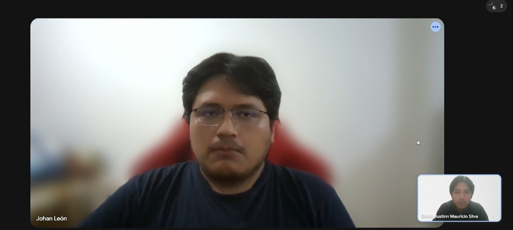
|3  | Nombre: Carolina Guzman   Edad:40 Años   Distrito: Jesus Maria  | Carolina menciona que usa más su celular y no suele usar servicios web para organizarse, además cuenta con 4 gatas desde hace 4 años cuya rutina es la limpieza de su espacio y brindarle comida y agua fres al igual que su revisión al veterinario una vez al año buscando experiencia como su veterinaria de confianza en donde ya atendió previamente a sus gatas como en el proceso de esterilización. En una veterinaria suele buscar explicaciones sobre los tratamientos que le darán a su mascota y nunca a tenido dificultades para buscar una veterinaria que cumpla con sus requisitos, genera citas por previa llamada y organiza el historial médico de su mascota por una carpeta física,  por otro lado ella piensa que en caso de tener que buscar a otro veterinario ella cree que el aspecto más importante que debería tener una aplicación que la ayude a resolver ese problema es una sección de reseñas para ver qué piensa la gente. |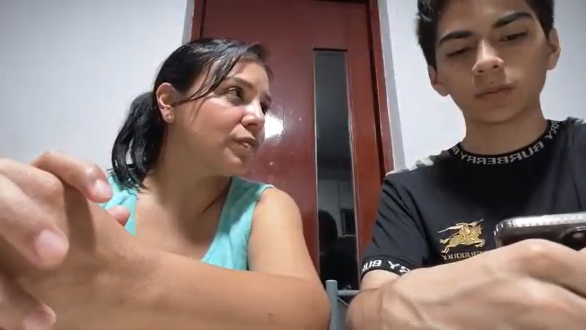

Segmento 2:

| N | Datos |Descripción |Imagen referencial|
|--|--|--|--|
|1  | Nombre: Mariana  Apellido: Espinoza  Edad: 39  Distrito: Surco  Profesión: Médica Veterinaria  Experiencia: 12 años  Negocio: Veterinaria Santa Rosa | Mariana Espinoza es un veterinaria con amplia trayectoria que lidera una clínica consolidada en el distrito de Surco. Su negocio cuenta con un equipo mediano y un flujo constante de paciente, compuesto principalmente por vecinos leales de la zona que buscan una atención personalizada. La clínica ofrece servicios esenciales como consultas, vacunación y cirugías menores. Actualmente, la gestión se apoya en métodos mixtos, utiliza excel y una agenda física para las citas, lo que refleja un digitalización parcial pero insuficiente. Estos procesos manuales genera cuellos de botella operativos, como la duplicidad de turnos y la falta de un seguimiento automatizado para las vacunas o desparasitaciones. La comunicación se centraliza casi exclusivamente en WhatsApp, lo que satura al personal y dificulta la separación entre la vida laboral y personal. Aunque el nivel de satisfacción de sus clientes es alto gracias a la confianza, Mariana identifica que la falta de organización en las historias clínicas limita el trabajo y la eficiencia del mismo. Ella esta dispuesta a adoptar una herramienta digital, priorizando la facilidad de uso y la automatización de recordatorios para mejorar su gestión. ||
|2  | Nombre: Ricardo  Apellido: Chavez  Edad: 35  Distrito: Miraflores | Ricardo Chavez es un administrador y médico veterinario encargado de un centro de alta rotación en Miraflores que opera las 24 horas. Su clínica cuenta con una infraestructura robusta, un equipo numeroso y tecnología avanzada para servicios especializados como laboratorio y hospitalización. A diferencia de otros negocios, ya utiliza un software de gestión, pero este resulta complejo de operar para el personal nuevo y carece de integraciones móviles, lo que limita el acceso a la información fuerea de los terminales de recepción. El principal problema que enfrente es el ausentismo de los clientes y la ineficiencia en el flujo de comunicación, ya que el sistema es el ausentismo de los clientes y la ineficiencia en el flujo de comunicación, ya que el sistema actual no logra que los recordatorios sean efectivos. A pesar de tener procesos más digitalizacos, la carga operativa en recepción sigue siendo alta debido a la gestión manual de consultas por redes sociales y llamadas. Ricardo busca una solución que permita la integración total entre las citas, las historias clínicas digitales y el inventario. Su interés en una nueva plataforma radica en la posibilidad de ofrecer un portal de autoservicio para el cliente, buscando optimizar la rentabilidad del negocio y reducir los tiempos de espera en sala a través de una tecnología más moderna y conectada. ||
| 3 | Nombre: Diego  Apellido: Fernández Baca  Edad: 27 años  Distrito: Los Olivos  Profesión: Médico Veterinario  Experiencia: 4 años  Negocio: Veterinaria Patitas Sanas | Diego Fernández es un veterinario joven que ha iniciado su propio negocio, el cual se encuentra en una etapa temprana de crecimiento y presenta un flujo de atención bajo a moderado. Su veterinaria ofrece servicios básicos como consultas, vacunación y tratamientos generales, además de la venta de productos para mascotas. La gestión del negocio se realiza principalmente de forma manual. Utiliza WhatsApp para la comunicación con clientes y Excel para registrar información básica; sin embargo, no cuenta con un sistema digital integrado. Esto genera desorganización y dificulta el acceso rápido a la información, especialmente en el manejo del historial clínico, que aún se realiza en fichas físicas.  Asimismo, la gestión de citas es manual, lo que ocasiona inconvenientes como desorden en los horarios y falta de confirmación por parte de los clientes. La captación de nuevos clientes depende en gran medida de recomendaciones, lo que limita el crecimiento del negocio. A pesar de estas limitaciones, el nivel de satisfacción de los clientes es positivo. No obstante, el entrevistado reconoce que la implementación de herramientas digitales permitiría mejorar la organización, optimizar tiempos y brindar un mejor servicio.  Finalmente, muestra disposición a adoptar una plataforma digital que integre la gestión de citas, historiales clínicos y recordatorios automáticos, además de mejorar la visibilidad de su veterinaria para atraer nuevos clientes. |  |

## 2.2.3. Análisis de entrevistas 

En esta sección se presenta el análisis  de los hallazgos obtenidos mediante las entrevistas a profundidad realizadas a los dos segmentos objetivos. El análisis se sustenta con datos estadísticos.

## Segmento 1: Dueños de Mascotas

Este segmento está compuesto por usuarios entre 20 y 40 años, residentes en distritos de Lima y Callao. Se caracterizan por un alto uso de dispositivos móviles y una preocupación genuina por la salud preventiva de sus mascotas.

### Cuadro 1: Comportamiento y Gestión del Dueño
| Característica | Detalle Estadístico | Sustento en Entrevistas |
| :--- | :---: | :--- |
| **Uso de Herramientas Digitales** | **67%** | Keidy y Johan utilizan laptops y apps (Notion, Trello, Excel) para su organización personal. |
| **Gestión de Historial Médico** | **100% Físico** | El 100% de los entrevistados depende de tarjetas, folders o folletos físicos entregados por la clínica. |
| **Canal de Reserva de Citas** | **100% Tradicional** | La totalidad de la muestra utiliza WhatsApp o llamadas telefónicas directas para agendar. |
| **Frecuencia de Visita** | **67% Mensual/Trimestral** | La mayoría acude con frecuencia para baños y chequeos; solo un 33% acude anualmente. |

* **Frustración por Comunicación:** El 67% reporta malestar por la lentitud de respuesta en WhatsApp o la dificultad para encontrar citas inmediatas.
* **Inseguridad en Emergencias:** Existe una necesidad latente de conocer qué servicios y equipos tiene una veterinaria antes de asistir, para evitar desplazamientos en vano durante emergencias.
* **Valor de la Reputación:** El acceso a reseñas y opiniones es considerado un factor determinante para elegir un nuevo especialista.

## Segmento 2: Especialistas y Centros Veterinarios

Este segmento incluye médicos veterinarios y administradores de clínicas con distintos niveles de experiencia, desde emprendimientos jóvenes hasta centros de atención 24 horas.

### Madurez Digital y Operaciones
| Característica | Detalle Estadístico | Sustento en Entrevistas |
| :--- | :---: | :--- |
| **Método de Gestión Actual** | **67% Manual/Mixto** | Mariana y Diego dependen de Excel y agendas de papel. Ricardo usa software pero con limitaciones de acceso móvil. |
| **Saturación de Canales** | **100%** | Todos los especialistas coinciden en que la gestión por WhatsApp/Redes Sociales es caótica y consume tiempo excesivo. |
| **Disposición a la Adopción Digital** | **100% Alta** | El 100% de los entrevistados está dispuesto a implementar una plataforma que centralice sus procesos. |
| **Problemas de Ausentismo** | **67%** | El ausentismo y la falta de confirmación de citas afectan la rentabilidad de las clínicas con mayor flujo. |

### Necesidades según el Perfil del Negocio
| Arquetipo de Negocio | Necesidad Primordial | Factor Crítico |
| :--- | :--- | :--- |
| **Clínica Consolidada (Mariana)** | Automatización de recordatorios | Ordenar el flujo de clientes antiguos. |
| **Centro 24 Horas (Ricardo)** | Integración y Movilidad | Acceder a datos desde cualquier dispositivo. |
| **Emprendimiento Joven (Diego)** | Visibilidad y Crecimiento | Atraer nuevos clientes y crear historiales digitales. |

1.  **Brecha de Comunicación:** Existe un desfase entre la inmediatez que busca el dueño de la mascota y la capacidad de respuesta manual de la veterinaria. WhatsApp, aunque es el canal preferido, actúa como un cuello de botella operativo.
2.  **El Problema del "Papel":** El historial clínico físico es el punto de dolor compartido. El dueño teme perderlo y el veterinario admite que buscar fichas físicas o folders ralentiza la atención.
3.  **Oportunidad de Mercado:** El 100% de los especialistas reconoce que una herramienta digital mejoraría la satisfacción del cliente y la eficiencia del negocio, lo que valida la viabilidad de la solución propuesta.
   
## 2.3. Needfinding

Para identificar las necesidades específicas de los segmentos objetivos, realizamos entrevistas con representantes de nuestros dos perfiles clave. Los dueños de mascotas expresaron frustración por la desorganización de los historiales médicos físicos y la desesperación al no encontrar clínicas adecuadamente equipadas durante emergencias, mostrando un gran interés en una plataforma de búsqueda inteligente que incluya reseñas y recordatorios. Por su parte, los médicos veterinarios manifestaron que la gestión manual de citas mediante WhatsApp y el uso de fichas de papel generan desorden y limitan el crecimiento de sus negocios, respondiendo muy positivamente a la adopción de una herramienta digital que centralice agendas y expedientes. Estos hallazgos confirman la necesidad de modernizar e integrar el ecosistema de salud animal para mejorar la eficiencia operativa y la experiencia de todos los usuarios.

## 2.3.1. User Personas 
### User Persona - Dueño de mascota
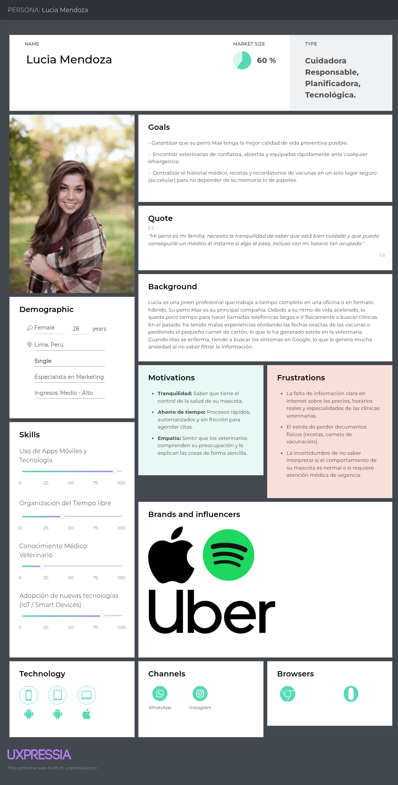

### User Persona - Veterinario
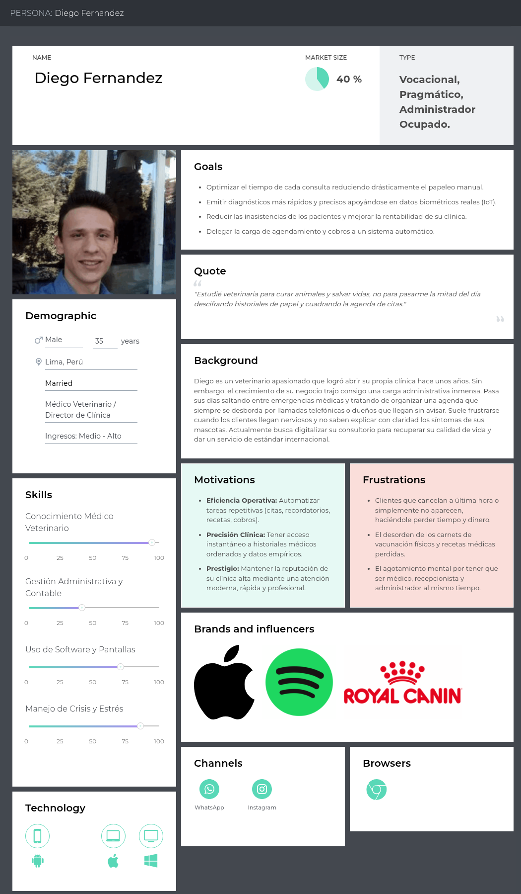

## 2.3.2. User Task Matrix 

| Tareas Principales (Task Matrix) | Dueños de Mascotas (Lucia Mendoza) | | Médicos Veterinarios (Diego Fernandez) | |
| :--- | :--- | :--- | :--- | :--- |
| | **Frecuencia** | **Importancia** | **Frecuencia** | **Importancia** |
| Registrar y configurar cuenta en la plataforma. | Baja | Alta | Baja | Alta |
| Registrar / Actualizar el historial clínico de la mascota. | A veces | Alta | Seguido | Alta |
| Buscar clínicas y especialistas usando Inteligencia Artificial. | A veces | Alta | Baja | Baja |
| Agendar, confirmar o reprogramar citas médicas. | A veces | Alta | Seguido | Alta |
| Monitorear métricas de salud en tiempo real (Dispositivo IoT). | A veces | Alta | A veces | Alta |
| Gestionar notificaciones y recordatorios (vacunas, controles). | A veces | Alta | Seguido | Alta |
| Procesar pagos o cobros por consultas y servicios. | A veces | Alta | Seguido | Alta |
| Leer, escribir o responder reseñas de atención veterinaria. | A veces | Media | Seguido | Alta |

## 2.3.3. User Journey Mapping 

### User Journey Map - Dueño de Mascota
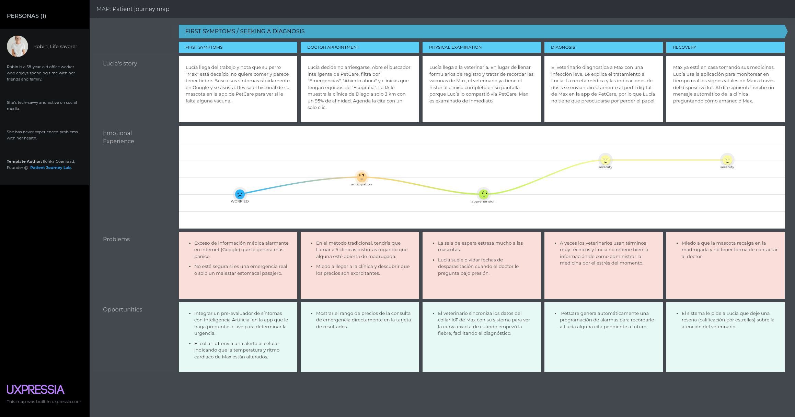

### User Journey Map - Veterinario
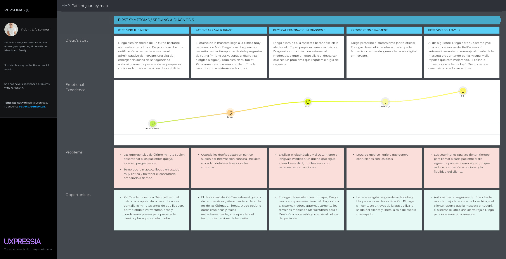

## 2.3.4. Empathy Mapping

### Empathy Map -  Dueño de mascota
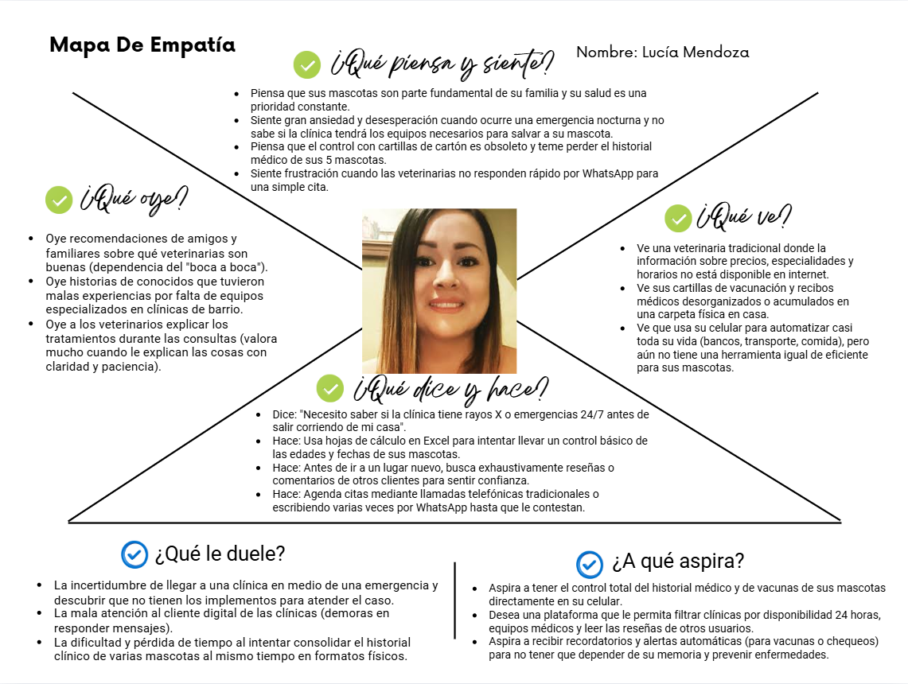

### Empathy Map - Veterinario
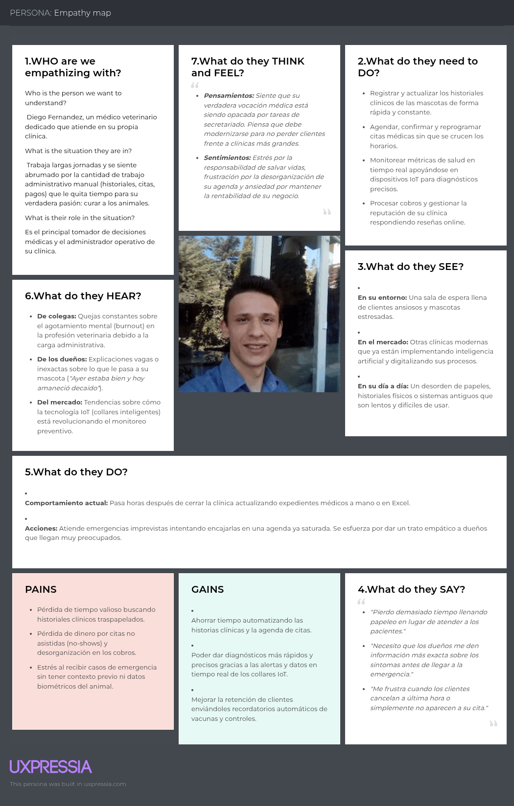

## 2.4. Big Picture Event Storming
-Para comenzar con el desarrollo de este seccion nos guiamos de la revista Revista Event Storming, tomando como referencia el arituculo "Guia de pasos para levar acabo su evento Big Picture event Storming" de Felipe Bourgau(2022).  -  Preparar la Habitacion: Para la preparacion dle espacio de trabajo, usaremos la aplicacion web Miro, ya que por limitaciones de tiempo y disponibilidad, no es posible realizar una reunion presencial. Esta herramienta simulara un entorno colaborativo virtual, donde podremos modelar el proceso de manera virtual y en tiempo real.  - Energizar a la audiencia: Se inicio la sesion conversando sobre las actividades realizadas durante el dia, con el objetivo de generar un ambiente de confianza en el grupo, para asi lanzar nuestras ideas sin temor.  - Informar y presentar el plan: Se conversó acerca del proyecto Petcare, definimos claramente los objetivos del sistema. Asimismo, se explicaron los pasos de la reunion realizada en Miro, desde el analisis del sistema hasta la identificacion de nesecidades y funcionalidades importantes, comprendiendo como cada etapa ayuda a llegar a un diseño de solucion final.  - Generacion de Eventos de Dominio: En esta fase se comenzo a plasmar las ideas en el Miro, identificando y colocando los eventos de dominio, los cuales representas hechos que ocurren dentro del negocio, Adjuntamos la evidencia:    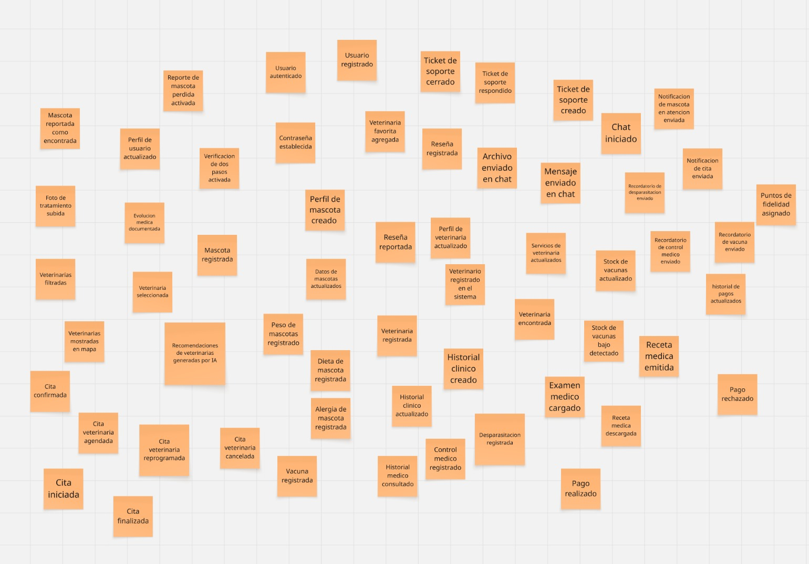  - Clasificacion de Eventos de Dominio: Se ordenaron los eventos colocados anterioromente en una linea de tiempo, desde lo que ocurre primero hasta lo que ocurre al final, discutiendlo ademas los eventos paralelos que suceden.   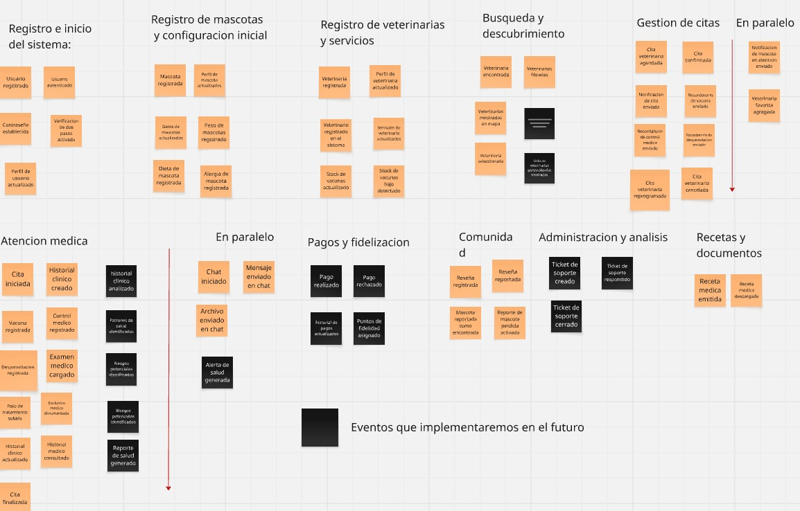  - Incorporacion de actores y sistemas externos: En esta fase se identificaron los actores principales del sistema, como el dueño de mascotas, veterinarias y administradores, asi como los sistemas externos involucrados, como servicios de pago, notificaciones, mapas, inteligencia artificial y dispositivos IoT.   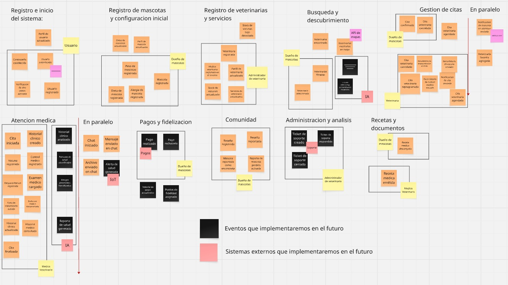
## 2.5. Ubiquitous Language
El Ubiquitous Language es un elemento fundamental dentro del enfoque Domain-Driven Design (DDD), el cual se basa en la creación de un lenguaje común que sea compartido por todos los involucrados en el proyecto. Su finalidad es reducir confusiones y garantizar que tanto el equipo de desarrollo como los stakeholders tengan una interpretación clara y uniforme de los conceptos relacionados al dominio del negocio.

En el contexto del proyecto PetCare, orientado a la gestión integral de la salud de mascotas, este lenguaje permite mejorar la comunicación entre los dueños de mascotas y las clínicas veterinarias mediante la definición precisa de términos como Pet (Mascota), Medical Record (Historial clínico), Appointment (Cita) y Health Monitoring (Monitoreo de salud). Además, los términos se establecen en inglés junto con su equivalente en español y se emplean de manera consistente en todos los artefactos del sistema, contribuyendo a una mejor comprensión y desarrollo de la solución.

| Término | Definición en el contexto |
| :------ | :------------------------ |
| Pet (Mascota) | Animal doméstico registrado en la plataforma, cuya información general, comportamiento y estado de salud son gestionados digitalmente. |
| Pet Owner (Dueño de mascota) | Persona responsable del cuidado de la mascota, encargada de registrar, consultar y actualizar su información dentro del sistema. |
| Veterinary Clinic (Clínica veterinaria) | Entidad que ofrece servicios de atención médica para mascotas y que se encuentra registrada en la plataforma con información relevante como ubicación, servicios y costos. |
| Veterinarian (Veterinario) | Profesional especializado en salud animal que realiza evaluaciones, diagnósticos y tratamientos a las mascotas. |
| Medical Record (Historial clínico) | Registro digital estructurado que almacena toda la información médica de la mascota, incluyendo vacunas, enfermedades, diagnósticos, tratamientos y cirugías. |
| Appointment (Cita) | Programación anticipada de un servicio veterinario entre el dueño de la mascota y una clínica o profesional. |
| Consultation (Consulta) | Atención médica realizada durante una cita, en la cual el veterinario evalúa el estado de salud de la mascota. |
| Treatment (Tratamiento) | Plan de acciones médicas definido por el veterinario para tratar una condición de salud específica. |
| Vaccination (Vacunación) | Procedimiento preventivo mediante el cual se administran vacunas para proteger a la mascota contra enfermedades. |
| Symptom (Síntoma) | Indicador físico o conductual que evidencia una posible alteración en el estado de salud de la mascota. |
| Diagnosis (Diagnóstico) | Conclusión médica emitida por el veterinario basada en la evaluación clínica de la mascota. |
| Health Monitoring (Monitoreo de salud) | Proceso continuo de recopilación de datos biométricos y de actividad de la mascota mediante dispositivos conectados. |
| Alert (Alerta) | Notificación generada automáticamente por el sistema ante eventos relevantes, como anomalías detectadas o recordatorios importantes. |
| Recommendation (Recomendación) | Sugerencia personalizada generada por el sistema en base a datos históricos, condiciones actuales y preferencias del usuario. |
| Veterinary Service (Servicio veterinario) | Tipo de atención ofrecida por una clínica, como consulta general, emergencia, cirugía o especialidad médica. |
| Specialty (Especialidad) | Área específica de atención veterinaria enfocada en un tipo de tratamiento o sistema del animal. |
| Location (Ubicación) | Referencia geográfica de la clínica veterinaria, utilizada para facilitar su búsqueda y acceso. |
| Budget (Presupuesto) | Rango económico definido por el usuario para acceder a servicios veterinarios. |
| Emergency (Emergencia) | Situación crítica que requiere atención veterinaria inmediata para preservar la vida o bienestar de la mascota. |
| Follow-up (Seguimiento) | Proceso de control posterior a una atención médica para evaluar la evolución del estado de salud de la mascota. |

# Capitulo III: Requirements Specification
## 3.1. User Stories
## 3.2. Impact Mapping
## 3.3. Product Backlog
# Capitulo IV: Product Design
## 4.1. Style Guidelines
### 4.1.1. General Style Guidelines
### 4.1.2. Web Style Guidelines
## 4.2. Information Architecture
### 4.2.1. Organization Systems
### 4.2.2. Labeling Systems
### 4.2.3. SEO Tags and Meta Tags 
### 4.2.4. Searching Systems
### 4.2.5. Navigation Systems
## 4.3. Landing Page UI Design
### 4.3.1. Landing Page Wireframe
### 4.3.2. Landing Page Mock-up
## 4.4. Web Applications UX/UI Design
### 4.4.1. Web Applications Wireframes
### 4.4.2. Web Applications Wireflow Diagrams
### 4.4.2. Web Applications Mock-ups
### 4.4.3. Web Applications User Flow Diagrams
## 4.5. Web Applications Prototyping
## 4.6. Domain-Driven Software Architecture
### 4.6.1. Design-Level Event Storming
### 4.6.2. Software Architecture Context Diagram
### 4.6.3. Software Architecture Container Diagrams
### 4.6.4. Software Architecture Components Diagrams
## 4.7. Software Object-Oriented Design
### 4.7.1. Class Diagrams
## 4.8. Database Design
### 4.8.1. Database Diagrams.
# Capitulo V: Product Implementation, Validation & Deployment
## 5.1. Software Configuration Management
### 5.1.1. Software Development Environment Configuration
### 5.1.2. Source Code Management
### 5.1.3. Source Code Style Guide & Conventions
### 5.1.4. Software Deployment Configuration
## 5.2. Landing Page, Services & Applications Implementation
### 5.2.X. Sprint n 
#### 5.2.X.1. Sprint Planning n
#### 5.2.X.2. Aspect Leaders and Collaborators
#### 5.2.X.3. Sprint Backlog n. 
#### 5.2.X.4. Development Evidence for Sprint Review
#### 5.2.X.5. Execution Evidence for Sprint Review
#### 5.2.X.6. Services Documentation Evidence for Sprint Review
#### 5.2.X.7. Software Deployment Evidence for Sprint Review
#### 5.2.X.8. Team Collaboration Insights during Sprint.
## 5.3. Validation Interviews
### 5.3.1. Diseño de Entrevistas
### 5.3.2. Registro de Entrevistas
### 5.3.3. Evaluaciones según heurísticas
## 5.4. Video About-the-Product.
# Conclusiones
## Conclusiones y recomendaciones
## Video About-the-Team.
# Bibliografía 
# Anexos
