<div align="center">
</img><br>


<h3>Universidad Peruana de Ciencias Aplicadas</h3>
<h4>Facultad de Ingeniería</h4>
<h4>Carrera de Ingeniería de Software</h4>
<h4>Ciclo 202610</h4>
<h4>1ASI0729 Desarrollo de Aplicaciones Open Source</h4>
<h4>NRC 11863</h4>
<h4>Docente: Ivan Robles Fernández</h4>
<h4>Informe del Trabajo Final</h4>
<h4>Startup: Co-Designers</h4>
<h4>Producto: PetCare </h4>

#### Relación de integrantes 
| **Código** | **Apellidos y Nombres**               |
| :--------: | :------------------------------------ |
| U202414313 | Campoblanco Guzman, Diego Roberto |
| U20201E781 | Huaman De La Cruz, Jean Pool   |
| U20241E242 | Mauricio Silva, Ghiou Justinn     |
| U20221A118 | Mejia Aliaga, Katherine Maryory     |
| U20241E107 | Tuncar Vila, Ghorghet Saul|

</div>

<br><div align="center"><h3>Abril 2026</h3></div><br>
<div style="text-align: justify;">

<br><br>

## Registro de Versiones del Informe

<div align="justify">
  
| Versión | Fecha | Autor | Descripción de modificación |
| :-----: | :------: | :---: | :--- |
| TB1 | 22/04/2026 | Todos | Avance del trabajo: elaboración inicial del informe, incluyendo carátula, registro de versiones, colaboración del equipo, Student Outcome, introducción, análisis de requerimientos, especificación de requerimientos, diseño del producto y primera evidencia de implementación. |
| TP1 | 27/05/2026 | Todos | Actualización del informe: corrección y mejora de artefactos previamente presentados, avance del frontend web, evidencias del Sprint, documentación de servicios, despliegue y colaboración del equipo. |
| TB2 | 17/06/2026 | Todos | Segundo avance del trabajo: incorporación de Web Services, actualización de la Web Application, evidencias de implementación, ejecución, documentación, despliegue, entrevistas de validación y videos del producto/equipo. |
| TF1 | 01/07/2026 | Todos | Versión final del informe: revisión completa de capítulos, evidencias finales del Sprint 4, despliegue final de los productos digitales, conclusiones, bibliografía y anexos finales. |

<div style="page-break-after: always;"></div>

## Project Report Collaboration Insights
URL de Organización de GITHUB del equipo Co-Designers: https://github.com/Co-Designers  
URL de Repositorio del Project Report: https://github.com/Co-Designers/PetCare

<strong>*Entrega TB1:*</strong> 

# Contenido

## Índice

- [Registro de versiones del informe](#registro-de-versiones-del-informe)

- [Project Report Collaboration Insights](#project-report-collaboration-insights)

- [Contenido](#contenido)

- [Student Outcome](#student-outcome-1)

- [Capítulo I: Introducción](#capitulo-i-introduccion)
  - [1.1. StartUp Profile](#11-startup-profile)
    - [1.1.1. Descripción de la StartUp](#111-descripción-de-la-startup)
    - [1.1.2. Perfiles de Integrantes del equipo](#112-perfiles-de-integrantes-del-equipo)
  - [1.2. Solution Profile](#12-solution-profile)
    - [1.2.1. Antecedentes y Problemática](#121-antecedentes-y-problemática)
    - [1.2.2. Lean UX Process](#122-lean-ux-process)
      - [1.2.2.1. Lean UX Problem Statements](#1221-lean-ux-problem-statements)
      - [1.2.2.2. Lean UX Assumptions](#1222-lean-ux-assumptions)
      - [1.2.2.3. Lean UX Hypothesis Statements](#1223-lean-ux-hyphotesis-statements)
      - [1.2.2.4. Lean UX Canvas](#1224-lean-ux-canvas)
  - [1.3. Segmentos objetivo](#13-segmentos-objetivo)
- [Capítulo II: Requirements Elicitation & Analysis]()
  - [2.1. Competidores](#21-competidores)
    - [2.1.1. Análisis competitivo](#211-análisis-competitivo)
    - [2.1.2. Estrategias y tácticas frente a competidores](#212-estrategias-y-tácticas-frente-a-competidores)
  - [2.2. Entrevistas](#22-entrevistas)
    - [2.2.1. Diseño de entrevistas](#221-diseño-de-entrevistas)
    - [2.2.2. Registro de entrevistas](#222-registro-de-entrevistas)
    - [2.2.3. Análisis de entrevistas](#223-análisis-de-entrevistas)
  - [2.3. Needfinding](#23-needfinding)
    - [2.3.1. User Persona](#231-user-persona)
    - [2.3.2. User Task Matrix](#232-user-task-matrix)
    - [2.3.3. User Journey Mapping](#233-user-journey-mapping)
    - [2.3.4. Empathy Mapping](#234-empathy-mapping)
  - [2.4 Big Picture Event Storming](#24-big-picture-event-storming)
  - [2.5 Ubiquitous Language](#25-ubiquitous-language)
- [Capítulo III: Requirements Specification]()
  - [3.1. User Stories](#31-user-stories)
  - [3.2. Impact Mapping](#32-impact-mapping)
  - [3.3. Product Backlog](#33-product-backlog)
- [Capítulo IV: Product Design]()
  - [4.1. Style Guidelines](#41-style-guidelines)
    - [4.1.1. General Style Guidelines](#411-general-style-guidelines)
    - [4.1.2. Web Style Guidelines](#412-web-style-guidelines)
  - [4.2. Information Architecture](#42-information-architecture)
    - [4.2.1. Organization Systems](#421-organization-systems)
    - [4.2.2. Labeling Systems](#422-labeling-systems)
    - [4.2.3. SEO Tags and Meta Tags](#423-seo-tags-and-meta-tags)
    - [4.2.4. Searching Systems](#424-searching-systems)
    - [4.2.5. Navigation Systems](#425-navigation-systems)
  - [4.3. Landing Page UI Design](#43-landing-page-ui-design)
    - [4.3.1. Landing Page Wireframe](#431-landing-page-wireframe)
    - [4.3.2. Landing Page Mock-up](#432-landing-page-mock-up)
  - [4.4. Web Applications UX/UI Design](#44-web-applications-uxui-design)
    - [4.4.1. Web Applications Wireframes](#441-web-applications-wireframes)
    - [4.4.2. Web Applications Wireflow Diagrams](#442-web-applications-wireflow-diagrams)
    - [4.4.3. Web Applications Mock-ups](#443-web-applications-mock-ups)
    - [4.4.4. Web Applications User Flow Diagrams](#444-web-applications-user-flow-diagrams)
  - [4.5. Web Applications Prototyping](#45-web-applications-prototyping)
  - [4.6. Domain-Driven Software Architecture](#46-domain-driven-software-architecture)
    - [4.6.1. Design-Level Event Storming](#461-design-level-event-storming)
    - [4.6.2. Software Architecture Context Diagram](#462-software-architecture-context-diagram)
    - [4.6.3. Software Architecture Container Diagrams](#463-software-architecture-container-diagrams)
    - [4.6.4. Software Architecture Components Diagrams](#464-software-architecture-components-diagrams)
  - [4.7. Software Object-Oriented Design](#47-software-object-oriented-design)
    - [4.7.1. Class Diagrams](#471-class-diagrams)
  - [4.8. Database Design](#48-database-design)
    - [4.8.1. Database Diagram](#481-database-diagram)
- [Capítulo V: Product Implementation, Validation & Deployment]()
  - [5.1. Software Configuration Management](#51-software-configuration-management)
    - [5.1.1. Software Development Environment Configuration](#511-software-development-environment-configuration)
    - [5.1.2. Source Code Management](#512-source-code-management)
    - [5.1.3. Source Code Style Guide & Conventions](#513-source-code-style-guide--conventions)
    - [5.1.4. Software Deployment Configuration](#514-software-deployment-configuration)
  - [5.2. Landing Page, Services & Applications Implementation](#52-landing-page-services--applications-implementation)
    - [5.2.1. Sprint 1](#521-sprint-1)
      - [5.2.1.1. Sprint Planning 1](#5211-sprint-planning-1)
      - [5.2.1.2. Aspect Leaders and Collaborators](#5212-aspect-leaders-and-collaborators)
      - [5.2.1.3. Sprint Backlog 1](#5213-sprint-backlog-1)
      - [5.2.1.4. Development Evidence for Sprint Review](#5214-development-evidence-for-sprint-review)
      - [5.2.1.5. Execution Evidence for Sprint Review](#5215-execution-evidence-for-sprint-review)
      - [5.2.1.6. Services Documentation Evidence for Sprint Review](#5216-services-documentation-evidence-for-sprint-review)
      - [5.2.1.7. Software Deployment Evidence for Sprint Review](#5217-software-deployment-evidence-for-sprint-review)
      - [5.2.1.8. Team Collaboration Insights during Sprint](#5218-team-collaboration-insights-during-sprint)
    - [5.2.2. Sprint 2](#522-sprint-2)
      - [5.2.2.1. Sprint Planning 2](#5221-sprint-planning-2)
      - [5.2.2.2. Aspect Leaders and Collaborators](#5222-aspect-leaders-and-collaborators)
      - [5.2.2.3. Sprint Backlog 2](#5223-sprint-backlog-2)
      - [5.2.2.4. Development Evidence for Sprint Review](#5224-development-evidence-for-sprint-review)
      - [5.2.2.5. Execution Evidence for Sprint Review](#5225-execution-evidence-for-sprint-review)
      - [5.2.2.6. Services Documentation Evidence for Sprint Review](#5226-services-documentation-evidence-for-sprint-review)
      - [5.2.2.7. Software Deployment Evidence for Sprint Review](#5227-software-deployment-evidence-for-sprint-review)
      - [5.2.2.8. Team Collaboration Insights during Sprint](#5228-team-collaboration-insights-during-sprint)
    - [5.2.3. Sprint 3](#523-sprint-3)
      - [5.2.3.1. Sprint Planning 3](#5231-sprint-planning-3)
      - [5.2.3.2. Aspect Leaders and Collaborators](#5232-aspect-leaders-and-collaborators)
      - [5.2.3.3. Sprint Backlog 3](#5233-sprint-backlog-3)
      - [5.2.3.4. Development Evidence for Sprint Review](#5234-development-evidence-for-sprint-review)
      - [5.2.3.5. Execution Evidence for Sprint Review](#5235-execution-evidence-for-sprint-review)
      - [5.2.3.6. Services Documentation Evidence for Sprint Review](#5236-services-documentation-evidence-for-sprint-review)
      - [5.2.3.7. Software Deployment Evidence for Sprint Review](#5237-software-deployment-evidence-for-sprint-review)
      - [5.2.3.8. Team Collaboration Insights during Sprint](#5238-team-collaboration-insights-during-sprint)
    - [5.2.4. Sprint 4](#524-sprint-4)
      - [5.2.4.1. Sprint Planning 4](#5241-sprint-planning-4)
      - [5.2.4.2. Aspect Leaders and Collaborators](#5242-aspect-leaders-and-collaborators)
      - [5.2.4.3. Sprint Backlog 4](#5243-sprint-backlog-4)
      - [5.2.4.4. Development Evidence for Sprint Review](#5244-development-evidence-for-sprint-review)
      - [5.2.4.5. Execution Evidence for Sprint Review](#5245-execution-evidence-for-sprint-review)
      - [5.2.4.6. Services Documentation Evidence for Sprint Review](#5246-services-documentation-evidence-for-sprint-review)
      - [5.2.4.7. Software Deployment Evidence for Sprint Review](#5247-software-deployment-evidence-for-sprint-review)
      - [5.2.4.8. Team Collaboration Insights during Sprint](#5248-team-collaboration-insights-during-sprint)
  - [5.3. Validation Interviews]()
    - [5.3.1. Diseño de Entrevistas](#531-diseño-de-entrevistas)
    - [5.3.2. Registro de Entrevistas](#532-registro-de-entrevistas)
    - [5.3.3. Evaluaciones según heurísticas](#533-evaluaciones-segun-heuristicas)
  - [5.4. Video About-the-Product](#54-video-about-the-product)
- [Conclusiones](#conclusiones)
  - [Conclusiones y recomendaciones](#conclusiones-y-recomendaciones)
- [Bibliografía](#bibliografía)
- [Anexos](#anexos)

<div style="page-break-after: always;"></div>

## Student Outcome

Objetivo general, ABET – EAC - Student Outcome 3: Capacidad de comunicarse efectivamente con un rango de audiencias.

| Criterio Específico | Acciones realizadas | Conclusiones |
|---|---|---|
| Comunica oralmente con efectividad a diferentes rangos de audiencia. | Diego Roberto <br>AV1: Realicé la entrevista con Carolina Guzman, en donde hice uso de un lenguaje sencillo y a la vez empático para entender sus frustraciones, mientras que en la coordinación técnica con los miembros de mi equipo, utilicé terminología de ingeniería como 'Arquitectura de Microservicios' e 'IoT'.<br>TB1: Sustenté los ajustes de los wireframes y mockups de la landing page web y mobile, en donde hice uso de un lenguaje claro, visual y centrado en el usuario para transmitir adecuadamente nuestra idea de negocio y corregir las redundancias conceptuales, mientras que en la coordinación técnica con los miembros de mi equipo para solventar los hallazgos del repositorio, utilicé terminología de ingeniería<br>AV2: Participé en la sustentación del Sprint 3, donde expliqué la transición de datos simulados a una base de datos real. Utilicé terminología técnica (como Spring Boot, RESTful API y JWT) para coordinar la implementación con mi equipo, y un lenguaje claro, enfocado en las historias de usuario, para demostrar el correcto funcionamiento de los endpoints ante los evaluadores académicos.<br>TB2: Lideré la demostración de la integración final del sistema (Sprint 4) ante la audiencia evaluadora. Adapté mi discurso para explicar cómo las pruebas End-to-End y la conexión definitiva entre el frontend en Angular y el backend en la nube garantizan una experiencia segura y fluida, evitando tecnicismos innecesarios al resaltar el valor que la plataforma aporta a los dueños de mascotas y veterinarios.<br><br>Jean Pool <br>AV1: Participé en la realización de entrevistas a dueños de mascotas para la definición de los segmentos objetivo, donde utilicé un lenguaje claro y empático para comprender sus necesidades y problemas. Asimismo, durante las reuniones de equipo, comuniqué ideas relacionadas a Ubiquitous Language y Domain-Driven Design, adaptando mi forma de expresión según el nivel técnico de los integrantes. Además, participé en las sesiones de Event Storming, explicando los eventos del dominio y el flujo del sistema de manera comprensible para todo el equipo. <br>TB1: Presenté las interfaces del veterinario desarrolladas en frontend, explicando su flujo y funcionalidad al equipo. Asimismo, comuniqué los conceptos de Domain-Driven Design (DDD) y las mejoras en OO Design, adaptando mi lenguaje técnico para que todo el equipo comprendiera la arquitectura propuesta y las mejoras implementadas. <br>AV2:<br>TB2:<br><br>Ghiou Justinn <br>AV1: Participé en la realización de entrevistas a dueños de mascotas, donde utilicé un lenguaje claro y empático para comprender sus necesidades y experiencias. Asimismo, durante las reuniones de equipo, comuniqué ideas relacionadas a la definición de User Stories, Impact Mapping y Product Backlog, adaptando mi forma de expresión según el contexto, explicando los puntos de manera sencilla para el equipo y asegurando una correcta comprensión de la información obtenida.<br>TB1: Participé en las reuniones de coordinación del equipo para explicar las correcciones realizadas en las User Stories, Product Backlog y Sprint Backlog, comunicando de manera clara los cambios necesarios para mejorar la trazabilidad entre historias, tareas y entregables. Además, sustenté la organización del Sprint 2, explicando el enfoque de la Web Application, la relación entre las historias funcionales y técnicas, y el estado de avance de las funcionalidades implementadas o en proceso.<br>AV2: Participé en la coordinación y sustentación del avance técnico del Sprint 3, explicando la implementación del backend, las correcciones realizadas en el frontend y el despliegue de ambos componentes. Utilicé un lenguaje técnico con el equipo al tratar temas como API REST, integración frontend-backend y despliegue en Azure, y un lenguaje más claro para explicar ante la audiencia cómo estas mejoras permitieron que el sistema PetCare funcione de manera integrada.<br>TB2: Expliqué los ajustes finales realizados en el backend y frontend para lograr la conexión correcta entre ambos componentes. Además, comuniqué la incorporación de seguridad mediante IAM en el backend y las correcciones necesarias en el frontend para consumir los servicios protegidos, adaptando mi explicación para que tanto el equipo técnico como los evaluadores comprendieran la importancia de la autenticación, autorización e integración final del sistema.<br><br>Katherine Maryory <br>AV1: Participé en las entrevistas a profundidad con dueños de mascotas y especialistas (veterinarios), adaptando mi lenguaje para extraer necesidades críticas sin usar tecnicismos. Asimismo, colaboré en las sesiones de Event Storming, comunicando ideas técnicas de forma clara para consensuar el flujo del negocio con el equipo. <br>TB1: Participé activamente en las reuniones de sincronización del equipo (Daily meetings) para explicar los desafíos técnicos encontrados en la implementación del frontend, específicamente sobre el manejo de rutas absolutas en WebStorm y la integración de validaciones bilingües. Asimismo, colaboré en la sustentación del rediseño de la Landing Page ante el equipo, argumentando cómo los nuevos Wireframes y Mockups mejoran la experiencia de usuario (UX) basándose en los Style Guidelines definidos previamente, asegurando que tanto los perfiles técnicos como los orientados a negocio comprendieran las mejoras. <br>AV2:<br>TB2:<br><br>Ghorghet Saul <br>AV1: Realicé una entrevista para el segmento uno, la entrevistada es Keidy Maquera, utilizando un lenguaje claro para facilitar una comunicación fluida. Además, participé en el Big Picture Event Storming, una actividad realizada en conjunto con el equipo, donde también se mantuvo un lenguaje claro y colaborativo. Finalmente, en la reunión grupal, se llegó a acuerdos importantes que ayudaron a la toma de decisiones del proyecto para el informe.<br>TB1: Se mejoraron las descripciones del dominio, el Event Storming y el proceso Lean UX para presentar de forma clara la arquitectura y funcionalidades del sistema.<br>AV2: Durante la presentación técnica, comuniqué con efectividad los detalles sobre el despliegue del backend en Azure y la resolución de conflictos de configuración en el entorno de desarrollo, logrando adaptar conceptos complejos de infraestructura y gestión de dependencias a un lenguaje claro y comprensible, lo cual permitió demostrar dominio técnico al justificar las decisiones de implementación tomadas frente a la audiencia.<br>TB2: | **Conclusión AV1:** Durante la AV1, se fortalecieron las habilidades de exposición oral al comunicar hallazgos, análisis y diagramas con claridad, mostrando dominio del contenido y adaptación a distintos públicos.<br><br>**Conclusión TB1:** En las presentaciones del TB1, el equipo demostró confianza, claridad y cohesión al exponer resultados técnicos y de diseño, generando comprensión y retroalimentación efectiva entre docentes y compañeros. |
| Comunica por escrito con efectividad a diferentes rangos de audiencia. | Diego Roberto <br>AV1: Desarrollé el documento haciendo uso del lenguaje Markdown para una lectura clara en la web. De igual manera el desarrollo de los diagramas Empathy Maps y Matrices de Tareas complementan el texto escrito para facilitar la comprensión de audiencias no técnicas al buscar representar de forma simple a los usuarios ideales y las tareas que estos cumplen de manera que cualquier persona tenga una idea clara de nuestro segmento objetivo.<br>TB1: Desarrollé y reestructuré el documento corrigiendo errores ortográficos, redundancias conceptuales y problemas de redacción técnica para asegurar una lectura fluida y profesional. De igual manera, la integración de los wireframes y mockups de la landing page (web y mobile) complementan el texto escrito para facilitar la comprensión de audiencias no técnicas, al ilustrar de forma simple e intuitiva nuestra idea de negocio, mientras que la sección de configuración detalla de manera estructurada las convenciones técnicas.<br>AV2: Redacté y estructuré en Markdown la documentación técnica correspondiente al Sprint 3. Me enfoqué en detallar claramente el Sprint Planning y el Sprint Backlog, empleando un lenguaje preciso para describir la creación de la API y la configuración de seguridad, asegurando que el avance técnico fuera comprensible para la revisión académica sin perder rigor ingenieril.<br>TB2: Fui responsable de redactar la planificación del Sprint 4 y de documentar la evidencia técnica de la integración total y el despliegue del proyecto. Mantuve el liderazgo en la corrección de estilo, ortografía y formato de todo el informe final, garantizando que el reporte del producto PetCare fuera un documento profesional, coherente y de fácil lectura para cualquier perfil de stakeholder.<br><br>Jean Pool <br>AV1: Elaboré documentación clave del proyecto, incluyendo los segmentos objetivo y el Ubiquitous Language, redactados de manera clara y estructurada para su comprensión por audiencias no técnicas. Además, desarrollé la documentación de la arquitectura de software basada en Domain-Driven Design, incluyendo diagramas de contexto, contenedores y componentes, utilizando un lenguaje organizado que permite tanto a stakeholders como al equipo técnico comprender el sistema. Asimismo, documenté los resultados del Event Storming y las evidencias del Sprint Review, asegurando una comunicación escrita clara y ordenada. <br>TB1: Documenté el desarrollo de las interfaces del veterinario (frontend) con descripciones claras y estructuradas. Redacté la documentación de Domain-Driven Design (DDD) y las mejoras realizadas en OO Design, utilizando un lenguaje técnico preciso pero comprensible para diferentes rangos de audiencia dentro del equipo y stakeholders. <br>AV2:<br>TB2:<br><br>Ghiou Justinn <br>AV1: Elaboré diversos entregables clave del proyecto, incluyendo el análisis competitivo, estrategias frente a competidores y la propuesta de diferenciación del producto, redactados de manera estructurada y comprensible para audiencias no técnicas. Además, desarrollé el capítulo de requisitos funcionales, que incluye el Product Backlog, Impact Mapping, User Stories y el Diagrama de Clases, utilizando un lenguaje claro y organizado que permite tanto a stakeholders como al equipo técnico comprender fácilmente el funcionamiento y la propuesta del sistema.<br>TB1: Realicé la corrección y mejora de las User Stories del proyecto, incorporando un enfoque más orientado al negocio, criterios de aceptación más consistentes y una mejor relación con las épicas correspondientes. Asimismo, actualicé el Product Backlog y el Sprint Backlog para reflejar el valor de negocio, los Story Points y el estado de avance de las historias. También documenté el Sprint 2 de la Web Application, incluyendo Sprint Planning, Aspect Leaders and Collaborators, Sprint Backlog, evidencias de desarrollo, ejecución, servicios simulados con `json-server`, despliegue en GitHub Pages y colaboración del equipo mediante evidencias de GitHub.<br>AV2: Documenté el desarrollo del backend, las correcciones aplicadas en el frontend y el proceso de despliegue de ambos componentes, redactando la información de manera ordenada para evidenciar la integración inicial del sistema. Asimismo, describí las evidencias de implementación, ejecución y despliegue, permitiendo que el avance técnico del Sprint 3 sea comprensible para el equipo y los evaluadores.<br>TB2: Redacté la documentación correspondiente a la incorporación de seguridad IAM en el backend, así como las correcciones realizadas en el frontend para conectarse correctamente con los servicios del backend desplegado. También registré evidencias de configuración, integración y despliegue final, usando un lenguaje técnico claro que facilita la comprensión del flujo de autenticación, consumo de endpoints y funcionamiento integrado de PetCare.<br><br>Katherine Maryory <br>AV1: Redacté la documentación técnica de la arquitectura (C4 y Context Mapping) y definí los User Stories, asegurando que los requerimientos fueran claros para el equipo de desarrollo. Además, elaboré los Style Guidelines y diseñé secciones de la Landing Page, comunicando visual y textualmente la identidad de la marca hacia los futuros usuarios.<br>TB1: Lideré el desarrollo técnico y la documentación del frontend para las pantallas de Login, Register y Perfil, asegurando una comunicación bilingüe impecable mediante la implementación de i18n para eliminar mensajes genéricos del navegador y reemplazarlos por validaciones personalizadas para el usuario final. Adicionalmente, realicé la actualización de los artefactos visuales (Wireframes y Mockups) en el reporte, y documenté el proceso de colaboración en GitHub mediante Conventional Commits claros y descriptivos, facilitando la trazabilidad del código para otros desarrolladores y el equipo de aseguramiento de calidad.<br>AV2:<br>TB2:<br><br>Ghorghet Saul <br>AV1: Me comuniqué por escrito de manera efectiva a lo largo del proyecto. Apliqué el proceso de Lean UX y participé en el Big Picture Event Storming para el análisis colaborativo del sistema. Además, implementé wireframes para versión mobile, mockups de interfaz y el user flow diagram para desktop. También realicé la grabación del flujo del user flow y elaboré el diagrama entidad-relación (ERD) para la base de datos del sistema.<br>TB1: Se realizaron mejoras y correcciones en la documentación, diagramas y descripciones del proyecto PetCare para presentar la información de manera clara y organizada.<br>AV2: Redacté de manera estructurada y precisa la documentación técnica sobre el despliegue del backend en Azure y la resolución de errores de configuración en el entorno de desarrollo, utilizando un lenguaje técnico adecuado para asegurar la claridad y la correcta ejecución de los procedimientos por parte de otros miembros del equipo, logrando así que la documentación funcionara como un recurso eficiente para la gestión del conocimiento y la continuidad del proyecto.<br>TB2: He demostrado esta competencia al redactar los informes de avance del proyecto PetCare, adaptando mi estilo de escritura según el lector. He elaborado documentación técnica detallada para el equipo de desarrollo, como la matriz LACX y el Sprint Backlog, asegurando la precisión en la terminología; a la vez, he sintetizado los logros de cada sprint en resúmenes ejecutivos claros y estructurados, facilitando que el equipo docente comprenda fácilmente el progreso, la integración de las tecnologías y el cumplimiento de los objetivos alcanzados.| **Conclusión AV1:** Durante la AV1, se desarrolló una comunicación escrita sólida, organizada y coherente, que permitió documentar con claridad los análisis, diagramas y hallazgos del proyecto.<br><br>**Conclusión TB1:** En el TB1, los integrantes consolidaron un estilo de redacción técnica más profesional, adaptando su lenguaje a distintos públicos y generando documentación de calidad que respaldó las decisiones del equipo. |


# Capitulo I: Introducción

## 1.1. StartUp Profile
  
### 1.1.1. Descripción de la StartUp

La startup CO-Designers es un equipo conformado por estudiantes de la carrera de Ingeniería de Software. Tenemos como objetivo principal desarrollar una solución tecnológica escalable que transforme el cuidado de la salud animal. Mediante la plataforma PetCare, se busca integrar IA para mejorar el sistema de búsqueda, analizar historiales clínicos y recomendaciones personalizadas, junto con dispositivos IoT para el monitoreo preventivo de signos vitales. Esta Integración permite a los dueños detectar anomalías a tiempo y gestionar servicios veterinarios de manera eficiente, promoviendo una cultura de prevención y bienestar animal. 

### Misión

Optimizar el cuidado de las mascotas mediante una plataforma integral que combine IA e IoT para facilitar el acceso a servicios veterinarios y permitir el monitoreo preventivo de la salud animal.

### Visión

Ser la plataforma referente en el ámbito de la salud veterinaria digital en el Perú, destacando por la innovación en medicina preventiva y el uso de tecnologías de código abierto para mejorar la calidad de vida de las mascotas.

### 1.1.2. Perfiles de integrantes del equipo
| **Nombre Completo del integrante**    |	**Descripción de la carrera** | **Fotografía** | **Conocimientos y habilidades**
| :------------------------------------ |:------------------------------------ |:------------------------------------ |:------------------------------------ |
| Campoblanco Guzman, Diego Roberto   |Ingeniería de Software Universidad Peruana de Ciencias Aplicadas|  | Mi nombre es diego Roberto Campoblanco Guzman, tengo 19 años y estoy cursando la carrera de Ingeniería de Software, actualmente estoy en el 5to ciclo y cuento con conocimientos de programación en los lenguajes de C++, HTML, JavaScript, python y CSS. Me gusta jugar videojuegos en mis ratos libres. además de conocer nueva gente y dar mi mejor esfuerzo en los trabajos en equipo. Además me gusta aprender nuevas cosas cada día desarrollando de esta forma mi capacidad profesional.
| Huaman De La Cruz, Jean Pool |Ingeniería de Software Universidad Peruana de Ciencias Aplicadas|  | Soy Jean Pool, tengo 23 años y estudio Ingeniería de Software en la UPC. Cuento con conocimientos en programación en lenguajes como Python, C++, Java, así como en desarrollo web utilizando HTML y CSS. Me caracterizo por ser una persona comprometida, responsable y orientada a la mejora continua, siempre enfocado en aprender nuevas tecnologías y fortalecer mis habilidades profesionales. Además, mantengo una actitud proactiva en el trabajo en equipo, aportando ideas, comunicándome de manera efectiva y contribuyendo al cumplimiento de los objetivos. |    
| Mauricio Silva, Ghiou Justinn |Ingeniería de Software Universidad Peruana de Ciencias Aplicadas|  | Soy Ghiou Justinn Mauricio Silva, tengo 19 años y curso el  5to ciclo de la carrera de Ingeniería de Software.  Me caracterizo por ser una persona responsable y comprometida con mis actividades académicas, manteniendo siempre una actitud proactiva dentro del trabajo en equipo. Me caracterizo por ser una persona responsable y comprometida con mis actividades académicas, mantengo una actitud proactiva en el trabajo en grupo, además de tener conocimientos en programación en C++, desarrollo web (HTML, CSS y JavaScript). Entre mis principales fortalezas destaca mi capacidad para colaborar eficazmente en entornos grupales, aportando soluciones y manteniendo una comunicación adecuada con los integrantes del equipo. Mi enfoque se centra en el aprendizaje continuo y en la adquisición de nuevos conocimientos, con el objetivo de seguir formándome y consolidarme como un profesional competente en el ámbito de la ingeniería de software.
| Mejia Aliaga, Katherine Mejia |Ingeniería de Software Universidad Peruana de Ciencias Aplicadas|  | Mi nombre es Katherine Mejia, tengo 21 años, curso el sexto ciclo de la carrera de ingeniería de software, Tengo conocimientos en C++, Phyton y HTML. Me gusta trabajar en equipo y a la vez sacar lo mejor de mis compañeros para hacer un buen trabajo. Además, tengo capacidad y aptitud para generar nuevas e innovadoras ideas y siempre estoy dispuesta a adquirir nuevas habilidades y conocimientos.
| Tuncar Vila, Ghorghet Saul|Ingeniería de Software Universidad Peruana de Ciencias Aplicadas|  | Soy Ghorghet Saul Tuncar Vila, tengo 20 años de edad, estudio ingeniería de software en la UPC y estoy comprometido a seguir aprendiendo tecnologías que me ayuden en mi crecimiento como profesional. Me considero una persona empática, responsable, organizada y perfeccionista. Me apasiona aprender cada tema a profundidad y disfruto ayudando a los demás mientras doy lo mejor de mi en cada actividad.


## 1.2 *Solution Profile*
### 1.2.1 Antecedentes y problemática
### Antecedentes
En los últimos años, el cuidado de los animales de compañía ha experimentado una transformación significativa, impulsada por la tendencia global de considerarlos miembros fundamentales de la familia. Es por esta razón que la gestión de la salud veterinaria sigue siendo fundamental para los dueños de mascotas. El historial clínico suele manejarse de forma aislada en cada clínica, muchas veces en formato físico o en sistemas cerrados, lo que dificulta a los dueños el seguimiento de vacunas, cirugías y tratamientos, resultando en un modelo de atención que reacciona ante la enfermedad en lugar de prevenirla.

Diversas iniciativas han buscado digitalizar este sector mediante soluciones de software. En el ámbito de las startups y proyectos académicos recientes, se han desarrollado aplicaciones móviles y directorios web que permiten buscar veterinarias cercanas y, en algunos casos, agendar citas. Aunque estos sistemas han permitido dar un paso importante en la digitalización del rubro, suelen operar de manera estática y limitarse a ser un canal de comunicación, sin capacidad para analizar datos complejos o personalizar las opciones según el presupuesto y el historial específico del usuario.

Más recientemente, a nivel internacional, el avance del Internet de las Cosas (IoT) ha introducido dispositivos portátiles para mascotas, como collares y sensores inteligentes. Iniciativas comerciales como FitBark o Whistle han popularizado el monitoreo en animales, pero se han centrado casi exclusivamente en el rastreo GPS y la medición de la actividad física general. La evolución hacia dispositivos enfocados netamente en la biometría preventiva, como la medición de variaciones de temperatura o frecuencia cardíaca, y su sincronización automática con plataformas médicas sigue siendo un área con muy poca explotación en nuestro entorno.

Por otro lado, si bien tecnologías como la Inteligencia Artificial ya se aplican con éxito en plataformas de salud humana para la clasificación de pacientes según la gravedad de su estado y la derivación de los mismos, su integración en aplicaciones veterinarias de uso cotidiano es aún muy incipiente. Las herramientas actuales no tienen la capacidad de cruzar de manera inteligente el historial clínico del animal con las necesidades inmediatas y financieras del dueño para recomendar la mejor clínica disponible.

Estos antecedentes demuestran que, aunque existen propuestas aisladas para el agendamiento digital, la gestión de clínicas y el uso temprano de IoT en mascotas, aún no se ha implementado una solución unificada. Esta brecha justifica plenamente el desarrollo de PetCare, una plataforma integral que no solo centralice la información y facilite el emparejamiento inteligente entre usuarios y veterinarias mediante IA, sino que también cambie el paradigma hacia la medicina preventiva a través del monitoreo IoT en tiempo real.
### Problemática
A pesar del crecimiento del sector de cuidado de mascotas y la digitalización de servicios en el Perú, la gestión de la salud veterinaria sigue siendo fragmentada y dependiente de procesos manuales o aislados. Los historiales clínicos suelen mantenerse en formatos físicos o en los sistemas cerrados de cada clínica, lo que genera pérdida de información y estrés para los dueños, especialmente ante emergencias o al cambiar de especialista. No existe una plataforma unificada y centralizada que permita a los usuarios buscar, comparar presupuestos y agendar citas de manera informada. Esta situación contrasta con el estilo de vida de los usuarios actuales, quienes se ven obligados a depender del "boca a boca" para encontrar la atención adecuada.

Esta falta de integración tecnológica afecta tanto el bienestar de las mascotas como la economía y experiencia de los dueños. Además, la carencia de herramientas de monitoreo continuo provoca que las enfermedades graves sean detectadas únicamente en etapas avanzadas, cuando los síntomas ya son visibles y los tratamientos resultan más invasivos y costosos. Aunque en el mercado existen directorios veterinarios básicos y dispositivos portátiles limitados al rastreo GPS, el entorno local aún no cuenta con un ecosistema integral que combine el emparejamiento inteligente de servicios (IA) y la recolección de datos biométricos en tiempo real (IoT) para habilitar una verdadera medicina preventiva.

## "5W" & "2H"

| Elemento | Pregunta | Definición para PetCare |
| :--- | :--- | :--- |
| ("Who") Quién | ¿A quiénes afecta? | Afecta directamente a los dueños de mascotas, quienes experimentan estrés, pérdida de tiempo y altos costos por tratamientos tardíos. Indirectamente, también afecta a las clínicas veterinarias y especialistas, quienes pierden eficiencia operativa al no contar con historiales clínicos previos ni un canal inteligente para captar pacientes que requieran sus servicios específicos. |
| ("What") Qué | ¿Cuál es el problema? | El problema radica en la ineficiencia y desarticulación del ecosistema de atención veterinaria. Los dueños de mascotas enfrentan graves dificultades para encontrar especialistas adecuados de forma rápida y carecen de herramientas para anticipar problemas de salud, lo que deteriora la calidad de vida de los animales e incrementa los gastos médicos por emergencias. |
| ("Where") Dónde | ¿Dónde ocurre? | El problema se presenta a nivel urbano en Lima Metropolitana, afectando simultáneamente dos frentes: los hogares de los dueños (donde ocurren las emergencias y falta prevención) y las clínicas veterinarias (que operan con sistemas de información aislados o físicos, impidiendo la interoperabilidad). |
| ("When") Cuándo | ¿Cuándo ocurre? | Esta situación es una constante diaria, pero alcanza su punto crítico en tres momentos específicos: durante una emergencia médica donde el tiempo es vital, al momento de requerir una derivación a un especialista (como cardiólogos u oncólogos), y cuando una enfermedad silenciosa se agrava por no haber sido detectada a tiempo en su fase temprana. |
| ("Why") Por qué | ¿Por qué ocurre el problema? | Este problema se debe a la fragmentación de la información clínica y a un enfoque médico que solo actúa cuando los síntomas en la mascota ya son evidentes. La falta de una base de datos unificada y la nula adopción de tecnologías de monitoreo continuo obligan a los dueños a depender de síntomas visibles o graves para buscar ayuda médica, dejando rezagada la prevención de enfermedades frente a las capacidades tecnológicas actuales. |
| ("How") Cómo | ¿Cómo se originó el problema? | El problema se originó debido al rápido aumento en la tenencia responsable y la "humanización" de las mascotas, lo cual generó una alta demanda de servicios especializados. Sin embargo, el sector veterinario no acompañó este crecimiento con una modernización tecnológica, manteniendo historiales en papel o sistemas cerrados, y retrasando la implementación de la Inteligencia Artificial y el IoT en el seguimiento clínico. |
| ("How much") Cuánto | ¿Cuánto costaría solucionarlo? | Se estima que el desarrollo del MVP (Producto Mínimo Viable)  requerirá una inversión inicial de S/.26,500, el cual incluye el desarrollo de una plataforma web/mobile con funciones centradas netamente en solucionar la problemática identificada. El sistema será diseñado para que sea adaptable a una futura implementación de  IA y dispositivos IoT, las cuales no forman parte del alcance ni del presupuesto del MVP
 |

### 1.2.2 Lean UX Process
#### 1.2.2.1 Lean UX Problem Statements
-Los dueños de mascotas tienen dificultades para poder organizar y dar seguimiento al historial médico de sus mascotas, especialmente en procedimientos frecuentes como baños, vacunas y controles, debido a la gran cantidad de información que deben gestionar. Además, al presentarse un emergencia con sus mascotas no saben a que veterinaria acudir por que no tiene información previa de qué procedimientos ofrecen ni de los precios y el horario de atención, perdiendo tiempo valioso. Por otro lado, los dueños de mascotas no conocen qué método de pago maneja cada veterinaria, ni los tiempos de respuesta para agendar una cita, los cuales en su mayoría de casos son de varios días, provocando demora en la atención.<br><br>
-La mayoría de veterinarias cuentan con una gestión de datos de sus usuarios muy poco eficiente, basados en registros físicos como tarjetas o historial médico en papel, dificultando identificar a sus clientes más frecuentes, saber que procedimientos que se realizan con mayor frecuencia y más datos valiosos para el negocio. Asimismo, cuentan con dificultad para captar nuevos clientes, debido a la falta de visibilidad de su información sobre los servicios que ofrecen, años de experiencia, reseñas de sus usuarios, horarios de atención y ubicaciones. Además, tienen limitaciones para hacer un seguimiento personalizado de cada mascota, lo que puede afectar en la calidad de atención, especialmente en situaciones de emergencia o en la detección de patrones para determinar la causa de algunas enfermedades. Por otro lado, no tienen control suficiente de la gestión de vacunas, medicamentos o productos que utilicen, perjudicando a la veterinaria y a los usuarios.<br><br>
El dominio de este proyecto se centra en el sector salud y cuidado de mascotas, específicamente en la gestión de los servicios veterinarios y el buen manejo de información clínica de las mascotas.
Los segmentos identificados son los dueños de mascotas que buscan un seguimiento y buen cuidado de la salud de sus mascotas y las veterinarias que necesitan optimizar la gestión de sus recursos, servicios y tener mayor rango de visibilidad del público.
Actualmente no existe una plataforma que esté centrada en la gestión del historial médico de las mascotas con información detallada de las veterinarias, incluyendo servicios, horarios, precios, métodos de pago y la opción de agendar citas.
La visión del proyecto es desarrollar una plataforma digital que conecta a dueños de mascotas con veterinarios, logrando optimizar la gestión de información, mejorando la toma de decisiones y garantizando el fácil acceso a un buen servicio de salud de forma rápida, eficiente y confiable.


#### 1.2.2.1 Lean UX Assumptions
Los siguientes Assumptions fueron definidos a partir de entrevistas y encuestas realizadas a dueños de mascotas y representantes o dueños de veterinarias, con el objetivo de identificar sus principales necesidades y problemas.<br><br>
Para los dueños de mascotas:<br>
-Se preocupan por la salud y el bienestar de sus mascotas, buscando mantener un adecuado control de su atención médica.<br>
-Prefieren obtener información de veterinarias de manera digital, evitando la necesidad de acudir presencialmente solo para realizar consultas básicas.<br>
-Necesitan una forma digital y organizada de almacenar y dar seguimiento al historial médico de sus mascotas.<br>
-Buscan una atención rápida y organizada que respete las fechas y horarios programados para sus citas veterinarias.<br><br>
Para las veterinarias:<br>
-Buscan mejorar la gestión de la información de sus clientes y de las mascotas mediante herramientas más organizadas y centralizadas.<br>
-Prefieren digitalizar sus procesos internos para optimizar tiempo, reducir errores y facilitar la administración de información.<br>
-Necesitan una manera rápida y organizada de registrar y dar seguimiento al historial clínico de las mascotas.<br>
-Buscan aumentar su visibilidad digital para atraer nuevos clientes y ampliar su alcance.<br>
-Desean mostrar información de sus servicios, precios, horarios y ubicación de forma accesible, sin necesidad de enviarla manualmente a cada cliente.<br>
-Necesitan herramientas que les permitan gestionar citas y la atención al cliente de manera más eficiente.<br>
-Buscan mejorar la calidad de atención mediante un seguimiento mucho más personalizado, relacionado a la salud de cada mascota.<br>


#### 1.2.2.1 Lean UX Hypothesis Statements
-Durante las entrevistas realizadas a dueños de mascotas, se identificó que muchos usuarios tienen dificultades para organizar y consultar el historial médico de sus mascotas, ya que la información suele encontrarse en documentos físicos, mensajes o recetas extraviadas. Creemos que mediante un sistema digital de historial médico dentro de la aplicación, los dueños de mascotas podrán organizar y dar seguimiento al historial médico de sus mascotas de manera más eficiente. Sabremos que hemos tenido éxito cuando al menos el 70% de los usuarios registrados utilicen la función de historial médico de forma recurrente. Mediremos esto mediante las estadísticas de uso dentro de la plataforma y mediante pruebas de usabilidad realizadas con usuarios a través de un prototipo del proyecto.<br><br>
-Durante la preguntas realizadas en las entrevistas a dueños de mascotas acerca de la búsqueda de veterinarias, se identificó que muchos usuarios tienen dificultades para encontrar veterinarias cercanas y disponibles de forma rápida, ya que normalmente recurren a recomendaciones informales o búsquedas en internet. Creemos que mediante una función de búsqueda y visualización de veterinarias dentro de la aplicación, los usuarios podrán encontrar veterinarias de forma más rápida y eficiente. Sabremos que hemos tenido éxito cuando al menos el 60% de los usuarios seleccionen una veterinaria desde la plataforma. Mediremos esto mediante las estadísticas de búsqueda y selecciones registradas en la base de datos y mediante pruebas de uso realizadas con un prototipo del proyecto a usuarios.<br><br>
-Durante las entrevistas realizadas a dueños de mascotas, se identificó que el proceso tradicional para agendar citas veterinarias suele ser lento y poco organizado, ya que requiere llamadas telefónicas o mensajes manuales. Creemos que mediante un sistema digital de reservas los usuarios podrán reducir el tiempo necesario para agendar citas veterinarias. Sabremos que hemos tenido éxito cuando el tiempo promedio de agendamiento disminuya en al menos un 40% en comparación con métodos tradicionales. Mediremos esto mediante los tiempos registrados en el sistema de agendamiento.<br><br>
-Durante entrevistas realizadas a personal y responsables de veterinarias, se identificó que muchos establecimientos presentan dificultades para organizar la información de sus clientes, gestionar citas y llevar un control adecuado de sus servicios, debido al uso de procesos manuales o herramientas poco centralizadas. Creemos que mediante una plataforma digital de gestión veterinaria, las veterinarias podrán mejorar la administración de sus clientes y servicios de manera más eficiente. Sabremos que hemos tenido éxito cuando al menos el 70% de las veterinarias registradas utilicen activamente la plataforma. Mediremos esto mediante las estadísticas de uso dentro del sistema y mediante pruebas de usabilidad realizadas con usuarios a través de un prototipo del proyecto.<br><br>
-Durante entrevistas realizadas a representantes de veterinarias, se identificó que muchos establecimientos presentan dificultades para aumentar su visibilidad y atraer nuevos clientes, debido a la limitada presencia digital y a la falta de plataformas centralizadas de búsqueda y reservas. Creemos que mediante la publicación y promoción de veterinarias dentro de la aplicación, las veterinarias podrán aumentar su visibilidad y captación de clientes. Sabremos que hemos tenido éxito cuando las citas agendadas a través de la plataforma aumenten en un 50%. Mediremos esto mediante los registros de citas almacenados en la base de datos y mediante pruebas de usabilidad realizadas con usuarios a través de un prototipo del proyecto.<br>

#### 1.2.2.1 Lean UX Canvas


<table>  
<tr>  
<td>  
<h2>Business Problem</h2>  
-Las veterinarias y los dueños de mascotas tienen dificultades para gestionar la información de los procesos y actividades relacionadas con el cuidado de las mascotas. Actualmente no existe una plataforma intermediaria que facilite la conexión entre los dueños de mascotas y las veterinarias, lo que genera desorganización, pérdida de tiempo y limita el acceso a los servicios veterinarios.
</td>
<td>  
<h2>Solutions</h2>  
-Plataforma centrada en conectar a dueños de mascotas con las veterinarias <br><br>-Sistema de registro y gestión del historial médico de las mascotas.<br><br>-Búsqueda de veterinarias y que contengan información detallada de servicios, precios, horarios y ubicación.<br><br>-Sistema de agendamiento de citas en línea.<br><br>-Apartado de gestión para veterinaria de clientes, mascotas, productos y servicios que brindan.<br><br>-Sistema de recordatorio para las citas, vacunas, controles y tratamientos. 
</td>  
<td>  
<h2>Business Outcomes</h2>  
-la cantidad de usuarios registrados en la plataforma aumentará en un 30% durante los primeros 5 meses después del lanzamiento.<br>KPI: Porcentaje de crecimiento mensual de usuarios registrados.<br>Metodo de medicion: Análisis de la base de datos de usuarios registrados en la plataforma.<br><br>-El número de citas en la veterinaria agendadas por medio de la plataforma aumentará en un 40% en los próximos 7 meses.<br>KPI: Número de citas agendadas por mes.<br>Métodos de medición: Comparación del registro de citas actuales con las anteriores, dentro del sistema.<br><br>-La cantidad de veterinarias registradas aumentará en un 25% durante el primer año.<br>KPI: Número de veterinarias activas en la actualidad.<br>Método de medición: Comparación en la base de datos de la cantidad de veterinarias actuales con las antiguas.<br><br>- El uso de la plataforma por parte de los usuarios aumentará un 35% en los primeros 6 meses.<br>KPI: Cantidad de usuarios navegando en la plataforma.<br>Metodo de medicion: Registro de los usuarios activos mediante herramientas de analitica, que monitorean la actividad dentro de la plataforma.
</td>  
</tr>  
<tr>  
<td>  
<h2>Users</h2>  
-Dueños de mascotas<br>Personas que tienen una o varias mascotas y buscan mejorar su cuidado mediante un seguimiento más preciso de su salud.<br><br>-veterinarias: Centros de atención que buscan captar más clientes, optimizar la gestión de su negocio y brindar una mejor experiencia a sus clientes.
</td>  
<td></td>  
<td>  
<h2>User Outcomes & Benefits</h2>  
-Dueños de las mascotas: Podrán organizar y dar seguimiento al historial médico de sus mascotas de manera más eficiente.<br>Podrán acceder rápidamente a informacion de veterinarias, ayudando a tomar una mejor decisión.<br>Recibirá una atención más rápida, organizada y personalizada.<br><br>-Veterinarias: Mejoraran la gestión de sus clientes, los servicios que brindan, productos que ofrecen y los pagos realizados.<br>Aumentaran su visibilidad y captación de nuevos clientes.
</td>  
</tr>  
<tr>  
<td>  
<h2>Hypotheses</h2>  
-Los dueños de mascotas necesitan llevar un registro del historial médico de sus mascotas.<br>Los usuarios consideran útil revisar el historial médico de forma frecuente.<br>-Los usuarios utilizarán la función de historial médico frecuentemente si es fácil de acceder.<br>-La gestión digital del historial médico es más eficiente que métodos manuales como papel o memorizar.<br>-Los usuarios tienen dificultades para encontrar veterinarias que cumplan con sus necesidades.<br>-Los usuarios prefieren buscar veterinarias dentro de la plataforma porque está enfocada en ello.<br>-Los usuarios confiaran en la informacion de las veterinarias mostradas en la paltaforma.<br>-El proceso actual que se usa para agendar citas es lento o poco eficiente.<br>-Los usuarios prefieren agendar citas desde una plataforma digital en lugar de realizar llamadas o ir presencialmente.<br>-Un sistema digital reduce el tiempo que se tarda en agendar una cita.<br>-Los usuarios completaran el proceso de agendamiento sin abandonar la plataforma por que será intuitiva, fácil de realizar y sin muchos clics.<br>-Las veterinarias están dispuestas a adoptar plataformas digitales para la mejora de su negocio.<br>-El uso de una plataforma mejora la organización interna de las veterinarias.<br>-Las veterinarias usarán de forma continua la plataforma si ven beneficios notables.<br>-Las veterinarias buscan aumentar su visibilidad frente a nuevos clientes.<br>-Los usuarios confiaran en las veterinarias que estén en la plataforma.
</td>  
<td>  
<h2>What’s the most important thing we need to learn first?</h2>  
-Lo más importante que necesitamos aprender primero es si los dueños de mascotas estarán dispuestos a utilizar una plataforma digital para gestionar el historial médico de sus mascotas. También si las veterinarias están dispuestas a colocar información en la plataforma, como ubicación y reseña de usuarios. Por último, en qué meses del año es donde las veterinarias concentran una mayor demanda de servicios.
</td>  
<td>  
<h2>What’s the least amount of work we need to do to learn the next most important thing?</h2>  
-Realizar encuestas y entrevistas a dueños de mascotas y representantes de veterinarias para identificar sus principales necesidades, problemas y expectativas respecto al uso de la plataforma. Además, se realizarán pruebas de usabilidad con un prototipo inicial para evaluar la interacción de los usuarios y detectar posibles mejoras.
<br>
</td>  
</tr>  
</table>

## 1.3 Segmentos objetivo

### Segmento Objetivo 1: Dueños de mascotas

Personas entre 18 y 30 años que poseen mascotas y buscan mejorar la gestión de su salud mediante herramientas digitales.

**Características:**
- Interesados en vacunas, controles periódicos y prevención de enfermedades.
- Buscan facilidad para agendar citas veterinarias.
- Valoran el ahorro de tiempo y el acceso rápido a clínicas confiables.
- Algunos requieren seguimiento constante (mascotas enfermas o de edad avanzada).

**Necesidad:**
Gestionar la salud de su mascota de forma rápida, organizada y accesible.

**Valor que reciben:**
Comodidad en la gestión, control del historial clínico y acceso a recomendaciones inteligentes personalizadas.


### Segmento Objetivo 2: Clínicas veterinarias y veterinarios

Centros veterinarios y profesionales independientes que ofrecen servicios de atención médica para mascotas.

**Características:**
- Necesitan mayor visibilidad en el mercado y captar nuevos clientes.
- Buscan digitalizar y organizar historiales clínicos.
- Quieren optimizar la gestión de citas y la atención al cliente.

**Necesidad:**
Digitalizar procesos operativos y aumentar su clientela.

**Valor que reciben:**
Mayor alcance, mejor organización interna y fidelización de clientes.
# Capítulo II: Requirements Elicitation & Analysis
## 2.1 Competidores
En esta sección se identificarán los principales referentes del mercado para posteriormente realizar un análisis competitivo que permitirá conocer el posicionamiento de PetCare y el valor agregado que ofrecerá dentro del sector de servicios veterinarios digitales.

Según la investigación realizada, se encontraron diversas plataformas web y aplicaciones móviles orientadas al cuidado de mascotas, servicios veterinarios y gestión sanitaria animal. Sin embargo, se han seleccionado tres competidores directos e indirectos que presentan mayor similitud con la propuesta de valor de nuestra startup.

* **DIMU**<br>
DIMU es una plataforma peruana orientada al ecosistema pet care que conecta a dueños de mascotas con distintos servicios como veterinarias, cuidado animal y atención especializada. Su modelo de negocio se basa en la intermediación digital entre usuarios y proveedores de servicios. Es un competidor directo debido a que participa en el mismo mercado objetivo. Sin embargo, PetCare se diferencia al integrar monitoreo de salud mediante dispositivos IoT e historial clínico digital en una sola plataforma.

* **RVM**<br>
RVM es una plataforma enfocada en el registro virtual de mascotas, control de vacunas e historial clínico veterinario. Su propuesta está centrada en la organización sanitaria y seguimiento médico de las mascotas. Representa un competidor directo en la gestión de información clínica. No obstante, PetCare amplía esta propuesta al incluir búsqueda de veterinarias, promociones, marketplace y monitoreo en tiempo real.

* **Rover**<br>
Rover es una plataforma internacional reconocida por conectar dueños de mascotas con cuidadores, paseadores y hospedajes temporales. Su modelo de negocio funciona mediante comisiones por servicios contratados dentro de la plataforma. Es considerado un competidor indirecto, ya que participa dentro del mercado digital pet care, aunque su enfoque principal no está en la salud veterinaria. A diferencia de Rover, PetCare prioriza la atención médica animal, historial clínico y monitoreo inteligente mediante IoT.

### 2.1.1 Análisis Competitivo

<table border="1" cellpadding="5" cellspacing="0">
  <tr>
    <th colspan="6"><b>Competitive Analysis Landscape</b></th>
  </tr>
  <tr>
    <td>¿Por qué llevar a cabo este análisis?</td>
    <td colspan="5">
      El análisis competitivo se realiza para identificar a los principales competidores en el mercado de servicios veterinarios digitales, comprender sus fortalezas, debilidades y estrategias, y definir una propuesta de valor diferenciada para PetCare. Además, permite reconocer oportunidades de innovación como la integración de tecnología IoT en el cuidado de mascotas.
    </td>
  </tr>
  <tr>
    <td colspan="2">Nombre y logo de competidor</td>
    <td align="center">
  <b>PetCare</b><br>
  
</td>

<td align="center">
  <b>DIMU</b><br>
  
</td>

<td align="center">
  <b>RVM</b><br>
  
</td>

<td align="center">
  <b>Rover</b><br>
  
</td>
  </tr>
  <tr>
    <td rowspan="2"><b>Perfil</b></td>
    <td><b>Overview</b></td>
    <td>Plataforma web que conecta dueños de mascotas con veterinarios, integrando historial clínico, gestión de citas y monitoreo de salud mediante IoT.</td>
    <td>Aplicación peruana que conecta usuarios con servicios para mascotas, permitiendo agendar citas y encontrar veterinarias.</td>
    <td>Plataforma digital que permite el registro de mascotas, historial clínico y seguimiento de vacunas.</td>
    <td>Plataforma internacional que conecta dueños con cuidadores de mascotas y servicios.</td>
  </tr>
  <tr>
    <td><b>Ventaja competitiva ¿Qué valor ofrece a los clientes?</b></td>
    <td>Integración de IoT, historial clínico y marketplace en una sola plataforma.</td>
    <td>Facilidad de uso y posicionamiento en el mercado local.</td>
    <td>Gestión organizada del historial y control de vacunas.</td>
    <td>Amplia red de servicios y reconocimiento global.</td>
  </tr>
  <tr>
    <td rowspan="2"><b>Perfil de Marketing</b></td>
    <td><b>Mercado objetivo</b></td>
    <td>Dueños de mascotas y veterinarias en Perú.</td>
    <td>Dueños de mascotas en Perú.</td>
    <td>Dueños de mascotas que buscan control de salud de sus animales.</td>
    <td>Dueños de mascotas a nivel internacional.</td>
  </tr>
  <tr>
    <td><b>Estrategias de marketing</b></td>
    <td>Marketing digital, suscripciones y posicionamiento de veterinarias.</td>
    <td>Marketing digital y alianzas con veterinarias.</td>
    <td>Promoción de control sanitario y registro digital.</td>
    <td>Publicidad online, SEO y expansión global.</td>
  </tr>
  <tr>
    <td rowspan="3"><b>Perfil de Producto</b></td>
    <td><b>Productos y Servicios</b></td>
    <td>Marketplace veterinario, historial clínico, monitoreo IoT, promociones.</td>
    <td>Agenda de citas, listado de veterinarias.</td>
    <td>Registro de mascotas, historial clínico, control de vacunas.</td>
    <td>Servicios de cuidado, paseo y alojamiento de mascotas.</td>
  </tr>
  <tr>
    <td><b>Precios y Costos</b></td>
    <td>Modelo con plan gratuito y plan de suscripción para funciones avanzadas.</td>
    <td>Gratuito con posibles comisiones.</td>
    <td>Gratuito o con servicios adicionales.</td>
    <td>Pago por servicio con comisión.</td>
  </tr>
  <tr>
    <td><b>Canales de distribución (Web y/o móvil)</b></td>
    <td>Web y app móvil.</td>
    <td>App móvil.</td>
    <td>Web.</td>
    <td>Web y app móvil.</td>
  </tr>
  <tr>
    <td rowspan="5"><b>Análisis SWOT</b></td>
    <td colspan="5">
      Este análisis permite identificar fortalezas, debilidades, oportunidades y amenazas de PetCare frente a sus competidores para definir estrategias competitivas.
    </td>
  </tr>
  <tr>
    <td><b>Fortalezas</b></td>
    <td>Uso de IoT y plataforma integral.</td>
    <td>Posicionamiento local.</td>
    <td>Especialización en historial clínico.</td>
    <td>Reconocimiento internacional.</td>
  </tr>
  <tr>
    <td><b>Debilidades</b></td>
    <td>Nueva en el mercado.</td>
    <td>No incluye IoT.</td>
    <td>No tiene marketplace de servicios.</td>
    <td>No enfocado en salud veterinaria.</td>
  </tr>
  <tr>
    <td><b>Oportunidades</b></td>
    <td>Crecimiento del mercado pet y tecnología.</td>
    <td>Expansión digital en Perú.</td>
    <td>Digitalización de registros veterinarios.</td>
    <td>Expansión global.</td>
  </tr>
  <tr>
    <td><b>Amenazas</b></td>
    <td>Competencia creciente.</td>
    <td>Nuevas startups.</td>
    <td>Limitaciones tecnológicas.</td>
    <td>Competidores especializados.</td>
  </tr>
</table>

### 2.1.2 Estrategias y tácticas frente a competidores <br> 
En esta sección, se llevará a cabo el análisis de las estrategias y tácticas que serán usadas con el objetivo de buscar provecho a las debilidades de la competencia y afrontar sus fortalezas. Además, gracias al análisis FODA, se lograron identificar las oportunidades y amenazas de mercado presentes, debido a la evaluación de las fortalezas que ofrece nuestro software y las debilidades frente a empresas con mayor posicionamiento y trayectoria dentro del sector veterinario digital. De esa manera, este enfoque nos permite concebir estrategias adecuadas para nuestros segmentos objetivos dentro del mercado pet care.

**Estrategia de Diferenciación:**

* Con el propósito de satisfacer las necesidades de los dueños de mascotas, PetCare propone una plataforma integral orientada al bienestar animal y al acceso rápido a servicios veterinarios confiables. A diferencia de otras alternativas que únicamente funcionan como directorios o plataformas de registro, PetCare se diferencia gracias a la integración de historial clínico digital, recordatorios de vacunas, agendamiento de citas y monitoreo inteligente mediante dispositivos IoT. Ello permitirá que los usuarios administren la salud de sus mascotas desde un solo entorno digital.

* En vista de enriquecer la experiencia de las veterinarias afiliadas, PetCare busca posicionarse como una herramienta comercial y tecnológica. Mientras otras plataformas solo muestran información básica, nuestra solución permitirá promociones, recomendaciones destacadas y posicionamiento dentro de las búsquedas internas. De esa manera, la plataforma ayudará a generar mayor visibilidad y captación de nuevos clientes para los negocios veterinarios asociados.

**Estrategia de Liderazgo en Costos:**

* Como resultado de la búsqueda de accesibilidad para los usuarios, se ofrecerá un modelo freemium. Ello permitirá que los dueños de mascotas accedan inicialmente a funciones esenciales como búsqueda de veterinarias, información básica y consultas generales, sin necesidad de asumir costos inmediatos. Posteriormente, podrán acceder a planes premium con beneficios avanzados como monitoreo IoT e historial clínico ampliado.

* A manera de buscar la satisfacción de las veterinarias afiliadas, la estrategia empleada se basará en planes escalables de bajo costo. En lugar de competir únicamente por precio, nuestra monetización se enfocará en el valor generado mediante publicidad digital, posicionamiento destacado y acceso a una mayor cartera de clientes potenciales dentro de la plataforma.

**Estrategia de Marketing:**

Para ambos segmentos, la estrategia estará centrada en el concepto de "Mascotas saludables con tecnología inteligente". Teniendo esa visión como eje central, se desarrollarán campañas de marketing digital en Lima Metropolitana y otras ciudades principales, demostrando cómo PetCare facilita el cuidado preventivo, mejora el acceso a veterinarias confiables y optimiza el seguimiento de la salud animal. El mensaje central será que una mascota saludable refleja un hogar responsable y conectado.

**Tácticas:**

Establecer alianzas estratégicas con veterinarias locales en Perú para ampliar la cobertura de servicios, lanzar promociones exclusivas dentro de la plataforma, implementar campañas SEO y publicidad digital para posicionar la marca, así como ofrecer periodos de prueba gratuitos para captar usuarios y negocios afiliados.

## 2.2 Entrevistas
### 2.2.1 Diseño de entrevistas

### Segmento Objetivo 1: Dueños de Mascotas (18-40 años)

**Objetivo de la entrevista:**  
Comprender las necesidades, hábitos, dificultades y expectativas de los dueños de mascotas respecto al cuidado, seguimiento médico y búsqueda de servicios veterinarios.

#### 1. Datos Generales

- ¿Qué edad tienes?
- ¿En qué distrito vives?
- ¿A qué te dedicas actualmente? (Estudias, trabajas o ambos)
- ¿Qué dispositivo utilizas con mayor frecuencia? (Celular, laptop, tablet)
- ¿Sueles utilizar aplicaciones o páginas web para organizar servicios en tu día a día? ¿Cuáles?

#### 2. Relación con la Mascota

- ¿Tienes mascotas actualmente?
- ¿Qué tipo de mascota tienes y cuántas?
- ¿Desde hace cuánto tiempo tienes mascotas?
- ¿Cómo es la rutina de cuidado de tu mascota?

#### 3. Servicios Veterinarios

- ¿Con qué frecuencia llevas a tu mascota al veterinario?
- ¿Qué es lo más importante que buscas en una veterinaria?
- ¿Tienes actualmente una veterinaria de confianza? ¿Por qué?
- ¿Qué servicios sueles buscar en una veterinaria?
- ¿Has tenido dificultades para encontrar una veterinaria que cumpla con tus necesidades? ¿Cómo fue esa experiencia?
- ¿Cuánto tiempo te tomó encontrar una veterinaria de confianza?

#### 4. Gestión y Seguimiento

- ¿Cómo sueles agendar citas para tu mascota?
- ¿Cuánto tiempo suele tardar en conseguir una cita?
- ¿Cómo organizas los documentos o historial médico de tu mascota?
- ¿Cómo haces el seguimiento de citas, vacunas o tratamientos?
- ¿Qué problemas has tenido al gestionar el cuidado de tu mascota?

#### 5. Necesidades y Solución Digital

- ¿Qué te gustaría mejorar en los servicios veterinarios actuales?
- ¿Te ayudaría una plataforma que te permita encontrar veterinarias según tus necesidades y las de tu mascota? ¿Por qué?
- ¿Qué funcionalidades te gustaría que tenga una aplicación web para el cuidado de mascotas?
- ¿Qué opinas de usar una aplicación para gestionar citas, recordatorios y servicios veterinarios?

---

### Segmento Objetivo 2: Centros Veterinarios y Profesionales Independientes

**Objetivo de la entrevista:**  
Comprender las necesidades, procesos y dificultades de clínicas veterinarias y profesionales independientes en la gestión de citas, pacientes y comunicación con clientes.

#### 1. Información General

- ¿En qué distrito está ubicada su clínica o centro veterinario?
- ¿Cuántos trabajadores tiene actualmente?
- ¿Cuántos años lleva trabajando en este rubro?
- ¿Qué tipo de clientes atienden con mayor frecuencia?

#### 2. Digitalización Actual

- ¿Utilizan actualmente algún sistema digital o software para la gestión de su clínica? ¿Cuál?
- ¿Qué tan útil considera la herramienta que utilizan actualmente?

#### 3. Operaciones y Servicios

- ¿Qué servicios ofrece actualmente su clínica veterinaria?
- ¿Cómo gestionan actualmente las citas para sus pacientes?
- ¿Cómo realizan el seguimiento y recordatorio de citas?
- ¿Cómo manejan la información y el historial de sus pacientes?

#### 4. Comunicación con Clientes

- ¿Qué canales utilizan sus clientes para comunicarse con la clínica? (WhatsApp, llamadas, redes sociales, etc.)
- ¿Cómo gestionan la comunicación con los clientes sobre indicaciones o tratamientos?

#### 5. Problemas y Oportunidades

- ¿Qué dificultades enfrentan en la gestión de citas y servicios?
- ¿Qué tipo de problemas han tenido con la organización o atención de pacientes?
- ¿Cómo evalúa el nivel de satisfacción de sus clientes?
- ¿Qué estrategias de marketing utilizan actualmente para promocionar su clínica?
- ¿Qué aspectos considera más importantes al usar una herramienta digital para su negocio?

#### 6. Solución Propuesta

- ¿Estaría dispuesto a utilizar una plataforma digital que le ayude a gestionar citas y pacientes? ¿Por qué?
- ¿Qué funcionalidades le gustaría que tenga una aplicación para clínicas veterinarias?
- ¿Qué beneficios esperaría obtener de una herramienta digital como esta?

### 2.2.2. Registro de entrevistas 
URL del video:

Segmento 1:

| N | Datos |Descripción |Imagen referencial
|--|--|--|--|
|1  | Nombre: Keidy Maquera  <br>Edad: 21 <br>Distrito: Callao |Ella menciona que usa excel para organizarse, siendo el celular y la laptop los dispositivos que más utiliza.<br>Las mascotas que tiene son 4 gatos y un perro, uno de sus gatos tiene 7 años y los demás gatos y el perro están entre 3-4 años.<br>El cuidado de sus mascotas lo hace por medio de una alimentación saludable y vacunas anuales.<br>La última vez que llevó a sus mascotas al veterinario fue hace  3 meses y ella desearía que las veterinarias cuenten con todos los implementos necesarios para atender la mayoría de casos que suelen presentarse.<br>Su veterinaria de confianza la escogió por que es la más cercana a su casa, y busca que las veterinarias cuenten con todo lo necesario para atender a sus mascotas ante una emergencia.<br>Hubo una ocasión donde llevó a su gato de emergencia por la noche y su veterinaria de confianza no tenía los implementos para atenderlo y tuvo que irse a buscar otra que atienda las 24 horas, sintió mucha desesperación.<br>Ella suele frecuentar las veterinarias por vacunas para sus gatos, pero es más por el corte y baño de su perro, agendando sus citas por whatsapp y aveces no le responden o tardan mucho en responder.<br>Para controlar el historial de sus mascotas lo hace por medio de tarjetas que le entregan al terminar una cita con fecha y el procedimiento que se realizó.<br>Lo que ella mejoraría de las veterinarias es que cuenten con todo los implementos para atender a sus mascotas y que sea 24  horas la atención.<br>Le parece increíble una plataforma para encontrar veterinarias según sus necesidades, así se ahorraría el tiempo de ir preguntando una por una.<br> Además, le fascinaría que brinde información adicional, como los procedimientos que tienen disponibles. y menciona que la gestion de citas, recordatorios y servicios le ayudaría para una rapida comunicación y una efectiva organización.||
|2  | Nombre: <br>Johan Yonel: <br>Edad: 20 <br>Distrito: Santiago de Surco|Él utiliza con mayor frecuencia el celular y la laptop, además de aplicaciones web como Trello, Notion y Google Calendar para organizar sus actividades diarias. Actualmente tiene dos mascotas: un perro desde hace dos años y un gato desde hace tres meses. Su rutina de cuidado incluye baños mensuales, cepillado constante, limpieza y supervisión cuando salen a la calle. Suele llevar a sus mascotas al veterinario aproximadamente una vez al mes, principalmente para baños, chequeos médicos y revisiones rápidas cuando presentan algún malestar. Considera importante que el veterinario brinde atención rápida, confianza y buen trato hacia los animales. Cuenta con una veterinaria de confianza y normalmente agenda citas por WhatsApp o llamadas. Sin embargo, a veces demora entre dos y tres días en conseguir una cita debido a la disponibilidad del profesional y sus propios horarios como estudiante. El historial médico de sus mascotas lo organiza en formato físico, mediante hojas o folletos donde registra vacunas, tratamientos y chequeos realizados. Entre las mejoras que propone para los servicios veterinarios actuales destaca una mayor adaptación a la virtualidad, permitiendo citas rápidas en línea, seguimiento digital de la mascota y acceso al historial médico. Finalmente, considera útil una plataforma web que permita encontrar veterinarios según necesidad, ubicación, calidad y opiniones de otros usuarios. También le gustaría que la aplicación incluya registro de vacunas, historial clínico compartido y acceso a distintas veterinarias en caso de cambio o emergencia.|
|3  | Nombre: Carolina Guzman  <br>Edad:40 Años  <br>Distrito: Jesus Maria  | Carolina menciona que usa más su celular y no suele usar servicios web para organizarse, además cuenta con 4 gatas desde hace 4 años cuya rutina es la limpieza de su espacio y brindarle comida y agua fresca al igual que su revisión al veterinario una vez al año buscando experiencia como su veterinaria de confianza en donde ya atendió previamente a sus gatas como en el proceso de esterilización. En una veterinaria suele buscar explicaciones sobre los tratamientos que le darán a su mascota y nunca a tenido dificultades para buscar una veterinaria que cumpla con sus requisitos, genera citas por previa llamada y organiza el historial médico de su mascota por una carpeta física,  por otro lado ella piensa que en caso de tener que buscar a otro veterinario ella cree que el aspecto más importante que debería tener una aplicación que la ayude a resolver ese problema es una sección de reseñas para ver qué piensa la gente. |

Segmento 2:


| N | Datos |Descripción |Imagen referencial|
|--|--|--|--|
|1  | Nombre: Mariana <br>Apellido: Espinoza <br>Edad: 39 <br>Distrito: Surco <br>Profesión: Médica Veterinaria <br>Experiencia: 12 años <br>Negocio: Veterinaria Santa Rosa | Mariana Espinoza es un veterinaria con amplia trayectoria que lidera una clínica consolidada en el distrito de Surco. Su negocio cuenta con un equipo mediano y un flujo constante de pacientes, compuesto principalmente por vecinos leales de la zona que buscan una atención personalizada. La clínica ofrece servicios esenciales como consultas, vacunación y cirugías menores. Actualmente, la gestión se apoya en métodos mixtos, utiliza excel y una agenda física para las citas, lo que refleja una digitalización parcial pero insuficiente. Estos procesos manuales generan cuellos de botella operativos, como la duplicidad de turnos y la falta de un seguimiento automatizado para las vacunas o desparasitaciones. La comunicación se centraliza casi exclusivamente en WhatsApp, lo que satura al personal y dificulta la separación entre la vida laboral y personal. Aunque el nivel de satisfacción de sus clientes es alto gracias a la confianza, Mariana identifica que la falta de organización en las historias clínicas limita el trabajo y la eficiencia del mismo. Ella está dispuesta a adoptar una herramienta digital, priorizando la facilidad de uso y la automatización de recordatorios para mejorar su gestión. ||
|2  | Nombre: Ricardo <br>Apellido: Chavez <br>Edad: 35 <br>Distrito: Miraflores | Ricardo Chavez es un administrador y médico veterinario encargado de un centro de alta rotación en Miraflores que opera las 24 horas. Su clínica cuenta con una infraestructura robusta, un equipo numeroso y tecnología avanzada para servicios especializados como laboratorio y hospitalización. A diferencia de otros negocios, ya utiliza un software de gestión, pero este resulta complejo de operar para el personal nuevo y carece de integraciones móviles, lo que limita el acceso a la información fuera de los terminales de recepción. El principal problema que enfrente es el ausentismo de los clientes y la ineficiencia en el flujo de comunicación, ya que el sistema es el ausentismo de los clientes y la ineficiencia en el flujo de comunicación, ya que el sistema actual no logra que los recordatorios sean efectivos. A pesar de tener procesos más digitalizados, la carga operativa en recepción sigue siendo alta debido a la gestión manual de consultas por redes sociales y llamadas. Ricardo busca una solución que permita la integración total entre las citas, las historias clínicas digitales y el inventario. Su interés en una nueva plataforma radica en la posibilidad de ofrecer un portal de autoservicio para el cliente, buscando optimizar la rentabilidad del negocio y reducir los tiempos de espera en sala a través de una tecnología más moderna y conectada. ||
| 3 | Nombre: Diego <br>Apellido: Fernández Baca <br>Edad: 27 años <br>Distrito: Los Olivos <br>Profesión: Médico Veterinario <br>Experiencia: 4 años <br>Negocio: Veterinaria Patitas Sanas | Diego Fernández es un veterinario joven que ha iniciado su propio negocio, el cual se encuentra en una etapa temprana de crecimiento y presenta un flujo de atención bajo a moderado. Su veterinaria ofrece servicios básicos como consultas, vacunación y tratamientos generales, además de la venta de productos para mascotas. La gestión del negocio se realiza principalmente de forma manual. Utiliza WhatsApp para la comunicación con clientes y Excel para registrar información básica; sin embargo, no cuenta con un sistema digital integrado. Esto genera desorganización y dificulta el acceso rápido a la información, especialmente en el manejo del historial clínico, que aún se realiza en fichas físicas.<br><br>Asimismo, la gestión de citas es manual, lo que ocasiona inconvenientes como desorden en los horarios y falta de confirmación por parte de los clientes. La captación de nuevos clientes depende en gran medida de recomendaciones, lo que limita el crecimiento del negocio. A pesar de estas limitaciones, el nivel de satisfacción de los clientes es positivo. No obstante, el entrevistado reconoce que la implementación de herramientas digitales permitiría mejorar la organización, optimizar tiempos y brindar un mejor servicio.<br><br>Finalmente, muestra disposición a adoptar una plataforma digital que integre la gestión de citas, historiales clínicos y recordatorios automáticos, además de mejorar la visibilidad de su veterinaria para atraer nuevos clientes. |  |

### Cuadro 1: Comportamiento y Gestión del Dueño
| Característica | Detalle Estadístico | Sustento en Entrevistas |
| :--- | :---: | :--- |
| **Uso de Herramientas Digitales** | **67%** | Keidy y Johan utilizan laptops y apps (Notion, Trello, Excel) para su organización personal. |
| **Gestión de Historial Médico** | **100% Físico** | El 100% de los entrevistados depende de tarjetas, folders o folletos físicos entregados por la clínica. |
| **Canal de Reserva de Citas** | **100% Tradicional** | La totalidad de la muestra utiliza WhatsApp o llamadas telefónicas directas para agendar. |
| **Frecuencia de Visita** | **67% Mensual/Trimestral** | La mayoría acude con frecuencia para baños y chequeos; solo un 33% acude anualmente. |

## 2.2.3. Análisis de entrevistas 

En esta sección se presenta el análisis  de los hallazgos obtenidos mediante las entrevistas a profundidad realizadas a los dos segmentos objetivos. El análisis se sustenta con datos estadísticos.

## Segmento 1: Dueños de Mascotas

Este segmento está compuesto por usuarios entre 20 y 40 años, residentes en distritos de Lima y Callao. Se caracterizan por un alto uso de dispositivos móviles y una preocupación genuina por la salud preventiva de sus mascotas.

### Cuadro 1: Comportamiento y Gestión del Dueño
| Característica | Detalle Estadístico | Sustento en Entrevistas |
| :--- | :---: | :--- |
| **Uso de Herramientas Digitales** | **67%** | Keidy y Johan utilizan laptops y apps (Notion, Trello, Excel) para su organización personal. |
| **Gestión de Historial Médico** | **100% Físico** | El 100% de los entrevistados depende de tarjetas, folders o folletos físicos entregados por la clínica. |
| **Canal de Reserva de Citas** | **100% Tradicional** | La totalidad de la muestra utiliza WhatsApp o llamadas telefónicas directas para agendar. |
| **Frecuencia de Visita** | **67% Mensual/Trimestral** | La mayoría acude con frecuencia para baños y chequeos; solo un 33% acude anualmente. |

* **Frustración por Comunicación:** El 67% reporta malestar por la lentitud de respuesta en WhatsApp o la dificultad para encontrar citas inmediatas.
* **Inseguridad en Emergencias:** Existe una necesidad latente de conocer qué servicios y equipos tiene una veterinaria antes de asistir, para evitar desplazamientos en vano durante emergencias.
* **Valor de la Reputación:** El acceso a reseñas y opiniones es considerado un factor determinante para elegir un nuevo especialista.

## Segmento 2: Especialistas y Centros Veterinarios

Este segmento incluye médicos veterinarios y administradores de clínicas con distintos niveles de experiencia, desde emprendimientos jóvenes hasta centros de atención 24 horas.

### Madurez Digital y Operaciones
| Característica | Detalle Estadístico | Sustento en Entrevistas |
| :--- | :---: | :--- |
| **Método de Gestión Actual** | **67% Manual/Mixto** | Mariana y Diego dependen de Excel y agendas de papel. Ricardo usa software pero con limitaciones de acceso móvil. |
| **Saturación de Canales** | **100%** | Todos los especialistas coinciden en que la gestión por WhatsApp/Redes Sociales es caótica y consume tiempo excesivo. |
| **Disposición a la Adopción Digital** | **100% Alta** | El 100% de los entrevistados está dispuesto a implementar una plataforma que centralice sus procesos. |
| **Problemas de Ausentismo** | **67%** | El ausentismo y la falta de confirmación de citas afectan la rentabilidad de las clínicas con mayor flujo. |

### Necesidades según el Perfil del Negocio
| Arquetipo de Negocio | Necesidad Primordial | Factor Crítico |
| :--- | :--- | :--- |
| **Clínica Consolidada (Mariana)** | Automatización de recordatorios | Ordenar el flujo de clientes antiguos. |
| **Centro 24 Horas (Ricardo)** | Integración y Movilidad | Acceder a datos desde cualquier dispositivo. |
| **Emprendimiento Joven (Diego)** | Visibilidad y Crecimiento | Atraer nuevos clientes y crear historiales digitales. |

1.  **Brecha de Comunicación:** Existe un desfase entre la inmediatez que busca el dueño de la mascota y la capacidad de respuesta manual de la veterinaria. WhatsApp, aunque es el canal preferido, actúa como un cuello de botella operativo.
2.  **El Problema del "Papel":** El historial clínico físico es el punto de dolor compartido. El dueño teme perderlo y el veterinario admite que buscar fichas físicas o folders ralentiza la atención.
3.  **Oportunidad de Mercado:** El 100% de los especialistas reconoce que una herramienta digital mejoraría la satisfacción del cliente y la eficiencia del negocio, lo que valida la viabilidad de la solución propuesta.
   
## 2.3. Needfinding

Para identificar las necesidades específicas de los segmentos objetivo, se realizaron entrevistas a dueños de mascotas y representantes de veterinarias con el fin de conocer sus principales problemas, métodos de organización y expectativas respecto a los servicios veterinarios actuales.<br><br>
En el caso de los dueños de mascotas, se identificó que la mayoría organiza el historial médico de sus mascotas mediante tarjetas, carpetas físicas o documentos impresos, generando desorden y dificultad para acceder rápidamente a la información en situaciones importantes o emergencias. Asimismo, varios entrevistados mencionaron que actualmente agendan citas mediante WhatsApp o llamadas telefónicas, experimentando demoras en las respuestas y dificultades para encontrar veterinarias que cuenten con atención rápida, disponibilidad inmediata o servicios específicos. También se observó interés en contar con una plataforma que permita visualizar información detallada de las veterinarias, como ubicación, horarios, reseñas, servicios disponibles y atención de emergencias.<br><br>
Por otro lado, los médicos veterinarios entrevistados señalaron que gran parte de la gestión de citas, historiales clínicos y comunicación con clientes aún se realiza de forma manual o parcialmente digitalizada mediante herramientas como Excel, agendas físicas y WhatsApp. Esto genera desorganización, saturación en la atención y dificultades para realizar seguimiento de vacunas, tratamientos y citas pendientes. Además, los encargados o administradores de veterinarias manifestaron interés en implementar herramientas digitales que les permitan tener toda la información y herramientas necesarias en un solo sistema, automatizar recordatorios, optimizar la gestión interna y aumentar la visibilidad de sus servicios para captar nuevos clientes.<br><br>
Los hallazgos obtenidos permitieron identificar una necesidad común en ambos segmentos: contar con una plataforma digital integrada que facilite la gestión de información veterinaria, optimice el proceso de atención y mejore la comunicación entre dueños de mascotas y veterinarias.


## 2.3.1. User Personas 
### User Persona - Dueño de mascota


### User Persona - Veterinario


## 2.3.2. User Task Matrix 

| Tareas Principales (Task Matrix) | Dueños de Mascotas (Lucia Mendoza) | | Médicos Veterinarios (Diego Fernandez) | |
| :--- | :--- | :--- | :--- | :--- |
| | **Frecuencia** | **Importancia** | **Frecuencia** | **Importancia** |
| Registrar y configurar cuenta en la plataforma. | Baja | Alta | Baja | Alta |
| Registrar / Actualizar el historial clínico de la mascota. | A veces | Alta | Seguido | Alta |
| Buscar clínicas y especialistas mediante filtros (ubicación, especialidad, disponibilidad y valoración). | A veces | Alta | Baja | Baja |
| Agendar, confirmar o reprogramar citas médicas. | A veces | Alta | Seguido | Alta |
| Consultar información del historial clínico de la mascota | A veces | Alta | A veces | Alta |
| Gestionar notificaciones y recordatorios (vacunas, controles). | A veces | Alta | Seguido | Alta |
| Gestionar el estado de los servicios brindados en consultas (pendiente, atendido, cancelado). | A veces | Alta | Seguido | Alta |
| Leer, escribir o responder reseñas de atención veterinaria. | A veces | Media | Seguido | Alta |

## 2.3.3. User Journey Mapping 

### User Journey Map - Dueño de Mascota


### User Journey Map - Veterinario


## 2.3.4. Empathy Mapping

### Empathy Map -  Dueño de mascota


### Empathy Map - Veterinario


## 2.4. Big Picture Event Storming
-Para comenzar con el desarrollo de esta sección nos guiamos de la revista Event Storming, tomando como referencia el aritculo "Guía de pasos para llevar a cabo su evento Big Picture event Storming" de Felipe Bourgau(2022).<br><br>-  Preparar la habitación: Para la preparación del espacio de trabajo, usaremos la aplicación web Miro, ya que por limitaciones de tiempo y disponibilidad, no es posible realizar una reunión presencial. Esta herramienta simulará un entorno colaborativo virtual, donde podremos modelar el proceso de manera virtual y en tiempo real.<br><br>- Energizar a la audiencia: Se inició la sesión conversando sobre las actividades realizadas durante el día, con el objetivo de generar un ambiente de confianza en el grupo, para así lanzar nuestras ideas sin temor.<br><br>- Informar y presentar el plan: Se conversó acerca del proyecto Petcare, definimos claramente los objetivos del sistema. Asimismo, se explicaron los pasos de la reunión realizada en Miro, desde el análisis del sistema hasta la identificación de necesidades y funcionalidades importantes, comprendiendo como cada etapa ayuda a llegar a un diseño de solución final.<br><br>- Generación de Eventos de Dominio: En esta fase se comenzó a plasmar las ideas en el Miro, identificando y colocando los eventos de dominio, los cuales representan hechos que ocurren dentro del negocio, Adjuntamos la evidencia: <br> <br><br><br>- Clasificación de Eventos de Dominio: Se ordenaron los eventos colocados anteriormente en una línea de tiempo, desde lo que ocurre primero hasta lo que ocurre al final, discutiendo además los eventos paralelos que suceden.<br><br>-Los bounded context de “pagos y fidelizacion”, “administracion de análisis” y los eventos que pertenecen a IA y IoT se tomará en cuenta en el futuro, primero implementaremos nuestro MVP que se enfocara en las funciones principales para que el sistema pueda funcionar y ser utilizado sin inconvenientes, resolviendo la problemática principal planteada al inicio y guiándonos de las entrevistas realizadas a nuestros dos segmentos, por ello aún no tomaremos en cuenta los bounded context mencionados.<br><br> <br><br>- Incorporación de actores y sistemas externos: En esta fase se identificaron los actores principales del sistema, como el dueño de mascotas, veterinarias y administradores, asi como los sistemas externos involucrados, como servicios de pago, notificaciones, mapas, inteligencia artificial y dispositivos IoT.<br><br> 
## 2.5. Ubiquitous Language
El Ubiquitous Language es un elemento fundamental dentro del enfoque Domain-Driven Design (DDD), el cual se basa en la creación de un lenguaje común que sea compartido por todos los involucrados en el proyecto. Su finalidad es reducir confusiones y garantizar que tanto el equipo de desarrollo como los stakeholders tengan una interpretación clara y uniforme de los conceptos relacionados al dominio del negocio.

En el contexto del proyecto PetCare, orientado a la gestión integral de la salud de mascotas, este lenguaje permite mejorar la comunicación entre los dueños de mascotas y las clínicas veterinarias mediante la definición precisa de términos como Pet (Mascota), Medical Record (Historial clínico), Appointment (Cita) y Health Monitoring (Monitoreo de salud). Además, los términos se establecen en inglés junto con su equivalente en español y se emplean de manera consistente en todos los artefactos del sistema, contribuyendo a una mejor comprensión y desarrollo de la solución.

| Término | Definición en el contexto |
| :------ | :------------------------ |
| Pet (Mascota) | Animal doméstico registrado en la plataforma, cuya información general, comportamiento y estado de salud son gestionados digitalmente. |
| Pet Owner (Dueño de mascota) | Persona responsable del cuidado de la mascota, encargada de registrar, consultar y actualizar su información dentro del sistema. |
| Veterinary Clinic (Clínica veterinaria) | Entidad que ofrece servicios de atención médica para mascotas y que se encuentra registrada en la plataforma con información relevante como ubicación, servicios y costos. |
| Veterinarian (Veterinario) | Profesional especializado en salud animal que realiza evaluaciones, diagnósticos y tratamientos a las mascotas. |
| Medical Record (Historial clínico) | Registro digital estructurado que almacena toda la información médica de la mascota, incluyendo vacunas, enfermedades, diagnósticos, tratamientos y cirugías. |
| Appointment (Cita) | Programación anticipada de un servicio veterinario entre el dueño de la mascota y una clínica o profesional. |
| Consultation (Consulta) | Atención médica realizada durante una cita, en la cual el veterinario evalúa el estado de salud de la mascota. |
| Treatment (Tratamiento) | Plan de acciones médicas definido por el veterinario para tratar una condición de salud específica. |
| Vaccination (Vacunación) | Procedimiento preventivo mediante el cual se administran vacunas para proteger a la mascota contra enfermedades. |
| Symptom (Síntoma) | Indicador físico o conductual que evidencia una posible alteración en el estado de salud de la mascota. |
| Diagnosis (Diagnóstico) | Conclusión médica emitida por el veterinario basada en la evaluación clínica de la mascota. |
| Health Monitoring (Monitoreo de salud) | Proceso continuo de recopilación de datos biométricos y de actividad de la mascota mediante dispositivos conectados. |
| Alert (Alerta) | Notificación generada automáticamente por el sistema ante eventos relevantes, como anomalías detectadas o recordatorios importantes. |
| Recommendation (Recomendación) | Sugerencia personalizada generada por el sistema en base a datos históricos, condiciones actuales y preferencias del usuario. |
| Veterinary Service (Servicio veterinario) | Tipo de atención ofrecida por una clínica, como consulta general, emergencia, cirugía o especialidad médica. |
| Specialty (Especialidad) | Área específica de atención veterinaria enfocada en un tipo de tratamiento o sistema del animal. |
| Location (Ubicación) | Referencia geográfica de la clínica veterinaria, utilizada para facilitar su búsqueda y acceso. |
| Budget (Presupuesto) | Rango económico definido por el usuario para acceder a servicios veterinarios. |
| Emergency (Emergencia) | Situación crítica que requiere atención veterinaria inmediata para preservar la vida o bienestar de la mascota. |
| Follow-up (Seguimiento) | Proceso de control posterior a una atención médica para evaluar la evolución del estado de salud de la mascota. |

# Capítulo III: Requirements Specification
## 3.1. User Stories
En esta sección, profundizaremos en la definición y elaboración de las User Stories relacionadas con nuestro proyecto. Las User Stories son una herramienta fundamental en el desarrollo de software y proyectos de diseño centrados en el usuario.

**EPICS**

| Epic ID | Título | Descripción | Criterio de aceptación |
|---|---|---|---|
| EP01 | Landing Page Experience | Como visitante interesado, quiero acceder a una experiencia informativa del Landing Page, para conocer la propuesta de valor, beneficios, planes y medios de acceso a PetCare. | **Escenario 1: Presentación informativa del Landing Page**<br>**Given** que el visitante ingresa al Landing Page,<br>**When** navega por sus secciones principales,<br>**Then** el sistema presenta información sobre PetCare, beneficios, suscripciones, contacto y acceso a la Web Application. |
| EP02 | Account and Access Management | Como usuario en proceso de registro o usuario registrado, quiero gestionar mi acceso según mi tipo de cuenta, para ingresar a una experiencia diferenciada como dueño de mascota o veterinaria. | **Escenario 1: Acceso diferenciado por tipo de cuenta**<br>**Given** que el usuario selecciona o utiliza un tipo de cuenta válido,<br>**When** completa el registro o inicia sesión,<br>**Then** el sistema habilita el flujo o panel correspondiente a su segmento. |
| EP03 | Pet Profile and Preventive Care | Como dueño de mascota, quiero gestionar la información principal y preventiva de mis mascotas, para mantener organizado su seguimiento de salud, alertas y recordatorios. | **Escenario 1: Seguimiento preventivo disponible**<br>**Given** que el dueño de mascota tiene una cuenta activa,<br>**When** registra o consulta información de sus mascotas,<br>**Then** el sistema muestra perfiles, alertas, recordatorios y datos relevantes para su cuidado preventivo. |
| EP04 | Veterinary Medical Record Management | Como dueño de mascota o veterinario, quiero gestionar información clínica de las mascotas, para asegurar continuidad médica, trazabilidad de atenciones y acceso controlado al historial. | **Escenario 1: Gestión clínica autorizada**<br>**Given** que existe información médica asociada a una mascota,<br>**When** un usuario autorizado consulta, registra o comparte información clínica,<br>**Then** el sistema actualiza o muestra el historial respetando las reglas de acceso definidas. |
| EP05 | Veterinary Search and Discovery | Como dueño de mascota, quiero encontrar veterinarias adecuadas según criterios médicos y de confianza, para elegir una atención acorde a la necesidad de mi mascota. | **Escenario 1: Descubrimiento de veterinarias**<br>**Given** que el dueño necesita atención veterinaria,<br>**When** realiza búsquedas con criterios como ubicación, especialidad, horario o reputación,<br>**Then** el sistema muestra veterinarias relacionadas con sus necesidades. |
| EP06 | Appointment and Payment Management | Como dueño de mascota, quiero gestionar reservas veterinarias y pagos digitales, para asegurar atenciones oportunas y mantener actualizada la disponibilidad de la veterinaria. | **Escenario 1: Gestión de cita veterinaria**<br>**Given** que el dueño desea reservar, modificar, cancelar o pagar una atención,<br>**When** realiza la acción correspondiente,<br>**Then** el sistema actualiza la cita, disponibilidad y estado de pago según corresponda. |
| EP07 | Communication and Support | Como usuario de PetCare, quiero contar con canales de comunicación y soporte, para resolver dudas post-consulta, enviar evidencias y reportar incidencias de la plataforma. | **Escenario 1: Comunicación o soporte registrado**<br>**Given** que el usuario necesita comunicarse o reportar un problema,<br>**When** envía un mensaje, evidencia o incidencia,<br>**Then** el sistema registra la solicitud y la asocia al seguimiento correspondiente. |
| EP08 | Clinic Operations and Analytics | Como administrador de veterinaria, quiero supervisar la operación diaria del centro veterinario, para organizar citas, evaluar desempeño y controlar ingresos del negocio. | **Escenario 1: Gestión operativa de veterinaria**<br>**Given** que la veterinaria tiene citas, pagos o actividad registrada,<br>**When** el administrador consulta su panel de gestión,<br>**Then** el sistema muestra agenda, estadísticas e ingresos disponibles. |
| EP09 | RESTful API Services | Como Developer, quiero habilitar servicios del RESTful API para integrar la Web Application con el backend, para soportar registro, autenticación, perfiles, historial, búsqueda, citas, pagos, recordatorios e IoT. | **Escenario 1: Interacción request/response exitosa**<br>**Given** que la Web Application envía una solicitud válida al RESTful API,<br>**When** el API procesa la operación correspondiente,<br>**Then** el sistema retorna una respuesta consistente con los datos, reglas o validaciones del dominio. |

**USER STORIES**

| Epic/User Story ID | Título | Descripción | Criterio de aceptación | Relación (EPIC ID) |
|---|---|---|---|---|
| US01 | Conocer propuesta de valor | Como visitante interesado, quiero conocer la propuesta de valor de PetCare, para entender cómo la plataforma contribuye al cuidado inteligente de las mascotas. | **Escenario 1: Visualización del inicio**<br>**Given** que el visitante ingresa al Landing Page,<br>**When** visualiza la sección principal,<br>**Then** el sistema muestra el mensaje de bienvenida, el propósito de PetCare y una llamada a la acción para conocer más. | EP01 |
| US02 | Conocer propósito de PetCare | Como visitante interesado, quiero conocer el propósito y enfoque de PetCare, para evaluar si la plataforma transmite confianza y responde a una necesidad real del cuidado veterinario. | **Escenario 1: Visualización de información institucional**<br>**Given** que el visitante navega por el Landing Page,<br>**When** accede a la sección “Quiénes somos”,<br>**Then** el sistema muestra información sobre PetCare, su propósito y su enfoque preventivo en el cuidado de mascotas. | EP01 |
| US03 | Revisar beneficios de salud preventiva | Como visitante dueño de mascota, quiero revisar los beneficios de PetCare, para identificar cómo la plataforma puede ayudarme a prevenir problemas de salud en mi mascota. | **Escenario 1: Visualización de beneficios**<br>**Given** que el visitante accede a la sección “Beneficios”,<br>**When** revisa las tarjetas informativas,<br>**Then** el sistema muestra beneficios relacionados con recomendaciones de salud, monitoreo en vivo e historial clínico. | EP01 |
| US04 | Comparar planes de suscripción | Como visitante interesado, quiero comparar los planes “Esencial”, “Cuidado Activo” y “Monitoreo Vital”, para elegir la mejor alternativa para el cuidado de mi mascota. | **Escenario 1: Visualización de planes**<br>**Given** que el visitante accede a la sección “Suscripción”,<br>**When** revisa los planes disponibles,<br>**Then** el sistema muestra precio, beneficios y opción para elegir un plan.<br><br>**Escenario 2: Selección de plan**<br>**Given** que el visitante revisa los planes disponibles,<br>**When** selecciona la opción “Elegir plan” en uno de los planes,<br>**Then** el sistema lo dirige al proceso de registro o solicitud de cuenta asociado al plan seleccionado. | EP01 |
| US05 | Solicitar registro desde el Landing Page | Como visitante interesado, quiero registrar mis datos de contacto, para iniciar el proceso de creación de cuenta en PetCare. | **Escenario 1: Registro de contacto exitoso**<br>**Given** que el visitante accede a la sección “Contacto” o selecciona “Registrarse”,<br>**When** ingresa nombres, apellidos, correo electrónico y celular válidos,<br>**Then** el sistema registra la solicitud de creación de cuenta.<br><br>**Escenario 2: Datos incompletos**<br>**Given** que el visitante deja campos obligatorios vacíos,<br>**When** intenta registrarse,<br>**Then** el sistema solicita completar la información requerida. | EP01 |
| US06 | Acceder al inicio de sesión | Como usuario registrado, quiero acceder desde el Landing Page al inicio de sesión, para ingresar a la Web Application de PetCare. | **Escenario 1: Redirección a login**<br>**Given** que el usuario ya tiene una cuenta,<br>**When** selecciona la opción “Iniciar sesión”,<br>**Then** el sistema lo redirige a la vista de autenticación de la Web Application.<br><br>**Escenario 2: Redirección no disponible**<br>**Given** que la vista de autenticación aún no está desplegada,<br>**When** el usuario selecciona “Iniciar sesión”,<br>**Then** el sistema mantiene una ruta preparada o informa que el acceso estará disponible próximamente. | EP01 |
| US07 | Cambiar idioma del contenido | Como visitante interesado, quiero cambiar el idioma entre español e inglés, para comprender el contenido del Landing Page según mi preferencia. | **Escenario 1: Cambio a inglés**<br>**Given** que el visitante se encuentra en el Landing Page,<br>**When** selecciona la opción “EN”,<br>**Then** el sistema muestra el contenido principal en inglés.<br><br>**Escenario 2: Cambio a español**<br>**Given** que el visitante se encuentra en el Landing Page,<br>**When** selecciona la opción “ES”,<br>**Then** el sistema muestra el contenido principal en español. | EP01 |
| US08 | Navegar por información del Landing Page | Como visitante interesado, quiero desplazarme por las secciones informativas del Landing Page, para encontrar rápidamente información sobre PetCare, sus beneficios, planes y medios de contacto. | **Escenario 1: Navegación interna exitosa**<br>**Given** que el visitante se encuentra en el Landing Page,<br>**When** selecciona una opción del menú de navegación,<br>**Then** el sistema desplaza o redirige al visitante hacia la sección correspondiente.<br><br>**Escenario 2: Consulta de información específica**<br>**Given** que el visitante busca información sobre beneficios, suscripciones o contacto,<br>**When** utiliza el menú principal,<br>**Then** el sistema facilita el acceso directo a la sección solicitada. | EP01 |
| US09 | Seleccionar tipo de cuenta | Como usuario en proceso de registro, quiero seleccionar si soy dueño de mascota o representante de una veterinaria, para acceder a una experiencia acorde a mi segmento dentro de PetCare. | **Escenario 1: Selección de tipo de usuario**<br>**Given** que el usuario inicia el proceso de registro,<br>**When** selecciona un tipo de cuenta válido,<br>**Then** el sistema habilita el flujo de registro correspondiente.<br><br>**Escenario 2: Tipo de usuario no seleccionado**<br>**Given** que el usuario no selecciona un tipo de cuenta,<br>**When** intenta continuar con el registro,<br>**Then** el sistema solicita elegir una opción para continuar. | EP02 |
| US10 | Habilitar cuenta de dueño de mascota | Como dueño de mascota, quiero crear una cuenta digital en PetCare, para centralizar la información médica y el seguimiento preventivo de mis mascotas desde un solo entorno. | **Escenario 1: Registro exitoso de dueño**<br>**Given** que el dueño de mascota ingresa datos válidos,<br>**When** confirma el registro,<br>**Then** el sistema crea su cuenta y habilita el panel de dueño de mascota.<br><br>**Escenario 2: Datos incompletos**<br>**Given** que el dueño de mascota deja campos obligatorios vacíos,<br>**When** intenta crear su cuenta,<br>**Then** el sistema solicita completar la información requerida. | EP02 |
| US11 | Registrar veterinaria en la plataforma | Como representante de veterinaria, quiero registrar mi negocio en PetCare, para aumentar su visibilidad digital y recibir solicitudes de atención de dueños de mascotas. | **Escenario 1: Registro exitoso de veterinaria**<br>**Given** que el representante ingresa información válida del negocio,<br>**When** confirma el registro,<br>**Then** el sistema crea el perfil inicial de la veterinaria.<br><br>**Escenario 2: Información comercial incompleta**<br>**Given** que faltan datos obligatorios del negocio,<br>**When** el representante intenta registrar la veterinaria,<br>**Then** el sistema solicita completar los datos faltantes. | EP02 |
| US12 | Iniciar sesión por tipo de cuenta | Como usuario registrado, quiero iniciar sesión de forma segura, para acceder únicamente al panel correspondiente a mi tipo de cuenta. | **Escenario 1: Acceso correcto**<br>**Given** que el usuario tiene credenciales válidas,<br>**When** inicia sesión,<br>**Then** el sistema lo dirige al panel correspondiente según su tipo de cuenta.<br><br>**Escenario 2: Credenciales inválidas**<br>**Given** que el usuario ingresa credenciales incorrectas,<br>**When** intenta iniciar sesión,<br>**Then** el sistema rechaza el acceso e informa que los datos no son válidos. | EP02 |
| US13 | Visualizar resumen de mascotas | Como dueño de mascota, quiero visualizar un resumen del estado de mis mascotas, para identificar citas próximas, recordatorios, alertas y notificaciones relevantes. | **Escenario 1: Dashboard con información disponible**<br>**Given** que el dueño tiene mascotas registradas,<br>**When** ingresa a su dashboard,<br>**Then** el sistema muestra tarjetas de mascotas, próximas citas, recordatorios y alertas disponibles.<br><br>**Escenario 2: Sin mascotas registradas**<br>**Given** que el dueño aún no tiene mascotas registradas,<br>**When** ingresa a su dashboard,<br>**Then** el sistema muestra una invitación para registrar su primera mascota. | EP03 |
| US14 | Priorizar alertas importantes | Como dueño de mascota, quiero identificar rápidamente las alertas más urgentes de mis mascotas, para actuar oportunamente ante riesgos de salud o compromisos próximos. | **Escenario 1: Priorización de alertas**<br>**Given** que existen alertas asociadas a una mascota,<br>**When** el dueño consulta su dashboard,<br>**Then** el sistema ordena las alertas según urgencia, fecha o criticidad.<br><br>**Escenario 2: Sin alertas pendientes**<br>**Given** que no existen alertas activas,<br>**When** el dueño consulta su dashboard,<br>**Then** el sistema informa que no hay alertas pendientes. | EP03 |
| US15 | Centralizar perfil clínico de mascota | Como dueño de mascota, quiero centralizar la información clínica principal de mi mascota, para facilitar su seguimiento preventivo y futuras atenciones veterinarias. | **Escenario 1: Perfil clínico creado**<br>**Given** que el dueño ingresa nombre, especie, raza, edad, peso, alergias y dieta,<br>**When** guarda la información,<br>**Then** el sistema crea el perfil clínico inicial de la mascota.<br><br>**Escenario 2: Datos clínicos obligatorios incompletos**<br>**Given** que faltan datos obligatorios de la mascota,<br>**When** el dueño intenta guardar el perfil clínico,<br>**Then** el sistema solicita completar la información requerida. | EP03 |
| US16 | Gestionar perfiles según suscripción | Como dueño de mascota, quiero conocer cuántos perfiles de mascota puedo registrar según mi plan, para gestionar mi cuenta de acuerdo con los beneficios contratados. | **Escenario 1: Registro permitido por el plan**<br>**Given** que el dueño aún no alcanza el límite de mascotas permitido por su plan,<br>**When** registra una nueva mascota,<br>**Then** el sistema permite completar el registro.<br><br>**Escenario 2: Límite del plan alcanzado**<br>**Given** que el dueño alcanzó el límite de mascotas permitido,<br>**When** intenta registrar una mascota adicional,<br>**Then** el sistema impide el registro e informa la restricción del plan. | EP03 |
| US17 | Consultar ficha médica de mascota | Como dueño de mascota, quiero acceder a la información médica organizada de mi mascota, para revisar datos generales, historial clínico, vacunas y alergias desde un solo lugar. | **Escenario 1: Consulta de ficha médica**<br>**Given** que la mascota tiene información registrada,<br>**When** el dueño accede a su ficha médica,<br>**Then** el sistema muestra la información clínica organizada y actualizada.<br><br>**Escenario 2: Información clínica incompleta**<br>**Given** que la mascota no tiene datos clínicos completos,<br>**When** el dueño consulta la ficha médica,<br>**Then** el sistema muestra la información disponible e indica los datos pendientes. | EP03 |
| US18 | Consultar antecedentes médicos | Como veterinario, quiero acceder a los antecedentes clínicos completos de una mascota, para tomar decisiones informadas antes de iniciar una atención. | **Escenario 1: Consulta autorizada**<br>**Given** que el veterinario tiene autorización para consultar el historial,<br>**When** accede al historial de la mascota,<br>**Then** el sistema muestra consultas, diagnósticos, tratamientos, vacunas y alergias registradas.<br><br>**Escenario 2: Consulta no autorizada**<br>**Given** que el veterinario no tiene autorización sobre la mascota,<br>**When** intenta acceder al historial clínico,<br>**Then** el sistema rechaza la consulta y protege la información médica. | EP04 |
| US19 | Registrar evolución médica | Como veterinario, quiero registrar diagnósticos, tratamientos y evolución médica, para garantizar continuidad clínica entre consultas. | **Escenario 1: Registro de evolución médica**<br>**Given** que el veterinario atiende a una mascota,<br>**When** registra síntomas, diagnóstico, tratamiento y observaciones clínicas,<br>**Then** el sistema actualiza el historial clínico de la mascota.<br><br>**Escenario 2: Registro clínico incompleto**<br>**Given** que faltan datos clínicos obligatorios,<br>**When** el veterinario intenta guardar la evolución médica,<br>**Then** el sistema solicita completar la información necesaria. | EP04 |
| US20 | Generar receta médica digital | Como veterinario, quiero emitir indicaciones médicas digitales después de una atención, para entregar al dueño una receta clara, trazable y asociada al historial clínico. | **Escenario 1: Receta generada**<br>**Given** que el veterinario finaliza una atención médica,<br>**When** registra medicamentos, dosis e indicaciones,<br>**Then** el sistema genera una receta digital asociada al historial clínico.<br><br>**Escenario 2: Indicaciones incompletas**<br>**Given** que la receta no contiene indicaciones suficientes,<br>**When** el veterinario intenta generarla,<br>**Then** el sistema solicita completar la información requerida. | EP04 |
| US21 | Exportar historial clínico | Como dueño de mascota, quiero obtener un documento consolidado con la información médica de mi mascota, para compartirlo durante emergencias o segundas opiniones veterinarias. | **Escenario 1: Exportación con atenciones registradas**<br>**Given** que la mascota tiene atenciones médicas registradas,<br>**When** el dueño solicita exportar su historial clínico,<br>**Then** el sistema genera un documento descargable con consultas, diagnósticos, tratamientos, vacunas y datos clínicos disponibles.<br><br>**Escenario 2: Exportación sin atenciones médicas**<br>**Given** que la mascota tiene un perfil clínico registrado, pero no cuenta con atenciones médicas previas,<br>**When** el dueño solicita exportar su historial clínico,<br>**Then** el sistema genera un documento con la información básica del perfil clínico e indica que aún no existen atenciones registradas. | EP04 |
| US22 | Compartir historial temporalmente | Como dueño de mascota, quiero compartir temporalmente el historial clínico con una veterinaria, para facilitar una segunda opinión médica sin perder privacidad. | **Escenario 1: Acceso temporal autorizado**<br>**Given** que el dueño desea compartir el historial,<br>**When** autoriza el acceso temporal a una veterinaria,<br>**Then** el sistema permite la consulta solo durante el periodo autorizado.<br><br>**Escenario 2: Acceso temporal vencido**<br>**Given** que el periodo de autorización ha terminado,<br>**When** la veterinaria intenta consultar el historial,<br>**Then** el sistema bloquea el acceso automáticamente. | EP04 |
| US23 | Buscar veterinarias con criterios médicos | Como dueño de mascota, quiero filtrar veterinarias por especialidad, horario, ubicación y tipo de servicio, para elegir la atención más adecuada según la necesidad médica de mi mascota. | **Escenario 1: Búsqueda con resultados**<br>**Given** que el dueño necesita atención veterinaria,<br>**When** aplica filtros de especialidad, horario, ubicación o tipo de servicio,<br>**Then** el sistema muestra veterinarias relacionadas con los criterios seleccionados.<br><br>**Escenario 2: Sin resultados disponibles**<br>**Given** que no existen coincidencias registradas,<br>**When** el dueño realiza la búsqueda,<br>**Then** el sistema informa que no se encontraron veterinarias disponibles. | EP05 |
| US24 | Identificar atención inmediata | Como dueño de mascota, quiero identificar veterinarias cercanas con atención inmediata y horario 24 horas, para responder rápidamente ante emergencias. | **Escenario 1: Atención inmediata encontrada**<br>**Given** que el dueño necesita atención urgente,<br>**When** busca veterinarias con disponibilidad inmediata u horario 24 horas,<br>**Then** el sistema muestra opciones cercanas con horarios y servicios disponibles.<br><br>**Escenario 2: Sin atención inmediata**<br>**Given** que no existen veterinarias cercanas con disponibilidad inmediata,<br>**When** el dueño realiza la búsqueda urgente,<br>**Then** el sistema informa que no hay opciones disponibles en ese momento. | EP05 |
| US25 | Evaluar reputación médica | Como dueño de mascota, quiero revisar reseñas y reputación de una veterinaria antes de reservar una cita, para tomar una decisión más confiable. | **Escenario 1: Visualización de reputación**<br>**Given** que el dueño consulta el perfil de una veterinaria,<br>**When** revisa su información pública,<br>**Then** el sistema muestra calificaciones, reseñas y servicios ofrecidos.<br><br>**Escenario 2: Veterinaria sin reseñas**<br>**Given** que la veterinaria aún no tiene reseñas registradas,<br>**When** el dueño consulta su perfil,<br>**Then** el sistema informa que todavía no existen valoraciones disponibles. | EP05 |
| US26 | Gestionar veterinarias favoritas | Como dueño de mascota, quiero mantener una lista de veterinarias de confianza, para acceder rápidamente a opciones conocidas en futuras atenciones. | **Escenario 1: Veterinaria guardada**<br>**Given** que el dueño encuentra una veterinaria de interés,<br>**When** la marca como favorita,<br>**Then** el sistema la guarda en su lista personal.<br><br>**Escenario 2: Veterinaria ya guardada**<br>**Given** que la veterinaria ya está en la lista de favoritos,<br>**When** el dueño intenta guardarla nuevamente,<br>**Then** el sistema evita duplicados y mantiene una sola asociación. | EP05 |
| US27 | Reservar atención veterinaria | Como dueño de mascota, quiero reservar una atención veterinaria según disponibilidad real, para reducir tiempos de espera y asegurar un horario para mi mascota. | **Escenario 1: Reserva creada**<br>**Given** que existe un horario disponible para el servicio seleccionado,<br>**When** el dueño selecciona mascota, veterinaria, servicio, fecha y hora,<br>**Then** el sistema registra la cita y bloquea el horario reservado.<br><br>**Escenario 2: Horario no disponible**<br>**Given** que el horario solicitado ya fue reservado o bloqueado,<br>**When** el dueño intenta confirmar la cita,<br>**Then** el sistema informa que debe elegir otro horario disponible. | EP06 |
| US28 | Confirmar cita con pago digital | Como dueño de mascota, quiero realizar pagos digitales inmediatos, para confirmar automáticamente mis reservas veterinarias. | **Escenario 1: Pago confirmado**<br>**Given** que existe una cita pendiente de confirmación,<br>**When** el dueño realiza un pago válido,<br>**Then** el sistema confirma la reserva y registra el estado de pago.<br><br>**Escenario 2: Pago rechazado**<br>**Given** que el pago no es válido o fue rechazado,<br>**When** el sistema procesa la operación,<br>**Then** la cita no se confirma y el sistema informa el resultado al dueño. | EP06 |
| US29 | Reprogramar atención veterinaria | Como dueño de mascota, quiero cambiar la fecha u hora de una atención programada, para mantener el cuidado de mi mascota cuando no pueda asistir al horario inicial. | **Escenario 1: Reprogramación exitosa**<br>**Given** que el dueño tiene una cita próxima y existe un nuevo horario disponible,<br>**When** selecciona la nueva fecha y hora,<br>**Then** el sistema actualiza la cita y notifica el cambio a la veterinaria.<br><br>**Escenario 2: Reprogramación no permitida**<br>**Given** que la cita no cumple las condiciones para modificarse,<br>**When** el dueño intenta reprogramarla,<br>**Then** el sistema rechaza el cambio e informa la restricción. | EP06 |
| US30 | Cancelar cita veterinaria | Como dueño de mascota, quiero cancelar una cita anticipadamente, para liberar el horario y permitir que la veterinaria reorganice su agenda. | **Escenario 1: Cancelación exitosa**<br>**Given** que el dueño tiene una cita confirmada,<br>**When** cancela la cita dentro de las condiciones permitidas,<br>**Then** el sistema cambia el estado de la cita y libera el horario asociado.<br><br>**Escenario 2: Cancelación no permitida**<br>**Given** que la cita ya fue atendida o no cumple las condiciones de cancelación,<br>**When** el dueño intenta cancelarla,<br>**Then** el sistema rechaza la operación e informa el motivo. | EP06 |
| US31 | Recibir recordatorios preventivos | Como dueño de mascota, quiero recibir recordatorios automáticos de vacunas, controles médicos y citas programadas, para evitar olvidos que afecten el cuidado preventivo de mi mascota. | **Escenario 1: Recordatorio de vacunación**<br>**Given** que una mascota tiene una próxima fecha programada de vacunación,<br>**When** el sistema detecta que la fecha está cerca,<br>**Then** el sistema envía un recordatorio al dueño de mascota.<br><br>**Escenario 2: Recordatorio de control médico**<br>**Given** que una mascota tiene un control médico preventivo programado,<br>**When** se acerca la fecha establecida,<br>**Then** el sistema envía una alerta preventiva al dueño de mascota.<br><br>**Escenario 3: Recordatorio de cita veterinaria**<br>**Given** que el dueño tiene una cita veterinaria agendada para una mascota,<br>**When** se acerca la fecha y hora de la cita,<br>**Then** el sistema envía un recordatorio con la información de la atención programada. | EP03 |
| US32 | Registrar vacunas aplicadas | Como veterinario, quiero registrar vacunas aplicadas y generar próximos controles preventivos, para mantener actualizado el seguimiento sanitario de la mascota. | **Escenario 1: Vacuna registrada**<br>**Given** que el veterinario aplica una vacuna,<br>**When** registra la aplicación en el sistema,<br>**Then** el sistema actualiza el historial clínico y calcula el próximo control preventivo.<br><br>**Escenario 2: Información de vacuna incompleta**<br>**Given** que faltan datos obligatorios de la vacuna aplicada,<br>**When** el veterinario intenta guardar el registro,<br>**Then** el sistema solicita completar la información requerida. | EP04 |
| US33 | Realizar seguimiento post-consulta | Como dueño de mascota, quiero comunicarme con el veterinario después de una consulta, para resolver dudas sobre el tratamiento indicado. | **Escenario 1: Mensaje post-consulta enviado**<br>**Given** que el dueño tiene una consulta finalizada,<br>**When** envía una consulta post-atención,<br>**Then** el sistema registra el mensaje y lo asocia a la atención correspondiente.<br><br>**Escenario 2: Consulta no habilitada**<br>**Given** que no existe una atención finalizada asociada,<br>**When** el dueño intenta iniciar el seguimiento,<br>**Then** el sistema informa que no hay una consulta disponible para seguimiento. | EP07 |
| US34 | Enviar evidencia visual de síntomas | Como dueño de mascota, quiero enviar fotos de los síntomas o lesiones de mi mascota al veterinario, para complementar la evaluación posterior a una atención. | **Escenario 1: Evidencia enviada**<br>**Given** que existe una conversación post-consulta habilitada,<br>**When** el dueño adjunta una imagen relacionada con síntomas o lesiones de su mascota,<br>**Then** el sistema almacena la evidencia dentro del seguimiento de la atención.<br><br>**Escenario 2: Archivo no permitido**<br>**Given** que el dueño adjunta un archivo con formato no permitido,<br>**When** intenta enviarlo,<br>**Then** el sistema rechaza el archivo e informa los formatos aceptados. | EP07 |
| US35 | Reportar incidencias de la plataforma | Como usuario de PetCare, quiero reportar incidencias técnicas de la plataforma, para recibir seguimiento y evitar interrupciones en el uso del servicio. | **Escenario 1: Incidencia reportada**<br>**Given** que el usuario encuentra un problema técnico,<br>**When** registra una incidencia con descripción del problema,<br>**Then** el sistema crea el caso y asigna un estado de atención.<br><br>**Escenario 2: Descripción incompleta**<br>**Given** que el usuario no describe el problema técnico,<br>**When** intenta enviar la incidencia,<br>**Then** el sistema solicita completar la descripción del caso. | EP07 |
| US36 | Supervisar agenda diaria | Como administrador de veterinaria, quiero visualizar la agenda diaria con estados de citas, para organizar la atención del centro veterinario. | **Escenario 1: Agenda visualizada**<br>**Given** que existen citas programadas para el día,<br>**When** el administrador consulta el dashboard de gestión,<br>**Then** el sistema muestra la agenda con estados actualizados.<br><br>**Escenario 2: Sin citas programadas**<br>**Given** que no existen citas para el día,<br>**When** el administrador consulta la agenda,<br>**Then** el sistema informa que no hay atenciones programadas. | EP08 |
| US37 | Analizar desempeño de citas | Como administrador de veterinaria, quiero consultar estadísticas de citas mensuales, para evaluar la demanda y mejorar la planificación operativa del centro veterinario. | **Escenario 1: Estadísticas disponibles**<br>**Given** que existen citas registradas en el sistema,<br>**When** el administrador revisa el dashboard,<br>**Then** el sistema muestra indicadores de citas por periodo.<br><br>**Escenario 2: Sin datos suficientes**<br>**Given** que no existen citas registradas en el periodo seleccionado,<br>**When** el administrador consulta las estadísticas,<br>**Then** el sistema informa que no hay datos disponibles. | EP08 |
| US38 | Consultar ingresos del negocio | Como administrador de veterinaria, quiero revisar reportes de ingresos, para controlar el rendimiento financiero de los servicios atendidos. | **Escenario 1: Reporte financiero mostrado**<br>**Given** que existen pagos registrados,<br>**When** el administrador consulta el reporte financiero,<br>**Then** el sistema muestra ingresos asociados a servicios y citas confirmadas.<br><br>**Escenario 2: Sin pagos registrados**<br>**Given** que no existen pagos en el periodo seleccionado,<br>**When** el administrador consulta el reporte financiero,<br>**Then** el sistema informa que no hay ingresos registrados. | EP08 |
| TS01 | Gestionar registro por tipo de cuenta | Como Developer, quiero habilitar el registro diferenciado de dueños de mascotas y veterinarias, para que la Web Application cree cuentas según el segmento seleccionado. | **Escenario 1: Registro exitoso por tipo de cuenta**<br>**Given** que la Web Application envía datos válidos y un tipo de cuenta permitido,<br>**When** el API procesa la solicitud de registro,<br>**Then** el sistema crea la cuenta y retorna una respuesta exitosa con el identificador del usuario.<br><br>**Escenario 2: Tipo de cuenta inválido**<br>**Given** que la solicitud contiene un tipo de cuenta no permitido,<br>**When** el API valida los datos recibidos,<br>**Then** el sistema rechaza la solicitud e informa el error correspondiente. | EP09 |
| TS02 | Validar autenticación por tipo de cuenta | Como Developer, quiero validar las credenciales y el tipo de cuenta del usuario, para que la Web Application lo redirija al panel correspondiente. | **Escenario 1: Autenticación exitosa**<br>**Given** que la Web Application envía credenciales válidas,<br>**When** el API valida la cuenta del usuario,<br>**Then** el sistema retorna una respuesta exitosa con token de acceso y tipo de cuenta.<br><br>**Escenario 2: Credenciales inválidas**<br>**Given** que la solicitud contiene credenciales incorrectas,<br>**When** el API intenta autenticar al usuario,<br>**Then** el sistema rechaza el acceso e informa que las credenciales no son válidas. | EP09 |
| TS03 | Gestionar perfiles clínicos de mascotas | Como Developer, quiero exponer servicios para registrar y consultar perfiles clínicos de mascotas, para que la Web Application centralice información útil para el seguimiento preventivo. | **Escenario 1: Perfil clínico registrado**<br>**Given** que la Web Application envía datos válidos de una mascota,<br>**When** el API valida la información y el plan del dueño,<br>**Then** el sistema registra el perfil clínico y lo asocia a la cuenta correspondiente.<br><br>**Escenario 2: Límite de mascotas alcanzado**<br>**Given** que el dueño alcanzó el límite permitido por su suscripción,<br>**When** la Web Application solicita registrar una mascota adicional,<br>**Then** el API rechaza la operación e informa la restricción del plan. | EP09 |
| TS04 | Proteger consulta de historial clínico | Como Developer, quiero validar el acceso al historial clínico de cada mascota, para proteger la información médica y permitir consultas solo a usuarios autorizados. | **Escenario 1: Consulta autorizada**<br>**Given** que el usuario tiene permiso para consultar el historial clínico de una mascota,<br>**When** la Web Application solicita la información médica,<br>**Then** el API retorna consultas, diagnósticos, tratamientos, vacunas y alergias registradas.<br><br>**Escenario 2: Consulta no autorizada**<br>**Given** que el usuario no tiene permiso sobre la mascota solicitada,<br>**When** intenta consultar el historial clínico,<br>**Then** el API rechaza la solicitud y no expone información médica. | EP09 |
| TS05 | Registrar evolución clínica | Como Developer, quiero permitir el registro de diagnósticos, tratamientos y evolución médica, para mantener continuidad clínica entre consultas veterinarias. | **Escenario 1: Evolución médica registrada**<br>**Given** que la Web Application envía síntomas, diagnóstico, tratamiento y observaciones válidas,<br>**When** el API procesa la atención veterinaria,<br>**Then** el sistema actualiza el historial clínico de la mascota.<br><br>**Escenario 2: Datos clínicos incompletos**<br>**Given** que la solicitud no contiene datos clínicos obligatorios,<br>**When** el API valida la información recibida,<br>**Then** el sistema rechaza el registro e informa los campos requeridos. | EP09 |
| TS06 | Generar documento de historial clínico | Como Developer, quiero generar documentos exportables del historial clínico, para que la Web Application permita compartir información médica en emergencias o segundas opiniones. | **Escenario 1: Exportación con atenciones registradas**<br>**Given** que la mascota tiene atenciones médicas registradas,<br>**When** la Web Application solicita exportar el historial clínico,<br>**Then** el API genera un documento con consultas, diagnósticos, tratamientos, vacunas y datos clínicos disponibles.<br><br>**Escenario 2: Exportación sin atenciones médicas**<br>**Given** que la mascota tiene perfil clínico registrado, pero no cuenta con atenciones previas,<br>**When** la Web Application solicita exportar el historial,<br>**Then** el API genera un documento con la información básica del perfil e indica que aún no existen atenciones registradas. | EP09 |
| TS07 | Filtrar veterinarias disponibles | Como Developer, quiero procesar búsquedas de veterinarias por ubicación, especialidad, horario y servicio, para que la Web Application muestre opciones adecuadas según la necesidad médica del dueño. | **Escenario 1: Búsqueda con resultados**<br>**Given** que existen veterinarias registradas con servicios disponibles,<br>**When** la Web Application envía filtros de búsqueda,<br>**Then** el API retorna veterinarias relacionadas con los criterios seleccionados.<br><br>**Escenario 2: Sin resultados disponibles**<br>**Given** que no existen coincidencias registradas,<br>**When** la Web Application realiza la búsqueda,<br>**Then** el API retorna una respuesta vacía e informa que no se encontraron resultados. | EP09 |
| TS08 | Validar reservas con disponibilidad real | Como Developer, quiero validar la disponibilidad real antes de registrar una reserva, para evitar cruces de horario y sobrecarga de atención veterinaria. | **Escenario 1: Reserva creada**<br>**Given** que existe un horario disponible para el servicio seleccionado,<br>**When** la Web Application envía mascota, veterinaria, servicio, fecha y hora,<br>**Then** el API registra la cita y bloquea el horario reservado.<br><br>**Escenario 2: Horario no disponible**<br>**Given** que el horario solicitado ya fue reservado o bloqueado,<br>**When** la Web Application intenta confirmar la reserva,<br>**Then** el API rechaza la operación e informa que debe elegirse otro horario. | EP09 |
| TS09 | Gestionar cambios de citas | Como Developer, quiero procesar reprogramaciones y cancelaciones de citas, para mantener actualizada la agenda de la veterinaria y liberar horarios disponibles. | **Escenario 1: Reprogramación exitosa**<br>**Given** que la cita puede ser modificada y existe un nuevo horario disponible,<br>**When** la Web Application solicita cambiar fecha u hora,<br>**Then** el API actualiza la cita, libera el horario anterior y bloquea el nuevo horario.<br><br>**Escenario 2: Cancelación exitosa**<br>**Given** que la cita cumple las condiciones de cancelación,<br>**When** la Web Application solicita cancelarla,<br>**Then** el API cambia el estado de la cita y libera el horario asociado. | EP09 |
| TS10 | Procesar pagos de reservas | Como Developer, quiero validar pagos digitales asociados a reservas veterinarias, para confirmar una cita solo cuando la operación de pago sea válida. | **Escenario 1: Pago validado**<br>**Given** que existe una cita pendiente de confirmación,<br>**When** el API recibe una confirmación de pago válida,<br>**Then** el sistema confirma la cita y registra el estado de pago.<br><br>**Escenario 2: Pago rechazado**<br>**Given** que el pago no es válido o fue rechazado,<br>**When** el API procesa la respuesta de pago,<br>**Then** el sistema mantiene la cita sin confirmar e informa el resultado de la operación. | EP09 |
| TS11 | Generar recordatorios preventivos | Como Developer, quiero automatizar recordatorios de vacunas, controles médicos y citas, para apoyar el seguimiento preventivo de las mascotas. | **Escenario 1: Recordatorio de vacunación**<br>**Given** que una mascota tiene una próxima fecha programada de vacunación,<br>**When** el sistema detecta que la fecha está cerca,<br>**Then** el API genera un recordatorio para el dueño de mascota.<br><br>**Escenario 2: Recordatorio de control o cita**<br>**Given** que una mascota tiene un control médico o cita veterinaria programada,<br>**When** se acerca la fecha establecida,<br>**Then** el API genera una alerta preventiva con la información correspondiente. | EP09 |
| TS12 | Procesar monitoreo IoT y alertas críticas | Como Developer, quiero procesar lecturas biométricas y generar alertas críticas, para que PetCare detecte riesgos de salud de manera preventiva. | **Escenario 1: Lectura biométrica registrada**<br>**Given** que un dispositivo IoT envía una lectura válida asociada a una mascota,<br>**When** el API procesa la lectura biométrica,<br>**Then** el sistema registra el dato en el monitoreo de la mascota.<br><br>**Escenario 2: Alerta crítica generada**<br>**Given** que una lectura biométrica supera un rango crítico definido,<br>**When** el sistema procesa el valor recibido,<br>**Then** el API genera una alerta crítica asociada a la mascota para notificar el riesgo detectado. | EP09 |


## 3.2. Impact Mapping

#### Segmento 1: Dueños de Mascotas


#### Segmento 2: Veterinarios / Profesionales independientes


## 3.3. Product Backlog

| # Orden | User Story Id | Título | Descripción | Story Points |
|---|---|---|---|---|
| 1 | US01 | Conocer propuesta de valor | Como visitante interesado, quiero conocer la propuesta de valor de PetCare, para entender cómo la plataforma contribuye al cuidado inteligente de las mascotas. | 1 |
| 2 | US02 | Conocer propósito de PetCare | Como visitante interesado, quiero conocer el propósito y enfoque de PetCare, para evaluar si la plataforma transmite confianza y responde a una necesidad real del cuidado veterinario. | 1 |
| 3 | US03 | Revisar beneficios de salud preventiva | Como visitante dueño de mascota, quiero revisar los beneficios de PetCare, para identificar cómo la plataforma puede ayudarme a prevenir problemas de salud en mi mascota. | 1 |
| 4 | US04 | Comparar planes de suscripción | Como visitante interesado, quiero comparar los planes “Esencial”, “Cuidado Activo” y “Monitoreo Vital”, para elegir la mejor alternativa para el cuidado de mi mascota. | 2 |
| 5 | US05 | Solicitar registro desde el Landing Page | Como visitante interesado, quiero registrar mis datos de contacto, para iniciar el proceso de creación de cuenta en PetCare. | 2 |
| 6 | US08 | Navegar por información del Landing Page | Como visitante interesado, quiero desplazarme por las secciones informativas del Landing Page, para encontrar rápidamente información sobre PetCare, sus beneficios, planes y medios de contacto. | 1 |
| 7 | US07 | Cambiar idioma del contenido | Como visitante interesado, quiero cambiar el idioma entre español e inglés, para comprender el contenido del Landing Page según mi preferencia. | 1 |
| 8 | US09 | Seleccionar tipo de cuenta | Como usuario en proceso de registro, quiero seleccionar si soy dueño de mascota o representante de una veterinaria, para acceder a una experiencia acorde a mi segmento dentro de PetCare. | 2 |
| 9 | US10 | Habilitar cuenta de dueño de mascota | Como dueño de mascota, quiero crear una cuenta digital en PetCare, para centralizar la información médica y el seguimiento preventivo de mis mascotas desde un solo entorno. | 2 |
| 10 | US11 | Registrar veterinaria en la plataforma | Como representante de veterinaria, quiero registrar mi negocio en PetCare, para aumentar su visibilidad digital y recibir solicitudes de atención de dueños de mascotas. | 2 |
| 11 | US06 | Acceder al inicio de sesión | Como usuario registrado, quiero acceder desde el Landing Page al inicio de sesión, para ingresar a la Web Application de PetCare. | 1 |
| 12 | US12 | Iniciar sesión por tipo de cuenta | Como usuario registrado, quiero iniciar sesión de forma segura, para acceder únicamente al panel correspondiente a mi tipo de cuenta. | 2 |
| 13 | TS01 | Gestionar registro por tipo de cuenta | Como Developer, quiero habilitar el registro diferenciado de dueños de mascotas y veterinarias, para que la Web Application cree cuentas según el segmento seleccionado. | 3 |
| 14 | TS02 | Validar autenticación por tipo de cuenta | Como Developer, quiero validar las credenciales y el tipo de cuenta del usuario, para que la Web Application lo redirija al panel correspondiente. | 3 |
| 15 | US13 | Visualizar resumen de mascotas | Como dueño de mascota, quiero visualizar un resumen del estado de mis mascotas, para identificar citas próximas, recordatorios, alertas y notificaciones relevantes. | 2 |
| 16 | US14 | Priorizar alertas importantes | Como dueño de mascota, quiero identificar rápidamente las alertas más urgentes de mis mascotas, para actuar oportunamente ante riesgos de salud o compromisos próximos. | 2 |
| 17 | US15 | Centralizar perfil clínico de mascota | Como dueño de mascota, quiero centralizar la información clínica principal de mi mascota, para facilitar su seguimiento preventivo y futuras atenciones veterinarias. | 3 |
| 18 | US16 | Gestionar perfiles según suscripción | Como dueño de mascota, quiero conocer cuántos perfiles de mascota puedo registrar según mi plan, para gestionar mi cuenta de acuerdo con los beneficios contratados. | 2 |
| 19 | US17 | Consultar ficha médica de mascota | Como dueño de mascota, quiero acceder a la información médica organizada de mi mascota, para revisar datos generales, historial clínico, vacunas y alergias desde un solo lugar. | 3 |
| 20 | TS03 | Gestionar perfiles clínicos de mascotas | Como Developer, quiero exponer servicios para registrar y consultar perfiles clínicos de mascotas, para que la Web Application centralice información útil para el seguimiento preventivo. | 3 |
| 21 | US23 | Buscar veterinarias con criterios médicos | Como dueño de mascota, quiero filtrar veterinarias por especialidad, horario, ubicación y tipo de servicio, para elegir la atención más adecuada según la necesidad médica de mi mascota. | 3 |
| 22 | US24 | Identificar atención inmediata | Como dueño de mascota, quiero identificar veterinarias cercanas con atención inmediata y horario 24 horas, para responder rápidamente ante emergencias. | 3 |
| 23 | US25 | Evaluar reputación médica | Como dueño de mascota, quiero revisar reseñas y reputación de una veterinaria antes de reservar una cita, para tomar una decisión más confiable. | 2 |
| 24 | US26 | Gestionar veterinarias favoritas | Como dueño de mascota, quiero mantener una lista de veterinarias de confianza, para acceder rápidamente a opciones conocidas en futuras atenciones. | 1 |
| 25 | TS07 | Filtrar veterinarias disponibles | Como Developer, quiero procesar búsquedas de veterinarias por ubicación, especialidad, horario y servicio, para que la Web Application muestre opciones adecuadas según la necesidad médica del dueño. | 3 |
| 26 | US27 | Reservar atención veterinaria | Como dueño de mascota, quiero reservar una atención veterinaria según disponibilidad real, para reducir tiempos de espera y asegurar un horario para mi mascota. | 5 |
| 27 | TS08 | Validar reservas con disponibilidad real | Como Developer, quiero validar la disponibilidad real antes de registrar una reserva, para evitar cruces de horario y sobrecarga de atención veterinaria. | 5 |
| 28 | US28 | Confirmar cita con pago digital | Como dueño de mascota, quiero realizar pagos digitales inmediatos, para confirmar automáticamente mis reservas veterinarias. | 5 |
| 29 | TS10 | Procesar pagos de reservas | Como Developer, quiero validar pagos digitales asociados a reservas veterinarias, para confirmar una cita solo cuando la operación de pago sea válida. | 5 |
| 30 | US29 | Reprogramar atención veterinaria | Como dueño de mascota, quiero cambiar la fecha u hora de una atención programada, para mantener el cuidado de mi mascota cuando no pueda asistir al horario inicial. | 3 |
| 31 | US30 | Cancelar cita veterinaria | Como dueño de mascota, quiero cancelar una cita anticipadamente, para liberar el horario y permitir que la veterinaria reorganice su agenda. | 3 |
| 32 | TS09 | Gestionar cambios de citas | Como Developer, quiero procesar reprogramaciones y cancelaciones de citas, para mantener actualizada la agenda de la veterinaria y liberar horarios disponibles. | 3 |
| 33 | US18 | Consultar antecedentes médicos | Como veterinario, quiero acceder a los antecedentes clínicos completos de una mascota, para tomar decisiones informadas antes de iniciar una atención. | 3 |
| 34 | US19 | Registrar evolución médica | Como veterinario, quiero registrar diagnósticos, tratamientos y evolución médica, para garantizar continuidad clínica entre consultas. | 3 |
| 35 | US20 | Generar receta médica digital | Como veterinario, quiero emitir indicaciones médicas digitales después de una atención, para entregar al dueño una receta clara, trazable y asociada al historial clínico. | 3 |
| 36 | US21 | Exportar historial clínico | Como dueño de mascota, quiero obtener un documento consolidado con la información médica de mi mascota, para compartirlo durante emergencias o segundas opiniones veterinarias. | 3 |
| 37 | US22 | Compartir historial temporalmente | Como dueño de mascota, quiero compartir temporalmente el historial clínico con una veterinaria, para facilitar una segunda opinión médica sin perder privacidad. | 5 |
| 38 | US32 | Registrar vacunas aplicadas | Como veterinario, quiero registrar vacunas aplicadas y generar próximos controles preventivos, para mantener actualizado el seguimiento sanitario de la mascota. | 3 |
| 39 | TS04 | Proteger consulta de historial clínico | Como Developer, quiero validar el acceso al historial clínico de cada mascota, para proteger la información médica y permitir consultas solo a usuarios autorizados. | 5 |
| 40 | TS05 | Registrar evolución clínica | Como Developer, quiero permitir el registro de diagnósticos, tratamientos y evolución médica, para mantener continuidad clínica entre consultas veterinarias. | 3 |
| 41 | TS06 | Generar documento de historial clínico | Como Developer, quiero generar documentos exportables del historial clínico, para que la Web Application permita compartir información médica en emergencias o segundas opiniones. | 3 |
| 42 | US31 | Recibir recordatorios preventivos | Como dueño de mascota, quiero recibir recordatorios automáticos de vacunas, controles médicos y citas programadas, para evitar olvidos que afecten el cuidado preventivo de mi mascota. | 3 |
| 43 | TS11 | Generar recordatorios preventivos | Como Developer, quiero automatizar recordatorios de vacunas, controles médicos y citas, para apoyar el seguimiento preventivo de las mascotas. | 3 |
| 44 | US33 | Realizar seguimiento post-consulta | Como dueño de mascota, quiero comunicarme con el veterinario después de una consulta, para resolver dudas sobre el tratamiento indicado. | 3 |
| 45 | US34 | Enviar evidencia visual de síntomas | Como dueño de mascota, quiero enviar fotos de los síntomas o lesiones de mi mascota al veterinario, para complementar la evaluación posterior a una atención. | 2 |
| 46 | US35 | Reportar incidencias de la plataforma | Como usuario de PetCare, quiero reportar incidencias técnicas de la plataforma, para recibir seguimiento y evitar interrupciones en el uso del servicio. | 2 |
| 47 | US36 | Supervisar agenda diaria | Como administrador de veterinaria, quiero visualizar la agenda diaria con estados de citas, para organizar la atención del centro veterinario. | 3 |
| 48 | US37 | Analizar desempeño de citas | Como administrador de veterinaria, quiero consultar estadísticas de citas mensuales, para evaluar la demanda y mejorar la planificación operativa del centro veterinario. | 3 |
| 49 | US38 | Consultar ingresos del negocio | Como administrador de veterinaria, quiero revisar reportes de ingresos, para controlar el rendimiento financiero de los servicios atendidos. | 3 |
| 50 | TS12 | Procesar monitoreo IoT y alertas críticas | Como Developer, quiero procesar lecturas biométricas y generar alertas críticas, para que PetCare detecte riesgos de salud de manera preventiva. | 8 |


# Capítulo IV: Product Design
## 4.1. Style Guidelines
Definiremos los lineamientos de diseño del sistema para  mantener una presentación consistente y enfocada.
### 4.1.1. General Style Guidelines

#### Branding: 
Es una plataforma de gestión de salud para mascotas donde se integra historial clínico, búsqueda de veterinarias y agendamiento de citas. El objetivo principal del sistema es la prevención de la salud de las mascotas, centralizando la información médica y facilitando la toma de decisiones del usuario.
#### Usuarios:
- Dueños de mascotas que requieren un seguimiento de la salud de sus mascota o que buscan facilidades para cuidar la salud de sus mascotas
- Clínicas veterinarias que ofrecen servicios de atención médica y buscan una plataforma que les facilite agendar citas, llevar un historial clínico y la comunicación con sus pacientes.

#### Personalidad del sistema
El sistema se define con una personalidad confiable, profesional y amable
Ya que, el sistema maneja información delicada relacionada con la salud de las mascotas, por lo que es importante que transmita seguridad y confianza.

#### Principios de diseño
- Claridad: la información médica debe ser fácil de entender.
- Confianza: el sistema debe transmitir seguridad en las recomendaciones.
- Eficiencia: el tiempo para encontrar veterinarias o agendar citas debe ser el menor posible.
- Accesibilidad: asegurar la comprensión para todo tipo de usuarios, creando así un sistema inclusivo.

#### Typography:

| Uso | Fuente | Ejemplo |
|-----|--------|--------|
| Encabezados (H1, H2) | Anton | TÍTULO PRINCIPAL |
| Subtítulos / botones | Antonio | Subtítulo / Acción |
| Texto general | Sans-serif del sistema | Párrafo estándar 

Se utilizan tipografías sans-serif debido a su alta legibilidad en interfaces digitales. La diferencia entre fuentes permite establecer una jerarquía visual, facilitando la lectura de la información. 

#### Colors

| Color | Hex | Uso |
|------|-----|-----|
| Azul principal | #1A3458 | Botones principales, navegación, headers |
| Azul claro | #F2F6FF | Fondos, secciones y cards |
| Negro | #000000 | Texto principal sobre fondos claros |
| Blanco | #FFFFFF | Texto sobre fondos oscuros, íconos |
| Escala de grises | #333333 – #DDDDDD | Bordes, placeholders, elementos secundarios |

La paleta se basa en tonos azules debido a su relación con la confianza y seguridad, aspectos fundamentales en un sistema relacionado con la salud. Los grises se utilizan para mantener la jerarquía visual.

#### Spacing

- Sistema basado en una cuadrícula de 8px.
- Márgenes y paddings consistentes en toda la interfaz.
- Bordes redondeados de 8px en botones y tarjetas.
- Sombras suaves para elementos elevados como cards y modales.

El uso de un sistema de espaciado consistente reduce la carga cognitiva del usuario y mejora la coherencia visual en toda la interfaz.

### 4.1.2. Web Style Guidelines

### Layout

La interfaz web sigue una estructura tipo dashboard, orientada a la gestión de información de salud de mascotas. Se prioriza el acceso rápido a funcionalidades clave como búsqueda de veterinarias, historial clínico y agendamiento de citas.

Se utiliza una navegación persistente (navbar superior o sidebar) que permite al usuario acceder a las principales secciones sin perder el contexto de la vista actual.

El contenido principal se organiza mediante cards y secciones claramente delimitadas, facilitando la lectura y comprensión de la información.

### Components

Los componentes principales del sistema incluyen:

- **Cards:** utilizadas para mostrar veterinarias, mascotas, citas y resúmenes de información relevante.  
- **Formularios:** empleados para registro de usuarios, mascotas, agendamiento de citas y actualización de datos clínicos.  
- **Listas estructuradas:** para la visualización del historial clínico (vacunas, enfermedades, tratamientos).  
Estos componentes permiten organizar la información de manera jerárquica y mantener consistencia en toda la interfaz.

### Navigation

La navegación está diseñada para ser clara y accesible en todo momento. Se prioriza el acceso directo a las siguientes secciones:

- Perfil de usuario y mascota  
- Historial clínico  
- Búsqueda de veterinarias  
- Agenda de citas  

Se reduce la cantidad de pasos necesarios para completar acciones clave, mejorando la eficiencia del usuario dentro del sistema.

### Interactions

El sistema proporciona retroalimentación visual constante para mejorar la experiencia del usuario:

- Estados de carga durante procesos como búsqueda con IA o envío de formularios  
- Indicadores visuales en botones (hover, activo, deshabilitado)  
- Confirmaciones después de acciones importantes (registro, agendamiento, actualización de datos)  
- Mensajes informativos en caso de errores o ausencia de resultados  

Esto permite al usuario comprender el estado del sistema en todo momento.

### Responsive Design

El sistema está diseñado bajo un enfoque responsive para adaptarse a distintos dispositivos:

- **Mobile:** estructura de una sola columna, priorizando acciones principales y navegación simplificada.  
- **Tablet:** distribución en dos columnas para mejorar el uso del espacio sin saturar la interfaz.  
- **Desktop:** layout completo tipo dashboard, permitiendo visualizar mayor cantidad de información de forma organizada.  

Se mantiene la consistencia visual y funcional en todos los tamaños de pantalla.

## 4.2. Information Architecture
### 4.2.1. Organization Systems

### 1. Organización Visual del Contenido

* **Organización Secuencial (Step-by-Step to Accomplish):** Se usará en el proceso de agendamiento de citas veterinarias y en la vinculación del collar IoT. Esto guiará a los usuarios paso a paso (selección de clínica -> selección de mascota -> selección de horario -> confirmación/pago) para completar la reserva o configuración de manera eficiente, asegurando que se realice mediante una serie de pasos consecuentes y ordenados sin abrumar al usuario.
* **Organización Jerárquica (Visual Hierarchy):** Se aplicará en los paneles principales (Dashboards) de ambos usuarios. Para el dueño de la mascota, la información más crítica (alertas de salud del IoT y citas próximas) se mostrará en la parte superior con mayor peso visual, desglosándose hacia abajo hacia información secundaria (consejos de salud o configuración de cuenta). Para el veterinario, la jerarquía priorizará las emergencias y la agenda del día sobre el inventario.
* **Organización Matricial (Matrix):** Se utilizará en el sistema inteligente de búsqueda de clínicas. Dado que los usuarios tienen múltiples necesidades, este sistema les permitirá cruzar y organizar los resultados bajo dos o más dimensiones simultáneamente (por ejemplo, ordenar por "Precio" y filtrar por "Distancia" o "Especialidad"), dándole al usuario el control de cómo visualizar las opciones.

### 2. Esquemas de Categorización de Contenido

* **Según Audiencia (Grupos de Usuarios):** Será el esquema principal de división estructural de la plataforma. El contenido y las interfaces estarán estrictamente separados en dos grandes grupos: el Portal para Dueños de Mascotas (enfocado en búsqueda, prevención y agendamiento) y el Portal para Veterinarios/Clínicas (enfocado en gestión de pacientes, historias clínicas y agenda de trabajo).
* **Cronológico:** Se aplicará fundamentalmente en el Historial Clínico de la mascota y en el Registro de Datos IoT. Los veterinarios y dueños verán las vacunas, cirugías, enfermedades y ritmo cardíaco/temperatura ordenadas desde el evento más reciente hasta el más antiguo, facilitando el seguimiento temporal de la salud del animal.
* **Por Tópicos (Topical):** Se utilizará para organizar el catálogo de Servicios Veterinarios. La información de las clínicas estará agrupada por especialidades temáticas claras (Ej. Odontología, Oncología, Baño y Corte, Emergencias 24h), lo que facilitará al motor de Inteligencia Artificial recomendar la clínica adecuada según el síntoma de la mascota.
* **Alfabético:** Se empleará en listas de referencia estáticas dentro de la aplicación, como el menú de selección de Razas de animales, el listado de especies al registrar una nueva mascota, o un glosario de términos médicos básicos en los resultados de sus exámenes.

### 4.2.2. Labeling Systems
Mis Mascotas: En esta sección se mostrarán los perfiles individuales de cada animal registrado por el usuario, consolidando su información básica, raza, edad y características principales.

Veterinarias: En esta sección se mostrará el directorio inteligente de clínicas y especialistas disponibles, detallando sus servicios, equipos (ej. rayos X, emergencias 24h) y ubicación.

Historial Clínico: En esta sección se mostrará el registro médico completo y centralizado de la mascota (vacunas, cirugías, tratamientos previos) para una consulta rápida tanto por el dueño como por el especialista.

Citas: En esta sección se mostrarán los turnos médicos agendados, el historial de visitas pasadas y el calendario de disponibilidad para organizar la atención de forma ordenada.

Monitoreo IoT: En esta sección se mostrarán en tiempo real los signos vitales recolectados por el collar inteligente (temperatura, frecuencia cardíaca) y las alertas tempranas de prevención de enfermedades.

Reseñas: En esta sección se mostrarán las calificaciones y comentarios de otros usuarios sobre las clínicas veterinarias, ayudando al dueño a tomar decisiones basadas en experiencias previas.

Perfil: En esta sección el usuario (ya sea el dueño de la mascota o el médico veterinario) podrá gestionar su información personal, los datos de su clínica, métodos de pago y configuraciones de la cuenta.

### 4.2.3. SEO Tags and Meta Tags 
### SEO Tags and Meta Tags

A continuación se mostrarán las etiquetas que representarán el contenido de la Landing Page y de la aplicación web para que los buscadores las indexen correctamente y los usuarios las encuentren con mayor facilidad.

#### **Landing Page:**
* **Meta Tags de Título:** PetCare - Prevención y Salud para tu Mascota.
* **Meta Tags de Descripción:** Landing Page oficial de PetCare. Descubre la plataforma que conecta dueños de mascotas con los mejores especialistas mediante Inteligencia Artificial e IoT.
* **Meta Tags de Palabras Clave:** Cuidado de mascotas, collares IoT, prevención veterinaria, veterinarias especializadas, bienestar animal.
* **Meta Tag de Autor:** Equipo PetCare.

#### **Aplicación Web:**
* **Meta Tags de Título:** PetCare App - Gestión Veterinaria Inteligente.
* **Meta Tags de Descripción:** Aplicación web oficial de PetCare. Centraliza el historial clínico de tu mascota, recibe alertas tempranas de salud y agenda citas veterinarias en segundos.
* **Meta Tags de Palabras Clave:** Plataforma veterinaria, historial clínico digital, inteligencia artificial veterinaria, agendar cita veterinaria, veterinarias 24 horas Lima, monitoreo IoT para mascotas, gestión de clínicas.
* **Meta Tag de Autor:** Equipo PetCare.

### 4.2.4. Searching Systems
### Searching Systems

Para evitar que los usuarios de PetCare se sientan abrumados por el volumen de información de las clínicas, historiales, citas y datos biométricos, la plataforma ofrecerá herramientas de búsqueda adaptadas a las necesidades específicas de cada segmento de usuario, tanto para dueños de mascotas como para veterinarios.

#### **Filtros de Búsqueda:**

**Para el Dueño de Mascota en búsqueda de clínicas:**
* **Ubicación y Distancia:** Rango de las veterinarias disponibles en kilómetros o "Usar mi ubicación actual".
* **Especialidad y Servicios:** Oncología, Traumatología, Baño/Corte, Rayos X, Ecografía.
* **Disponibilidad:** Atención 24/7, Emergencias, Abierto ahora.
* **Presupuesto:** Rango de precios para consultas generales ($ - $$$).
* **Calificación:** Filtrar por clínicas con 4 o más estrellas basadas en reseñas.

**Para el Médico Veterinario durante búsqueda interna:**
* **Estado de la Cita:** Pendiente, Confirmada, Completada, Cancelada.
* **Rango de Fechas:** Selector de calendario para buscar atenciones pasadas o futuras.

### 4.2.5. Navigation Systems

**Landing Page:**
* **Barra de navegación global:** Ubicada en la parte superior, contendrá enlaces directos (Inicio, Beneficios, Cómo Funciona, Planes) que desplazarán al usuario hacia la sección correspondiente dentro de la misma página.
* **Botones de Llamado a la Acción (CTA):** Botones llamativos y estratégicamente ubicados con textos como "Regístrate ahora" o "Iniciar Sesión", que servirán como puente para llevar al visitante hacia la aplicación principal.

**En la Aplicación Web/Móvil:**
* **Menú de navegación principal:** Para los **dueños de mascotas**, se implementará una barra de navegación inferior con iconos rápidos hacia las funciones más usadas: Inicio, Buscar Clínicas, Mis Mascotas y Citas.
* Para los **veterinarios**, se utilizará un menú lateral fijo que facilite la gestión administrativa: Dashboard, Agenda, Pacientes y Configuraciones.
* **Navegación contextual:** Se usarán enlaces internos dentro de los elementos visuales. Por ejemplo, si un usuario está viendo su próxima cita, podrá hacer clic en el nombre de la clínica para navegar directamente al perfil de la veterinaria o ver su ubicación en el mapa.

## 4.3. Landing Page UI Design
### 4.3.1. Landing Page Wireframe
-Desktop Web Browser:<br>
<br>
En este primer Frame se presenta la sección de bienvenida al usuario, donde se incluye el nombre de la aplicación, para que el usuario reconozca de inmediato que ingresó al sitio web correcto. Asimismo, se comunica de forma clara que la plataforma está orientada al cuidado del bienestar de su mascota. Por otro lado, la barra de navegación se ubica en la parte superior ya que la mayoría de páginas están hechas con esta estructura, y el usuario ya está más familiarizado. También, colocamos los botones de iniciar sesión y registrarse en la barra de navegación para un fácil acceso a la plataforma.<br><br>


Al realizar un desplazamiento (Scroll), el usuario encuentra la sección "Quienes Somos", la cual presenta información importante sobre la plataforma. Utilizamos un título de letras grandes para captar la atención del usuario e incentivar la lectura del contenido.<br><br>
<br></br>La sección de beneficios se organiza en tres bloques horizontales, permitiendo una presentación clara y ordenada. El uso de un titulo de tamaño grande, facilita su identificación y ayuda al usuario a comprender rápido las ventajas de la plataforma.<br><br>
</img><br><br>La sección de suscripciones se organiza en los bloques horizontales, permitiendo una comparación clara. Cada uno incluye un botón de "saber más" para acceder a información detallada<br><br></img><br><br> Finalmente, se incluye un bloque donde se le invita al usuario a registrarse, con un título grande. Es un formulario de ingreso de datos, facilitando el registro de manera directa. <br><br>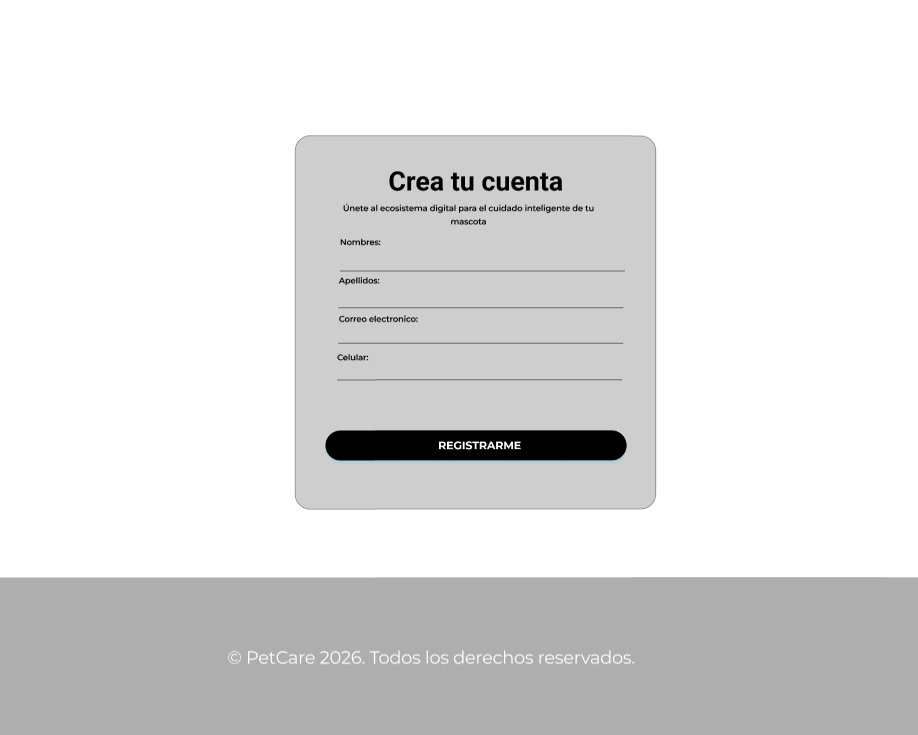<br><br><br>-Mobile Web Browser:<br><br>En la versión mobile, en este apartado el contenido se organiza de forma vertical, priorizando el nombre de la aplicación y su propósito. Los botones principales son intuitivos, facilitando la navegación y siendo esta fluida. Además, se simplificó la navegación mediante una navegación de tipo hamburguesa, optimizando el espacio en pantalla y permitiendo acceder a las opciones de forma ordenada.<br><br><br><br>En esta sección se presenta en formato vertical, manteniendo una jerarquía clara para facilitar la lectura y comprensión del contenido.<br><br> <br><br> En este bloque, que describe cuales son los beneficios, se organizó de igual forma, en vertical, permitiendo una visualización clara y secuencial en pantallas reducidas.<br><br><br><br>En la sección de suscripciones también se organizó de forma vertical, facilitando la comparación y acceso a información adicional mediante botones.<br><br><br><br>En la sección de registro se agregó un bloque donde está el formulario, pensado para que el usuario pueda registrarse de forma rápida y sencilla desde el celular.<br><br>

### 4.3.2. Landing Page Mock-up
-Desktop Web Browser:<br><br>
</img><br><br>
</img><br><br>
</img><br><br>
</img><br><br>
</img><br><br>
-Mobile Web Browser:<br><br><br><br><br><br><br><br><br><br><br><br>

## 4.4. Web Applications UX/UI Design
### 4.4.1. Web Applications Wireframes
</img><br>
</img><br>
</img><br>
</img><br>
</img><br>
</img><br>
</img><br>
</img><br>
</img><br>
### 4.4.2. Web Applications Wireflow Diagrams
</img><br>
### 4.4.2. Web Applications Mock-ups
</img><br>
</img><br>
</img><br>
</img><br>
</img><br>
</img><br>
</img><br>
</img><br>
</img><br>
</img><br>

### 4.4.3. Web Applications User Flow Diagrams

-User Goal : El usuario desea registrarse en la plataforma para gestionar la información de su mascota<br><br>-Happy path:<br><br><br>-UnHappy Path: <br><br><br>
-User Goal : El usuario desea encontrar veterinarias confiables para atender a su mascota rápidamente.<br><br>-Happy Path<br><br>-UnHappy Path:<br><br>-User Goal : El usuario desea registrar y consultar el historial médico de su mascota.<br><br>-Happy Path:<br><br><br>-UnHappy Path 1:<br><br><br>-UnHappy Path 2:<br><br><br>-UnHappy Path 3:<br><br><br>-User Goal: El usuario desea recibir recordatorios de vacunas para cuidar la salud preventiva de su mascota.<br><br>-Happy Path: <br><br><br>-User Goal: El usuario desea registrar diagnósticos y citas médicas de forma digital para reducir el uso de papeleo.<br><br>-Happy Path:<br><br><br>-UnHappy Path:<br><br>
## 4.5. Web Applications Prototyping
En esta sección se presenta el flujo de cada frame. Se utilizaron los User Goals como base para construir los diagramas y posteriormente se conectaron en el User Flow. A continuación, se adjuntan imágenes como evidencia:<br><br><br><br>[Link del video donde se explican los User Flow Diagrams](https://1drv.ms/v/c/6f853fb278bb6268/IQBpn0BRBk22RJm7W5r_gqs5AVBObmjJoZsgVpKlszwqLBA?e=qGSUQC)
## 4.6. Domain-Driven Software Architecture

### 4.6.1. Design-Level Event Storming
En esta sección se presenta el proceso de Design-Level Event Storming, el cual permitió identificar, analizar y organizar los eventos clave del dominio del sistema PetCare.<br><br>
A través de esta técnica, se logró construir una visión más clara del comportamiento del sistema, facilitando la comprensión de los flujos principales, las interacciones entre los actores y la definición de los límites del dominio. Esto sirvió como base para una aproximación más estructurada y refinada del diseño a nivel general de la arquitectura del sistema.
Además, se incorporaron eventos del sistema y sistemas externos, como IoT, APIs e inteligencia artificial (IA), los cuales se representaron en el modelo para evidenciar futuras integraciones. Estos elementos fueron incluidos en el Event Storming en color negro, con el objetivo de diferenciar componentes externos del dominio principal, considerando 


<br>

<a href="https://miro.com/app/board/uXjVHe7toes=/?share_link_id=220216776831" target="_blank">
  
</a>

### 4.6.2. Software Architecture Context Diagram
<br>

### 4.6.3. Software Architecture Container Diagrams
<br>

### 4.6.4. Software Architecture Components Diagrams
<br>

## 4.7. Software Object-Oriented Design
### 4.7.1. Class Diagrams
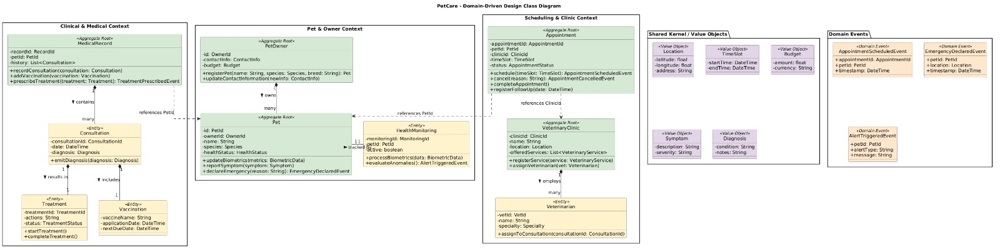<br>

## 4.8. Database Design
Para el diseño del sistema de la base de datos se usó un diagrama entidad-relación (ERD). En él se modela cómo un Usuario puede tener múltiples Mascotas, y cómo cada mascota puede estar asociada a citas veterinarias, historial clínico, vacunas, dispositivos IoT y alertas. También se incluye un Perfil con información adicional del usuario y una entidad de veterinarias para gestionar las clínicas. Además, el sistema incorpora el monitoreo en tiempo real mediante dispositivos IoT, que generan datos almacenados en Datos IoT, permitiendo registrar información y alertas sobre el estado de las mascotas.<br>
### 4.8.1. Database Diagrams.
<br>
# Capítulo V: Product Implementation, Validation & Deployment
## 5.1. Software Configuration Management
### 5.1.1. Software Development Environment Configuration
**Project Management y Requirements Management:**
  * **Miro:** Plataforma en línea que permite la colaboración en tiempo real a través de pizarras digitales. Ofrece herramientas para la creación de diagramas, mapas mentales y flujos.

**Product UX/UI Design:**
  * **Figma:** Herramienta de diseño de interfaces de usuario (UI) y prototipado colaborativo basada en la nube. En este caso, utilizamos Figma para la elaboración del prototipo interactivo de la aplicación móvil para los dueños de mascotas y el panel administrativo web para las clínicas veterinarias.

**Software Development:**
  * **IntelliJ IDEA:** Entorno de desarrollo integrado (IDE) profesional diseñado para maximizar la productividad del desarrollador. En este caso, lo utilizamos para el desarrollo robusto de toda la lógica de negocio y el backend del proyecto empleando Java y el framework Spring Boot.
  * **GitHub:** Plataforma de desarrollo colaborativo basada en la nube que utiliza el sistema de control de versiones Git. Permite a los desarrolladores alojar, revisar y colaborar en proyectos de software. En este caso, utilizamos GitHub como un repositorio remoto para almacenar, unificar y gestionar el código fuente de todo nuestro proyecto.

**Software Deployment y Bases de Datos:**
  * **SQL Server:** Sistema de gestión de bases de datos relacionales (RDBMS) desarrollado por Microsoft que utiliza el lenguaje SQL para la manipulación y consulta de datos. En este caso, utilizamos SQL Server como el motor principal para garantizar la integridad referencial de la plataforma, permitiendo estructurar los perfiles de usuarios, historiales médicos fijos y la gestión de citas mediante relaciones complejas y transacciones seguras

### 5.1.2. Source Code Management
Durante todo el desarrollo del proyecto, nuestro equipo hará uso de versiones de Git en la cual toda la evidencia podrá ser visualizada para posteriormente ser subida a la plataforma de github de la organización, en donde se podrán observar todas las modificaciones que se le harán realizando al proyecto a lo largo del desarrollo por cada uno de los miembros del equipo.

GitHub URL: https://github.com/Co-Designers/PetCare

### 5.1.3. Source Code Style Guide & Conventions

Para asegurar la escalabilidad, legibilidad y el mantenimiento del código de PetCare, el equipo adoptará como regla general que toda la nomenclatura (variables, clases, métodos, archivos y bases de datos) se escribirá estrictamente en idioma inglés. Además, nos apegaremos a las siguientes convenciones estándar según cada tecnología:

#### **HTML:**
Para el lenguaje HTML utilizaremos las siguientes convenciones:
* Usar nombres de elementos y etiquetas siempre en minúsculas.
* Cerrar obligatoriamente todos los elementos HTML.
* Usar nombres de atributos en minúsculas y encerrar sus valores entre comillas dobles.
* Evitar líneas de código demasiado largas para facilitar la lectura en el editor.

#### **CSS:**
Para el lenguaje CSS, utilizaremos las siguientes prácticas para alcanzar un código coherente y ordenado:
* Utilizar `camelCase` (capitalizar la primera letra de cada palabra excepto la primera) para los nombres de clases e IDs.
* Utilizar nombres de clases que sean descriptivos en inglés y que reflejen la función estructural del elemento, no su apariencia visual.

#### **JavaScript / TypeScript (Angular):**
Para la lógica del frontend, seguiremos las siguientes convenciones:
* Utilizar `camelCase` para nombrar variables, propiedades y métodos (ejemplo: `getPetHistory`).
* Utilizar `PascalCase` para nombrar Clases e Interfaces (ejemplo: `PetProfileComponent`).
* Utilizar `UPPER_SNAKE_CASE` para constantes inmutables (ejemplo: `MAX_UPLOAD_SIZE`).
* En Angular, nombrar los archivos separando las palabras con guiones y especificando su tipo (ejemplo: `vet-list.component.ts`, `auth.service.ts`).

#### **Java (Spring Boot):**
Para el desarrollo del backend, nos guiaremos de las siguientes convenciones:
* Utilizar `PascalCase` para el nombre de las Clases y `camelCase` para los métodos y atributos.
* Mantener la regla de escribir una sola clase por archivo.
* Usar `UPPER_SNAKE_CASE` para las constantes (`static final`).
* Utilizar las anotaciones semánticas de Spring Boot para definir claramente la capa lógica de cada clase (`@RestController` para controladores, `@Service` para lógica de negocio, `@Repository` para acceso a datos).
* Agrupar las clases en paquetes lógicos según su dominio (ejemplo: `com.petcare.users`, `com.petcare.appointments`).

### 5.1.4. Software Deployment Configuration
Para realizar el despliegue de nuestro landing page haremos uso de la herramienta GitHub. En donde el equipo deberá contar con una organización y repositorio donde ubicamos los documentos. En este mismo observaremos los siguientes elementos:

  * Una carpeta “html” con el “index.html” en donde almacenaremos el código de nuestra landing page. 
  * Una carpeta “js” la cual contiene los scripts con la lógica para el landing page en un archivo “index.js”
  * Una carpeta “css” la cual contiene los estilos que usaremos en un archivo “style.css” 
  * Una carpeta “images” la cual contiene las imágenes empleadas en el landing page

## 5.2. Landing Page, Services & Applications Implementation

En esta sección se presenta el avance de implementación, documentación, pruebas y despliegue de los productos digitales de PetCare. Para cada Sprint se describe la planificación, distribución de responsabilidades, Sprint Backlog, evidencias de desarrollo, ejecución, documentación de servicios, despliegue y colaboración del equipo.

### 5.2.1. Sprint 1

El Sprint 1 tuvo como objetivo implementar la primera versión funcional del Landing Page de PetCare. Este Sprint se enfocó en las User Stories relacionadas con la experiencia inicial del visitante, permitiendo presentar la propuesta de valor, explicar el propósito de la plataforma, mostrar beneficios, comparar planes de suscripción, facilitar la navegación entre secciones, habilitar el cambio de idioma y registrar datos de contacto de usuarios interesados.

#### 5.2.1.1. Sprint Planning 1

En esta sección se presenta la planificación del Sprint 1, indicando el alcance definido, los participantes, el objetivo del Sprint, las User Stories seleccionadas y la suma de Story Points considerada para esta iteración.

<table>
  <tr>
    <th>Categoría</th>
    <th>Detalle</th>
  </tr>
  <tr>
    <td><strong>Sprint #</strong></td>
    <td>Sprint 1</td>
  </tr>
  <tr>
    <td colspan="2"><strong>Sprint Planning Background</strong></td>
  </tr>
  <tr>
    <td><strong>Date</strong></td>
    <td>2026-04-22</td>
  </tr>
  <tr>
    <td><strong>Time</strong></td>
    <td>8:00 PM - 12:00 AM</td>
  </tr>
  <tr>
    <td><strong>Location</strong></td>
    <td>Discord</td>
  </tr>
  <tr>
    <td><strong>Prepared By</strong></td>
    <td>Katherine Maryory, Mejía Aliaga</td>
  </tr>
  <tr>
    <td><strong>Attendees (to planning meeting)</strong></td>
    <td>
      Diego Roberto, Campoblanco Guzman<br>
      Ghiou Justinn, Mauricio Silva<br>
      Ghorget Saul, Tuncar Vila<br>
      Jean Pool, Huaman de la Cruz<br>
      Katherine Maryory, Mejía Aliaga
    </td>
  </tr>
  <tr>
    <td><strong>Sprint 0 Review Summary</strong></td>
    <td>Se definió el enfoque inicial del producto PetCare y se organizaron las primeras historias relacionadas con el Landing Page, priorizando la presentación de la propuesta de valor y la captación inicial de usuarios interesados.</td>
  </tr>
  <tr>
    <td><strong>Sprint 0 Retrospective Summary</strong></td>
    <td>El equipo identificó la necesidad de mejorar la trazabilidad entre User Stories, tareas y entregables del Sprint, por lo que se acordó enfocar el Sprint 1 únicamente en las funcionalidades visibles y alcanzables del Landing Page.</td>
  </tr>
  <tr>
    <td colspan="2"><strong>Sprint Goal & User Stories</strong></td>
  </tr>
  <tr>
    <td><strong>Sprint 1 Goal</strong></td>
    <td>
      Nuestro enfoque es entregar un Landing Page informativo y responsive para PetCare.<br><br>
      Creemos que esto permite a los visitantes comprender claramente la propuesta de valor de PetCare e identificar los beneficios, planes de suscripción y opciones de registro de la plataforma.<br><br>
      Esto se confirmará cuando los visitantes puedan navegar por las secciones principales del Landing Page, revisar beneficios y planes, cambiar el idioma entre español e inglés y enviar sus datos de contacto desde la sección de registro.
    </td>
  </tr>
  <tr>
    <td><strong>Sprint 1 Velocity</strong></td>
    <td>9</td>
  </tr>
  <tr>
    <td><strong>Sum of Story Points</strong></td>
    <td>9</td>
  </tr>
</table>

#### 5.2.1.2. Aspect Leaders and Collaborators

En el presente Sprint se priorizó el desarrollo del Landing Page de la plataforma PetCare, el cual constituye el principal punto de entrada para los visitantes interesados en conocer el producto. Este componente cumple un rol estratégico, ya que permite comunicar de manera clara y visualmente atractiva la propuesta de valor, los beneficios, los planes de suscripción y los medios de contacto inicial de la plataforma.

El Sprint se enfocó en el diseño e implementación de la interfaz del Landing Page, abarcando la estructura visual, la organización del contenido, la navegación interna, el cambio de idioma y el formulario de registro de contacto. Para optimizar la distribución del trabajo, se definió una Leadership and Collaboration Matrix (LACX), donde se establecen los roles de Leader y Collaborator por cada aspecto técnico trabajado durante el Sprint.

A continuación, se presenta la matriz de liderazgo y colaboración del Sprint 1.

**Leadership and Collaboration Matrix (LACX)**

| Team Member (Last Name, First Name) | GitHub Username | Landing Page HTML (L/C) | Landing Page CSS (L/C) | Landing Page JS (L/C) | UI/UX Design (L/C) |
|---|---|---|---|---|---|
| Mejía Aliaga, Katherine Maryory | KathMJ | L | L | L | C |
| Tuncar Vila, Ghorghet Saul | Ghorghet | C | C | C | C |

**Aspecto: Desarrollo del Landing Page de PetCare**

| Aspecto | Descripción |
|---|---|
| Feature | Diseño, desarrollo e implementación del Landing Page de la plataforma PetCare. |
| Objetivo Principal | Desarrollar una landing page informativa, responsive y visualmente consistente que comunique la propuesta de valor de PetCare, presente sus beneficios principales, muestre los planes de suscripción y facilite la captación inicial de visitantes interesados mediante un formulario de registro de contacto. |
| Elementos incluidos | • Diseño de layout principal adaptable.<br>• Barra de navegación con acceso a secciones clave: Inicio, Quiénes somos, Beneficios, Suscripción y Contacto.<br>• Sección Hero con mensaje principal y llamada a la acción.<br>• Sección “Quiénes somos” con descripción institucional de PetCare.<br>• Sección de Beneficios estructurada en tarjetas informativas.<br>• Sección de Planes de suscripción: “Esencial”, “Cuidado Activo” y “Monitoreo Vital”.<br>• Formulario de contacto para captación de usuarios interesados.<br>• Footer con información general del sistema.<br>• Botones de acción como “Saber más”, “Registrarse” y “Elegir plan”.<br>• Implementación de internacionalización básica mediante opciones ES/EN. |
| Criterios de aceptación | • Navegación fluida entre secciones mediante enlaces internos.<br>• Correcta visualización en distintos dispositivos.<br>• Coherencia visual con la identidad de marca de PetCare.<br>• Contenido claro, legible y estructurado.<br>• Correcta carga de recursos visuales, estilos y scripts.<br>• Funcionamiento adecuado de botones y enlaces interactivos del Landing Page.<br>• Formulario de contacto visible y estructurado para el registro inicial de visitantes interesados.<br>• Implementación funcional del cambio de idioma ES/EN. |
| Resultado esperado | Un Landing Page funcional, accesible y visualmente consistente que represente la propuesta de valor de PetCare, facilite la comprensión del producto por parte de los visitantes y promueva el registro inicial de usuarios interesados. |


#### 5.2.1.3. Sprint Backlog 1. 

El Sprint Backlog 1 se organizó a partir de las User Stories seleccionadas para el desarrollo inicial del Landing Page de PetCare. Las tareas se enfocaron en implementar las secciones informativas principales, la navegación interna, los planes de suscripción, el formulario de contacto y el cambio de idioma, manteniendo trazabilidad con el Sprint Goal definido.

| Sprint # | US ID | User Story Title | Task ID | Task Title | Description | Estimation | Assigned To | Status |
|---|---|---|---|---|---|---|---|---|
| Sprint 1 | US01 | Conocer propuesta de valor | W-01 | Implementar sección hero | Desarrollar la sección principal del Landing Page con mensaje de bienvenida, propuesta de valor de PetCare y llamada a la acción para que el visitante conozca más sobre la plataforma. | 1 hora | Katherine Maryory, Mejía Aliaga | Done |
| Sprint 1 | US02 | Conocer propósito de PetCare | W-02 | Implementar sección “Quiénes somos” | Añadir una sección institucional que explique el propósito de PetCare y su enfoque en el cuidado veterinario preventivo. | 1 hora | Katherine Maryory, Mejía Aliaga | Done |
| Sprint 1 | US03 | Revisar beneficios de salud preventiva | W-03 | Implementar sección de beneficios | Diseñar tarjetas informativas que presenten beneficios como recomendaciones de salud, monitoreo en vivo e historial clínico digital. | 1 hora | Katherine Maryory, Mejía Aliaga | Done |
| Sprint 1 | US04 | Comparar planes de suscripción | W-04 | Implementar sección de suscripciones | Mostrar los planes “Esencial”, “Cuidado Activo” y “Monitoreo Vital” con sus precios, beneficios y opción para elegir un plan. | 1 hora | Katherine Maryory, Mejía Aliaga | Done |
| Sprint 1 | US05 | Solicitar registro desde el Landing Page | W-05 | Implementar formulario de registro | Añadir un formulario de contacto con campos para nombres, apellidos, correo electrónico y celular, permitiendo iniciar el proceso de creación de cuenta. | 1 hora | Katherine Maryory, Mejía Aliaga | Done |
| Sprint 1 | US07 | Cambiar idioma del contenido | W-06 | Implementar cambio de idioma ES/EN | Habilitar las opciones de idioma español e inglés para permitir que el visitante visualice el contenido principal según su preferencia. | 1 hora | Katherine Maryory, Mejía Aliaga | Done |
| Sprint 1 | US08 | Navegar por información del Landing Page | W-07 | Implementar navegación interna | Configurar la barra de navegación y los enlaces internos hacia las secciones Inicio, Quiénes somos, Beneficios, Suscripción y Contacto. | 1 hora | Katherine Maryory, Mejía Aliaga | Done |

#### 5.2.1.4. Development Evidence for Sprint Review

En esta sección se presenta la evidencia del progreso alcanzado durante el desarrollo del Sprint 1, específicamente en la implementación del Landing Page de la plataforma PetCare. Si bien la planificación inicial del Sprint se realizó previamente, el entregable fue consolidado mediante ajustes y mejoras sobre la estructura, diseño, organización de archivos e internacionalización básica del Landing Page.

Los commits registrados evidencian la consolidación del Landing Page y la preparación de una versión funcional para la revisión del Sprint. A continuación, se muestra la tabla con los commits más relevantes asociados al repositorio del proyecto.

| Repository | Branch | Commit Id | Commit Message | Commit Message Body | Committed on (Date) |
|---|---|---|---|---|---|
| KathMJ/petcare-landingpage | main | ce8de6c | refactor: landing page overhaul | Refactor and improvement of the Landing Page structure, layout and visual presentation. | 09/05/2026 |
| KathMJ/petcare-landingpage | main | a62e0a6 | feat: added i18n | Added basic internationalization support for Spanish and English content. | 10/05/2026 |
| KathMJ/petcare-landingpage | main | 477b2a | feat: created translation.js | Created translation file for multilingual Landing Page content. | 10/05/2026 |
| KathMJ/petcare-landingpage | main | a853e0 | feat: deleted translation.js | Removed previous translation file as part of file reorganization. | 10/05/2026 |
| KathMJ/petcare-landingpage | main | 19aff4 | feat: rename translation.js to translations.js | Renamed translation file to improve naming consistency. | 10/05/2026 |


#### 5.2.1.5. Execution Evidence for Sprint Review

**Sprint 1:**

Durante el desarrollo del Sprint 1 se implementó la primera versión funcional del Landing Page de PetCare, cumpliendo con las User Stories priorizadas para la experiencia inicial del visitante. Las evidencias muestran las secciones principales desarrolladas, la navegación interna, la presentación de beneficios, los planes de suscripción, el formulario de registro y el cambio de idioma del contenido.

1. **Barra de navegación:**  
Se implementó una barra de navegación que permite al visitante acceder de forma rápida a las secciones principales del Landing Page: Inicio, Quiénes somos, Beneficios, Suscripción y Contacto. Esta funcionalidad facilita el desplazamiento interno y mejora la experiencia de navegación.


2. **Sección Hero:**  
Se desarrolló la sección principal del Landing Page, la cual incluye un mensaje introductorio y una llamada a la acción orientada a comunicar la propuesta de valor de PetCare desde el primer contacto con el visitante.


3. **Sección Quiénes somos:**  
Se añadió una sección institucional con información sobre PetCare, su propósito y su enfoque en el cuidado veterinario preventivo, permitiendo que los visitantes comprendan mejor la finalidad de la plataforma.


4. **Sección Beneficios:**  
Se implementó una sección de beneficios mediante tarjetas informativas, donde se explican las principales ventajas de PetCare para el cuidado de las mascotas, como recomendaciones de salud, monitoreo en vivo e historial clínico digital.


5. **Sección de Suscripciones:**  
Se incorporó una sección de planes de suscripción, donde se presentan las alternativas disponibles para que el visitante pueda comparar beneficios y elegir la opción que mejor se ajuste a las necesidades de cuidado de su mascota.


6. **Sección de Registro:**  
Se implementó un formulario de registro de contacto, donde el visitante interesado puede ingresar nombres, apellidos, correo electrónico y celular para iniciar el proceso de creación de cuenta en PetCare.


7. **Cambio de idioma:**  
Se habilitaron las opciones de idioma ES/EN, permitiendo que el visitante pueda visualizar el contenido principal del Landing Page en español o inglés según su preferencia.


**Link del video de demostración:** https://drive.google.com/file/d/1ThG-uKVHmkH3e956boju7AyqltXSUESM/view?usp=sharing 

#### 5.2.1.6. Services Documentation Evidence for Sprint Review

Durante el Sprint 1, el alcance principal estuvo enfocado en el diseño, implementación y despliegue inicial del Landing Page de PetCare. Por ello, en esta iteración no se implementaron endpoints del RESTful API ni se generó documentación OpenAPI asociada a Web Services.

Sin embargo, como parte de la planificación técnica del producto, se identificaron los servicios que serán necesarios para los siguientes Sprints, considerando las User Stories funcionales de la Web Application y las Technical Stories definidas para el RESTful API.

Los servicios identificados para futuras iteraciones son los siguientes:

- **Servicios de Autenticación y Autorización:** registro de usuarios, inicio de sesión, gestión de sesiones y control de acceso según el tipo de cuenta.
- **Servicios de Gestión de Usuarios:** creación y consulta de perfiles de dueños de mascotas y representantes de veterinarias.
- **Servicios de Gestión de Mascotas:** registro, consulta y actualización de perfiles clínicos de mascotas, considerando restricciones según el plan de suscripción.
- **Servicios de Historial Clínico:** consulta autorizada, registro de evolución médica, recetas, vacunas y exportación del historial clínico.
- **Servicios de Búsqueda de Veterinarias:** consulta de veterinarias por ubicación, especialidad, horario, tipo de servicio y disponibilidad.
- **Servicios de Reserva :** creación de reservas, validación de disponibilidad real, reprogramación y cancelación.
- **Servicios de Recordatorios Preventivos:** generación automática de recordatorios de vacunas, controles médicos y citas programadas.
- **Servicios de Monitoreo IoT:** procesamiento de lecturas biométricas y generación de alertas críticas asociadas a la salud de la mascota.

Debido a que estos servicios no formaron parte del alcance implementado en el Sprint 1, no se adjuntan endpoints documentados, URL de OpenAPI ni commits relacionados con documentación de Web Services para esta iteración. La documentación técnica de estos servicios será incorporada en los Sprints donde se implemente el RESTful API correspondiente.


#### 5.2.1.7. Software Deployment Evidence for Sprint Review
En esta sección se describe el proceso de despliegue del Landing Page de la plataforma PetCare en un entorno accesible para los usuarios. Este proceso permite validar la correcta implementación de la interfaz desarrollada durante el Sprint 1, asegurando su disponibilidad, visualización y funcionamiento en línea.

El despliegue del Landing Page representa un hito importante dentro del desarrollo del proyecto, ya que permite contar con una versión funcional del sistema accesible mediante un enlace público, facilitando la validación del producto por parte del equipo y de los usuarios objetivo.

**URL de despliegue del Landing Page:**

[](https://co-designers.github.io/petcare-landingpage/)

**Landing Page Desplegado**

1. Para el despliegue del Landing Page, el equipo utilizó el repositorio del proyecto *petcare-landingpage*, en el cual se gestionaron todos los archivos correspondientes a la estructura HTML, estilos CSS y funcionalidades JavaScript desarrolladas durante el Sprint.


2. Se trabajó sobre la rama principal *main*, donde se integraron los cambios finales del Landing Page, asegurando una versión estable y lista para su publicación.


3. Posteriormente, se configuró el servicio GitHub Pages, el cual permite el alojamiento de sitios web estáticos directamente desde el repositorio. A través de esta herramienta, se seleccionó la rama *main* como fuente de despliegue.


4. Finalmente, se generó el enlace público del sitio, permitiendo acceder al Landing Page de PetCare desde cualquier navegador web, validando su correcto funcionamiento, diseño responsive y experiencia de usuario.


El resultado de este proceso es un Landing Page desplegado y accesible en línea, que representa de manera efectiva la propuesta de valor de PetCare y sirve como punto de entrada para los usuarios del sistema.


#### 5.2.1.8. Team Collaboration Insights during Sprint

En esta sección se presenta una visión general de la colaboración del equipo durante el Sprint 1 del proyecto PetCare. Durante esta iteración, el trabajo se enfocó en el desarrollo del Landing Page, por lo que las actividades principales estuvieron relacionadas con la organización del contenido, diseño visual, maquetación, estilos, navegación interna, cambio de idioma y documentación de evidencias.

La implementación técnica del Landing Page fue registrada principalmente mediante commits realizados por Katherine Maryory, Mejía Aliaga en el repositorio del proyecto. Asimismo, los demás integrantes del equipo colaboraron en actividades complementarias como revisión del contenido, validación visual del Landing Page, recopilación de capturas, documentación del Sprint y verificación de la navegación implementada.

La colaboración del Sprint se evidencia mediante capturas de GitHub, donde se muestran los commits realizados en el repositorio del Landing Page, así como el avance técnico correspondiente a la implementación y consolidación del producto. Esta evidencia permite relacionar las tareas planificadas en el Sprint Backlog con el entregable presentado para la revisión del Sprint.

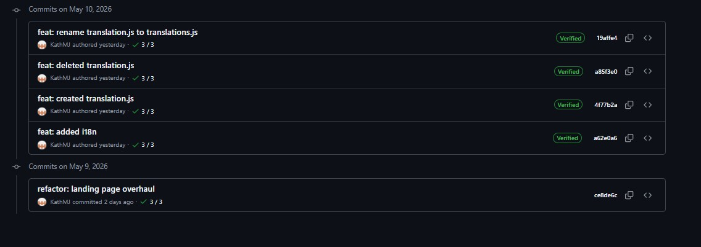

### 5.2.2. Sprint 2

El Sprint 2 tuvo como objetivo implementar una primera versión funcional de la Web Application de PetCare, permitiendo validar el acceso de usuarios mediante vistas de inicio de sesión y registro, así como la navegación diferenciada según el tipo de cuenta. Este Sprint incorporó interfaces iniciales para el dueño de mascota y para la veterinaria, mostrando funcionalidades relacionadas con mascotas registradas, próximas citas, alertas de salud, servicios veterinarios, búsqueda de veterinarias, historial médico, agenda médica, pacientes, monitoreo IoT y configuración del perfil veterinario.

#### 5.2.2.1. Sprint Planning 2

En esta sección se presenta la planificación del Sprint 2, indicando el alcance definido, los participantes, el objetivo del Sprint, las User Stories seleccionadas y la suma de Story Points considerada para esta iteración.

<table>
  <tr>
    <th>Categoría</th>
    <th>Detalle</th>
  </tr>
  <tr>
    <td><strong>Sprint #</strong></td>
    <td>Sprint 2</td>
  </tr>
  <tr>
    <td colspan="2"><strong>Sprint Planning Background</strong></td>
  </tr>
  <tr>
    <td><strong>Date</strong></td>
    <td>2026-05-12</td>
  </tr>
  <tr>
    <td><strong>Time</strong></td>
    <td>8:00 PM - 12:00 AM</td>
  </tr>
  <tr>
    <td><strong>Location</strong></td>
    <td>Discord</td>
  </tr>
  <tr>
    <td><strong>Prepared By</strong></td>
    <td>Ghiou Justinn, Mauricio Silva</td>
  </tr>
  <tr>
    <td><strong>Attendees (to planning meeting)</strong></td>
    <td>
      Diego Roberto, Campoblanco Guzman<br>
      Ghiou Justinn, Mauricio Silva<br>
      Ghorget Saul, Tuncar Vila<br>
      Jean Pool, Huaman de la Cruz<br>
      Katherine Maryory, Mejía Aliaga
    </td>
  </tr>
  <tr>
    <td><strong>Sprint 1 Review Summary</strong></td>
    <td>Durante el Sprint 1 se implementó y consolidó la primera versión funcional del Landing Page de PetCare. Se desarrollaron las secciones principales del sitio, incluyendo propuesta de valor, información institucional, beneficios, planes de suscripción, formulario de registro, navegación interna y cambio de idioma ES/EN.</td>
  </tr>
  <tr>
    <td><strong>Sprint 1 Retrospective Summary</strong></td>
    <td>El equipo identificó la necesidad de continuar con la conexión entre el Landing Page y la Web Application, especialmente en el acceso al inicio de sesión, registro de usuarios y diferenciación de vistas según tipo de cuenta. Además, se acordó trabajar con datos de prueba para validar la navegación inicial de los paneles de dueño de mascota y veterinaria.</td>
  </tr>
  <tr>
    <td colspan="2"><strong>Sprint Goal & User Stories</strong></td>
  </tr>
  <tr>
    <td><strong>Sprint 2 Goal</strong></td>
    <td>
      Nuestro enfoque es implementar una primera versión funcional de la Web Application de PetCare con acceso diferenciado para dueños de mascotas y veterinarias.<br><br>
      Creemos que esto permite validar la experiencia interna de la plataforma, facilitando que los dueños de mascotas accedan a información inicial sobre mascotas, citas, alertas, servicios veterinarios e historial médico, mientras que las veterinarias puedan visualizar secciones de gestión como dashboard, agenda médica, pacientes, monitoreo IoT y configuración.<br><br>
      Esto se confirmará cuando los usuarios puedan iniciar sesión con cuentas de prueba, acceder a una interfaz diferenciada según su tipo de cuenta y navegar por las principales secciones implementadas de la Web Application.
    </td>
  </tr>
  <tr>
    <td><strong>Sprint 2 Velocity</strong></td>
    <td>42</td>
  </tr>
  <tr>
    <td><strong>Sum of Story Points</strong></td>
    <td>42</td>
  </tr>
</table>

#### 5.2.2.2. Aspect Leaders and Collaborators

En el presente Sprint se priorizó el desarrollo inicial de la Web Application de PetCare, la cual permite a los usuarios acceder a una experiencia diferenciada según su tipo de cuenta. A diferencia del Sprint 1, centrado en el Landing Page, este Sprint se enfocó en la implementación de vistas internas para dueños de mascotas y veterinarias, incluyendo pantallas de inicio de sesión, registro, dashboards, navegación por secciones, visualización de información básica y despliegue del frontend.

El Sprint se enfocó en la construcción de la interfaz principal de la Web Application, abarcando la estructura de navegación, vistas para el usuario dueño de mascota, vistas para el usuario veterinario, conexión con datos de prueba mediante `db.json`, validación inicial de credenciales y despliegue del proyecto frontend. Para optimizar la distribución del trabajo, se definió una Leadership and Collaboration Matrix (LACX), donde se establecen los roles de Leader y Collaborator por cada aspecto técnico trabajado durante el Sprint.

A continuación, se presenta la matriz de liderazgo y colaboración del Sprint 2.

**Leadership and Collaboration Matrix (LACX)**

| Team Member (Last Name, First Name) | GitHub Username | Web App Frontend (L/C) | Authentication Flow (L/C) | Pet Owner Interface (L/C) | Veterinary Interface (L/C) | Deployment (L/C) | Documentation & Review (L/C) |
|---|---|---|---|---|---|---|---|
| Huaman de la Cruz, Jean Pool | JeanPool | L | L | L | L | L | C |
| Mauricio Silva, Ghiou Justinn | Justinn2006 | C | C | C | C | C | L |
| Campoblanco Guzman, Diego Roberto | DiegoCampoblanco | C | C | C | C | C | C |
| Tuncar Vila, Ghorget Saul | Ghorghet | C | C | C | C | C | C |
| Mejía Aliaga, Katherine Maryory | KathMJ | C | C | C | C | C | C |

**Aspecto: Desarrollo y despliegue inicial de la Web Application de PetCare**

| Aspecto | Descripción |
|---|---|
| Feature | Diseño, desarrollo, validación y despliegue inicial de la Web Application de PetCare. |
| Objetivo Principal | Implementar una primera versión funcional del frontend de la Web Application, permitiendo validar el acceso de usuarios, la navegación diferenciada por tipo de cuenta y la visualización de vistas iniciales para dueños de mascotas y veterinarias. |
| Elementos incluidos | • Vista de inicio de sesión.<br>• Vista de registro de usuario.<br>• Selección o diferenciación de tipo de cuenta.<br>• Dashboard inicial para dueño de mascota.<br>• Visualización de mascotas registradas, próximas citas y alertas de salud.<br>• Secciones de servicios veterinarios, veterinarias, citas, contacto e historial médico.<br>• Dashboard inicial para veterinaria.<br>• Secciones de agenda médica, pacientes, monitoreo IoT y configuración.<br>• Uso de datos de prueba mediante `db.json`.<br>• Validación inicial de credenciales de prueba.<br>• Despliegue inicial del frontend de la Web Application. |
| Criterios de aceptación | • El usuario puede acceder a la vista de inicio de sesión.<br>• El sistema permite validar credenciales de prueba para dueño de mascota y veterinario.<br>• El usuario visualiza una interfaz diferenciada según el tipo de cuenta.<br>• El dueño de mascota puede navegar por las vistas principales de su panel.<br>• La veterinaria puede navegar por las vistas principales de su panel.<br>• Las vistas muestran información inicial utilizando datos de prueba.<br>• El frontend se encuentra desplegado y accesible desde una URL pública.<br>• Las pantallas principales mantienen coherencia visual y navegación funcional. |
| Resultado esperado | Una primera versión navegable de la Web Application de PetCare, desplegada y validada con datos de prueba, que permita demostrar el acceso diferenciado para dueños de mascotas y veterinarias, así como la estructura base de las principales funcionalidades internas de la plataforma. |

#### 5.2.2.3. Sprint Backlog 2

El Sprint Backlog 2 se organizó a partir de las User Stories seleccionadas para la implementación inicial de la Web Application de PetCare. Las tareas se enfocaron en desarrollar el flujo de acceso, la diferenciación de interfaces por tipo de usuario, el panel del dueño de mascota, el panel de veterinaria, la navegación interna, la visualización de información con datos de prueba y el despliegue inicial del frontend.

| Sprint # | US ID | User Story Title | Task ID | Task Title | Description | Estimation | Assigned To | Status |
|---|---|---|---|---|---|---|---|---|
| Sprint 2 | US06 | Acceder al inicio de sesión | W-01 | Conectar acceso desde Landing Page | Habilitar la navegación desde el Landing Page hacia la vista de inicio de sesión de la Web Application. | 1 hora | Jean Pool, Huaman de la Cruz | Done |
| Sprint 2 | US09 | Seleccionar tipo de cuenta | W-02 | Implementar selección de tipo de usuario | Permitir que el usuario identifique si accederá como dueño de mascota o veterinaria dentro del flujo de acceso. | 1 hora | Jean Pool, Huaman de la Cruz | Done |
| Sprint 2 | US10 | Habilitar cuenta de dueño de mascota | W-03 | Crear flujo básico para dueño de mascota | Implementar una estructura inicial para el acceso de dueños de mascotas mediante credenciales de prueba. | 1 hora | Jean Pool, Huaman de la Cruz | Done |
| Sprint 2 | US11 | Registrar veterinaria en la plataforma | W-04 | Crear flujo básico para veterinaria | Implementar una estructura inicial para el acceso de veterinarias mediante credenciales de prueba. | 1 hora | Jean Pool, Huaman de la Cruz | Done |
| Sprint 2 | US12 | Iniciar sesión por tipo de cuenta | W-05 | Validar acceso diferenciado | Configurar el flujo de inicio de sesión para redirigir al usuario hacia la interfaz correspondiente según su tipo de cuenta. | 2 horas | Jean Pool, Huaman de la Cruz | Done |
| Sprint 2 | US13 | Visualizar resumen de mascotas | W-06 | Implementar home del dueño de mascota | Desarrollar la vista principal del dueño de mascota con información inicial sobre mascotas registradas, próximas citas y alertas. | 2 horas | Jean Pool, Huaman de la Cruz | Done |
| Sprint 2 | US14 | Priorizar alertas importantes | W-07 | Mostrar alertas de salud | Incorporar una sección visual de alertas relevantes para que el dueño identifique riesgos o recordatorios importantes. | 1 hora | Jean Pool, Huaman de la Cruz | Done |
| Sprint 2 | US17 | Consultar ficha médica de mascota | W-08 | Implementar vista de historial médico | Crear una vista inicial para mostrar información médica de la mascota, incluyendo datos clínicos disponibles mediante datos de prueba. | 2 horas | Jean Pool, Huaman de la Cruz | Done |
| Sprint 2 | US23 | Buscar veterinarias con criterios médicos | W-09 | Implementar vista de veterinarias | Desarrollar una vista inicial para mostrar servicios veterinarios y opciones de veterinarias disponibles para el dueño de mascota. | 2 horas | Jean Pool, Huaman de la Cruz | Done |
| Sprint 2 | US24 | Identificar atención inmediata | W-10 | Mostrar servicios veterinarios destacados | Incorporar tarjetas o secciones que permitan visualizar servicios veterinarios relevantes para futuras atenciones. | 1 hora | Jean Pool, Huaman de la Cruz | Done |
| Sprint 2 | US25 | Evaluar reputación médica | W-11 | Mostrar información básica de veterinarias | Presentar información inicial de veterinarias o servicios para apoyar la decisión del dueño de mascota. | 1 hora | Jean Pool, Huaman de la Cruz | In-Process |
| Sprint 2 | US27 | Reservar atención veterinaria | W-12 | Crear vista inicial de citas | Implementar la sección de citas del dueño de mascota, permitiendo visualizar opciones relacionadas con reservas o atenciones programadas. | 2 horas | Jean Pool, Huaman de la Cruz | In-Process |
| Sprint 2 | US29 | Reprogramar atención veterinaria | W-13 | Preparar acciones de gestión de citas | Añadir elementos visuales para futuras acciones de reprogramación de citas dentro de la vista correspondiente. | 1 hora | Jean Pool, Huaman de la Cruz | In-Process |
| Sprint 2 | US30 | Cancelar cita veterinaria | W-14 | Preparar acciones de cancelación de citas | Añadir elementos visuales para futuras acciones de cancelación de citas, dejando pendiente la lógica completa de actualización. | 1 hora | Jean Pool, Huaman de la Cruz | In-Process |
| Sprint 2 | US31 | Recibir recordatorios preventivos | W-15 | Mostrar recordatorios iniciales | Incorporar información visual relacionada con citas, controles o alertas preventivas dentro del panel del dueño. | 1 hora | Jean Pool, Huaman de la Cruz | In-Process |
| Sprint 2 | US36 | Supervisar agenda diaria | W-16 | Implementar dashboard veterinario | Crear la vista principal para veterinaria, incluyendo acceso a agenda médica, pacientes, monitoreo IoT y configuración. | 2 horas | Jean Pool, Huaman de la Cruz | Done |
| Sprint 2 | US37 | Analizar desempeño de citas | W-17 | Mostrar indicadores iniciales del dashboard | Incorporar tarjetas o datos resumidos en el dashboard veterinario para representar actividad o gestión inicial. | 1 hora | Jean Pool, Huaman de la Cruz | In-Process |
| Sprint 2 | US38 | Consultar ingresos del negocio | W-18 | Preparar sección de gestión veterinaria | Añadir estructura visual inicial para futuras métricas administrativas o información de gestión del negocio veterinario. | 1 hora | Jean Pool, Huaman de la Cruz | In-Process |
| Sprint 2 | TS01 | Gestionar registro por tipo de cuenta | W-19 | Configurar datos de prueba de usuarios | Preparar datos simulados en `db.json` para representar cuentas de dueño de mascota y veterinaria. | 1 hora | Jean Pool, Huaman de la Cruz | Done |
| Sprint 2 | TS02 | Validar autenticación por tipo de cuenta | W-20 | Conectar autenticación con datos mock | Validar credenciales de prueba mediante `json-server`, permitiendo simular el acceso diferenciado por tipo de usuario. | 2 horas | Jean Pool, Huaman de la Cruz | In-Process |
| Sprint 2 | TS03 | Gestionar perfiles clínicos de mascotas | W-21 | Integrar datos iniciales de mascotas | Mostrar datos básicos de mascotas e información clínica mediante datos de prueba en las vistas del dueño. | 2 horas | Jean Pool, Huaman de la Cruz | In-Process |
| Sprint 2 | TS07 | Filtrar veterinarias disponibles | W-22 | Preparar estructura de servicios veterinarios | Implementar la vista base para servicios o veterinarias, dejando pendiente el filtrado completo mediante API. | 1 hora | Jean Pool, Huaman de la Cruz | In-Process |
| Sprint 2 | TS12 | Procesar monitoreo IoT y alertas críticas | W-23 | Implementar vista inicial de monitoreo IoT | Crear una vista visual inicial para monitoreo IoT dentro del panel veterinario, utilizando información simulada. | 2 horas | Jean Pool, Huaman de la Cruz | In-Process |

#### 5.2.2.4. Development Evidence for Sprint Review

En esta sección se presenta la evidencia del progreso alcanzado durante el desarrollo del Sprint 2, específicamente en la implementación inicial de la Web Application Frontend de PetCare. Los avances realizados se enfocaron en la construcción de vistas internas para dueños de mascotas y veterinarias, la mejora de estilos visuales, la corrección de recursos gráficos, la integración de rutas principales y la preparación del frontend para su despliegue.

Los commits registrados evidencian la consolidación de la Web Application, incluyendo ajustes en la interfaz de registro, mejoras visuales de componentes, cambios locales del frontend y actualización de recursos utilizados por el usuario veterinario. A continuación, se muestra la tabla con los commits más relevantes asociados al repositorio del proyecto.

| Repository | Branch | Commit Id | Commit Message | Commit Message Body | Committed on (Date) |
|---|---|---|---|---|---|
| Co-Designers/PetCare-Frontend | main | 8aa6fd8 | feat: local petcare frontend changes | Local frontend changes for the initial Web Application structure and navigation. | 12/05/2026 |
| Co-Designers/PetCare-Frontend | main | 7e8d253 | Enhance CSS styles for layout and components | Improved visual styles, layout structure and frontend components for the Web Application. | 12/05/2026 |
| Co-Designers/PetCare-Frontend | main | 5a57cf8 | Fix image source path in register-view.html | Fixed image source path used in the register view of the Web Application. | 12/05/2026 |
| Co-Designers/PetCare-Frontend | main | bfde882 | Update avatar URL for vet user Pedro Gonzales | Updated avatar resource for the veterinary user profile used in the Web Application. | 12/05/2026 |

#### 5.2.2.5. Execution Evidence for Sprint Review

Durante el desarrollo del Sprint 2 se implementó una primera versión funcional de la Web Application de PetCare, cumpliendo con las User Stories priorizadas para la experiencia interna de los usuarios. Las evidencias muestran el flujo de inicio de sesión, registro, navegación diferenciada por tipo de cuenta, panel del dueño de mascota, panel de veterinaria y vistas principales desarrolladas con datos de prueba.

1. **Vista de inicio de sesión:**  
Se implementó la pantalla de inicio de sesión de la Web Application, permitiendo que el usuario ingrese sus credenciales para acceder a la plataforma. Esta vista representa el punto de entrada hacia las interfaces internas de PetCare.

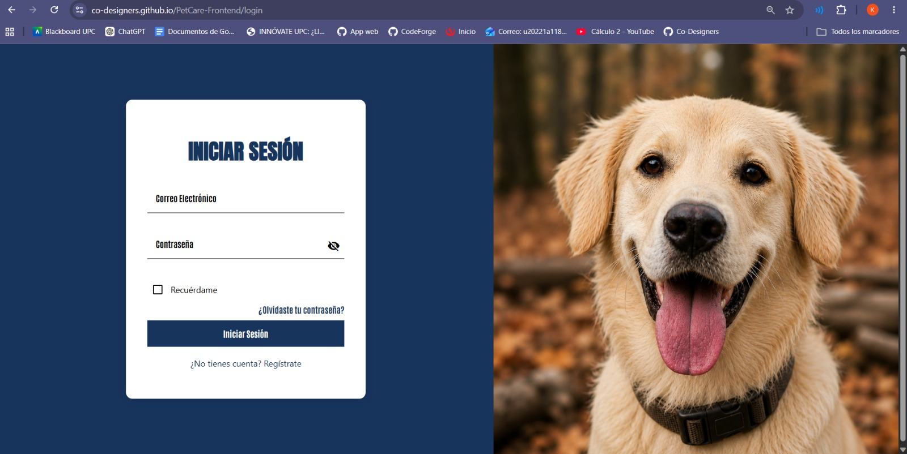

2. **Vista de registro:**  
Se desarrolló la pantalla de registro, donde el usuario puede ingresar datos básicos como nombres, apellidos, correo electrónico y contraseña. Además, se incluyó una opción para identificar si la cuenta corresponde a un usuario veterinario.

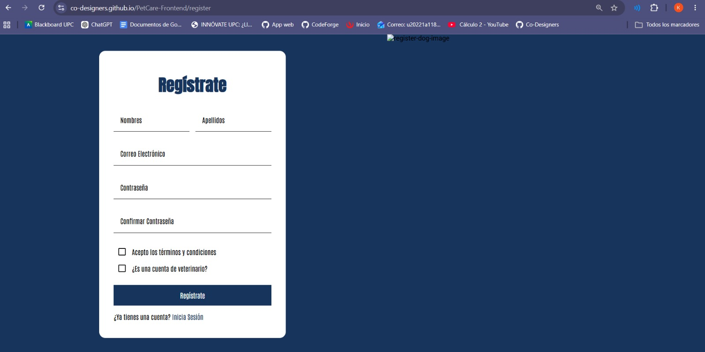

3. **Home del dueño de mascota:**  
Se implementó la vista principal para el dueño de mascota, donde se muestran mascotas registradas, accesos a historial, próximas citas y alertas de salud. Esta pantalla permite centralizar información relevante para el seguimiento preventivo de las mascotas desde una misma interfaz.

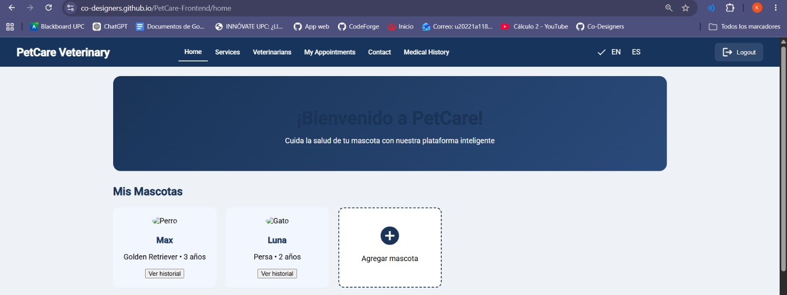

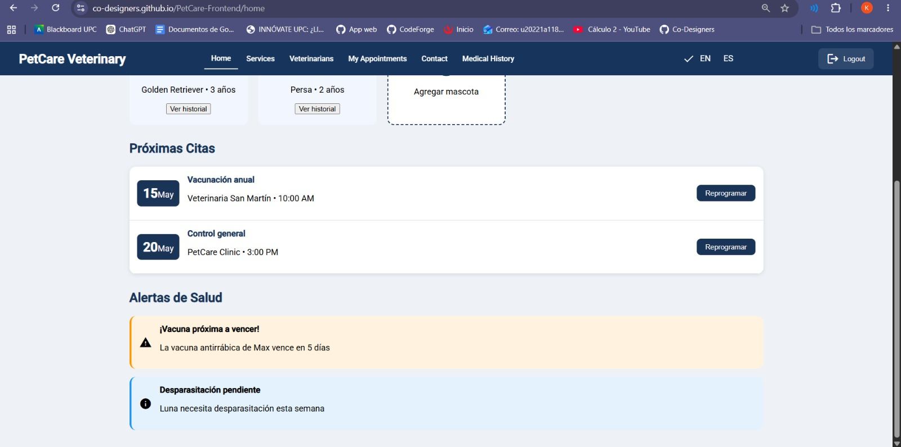

4. **Servicios veterinarios:**  
Se añadió una sección de servicios veterinarios, donde el usuario puede visualizar opciones como consulta general, vacunación, emergencia 24h, odontología, laboratorio y peluquería, junto con precios referenciales y botones de agenda.

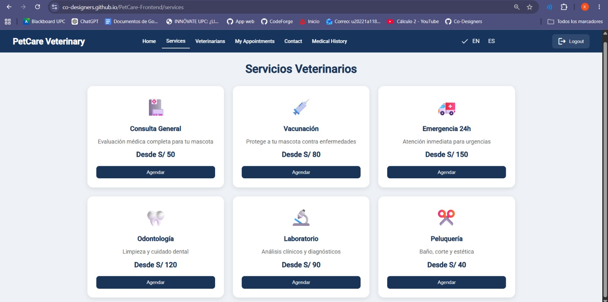

5. **Búsqueda y visualización de veterinarias:**  
Se implementó una vista de veterinarias cercanas con opciones de búsqueda y filtros por distrito o especialidad. La sección muestra información básica de veterinarias, reseñas, dirección, horario, teléfono y servicios ofrecidos.

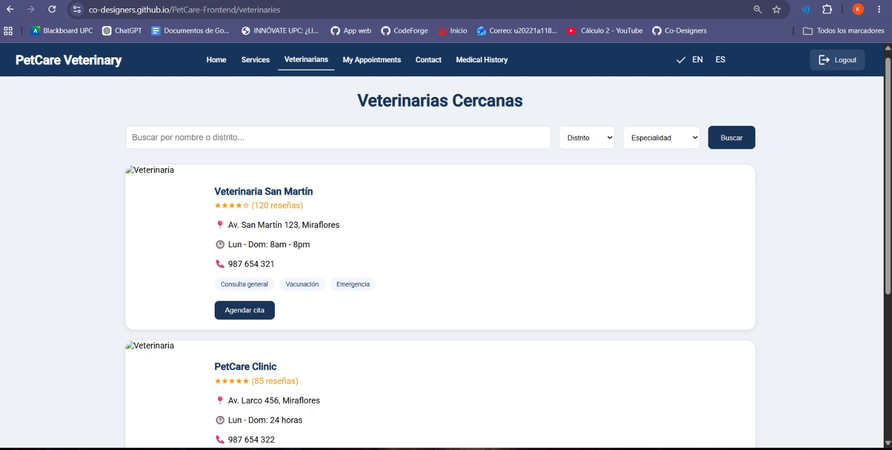

6. **Mis citas:**  
Se desarrolló una sección para visualizar citas próximas, historial y citas canceladas. Además, se incorporaron botones visuales para futuras acciones como reprogramar o cancelar una cita.

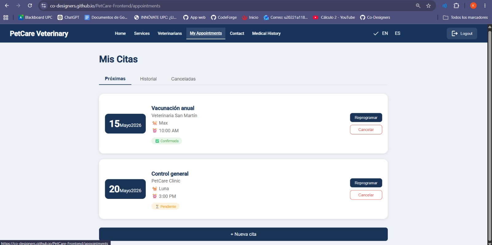

7. **Contacto:**  
Se implementó una vista de contacto con información de dirección, teléfono, correo y horario de atención. También se incluyó un formulario para que el usuario pueda enviar un mensaje desde la plataforma.

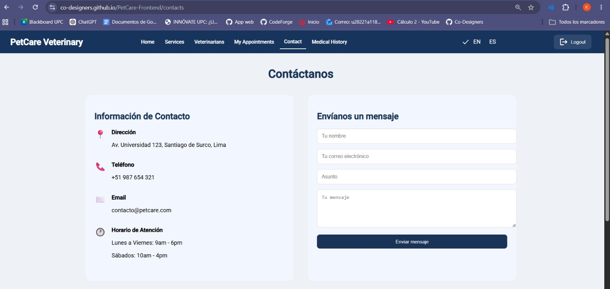

8. **Historial médico:**  
Se desarrolló una vista inicial de historial médico, donde el usuario puede seleccionar una mascota y visualizar información clínica como vacunas, enfermedades, tratamientos, cirugías y controles.

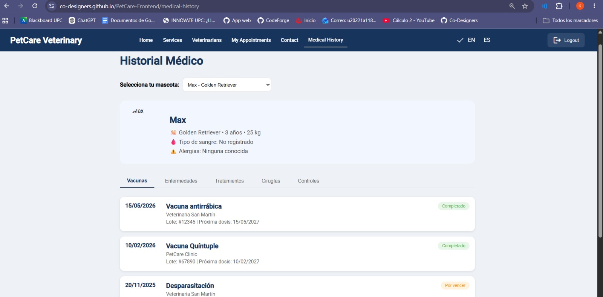

9. **Dashboard veterinario:**  
Se implementó una vista principal para el usuario veterinario, mostrando indicadores iniciales como citas del día, alertas críticas, tratamientos pendientes y pacientes activos. Esta vista permite representar una primera aproximación al panel de gestión clínica.

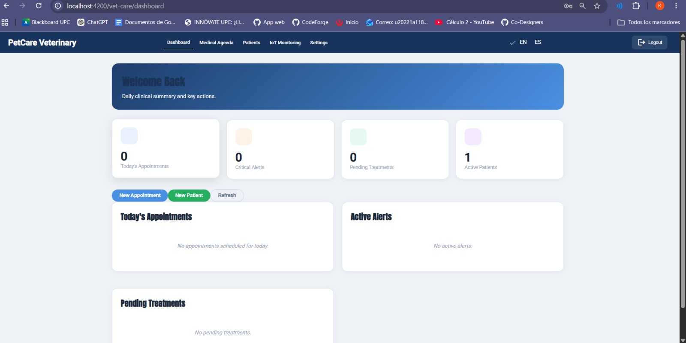

10. **Agenda médica:**  
Se añadió una sección de agenda médica para veterinarias, con controles de navegación por día, semana o mes, además de filtros por estado. Esta vista servirá como base para la futura gestión de citas clínicas.

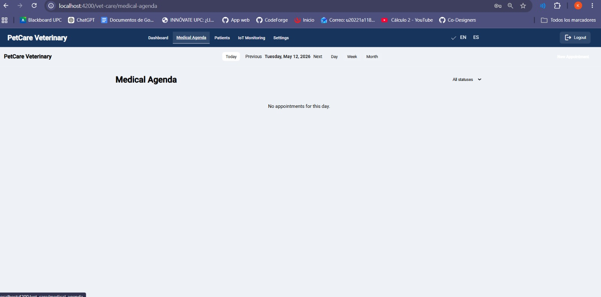

11. **Gestión de pacientes:**  
Se implementó una vista de pacientes, donde se muestran tarjetas con información básica de mascotas atendidas, incluyendo nombre, especie, edad, propietario y accesos a edición o historial.

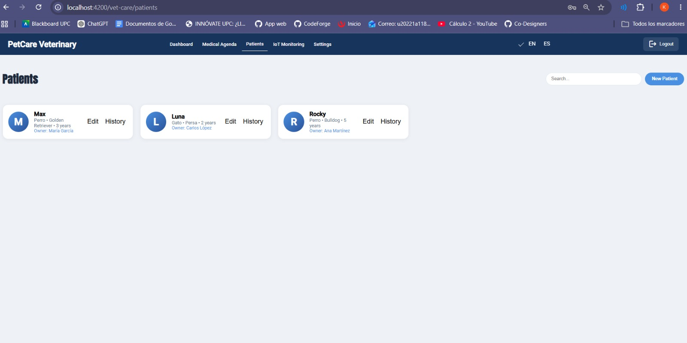

12. **Monitoreo IoT:**  
Se desarrolló una vista inicial de monitoreo IoT, donde se visualizan datos simulados como temperatura y frecuencia cardíaca. También se incluyó una sección para configurar umbrales normales y críticos.

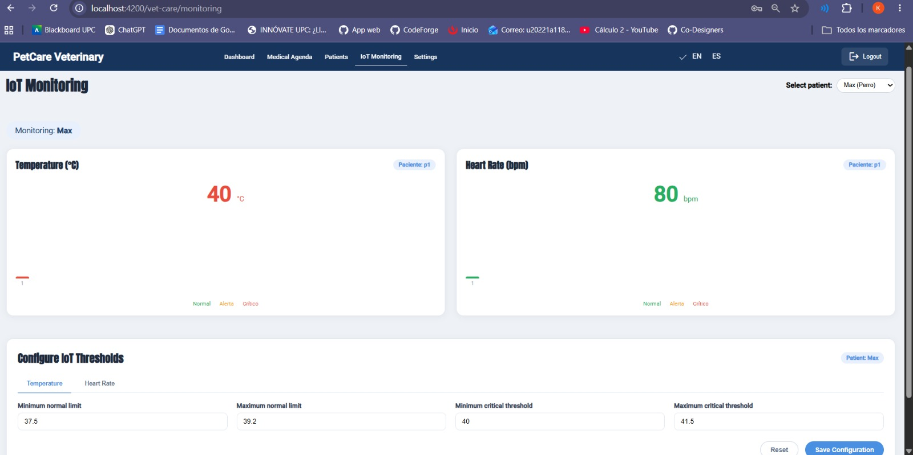

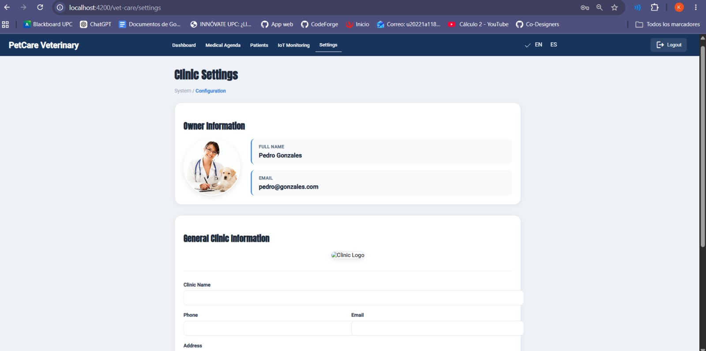

#### 5.2.2.6. Services Documentation Evidence for Sprint Review

Durante el Sprint 2, el alcance principal estuvo enfocado en la implementación inicial de la Web Application Frontend de PetCare. Para validar el funcionamiento de algunas vistas y flujos internos, se utilizó un servicio local basado en `json-server`, el cual permitió simular datos de prueba mediante el archivo `server/db.json`.

Este servicio local fue utilizado como apoyo para validar el acceso de usuarios, la diferenciación de cuentas y la visualización inicial de información dentro de las interfaces de dueño de mascota y veterinaria. Sin embargo, en esta iteración todavía no se implementó un RESTful API definitivo ni documentación OpenAPI formal, debido a que el Sprint estuvo orientado principalmente al frontend y al uso de datos simulados.

Para ejecutar el servicio local de datos se utilizó el siguiente comando:

```bash
npx json-server --watch server/db.json --port 3000
```

Debido a que el servicio utilizado corresponde a una simulación local mediante `json-server`, no se adjuntan endpoints documentados con OpenAPI en este Sprint. La documentación formal de los endpoints del RESTful API será incorporada en los siguientes Sprints, cuando se implemente el backend definitivo.


#### 5.2.2.7. Software Deployment Evidence for Sprint Review

En esta sección se describe el proceso de despliegue de la Web Application Frontend de PetCare en un entorno accesible mediante GitHub Pages. Este proceso permitió validar la disponibilidad de la aplicación web, la correcta publicación del frontend y el acceso público a las vistas desarrolladas durante el Sprint 2.

El despliegue de la Web Application representa un avance importante dentro del proyecto, ya que permite contar con una versión navegable de la plataforma, donde se pueden visualizar las interfaces de inicio de sesión, registro, panel del dueño de mascota, panel veterinario y demás secciones internas desarrolladas con datos de prueba.

Para el despliegue de la Web Application, el equipo utilizó el repositorio `PetCare-Frontend`, en el cual se gestionaron los archivos correspondientes al frontend de la plataforma. Este repositorio contiene la estructura principal del proyecto, los recursos visuales, las vistas internas, la configuración del proyecto y los archivos necesarios para su ejecución y publicación.

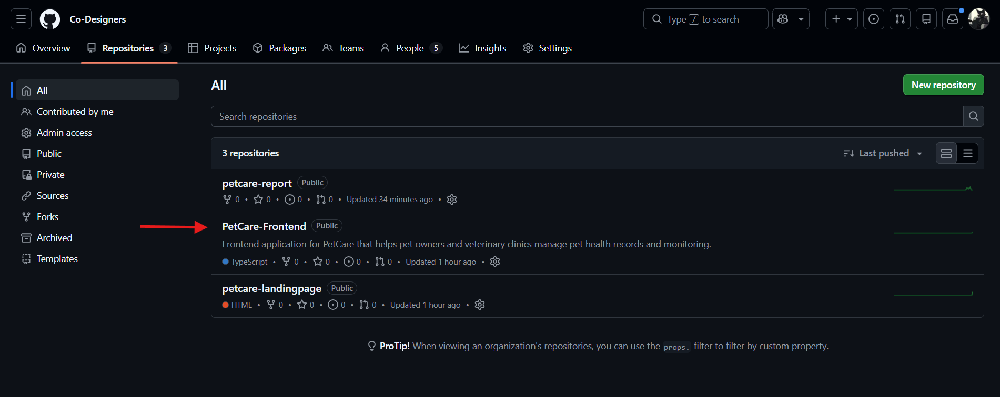

Posteriormente, se verificó el contenido del repositorio, donde se evidencian carpetas y archivos principales como `src`, `public`, `server`, `package.json`, `angular.json` y archivos de configuración. Estos elementos forman parte de la estructura base utilizada para desarrollar y desplegar la Web Application.

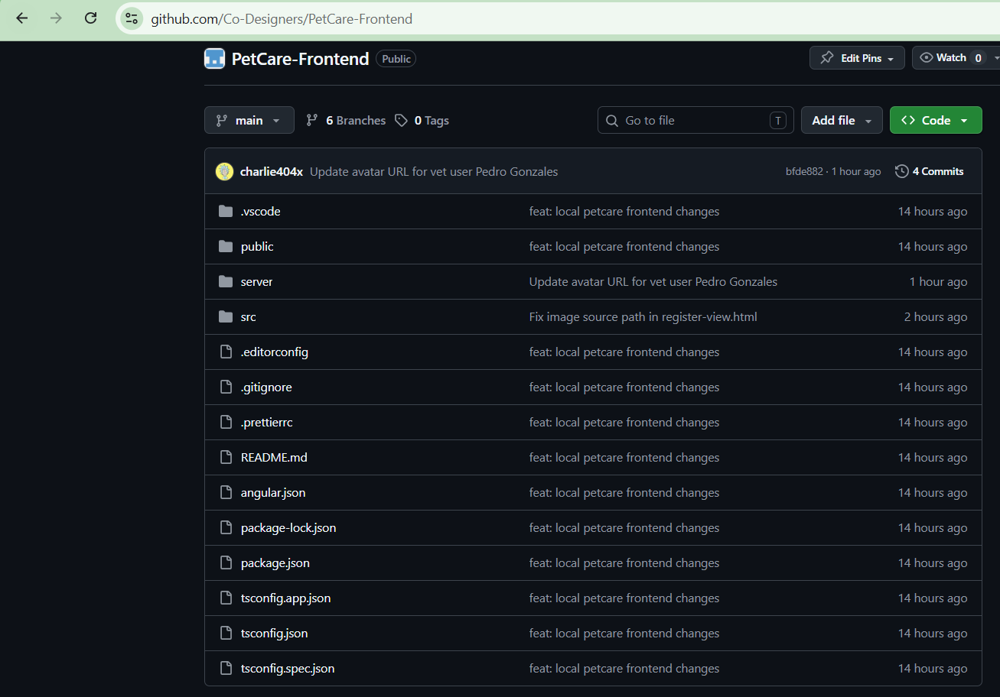

Luego, se configuró GitHub Pages desde la sección de configuración del repositorio. En esta vista se observa que el sitio fue publicado correctamente y que el despliegue se realizó desde la rama `gh-pages`, permitiendo generar una URL pública para acceder a la Web Application.

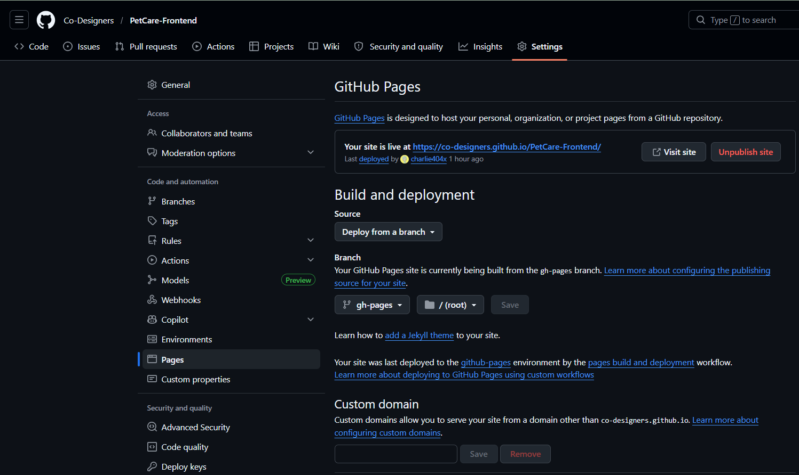

Finalmente, se validó el enlace público generado por GitHub Pages, confirmando que la Web Application de PetCare se encuentra desplegada y accesible desde el navegador. Esta URL permite revisar las vistas implementadas durante el Sprint 2 y comprobar el avance del frontend de la plataforma.

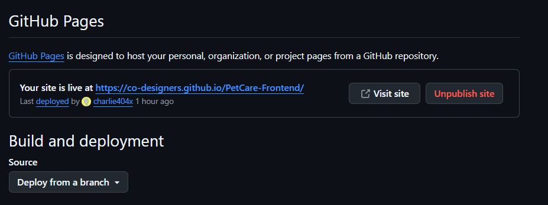

**URL de despliegue de la Web Application:**  
https://co-designers.github.io/PetCare-Frontend/

El resultado de este proceso es una primera versión desplegada de la Web Application Frontend de PetCare, accesible mediante un enlace público y preparada para validar la navegación inicial de usuarios, vistas diferenciadas por tipo de cuenta y secciones principales desarrolladas durante el Sprint 2.


#### 5.2.2.8. Team Collaboration Insights during Sprint

En esta sección se presenta una visión general de la colaboración del equipo durante el Sprint 2 del proyecto PetCare. Durante esta iteración, el trabajo se enfocó en la implementación inicial de la Web Application Frontend, por lo que las actividades principales estuvieron relacionadas con el desarrollo de vistas internas, configuración de rutas, validación de datos de prueba, mejora de estilos, despliegue en GitHub Pages y documentación de evidencias.

La implementación técnica del frontend fue registrada principalmente mediante commits realizados por Jean Pool, Huaman de la Cruz en el repositorio `PetCare-Frontend`. Asimismo, los demás integrantes del equipo colaboraron en actividades complementarias como revisión de pantallas, validación de flujos, organización de evidencias, documentación del Sprint y verificación del despliegue de la Web Application.

La colaboración del Sprint se evidencia mediante capturas de GitHub, donde se muestran los commits realizados en el repositorio del frontend, así como el avance técnico correspondiente a la implementación y consolidación de la Web Application. Esta evidencia permite relacionar las tareas planificadas en el Sprint Backlog con el entregable presentado para la revisión del Sprint.

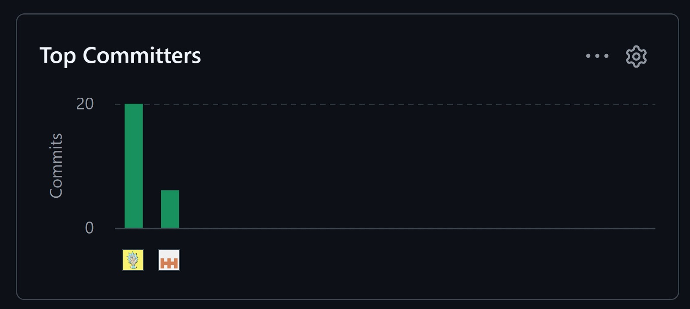

Adicionalmente, se presenta la gráfica de colaboración del repositorio, donde se observa la participación registrada mediante commits durante el Sprint. Esta evidencia permite identificar la actividad técnica registrada en GitHub y complementar el análisis de colaboración del equipo.

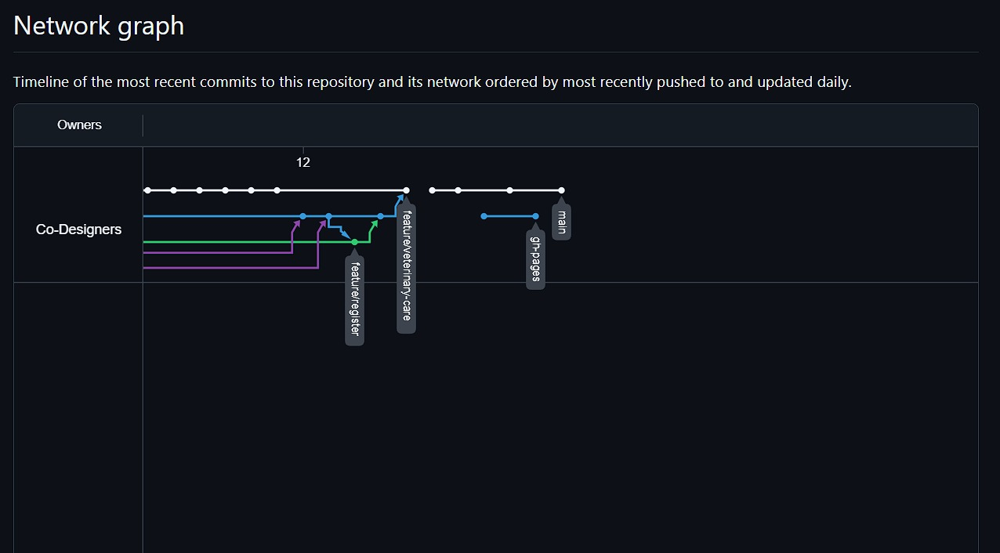

#### 5.2.3. Sprint 3

El Sprint 3 tuvo como objetivo principal implementar los servicios backend (RESTful API) y establecer la integración con el frontend de la Web Application de PetCare. Durante esta iteración, el equipo se enfocó en reemplazar los datos simulados del sprint anterior por un modelo de base de datos relacional real, habilitando funcionalidades críticas reales como la autenticación de usuarios, la gestión de perfiles de mascotas, el historial clínico, la búsqueda de veterinarias y el agendamiento de citas. Asimismo, este Sprint abarca el despliegue del backend en la nube y la preparación de la plataforma para las sesiones de validación con los segmentos objetivo. 

#### 5.2.2.1. Sprint Planning 3

En esta sección se especifican los aspectos principales del Sprint Planning Meeting para el Sprint 3. Se establecen los objetivos que marcan la transición hacia el desarrollo del backend con Spring Boot y la integración de la base de datos real, dejando atrás los datos simulados. A continuación, se detalla el alcance, los asistentes, las conclusiones del sprint previo y el Sprint Goal trazado.

| Categoría | Detalle |
| :--- | :--- |
| Sprint # | Sprint 3 |
| **Sprint Planning Background** | |
| Date | 2026-06-09 |
| Time | 8:00 PM - 12:00 AM |
| Location | Discord |
| Prepared By | Ghiou Justinn, Mauricio Silva |
| Attendees (to planning meeting) | Diego Roberto, Campoblanco Guzman<br>Ghiou Justinn, Mauricio Silva<br>Ghorget Saul, Tuncar Vila<br>Jean Pool, Huaman de la Cruz<br>Katherine Maryory, Mejía Aliaga |
| Sprint 2 Review Summary | Durante el Sprint 2 se implementó con éxito la primera versión del frontend de la Web Application en Angular, logrando la navegación diferenciada entre dueños de mascotas y veterinarias utilizando datos simulados (json-server). Se validó visualmente el flujo de inicio de sesión, paneles de control y vistas de historial clínico. |
| Sprint 2 Retrospective Summary | El equipo identificó que las interfaces ya están maduras visualmente, pero la dependencia de datos simulados limita la validación de procesos complejos como el agendamiento y la persistencia de datos. Se acordó que el siguiente paso crítico es desarrollar el RESTful API y la base de datos en SQL Server para integrar un backend real a las vistas ya construidas. |
| **Sprint Goal & User Stories** | |
| Sprint 3 Goal | Nuestro enfoque es implementar el backend RESTful API y conectarlo con el frontend de la Web Application.<br><br>Creemos que esto entrega una experiencia de gestión de datos real, segura y trazable para los dueños de mascotas y clínicas veterinarias.<br><br>Esto se confirmará cuando los usuarios puedan registrarse, iniciar sesión de forma segura, gestionar historiales médicos y buscar veterinarias utilizando datos persistidos en la base de datos relacional (SQL Server), y cuando los endpoints estén documentados formalmente con OpenAPI. |
| Sprint 3 Velocity | 38 |
| Sum of Story Points | 38 |

#### 5.2.2.2. Aspect Leaders and Collaborators

En el presente Sprint, el equipo centró sus esfuerzos en la arquitectura, desarrollo e integración del backend de la plataforma PetCare. A diferencia del Sprint 2, donde el enfoque estuvo en el diseño de interfaces y el uso de datos simulados (mock data), esta iteración exigió una organización orientada a la creación de los Web Services (RESTful API) utilizando Spring Boot, el modelado de la base de datos relacional en SQL Server y la integración directa con el frontend en Angular.

Para gestionar de forma eficiente la complejidad técnica de esta transición, así como la documentación exigida mediante OpenAPI y el despliegue en la nube, se redefinieron los roles técnicos del equipo. La distribución del trabajo se ha estructurado en la Leadership and Collaboration Matrix (LACX), estableciendo claramente quién asume el rol de Leader (L) para guiar la implementación y quiénes actúan como Collaborators (C) en cada frente del desarrollo.

A continuación, se presenta la matriz de liderazgo y colaboración del Sprint 3.

Leadership and Collaboration Matrix (LACX)

| Team Member (Last Name, First Name) | GitHub Username | Web App Frontend (L/C) | Authentication Flow (L/C) | Pet Owner Interface (L/C) | Veterinary Interface (L/C) | Deployment (L/C) | Documentation & Review (L/C) |
| :--- | :--- | :--- | :--- | :--- | :--- | :--- | :--- |
| Huaman de la Cruz, Jean Pool | JeanPool | C | C | C | C | C | C |
| Mauricio Silva, Ghiou Justinn | Justinn2006 | L | L | L | L | L | L |
| Campoblanco Guzman, Diego Roberto | DiegoCampoblanco | C | C | C | C | C | C |
| Tuncar Vila, Ghorghet Saul | Ghorghet | C | C | C | C | C | C |
| Mejía Aliaga, Katherine Maryory | KathMJ | C | C | C | C | C | C |

**Aspecto: Implementación del Backend e Integración de la Web Application**

| Aspecto | Descripción |
|---|---|
| Feature | Desarrollo del RESTful API, integración de la base de datos y conexión con la Web Application de PetCare. |
| Objetivo Principal | Implementar los servicios backend reales en Java (Spring Boot) y reemplazar los datos simulados del frontend, permitiendo la autenticación, registro, gestión de historiales y búsqueda de veterinarias de forma funcional, persistente y segura. |
| Elementos incluidos | • Desarrollo de Controladores, Servicios y Repositorios en Spring Boot.<br>• Creación y conexión con la base de datos relacional (SQL Server).<br>• Implementación de seguridad y autenticación (JWT).<br>• Documentación de todos los endpoints utilizando OpenAPI (Swagger).<br>• Integración de servicios (HttpClient) en el frontend (Angular).<br>• Despliegue del backend en la nube y actualización de GitHub Pages. |
| Criterios de aceptación | • Los endpoints responden correctamente a las peticiones HTTP (GET, POST, PUT, DELETE).<br>• El inicio de sesión y registro interactúan con la base de datos real.<br>• El frontend consume y renderiza correctamente la información obtenida del backend.<br>• La documentación de Swagger es accesible y detalla la estructura de peticiones y respuestas.<br>• No existen dependencias del archivo `db.json` utilizado en el sprint anterior para las funciones integradas. |
| Resultado esperado | Una Web Application funcional conectada a un backend estable, seguro y documentado, capaz de persistir los datos reales de los dueños de mascotas y clínicas veterinarias de la plataforma PetCare. |

#### 5.2.2.3. Sprint Backlog 3

El Sprint Backlog 3 se ha organizado priorizando las Technical Stories correspondientes al desarrollo del RESTful API y las User Stories necesarias para integrar el frontend con el nuevo backend. Las tareas abarcan la creación de controladores, servicios y repositorios en Spring Boot, la configuración de la base de datos relacional, la documentación con OpenAPI y la conexión de la Web Application en Angular. 

| Sprint # | US ID | User Story Title | Task ID | Task Title | Description | Estimation | Assigned To | Status |
| :--- | :--- | :--- | :--- | :--- | :--- | :--- | :--- | :--- |
| Sprint 3 | TS01 | Gestionar registro por tipo de cuenta | W-01 | Implementar endpoints de registro | Crear los controladores en Spring Boot para registrar dueños de mascotas y clínicas en SQL Server, y documentarlos en Swagger. | 3 horas | [Asignar miembro] | To-do |
| Sprint 3 | TS02 | Validar autenticación por tipo de cuenta | W-02 | Configurar Spring Security y JWT | Implementar la seguridad del API, validación de credenciales y generación de tokens JWT para el inicio de sesión seguro. | 4 horas | [Asignar miembro] | To-do |
| Sprint 3 | TS03 | Gestionar perfiles clínicos de mascotas | W-03 | Desarrollar API de perfiles de mascotas | Crear los endpoints (GET, POST, PUT, DELETE) para la gestión de los perfiles de las mascotas en la base de datos. | 3 horas | [Asignar miembro] | To-do |
| Sprint 3 | TS04 | Proteger consulta de historial clínico | W-04 | Desarrollar API de historial médico | Implementar los endpoints para recuperar el historial médico, validando que solo los usuarios autorizados tengan acceso. | 3 horas | [Asignar miembro] | To-do |
| Sprint 3 | TS05 | Registrar evolución clínica | W-05 | Implementar registro de diagnósticos | Crear endpoints para que el veterinario pueda registrar nuevos diagnósticos y tratamientos en el historial clínico. | 3 horas | [Asignar miembro] | To-do |
| Sprint 3 | TS07 | Filtrar veterinarias disponibles | W-06 | Desarrollar buscador de veterinarias | Implementar endpoints con filtros (ubicación y especialidad) consultando a la base de datos relacional. | 3 horas | [Asignar miembro] | To-do |
| Sprint 3 | US10 | Habilitar cuenta de dueño de mascota | W-07 | Integrar registro en Angular | Reemplazar el mock del frontend conectando el formulario de registro con el nuevo endpoint del backend. | 2 horas | [Asignar miembro] | To-do |
| Sprint 3 | US12 | Iniciar sesión por tipo de cuenta | W-08 | Integrar Login y manejo de Token | Conectar la vista de inicio de sesión con el API, guardar el JWT recibido y proteger las rutas privadas del frontend. | 3 horas | [Asignar miembro] | To-do |
| Sprint 3 | US15 | Centralizar perfil clínico de mascota | W-09 | Integrar vista de mascotas | Conectar el dashboard del dueño de mascota para consumir la lista real de mascotas directamente desde el backend. | 2 horas | [Asignar miembro] | To-do |
| Sprint 3 | US17 | Consultar ficha médica de mascota | W-10 | Integrar vista de historial clínico | Modificar el frontend para renderizar el historial médico y las vacunas obtenidos desde la base de datos. | 2 horas | [Asignar miembro] | To-do |
| Sprint 3 | US23 | Buscar veterinarias con criterios médicos | W-11 | Integrar buscador en el frontend | Conectar la vista de búsqueda de veterinarias con el API, enviando los parámetros de filtrado reales implementados. | 2 horas | [Asignar miembro] | To-do |

#### 5.2.3.4.Development Evidence for Sprint Review. 

En esta sección se presenta la evidencia del progreso alcanzado durante el desarrollo del Sprint 3, específicamente en la implementación del Web Service Backend de PetCare, implementando correctamente la exposición de la API y de una arquitectura escalable y segura. 

Los commits registrados evidencian la consolidación de la Web Service. A continuación, se muestra la tabla con los commits más relevantes asociados al repositorio del proyecto, la resolución de requerimientos y la evolución de la infraestructura del backend durante este Sprint:


| Repository | Branch | Commit Id | Commit Message | Commit Message Body | Committed on (Date) |
|---|---|---|---|---|---|
| Co-Designers/PetCare-Backend | main | d843525  | feat: add setup and API usage instructions | Add comprehensive documentation to the README file for the PetCare Platform Backend, detailing environment setup, architecture, and integration. | 15/06/2026 |
| Co-Designers/PetCare-Backend | main | 9a27d0c  | feat(mobile-interfaces): add mobile REST endpoints | Introduce MobileAppointmentsController to expose REST endpoints for managing mobile professional appointments within the 'mobile' bounded context. | 15/06/2026 |
| Co-Designers/PetCare-Backend | main | 19cdeb0 | feat(pet-management-interfaces): add pets REST endpoints | Introduce PetsController to expose REST endpoints for managing pets within the 'petmanagement' bounded context. | 15/06/2026 |
| Co-Designers/PetCare-Backend | main | 3a583c1  | feat(medical-records-domain): add medical record domain model | Introduce the MedicalRecord aggregate root entity within the 'medicalrecords' bounded context to represent comprehensive clinical history data. | 15/06/2026 |

#### 5.2.3.5.Execution Evidence for Sprint Review.<br>
En este tercer Sprint, el equipo logró con éxito la transición de una arquitectura basada en datos estáticos (mock data) a una arquitectura robusta basada en microservicios RESTful. Se completó la implementación del backend utilizando Spring Boot, estableciendo la persistencia de datos mediante Mysql y garantizando la seguridad de las operaciones mediante JSON Web Tokens (JWT). La integración entre el frontend de Angular y los servicios backend permite ahora un flujo de información real, cumpliendo con los criterios de aceptación de autenticación, gestión de perfiles y búsqueda de servicios veterinarios.<br>

La plataforma ahora cuenta con una API documentada bajo el estándar OpenAPI (Swagger). Esto permite visualizar todos los servicios disponibles (endpoints) y realizar pruebas en tiempo real sin necesidad de herramientas externas.

Evidencia: 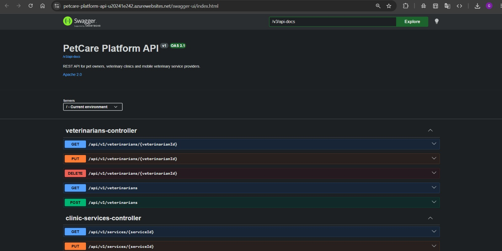<br><br>
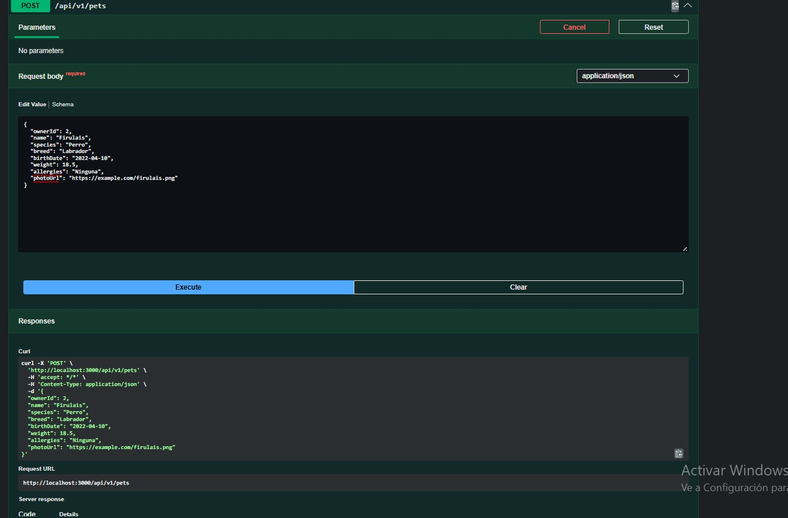<br><br>
 https://docs.google.com/document/d/1j-y7yHdcBXKkSNk_jb5tRmIFZgX7Qo11NsIOVeYtS2g/edit?tab=t.0


#### 5.2.3.6.Services Documentation Evidence for Sprint Review. 

### Relación de Endpoints (Sprint 3)

| Endpoint | Verbo | Acción | Descripción |
| :--- | :--- | :--- | :--- |
| `/api/v1/authentication/sign-in` | POST | Autenticación | Valida credenciales y genera token JWT. |
| `/api/v1/authentication/sign-up` | POST | Registro | Crea un nuevo usuario en la plataforma. |
| `/api/v1/users/me` | GET | Perfil | Obtiene los datos del usuario autenticado. |
| `/api/v1/pets?ownerId=2` | GET | Listar Mascotas | Obtiene mascotas de un dueño específico. |
| `/api/v1/appointments?ownerId=2` | GET | Citas (Dueño) | Consulta citas programadas de un dueño. |
| `/api/v1/appointments?clinicId=1` | GET | Citas (Clínica) | Consulta citas programadas para una clínica. |
| `/api/v1/service-providers?district=Miraflores` | GET | Buscar Clínicas | Filtra proveedores por distrito. |
| `/api/v1/mobile-professionals?userId=3` | GET | Profesionales | Obtiene datos de un profesional móvil. |
| `/api/v1/mobile-services?mobileId=1` | GET | Servicios Móviles | Lista servicios ofrecidos por un profesional. |

#### 5.2.3.7.Software Deployment Evidence for Sprint Review. 

Durante este Sprint, el objetivo principal fue establecer un entorno de despliegue funcional en la nube para nuestra plataforma PetCare. Nos enfocamos en configurar una Máquina Virtual (VM) en Azure para alojar nuestros servicios, asegurando que tanto el frontend como el backend sean accesibles de forma estable. A diferencia de un entorno automatizado (CI/CD), en esta etapa hemos priorizado la configuración manual y controlada de los recursos para garantizar la correcta integración de nuestra base de datos MySQL con los servicios de backend.<br>

Despliegue del Frontend: La aplicación web (Angular) se desplegó utilizando GitHub Pages. Esta configuración permite que los cambios en nuestra interfaz sean publicados de manera ágil, facilitando el acceso a la plataforma desde cualquier lugar.

Configuración del Backend en Azure: Provisionamos una Máquina Virtual (VM) en Microsoft Azure para alojar el backend (Spring Boot). Se realizaron las configuraciones necesarias en el sistema operativo y el entorno de ejecución (Java) para asegurar que la API esté disponible de forma permanente.

Gestión de Base de Datos (MySQL): Implementamos nuestra base de datos en MySQL, configurando las reglas de acceso necesarias dentro de la infraestructura de Docker. Esto permite que el backend pueda conectarse de forma segura y persistir la información real de nuestros usuarios y servicios veterinarios.

La siguiente imagen muestra el esquema de tablas en MySQL Workbench, el cual garantiza la persistencia de datos del sistema. El backend (alojado en Azure VM) se encuentra correctamente conectado a este motor de base de datos, permitiendo la gestión y almacenamiento seguro de la información de usuarios, mascotas y citas en tiempo real.<br><br>
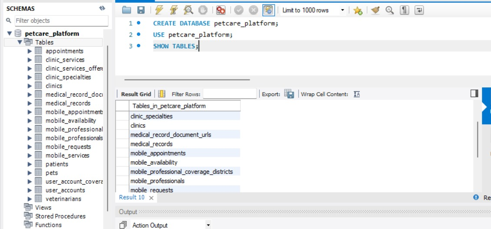<br><br>
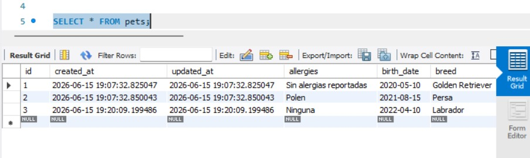<br><br>
#### 5.2.3.8.Team Collaboration Insights during Sprint. 

En esta sección se presenta la evidencia de colaboración del equipo durante el Sprint 3, cuyo enfoque principal fue el desarrollo del Web Service Backend de PetCare. 

La implementación técnica en el repositorio del backend se complementó con el esfuerzo conjunto del equipo en la revisión de arquitectura, validación de endpoints y documentación técnica del Sprint.

Este avance se evidencia a continuación mediante el registro de commits en GitHub, vinculando directamente las tareas planificadas en el Sprint Backlog con el incremento del producto entregado  

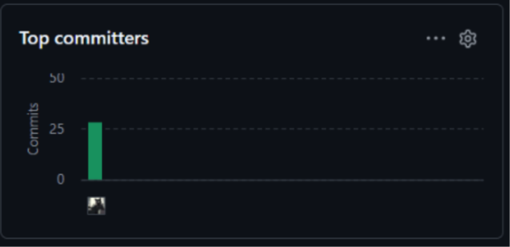</img><br>

#### 5.2.4. Sprint 4

El Sprint 4 tuvo como objetivo principal culminar al 100% el desarrollo de la Web Application de PetCare, logrando la integración total y definitiva entre el frontend y el backend (RESTful API). Durante esta iteración final, el equipo se enfocó en conectar todas las interfaces de usuario con los endpoints reales desplegados en la nube, eliminando por completo cualquier dependencia de datos simulados de sprints anteriores. Este Sprint garantizó el correcto funcionamiento de los flujos críticos para ambos segmentos (dueños de mascotas y veterinarias), incluyendo la autenticación segura, la gestión completa del historial médico, el agendamiento de citas, los pagos digitales y el monitoreo IoT, asegurando un producto robusto, estable y listo para las validaciones finales.

#### 5.2.4.1.Sprint Planning 4.

En esta sección se especifican los aspectos principales del Sprint Planning Meeting para el Sprint 4. Se establecen los objetivos finales que marcan la integración total del frontend y el backend, consolidando el 100% del desarrollo de la plataforma PetCare. A continuación, se detalla el alcance, los asistentes, las conclusiones del sprint previo y el Sprint Goal trazado.

| Categoría | Detalle |
| :--- | :--- |
| **Sprint #** | Sprint 4 Sprint Planning |
| **Background** | **Date:** 2026-07-06<br>**Time:** 8:00 PM - 12:00 AM<br>**Location:** Discord |
| **Prepared By** | Diego Roberto, Campoblanco Guzman |
| **Attendees (to planning meeting)** | Diego Roberto, Campoblanco Guzman<br>Ghiou Justinn, Mauricio Silva<br>Ghorghet Saul, Tuncar Vila<br>Jean Pool, Huaman de la Cruz<br>Katherine Maryory, Mejía Aliaga |
| **Sprint 3 Review Summary** | Durante el Sprint 3 se implementó con éxito el backend RESTful API utilizando Spring Boot, se estableció la persistencia en la base de datos SQL Server y se protegió la plataforma mediante seguridad JWT. Además, se logró el despliegue inicial en la nube (Azure VM) y se documentaron los endpoints con Swagger. |
| **Sprint 3 Retrospective Summary** | El equipo identificó que, si bien el backend está desplegado y operativo, la Web Application en Angular aún requiere conectarse en su totalidad a los endpoints finales. Se acordó que el esfuerzo crítico del Sprint 4 debe centrarse exclusivamente en reemplazar cualquier rastro de datos simulados restantes y asegurar que el 100% de las interfaces operen fluidamente con el backend en la nube. |
| **Sprint Goal & User Stories** | **Sprint 4 Goal:** Nuestro enfoque es completar la integración total entre el frontend (Angular) y el backend (RESTful API), culminando al 100% el desarrollo de la Web Application de PetCare. Creemos que esto garantizará una experiencia de usuario completamente funcional, segura y lista para producción. Esto se confirmará cuando todas las interacciones de los dueños de mascotas y veterinarios (agendamientos, historial médico, pagos y monitoreo IoT) se procesen sin errores y se reflejen en la base de datos real. |
| **Sprint 4 Velocity** | 30 |
| **Sum of Story Points** | 30 |

#### 5.2.4.2. Aspect Leaders and Collaborators.

En el presente Sprint, el equipo centró todos sus esfuerzos en la integración total y definitiva del frontend (Angular) con el backend (Spring Boot y SQL Server). A diferencia de los sprints anteriores, donde el trabajo se dividió entre la maquetación visual y la construcción aislada de la API, esta iteración exigió un enfoque colaborativo orientado a consumir los endpoints reales, manejar el flujo de seguridad (JWT) desde el lado del cliente y realizar pruebas de extremo a extremo (*End-to-End*).

Para gestionar de forma eficiente la complejidad de conectar al 100% la plataforma PetCare, eliminar cualquier dependencia de datos simulados y asegurar el correcto funcionamiento en el entorno de producción (nube), se redefinieron los roles técnicos del equipo. La distribución del trabajo se ha estructurado en la Leadership and Collaboration Matrix (LACX), estableciendo claramente quién asume el rol de Leader (L) y quiénes actúan como Collaborators (C) en cada frente de la integración.

A continuación, se presenta la matriz de liderazgo y colaboración del Sprint 4.

**Leadership and Collaboration Matrix (LACX)**

| Team Member (Last Name, First Name) | GitHub Username | API Integration & Consumption (L/C) | Security & JWT Handling (L/C) | End-to-End Testing (L/C) | Final Deployment (L/C) | Documentation & Review (L/C) |
| :--- | :--- | :--- | :--- | :--- | :--- | :--- |
| Huaman de la Cruz, Jean Pool | JeanPool | C | C | C | C | L |
| Mauricio Silva, Ghiou Justinn | Justinn2006 | C | L | C | C | C |
| Campoblanco Guzman, Diego Roberto | DiegoCampoblanco | L | C | L | C | C |
| Tuncar Vila, Ghorghet Saul | Ghorghet | C | C | C | L | C |
| Mejía Aliaga, Katherine Maryory | KathMJ | L | C | C | C | C |

<br>

**Aspecto: Integración Total y Despliegue Final de la Web Application**

| Aspecto | Descripción |
| :--- | :--- |
| **Feature** | Conexión definitiva entre el frontend y el RESTful API, pruebas funcionales y despliegue final de la plataforma PetCare. |
| **Objetivo Principal** | Lograr la operatividad al 100% de la plataforma, garantizando que todas las acciones del usuario en las interfaces web interactúen correctamente, de forma segura y sin latencias con la base de datos relacional alojada en la nube. |
| **Elementos incluidos** | • Implementación de servicios HTTP (`HttpClient`) en Angular para consumir los endpoints reales.<br>• Eliminación total de datos simulados (*mock data*) y configuraciones de `json-server`.<br>• Manejo de interceptores en el frontend para inyectar los tokens JWT en cada petición protegida.<br>• Integración de flujos completos: registro, login, gestión de mascotas, historial clínico, búsqueda de veterinarias y agendamiento.<br>• Despliegue de la versión final del frontend y backend en sus respectivos entornos de producción. |
| **Criterios de aceptación** | • El 100% de las interfaces (paneles de dueños de mascotas y veterinarias) renderizan información real proveniente de la base de datos.<br>• El manejo de sesiones (Login/Logout) funciona correctamente con validación de tokens JWT.<br>• No existen errores de CORS (Cross-Origin Resource Sharing) entre el frontend y el backend desplegado.<br>• Las acciones CRUD (Crear, Leer, Actualizar, Eliminar) ejecutadas desde el frontend se reflejan exitosamente en SQL Server.<br>• La plataforma completa está desplegada, estable y es accesible públicamente sin interrupciones. |
| **Resultado esperado** | La Web Application PetCare completamente finalizada, segura, integrada de extremo a extremo y lista para las entrevistas de validación con los segmentos objetivo (dueños de mascotas y clínicas veterinarias). |

#### 5.2.4.3.Sprint Backlog 4.

El Sprint Backlog 4 se estructuró con el objetivo de lograr la integración definitiva del 100% de la plataforma PetCare. Las tareas seleccionadas se enfocaron en conectar las vistas del frontend que aún utilizaban datos simulados con los endpoints finales del RESTful API. Se priorizó la funcionalidad completa de reservas con disponibilidad real, la integración de pagos digitales, la gestión clínica avanzada para los veterinarios (evolución, recetas y vacunas), la exportación del historial y la conexión final de los datos biométricos IoT.

| Sprint # | US ID | User Story Title | Task ID | Task Title | Description | Estimation | Assigned To | Status |
| :--- | :--- | :--- | :--- | :--- | :--- | :--- | :--- | :--- |
| Sprint 4 | US27 | Reservar atención veterinaria | W-01 | Integrar agendamiento con disponibilidad real | Conectar el formulario de reserva en Angular con el endpoint del backend para validar y bloquear horarios reales en la base de datos. | 3 horas | Jean Pool, Huaman de la Cruz | Done |
| Sprint 4 | US28 | Confirmar cita con pago digital | W-02 | Integrar pasarela de pago simulada | Conectar el flujo de confirmación de citas con el procesamiento de pagos, asegurando que la cita pase a estado "Confirmada" tras el pago. | 4 horas | Ghiou Justinn, Mauricio Silva | Done |
| Sprint 4 | TS09 | Gestionar cambios de citas | W-03 | Conectar reprogramación y cancelación | Implementar las llamadas HTTP (`PUT`/`DELETE`) desde el frontend para permitir a los usuarios modificar o cancelar sus citas, liberando los horarios. | 2 horas | Diego Roberto, Campoblanco | Done |
| Sprint 4 | US19 | Registrar evolución médica | W-04 | Integrar registro de diagnóstico y evolución | Conectar el formulario del panel veterinario con el API para registrar nuevos síntomas, diagnósticos y tratamientos en el historial real de la mascota. | 3 horas | Katherine Maryory, Mejía | Done |
| Sprint 4 | US20 | Generar receta médica digital | W-05 | Integrar emisión de recetas médicas | Configurar el endpoint para que, al finalizar una consulta, el veterinario pueda emitir y guardar indicaciones médicas trazables en el sistema. | 2 horas | Ghorghet Saul, Tuncar Vila | Done |
| Sprint 4 | US32 | Registrar vacunas aplicadas | W-06 | Conectar actualización de vacunas | Implementar la integración para que el veterinario registre nuevas vacunas, impactando directamente en la base de datos y calculando el próximo control. | 2 horas | Katherine Maryory, Mejía | Done |
| Sprint 4 | US21 | Exportar historial clínico | W-07 | Implementar descarga de historial en PDF | Conectar la vista del dueño de mascota con el servicio del backend encargado de generar y retornar el documento del historial clínico exportable. | 3 horas | Diego Roberto, Campoblanco | Done |
| Sprint 4 | TS12 | Procesar monitoreo IoT y alertas | W-08 | Conectar dashboard IoT con datos reales | Reemplazar los datos estáticos de temperatura y ritmo cardíaco conectando el panel con los endpoints que procesan las lecturas biométricas y generan alertas. | 4 horas | Jean Pool, Huaman de la Cruz | Done |

#### 5.2.4.4. Development Evidence for Sprint Review

En esta sección se presenta la evidencia del progreso alcanzado durante el desarrollo del Sprint 4, el cual estuvo enfocado en la integración definitiva de la Web Application con el backend desplegado en la nube. 

A diferencia de los sprints anteriores, el esfuerzo de desarrollo se centró en unificar el ecosistema de la plataforma. El commit registrado evidencia la eliminación completa de la dependencia de datos simulados (*mock data*), la resolución de políticas de seguridad para la comunicación entre aplicaciones y la conexión final de los endpoints de producción. 

A continuación, se detalla el commit que consolida la versión final del sistema:

| Repository | Branch | Commit Id | Commit Message | Commit Message Body | Committed on (Date) |
| :--- | :--- | :--- | :--- | :--- | :--- |
| Co-Designers/PetCare-Backend | main | eedbac8 | Final PetCare frontend integration | Fully integrated REST API endpoints with the Angular frontend. Resolved CORS policies for the production environment, removed all remaining mock data dependencies (json-server), and successfully connected the modules for appointments, medical records, and IoT monitoring. | 06/07/2026 |

#### 5.2.4.5.Execution Evidence for Sprint Review.
El Sprint 4 marcó el hito final en el desarrollo de la plataforma PetCare, logrando la integración total y definitiva entre el frontend (Angular) y el backend (RESTful API con Spring Boot). El objetivo central fue la eliminación absoluta de datos simulados, garantizando que toda la interfaz interactúe en tiempo real con la base de datos SQL Server alojada en Azure.

Durante esta iteración, se consolidaron los flujos críticos de la plataforma: autenticación segura mediante tokens JWT, gestión integral de historiales médicos, sistema de citas con disponibilidad real, procesamiento de pagos digitales y visualización de datos biométricos provenientes de dispositivos IoT. El producto final se encuentra ahora estable, seguro y listo para su despliegue en el entorno de producción.

Principales vistas implementadas:

-Panel de Agendamiento:
<br>
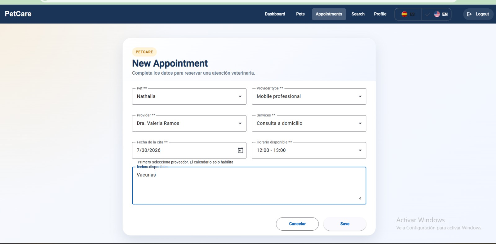<br>

-Dashboard de Veterinaria:Vista del registro de diagnósticos, evolución médica y recetas digitales.
<br>
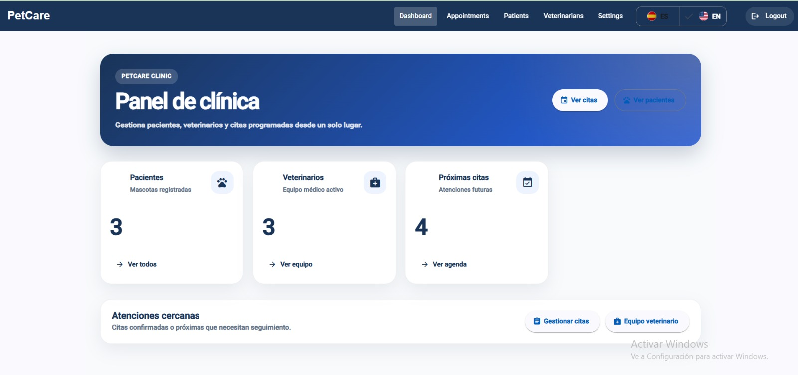<br>


-Gestion de Historial:Visualización de los datos del paciente.
<br>
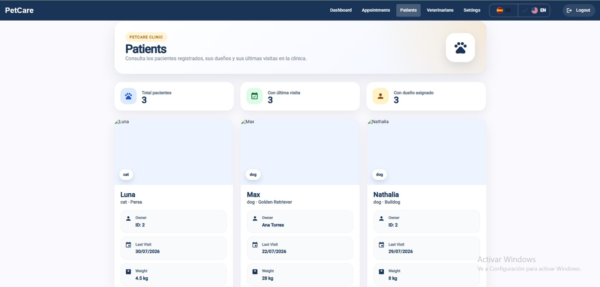<br>


-Flujo de Autenticacion JWT:Pantalla de Login/Registro demostrando el manejo de sesiones mediante interceptores JWT.
<br>
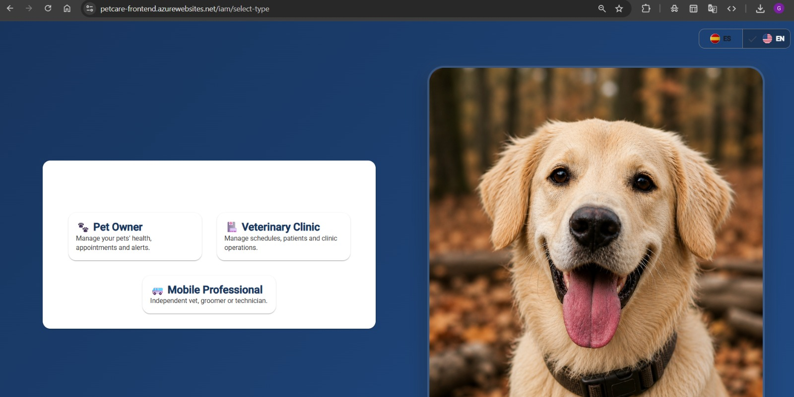<br>
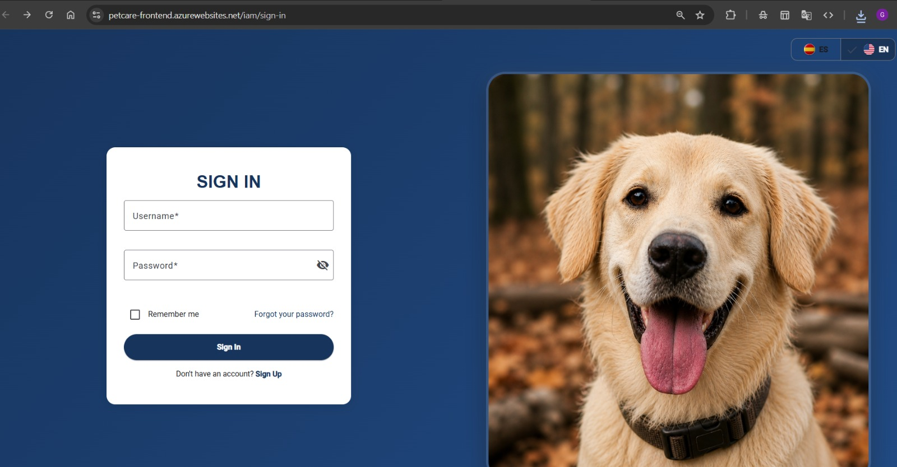<br>

#### 5.2.4.6.Services Documentation Evidence for Sprint Review.

En el Sprint 4 se completó la documentación de los servicios RESTful API de PetCare utilizando **OpenAPI 3.1.0**, accesible a través de **Swagger UI**. Durante esta iteración final se consolidaron y documentaron los endpoints principales correspondientes a los diferentes bounded contexts del sistema, incluyendo autenticación, gestión de usuarios, mascotas, citas, historial médico, clínicas, veterinarios, servicios móviles y notificaciones.

La documentación está desplegada en el entorno de producción de Azure y puede ser consultada en el siguiente enlace:

🔗 **Swagger UI:** [https://petcare-platform-api-u20241e242.azurewebsites.net/swagger-ui/index.html](https://petcare-platform-api-u20241e242.azurewebsites.net/swagger-ui/index.html)


##### Relación de Endpoints Documentados

A continuación se presentan los endpoints más relevantes expuestos por el backend de PetCare, agrupados por controlador. Se incluyen aquellos que representan operaciones de negocio clave (registro, autenticación, gestión de perfiles, citas, historial clínico y servicios móviles). Para cada uno se detalla su método, descripción y parámetros principales.

| Controlador | Endpoint | Método | Descripción | Parámetros/Documentación |
|-------------|----------|--------|-------------|---------------------------|
| **authentication-controller** | `/api/v1/authentication/sign-up/owner` | POST | Registra un nuevo dueño de mascota. | Body: `firstName`, `lastName`, `email`, `password`, `phone`. Email único. |
| | `/api/v1/authentication/sign-up/clinic` | POST | Registra una nueva clínica veterinaria. | Body: `businessName`, `ruc`, `email`, `password`, `phone`, `address`. RUC y email únicos. |
| | `/api/v1/authentication/sign-up/mobile-professional` | POST | Registra un profesional de servicios móviles. | Body: `firstName`, `lastName`, `email`, `password`, `phone`, `specialty`. Email único. |
| | `/api/v1/authentication/sign-in` | POST | Autentica usuario y devuelve token JWT. | Body: `email`, `password`. Devuelve `token`, `userId`, `role`. |
| | `/api/v1/authentication/change-password` | POST | Cambia la contraseña del usuario autenticado. | Header: Bearer token. Body: `oldPassword`, `newPassword`. |
| **users-controller** | `/api/v1/users/me` | GET | Obtiene los datos del usuario autenticado. | Header: Bearer token. |
| | `/api/v1/users/{userId}` | PATCH | Actualiza datos parciales de un usuario. | Path: `userId`. Header: Bearer token. Body: campos a actualizar. |
| **pets-controller** | `/api/v1/pets` | POST | Registra una nueva mascota. | Header: Bearer token. Body: `name`, `species`, `breed`, `age`, `weight`, `allergies`. Valida límites por suscripción. |
| | `/api/v1/pets/{petId}` | PUT | Actualiza todos los datos de una mascota. | Path: `petId`. Header: Bearer token. Body: datos completos. |
| **medical-records-controller** | `/api/v1/medical-records` | POST | Añade un nuevo registro médico. | Header: Bearer token. Body: `petId`, `diagnosis`, `treatment`, `notes`. Solo veterinarios autorizados. |
| **appointments-controller** | `/api/v1/appointments` | POST | Agenda una nueva cita veterinaria. | Header: Bearer token. Body: `petId`, `clinicId`, `serviceId`, `dateTime`. Valida disponibilidad real. |
| | `/api/v1/appointments/{appointmentId}/start` | PATCH | Marca una cita como iniciada. | Path: `appointmentId`. Header: Bearer token. Solo veterinarios/clínica. |
| | `/api/v1/appointments/{appointmentId}/complete` | PATCH | Marca una cita como completada. | Path: `appointmentId`. Header: Bearer token. Solo veterinarios/clínica. |
| | `/api/v1/appointments/{appointmentId}/cancel` | PATCH | Cancela una cita. | Path: `appointmentId`. Header: Bearer token. Libera el horario. |
| | `/api/v1/appointments/available-slots` | GET | Verifica horarios disponibles para una clínica. | Query: `clinicId`, `date` (yyyy-MM-dd). Header: Bearer token. |
| **clinics-controller** | `/api/v1/clinics` | POST | Registra una nueva clínica (solo administradores). | Header: Bearer token. Body: datos de la clínica. |
| | `/api/v1/clinics/{clinicId}` | PATCH | Actualiza datos parciales de una clínica. | Path: `clinicId`. Header: Bearer token. Body: campos a actualizar. |
| **veterinarians-controller** | `/api/v1/veterinarians` | POST | Registra un nuevo veterinario. | Header: Bearer token. Body: `firstName`, `lastName`, `specialty`, `clinicId`. |
| | `/api/v1/veterinarians/{veterinarianId}` | PUT | Actualiza todos los datos de un veterinario. | Path: `veterinarianId`. Header: Bearer token. Body: datos completos. |
| **clinic-services-controller** | `/api/v1/services` | POST | Registra un nuevo servicio veterinario. | Header: Bearer token. Body: `name`, `description`, `price`, `clinicId`. |
| | `/api/v1/services/{serviceId}` | PUT | Actualiza todos los datos de un servicio. | Path: `serviceId`. Header: Bearer token. Body: datos completos. |
| **service-providers-controller** | `/api/v1/service-providers` | GET | Obtiene proveedores de servicios (clínicas o profesionales). | Query: `type` (CLINIC/MOBILE), `location`. Header: Bearer token (opcional). |
| **mobile-professionals-controller** | `/api/v1/mobile-professionals` | POST | Registra un nuevo profesional móvil. | Header: Bearer token. Body: `firstName`, `lastName`, `email`, `phone`, `specialty`. |
| | `/api/v1/mobile-professionals/{id}` | PUT | Actualiza todos los datos de un profesional móvil. | Path: `id`. Header: Bearer token. Body: datos completos. |
| **mobile-services-controller** | `/api/v1/mobile-services` | POST | Registra un nuevo servicio móvil. | Header: Bearer token. Body: `professionalId`, `name`, `description`, `price`. |
| | `/api/v1/mobile-services/{id}` | PUT | Actualiza todos los datos de un servicio móvil. | Path: `id`. Header: Bearer token. Body: datos completos. |
| **mobile-availability-controller** | `/api/v1/mobile-availability` | POST | Registra un nuevo bloque de disponibilidad. | Header: Bearer token. Body: `professionalId`, `dayOfWeek`, `startTime`, `endTime`. |
| | `/api/v1/mobile-availability/{id}` | PUT | Actualiza un bloque de disponibilidad. | Path: `id`. Header: Bearer token. Body: datos completos. |
| **mobile-requests-controller** | `/api/v1/mobile-requests` | POST | Registra una nueva solicitud de servicio móvil. | Header: Bearer token. Body: `petId`, `professionalId`, `serviceId`, `dateTime`. |
| | `/api/v1/mobile-requests/{id}/start` | PATCH | Marca una solicitud como iniciada. | Path: `id`. Header: Bearer token. Solo el profesional asignado. |
| | `/api/v1/mobile-requests/{id}/complete` | PATCH | Marca una solicitud como completada. | Path: `id`. Header: Bearer token. Solo el profesional asignado. |
| | `/api/v1/mobile-requests/{id}/cancel` | PATCH | Cancela una solicitud. | Path: `id`. Header: Bearer token. Libera el horario. |
| | `/api/v1/mobile-requests/available-slots` | GET | Verifica horarios disponibles para solicitudes móviles. | Query: `professionalId`, `date` (yyyy-MM-dd). Header: Bearer token. |
| **mobile-appointments-controller** | `/api/v1/mobile-appointments` | POST | Agenda una cita de servicio a domicilio. | Header: Bearer token. Body: `requestId`, `dateTime`. |
| **notifications-controller** | `/api/v1/notifications/{id}/read` | PATCH | Marca una notificación como leída. | Path: `id`. Header: Bearer token. Solo el propietario. |
| **patients-controller** | `/api/v1/patients` | GET | Obtiene todos los pacientes (mascotas) de una clínica. | Query: `clinicId`. Header: Bearer token. Solo personal de la clínica. |
| **roles-controller** | `/api/v1/roles` | GET | Obtiene todos los roles disponibles. | Header: Bearer token. Solo administradores. |

##### Observación sobre Endpoints de Pagos y Monitoreo IoT

Tras la revisión exhaustiva de la documentación OpenAPI, **no se encontraron endpoints específicos para pagos digitales** (ej. `/api/v1/payments`) **ni para monitoreo IoT** (ej. `/api/v1/iot/devices` o `/api/v1/iot/readings`). Estas funcionalidades, si bien fueron consideradas en el diseño inicial y en las User Stories (US28, TS10, TS12), no han sido implementadas en la versión final del backend para el TB2.

**Justificación:** El equipo priorizó la implementación del núcleo funcional de la plataforma (autenticación, gestión de mascotas, citas, historial clínico y servicios móviles) por encima de los módulos de pago e IoT, que quedan como **trabajo pendiente para futuras iteraciones** del producto. Se recomienda documentar estos servicios en próximos sprints, siguiendo el mismo estándar OpenAPI, y desplegarlos en el entorno de producción.


#### 5.2.4.7.Software Deployment Evidence for Sprint Review.

Durante el Sprint 4, se consolidó el despliegue final de la plataforma PetCare en el entorno de producción en la nube de **Microsoft Azure**. El equipo configuró y desplegó los servicios backend (RESTful API) en una máquina virtual de Azure, asegurando que la aplicación esté accesible de forma estable y que la base de datos MySQL esté correctamente conectada y configurada para la persistencia de datos en producción.

##### Despliegue del Backend en Azure

A continuación se muestran las capturas del proceso de configuración y despliegue del backend en Azure durante el Sprint 4.


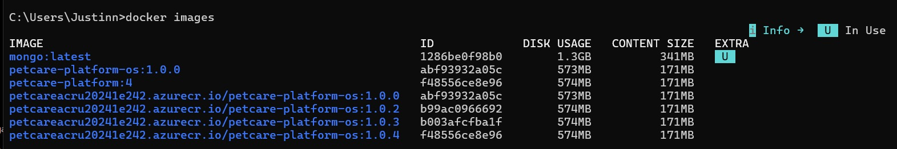

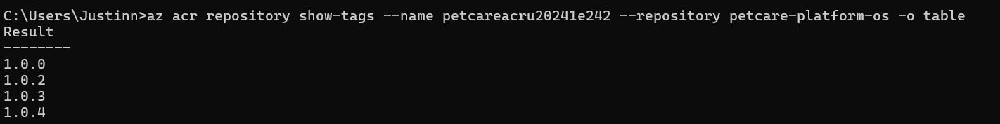

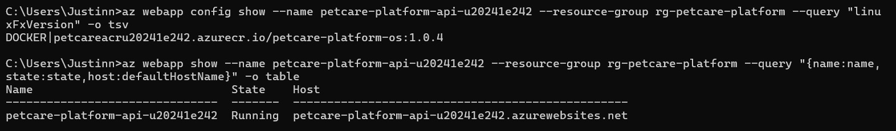

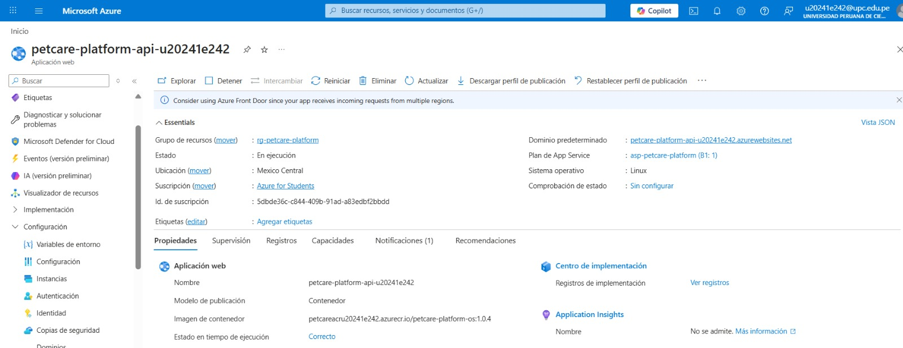

##### Validación del Despliegue a través de Swagger UI

Una vez completado el despliegue del backend en Azure, se procedió a verificar el correcto funcionamiento de la API a través de la documentación Swagger UI. Las siguientes capturas muestran la validación de los diferentes controladores y endpoints disponibles en la versión desplegada.
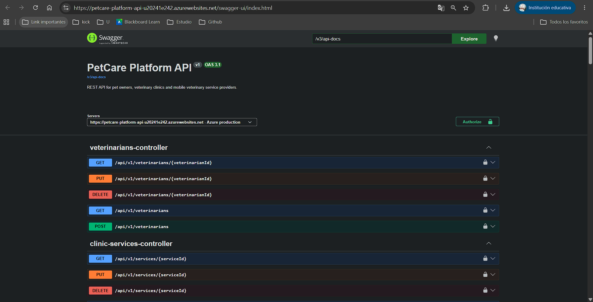

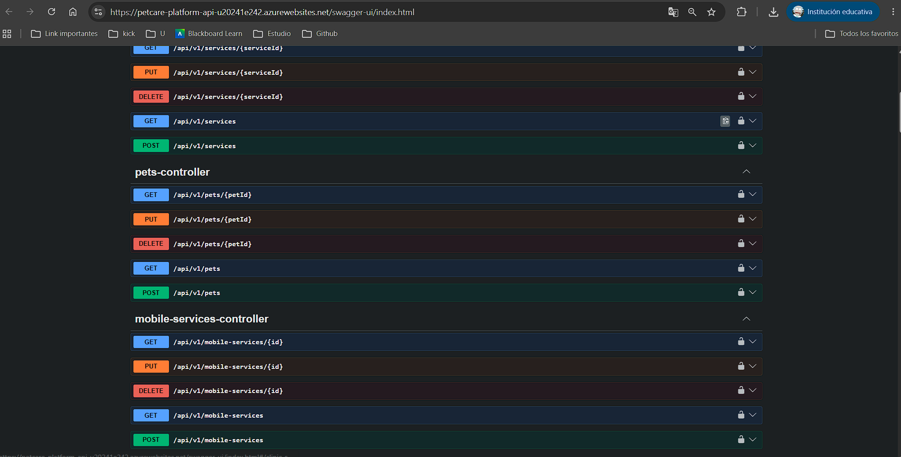

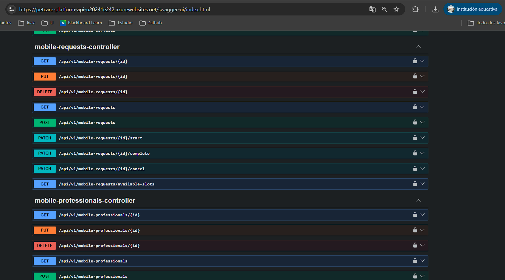

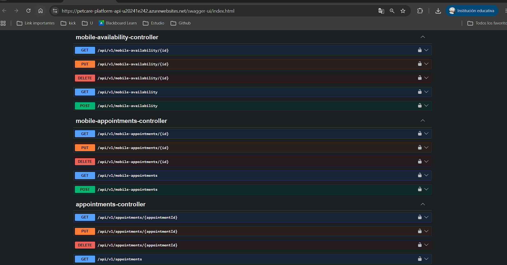

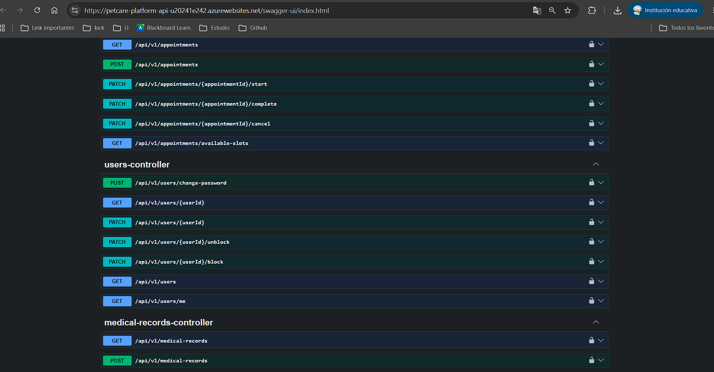

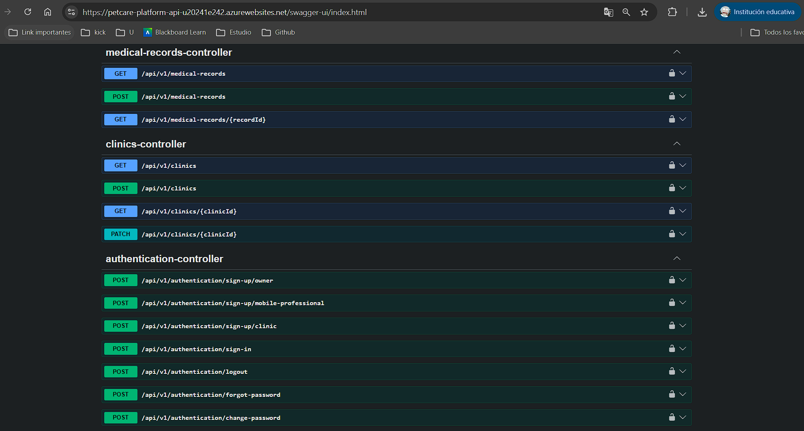

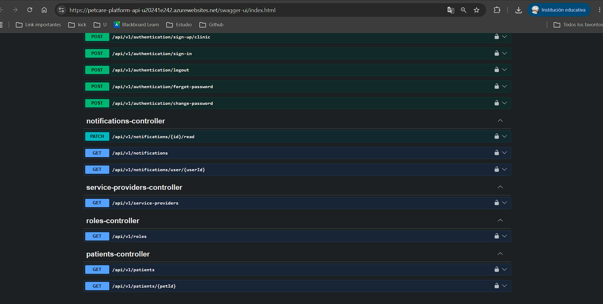

#### 5.2.4.8.Team Collaboration Insights during Sprint.
En el Sprint 4, dejamos atrás el trabajo aislado para enfocarnos en la integración total. La dinámica de trabajo se centró en la colaboración cruzada: mientras algunos compañeros se enfocaron en la seguridad con JWT, otros aseguraron que los servicios HTTP (en Angular) y los endpoints en el backend funcionaran sin errores. Gracias a la matriz LACX, cada miembro asumió roles de Leader o Collaborator, permitiéndonos cubrir desde el despliegue en la nube hasta las pruebas finales.

Evidencia del repositorio backend:<br>
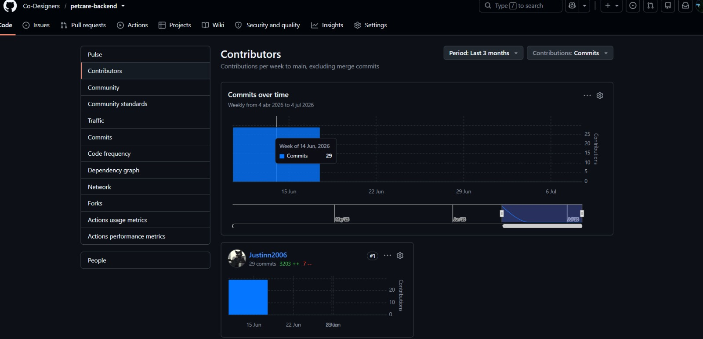<br>

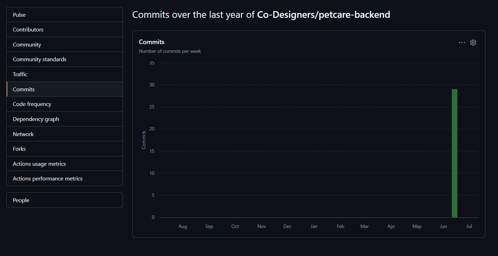

Evidencia del repositorio Frontend:
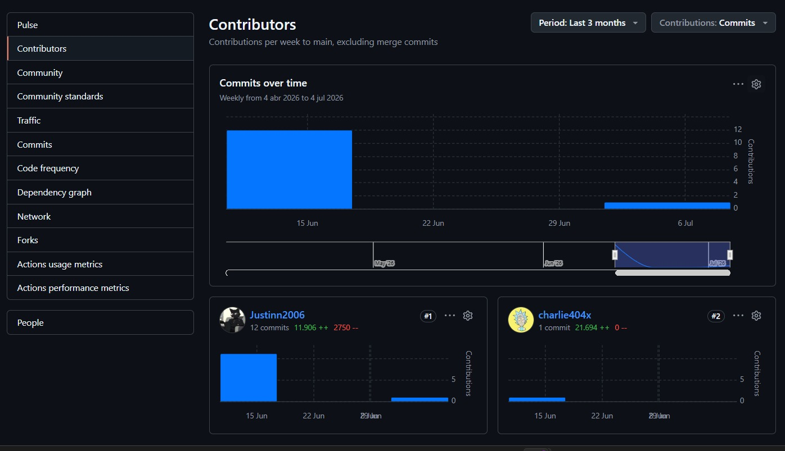<br>

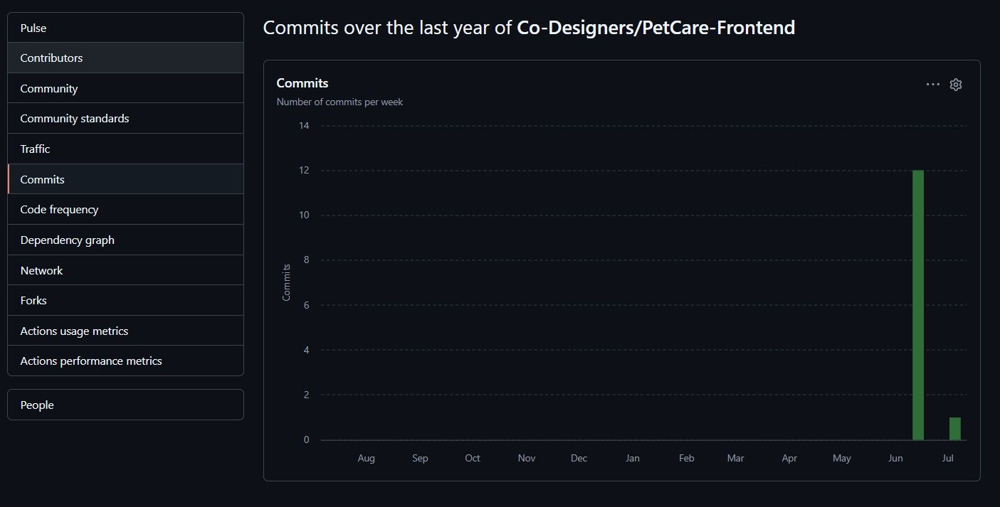


#### 5.3. Validation Interviews. 

#### 5.3.1. Diseño de Entrevistas.

Para el presente sprint, el objetivo de las entrevistas de validación es evaluar la usabilidad, eficiencia y satisfacción del usuario final tras haber interactuado con la primera versión funcional e integrada de la Web Application de PetCare. 

**Metodología:** Los entrevistados tuvieron acceso previo a la plataforma con una serie de tareas asignadas (registro, gestión de perfiles, historiales médicos y búsqueda). La entrevista grabada se enfoca en recolectar su retroalimentación cualitativa sobre dicha experiencia de uso, identificando puntos de dolor y oportunidades de mejora a nivel de Interfaz (UI) y Experiencia de Usuario (UX).

Se han elaborado dos guiones distintos adaptados a nuestros segmentos objetivo.

---

**Guion A: Segmento - Dueños de Mascotas**

**Fase 1: Introducción**
* "Hola, muchas gracias por tomarte el tiempo de probar la plataforma PetCare previamente. En esta breve entrevista, te haré algunas preguntas sobre tu experiencia navegando por la aplicación para entender qué funciona bien y qué podemos mejorar."

**Fase 2: Preguntas sobre Tareas y Flujos**
1. **(Registro y Autenticación):** ¿Qué te pareció el proceso para registrar tu cuenta e iniciar sesión por primera vez? ¿Te resultó claro y rápido?
2. **(Gestión de Mascotas):** Cuando intentaste añadir los datos de tu mascota en el sistema, ¿sentiste que faltó algún campo importante o la información solicitada fue la adecuada?
3. **(Historial Clínico):** Al revisar la sección del historial médico y las vacunas de tu mascota, ¿la información estaba organizada de una manera fácil de entender? 
4. **(Búsqueda de Veterinarias):** Durante tu búsqueda de una clínica veterinaria, ¿los filtros proporcionados (especialidad, ubicación) te ayudaron a encontrar lo que necesitabas?

5. ¿Hubo alguna pantalla o botón durante tu uso de la aplicación que te haya confundido o que no haya funcionado como esperabas?
6. En una escala del 1 al 5, ¿qué tan intuitiva te pareció la navegación general de la plataforma? ¿Por qué?
7. ¿Qué funcionalidad mejorarías o agregarías para sentirte más cómodo y seguro gestionando la salud de tu mascota con PetCare?

---

**Guion B: Segmento - Clínicas Veterinarias / Veterinarios**

**Fase 1: Introducción**
* "Hola, gracias por haber probado el panel de especialistas de PetCare. Nuestro objetivo hoy es conversar sobre tu experiencia registrando información clínica en el sistema, para asegurar que la herramienta se adapte realmente al día a día de una veterinaria."

**Fase 2: Preguntas sobre Tareas y Flujos**
1. **(Autenticación y Búsqueda):** ¿Cómo calificarías la rapidez y claridad al iniciar sesión y buscar el perfil de un paciente específico en la plataforma?
2. **(Registro de Diagnósticos):** Al momento de simular el registro de un nuevo diagnóstico o evolución clínica, ¿consideras que los campos del formulario cubren la información esencial que tomas en una consulta real?
3. **(Validación de Datos):** ¿Notaste algún problema, error o lentitud al momento de guardar la información del paciente en el sistema?
4. **(Organización Visual):** ¿Qué te pareció la estructura de la línea de tiempo donde se muestran las atenciones pasadas del paciente? ¿Fue fácil de leer?
5. ¿Hubo algún momento durante tu navegación en el que te sentiste perdido o no supiste cómo regresar a la pantalla anterior?
6. Pensando en la operatividad de tu clínica, ¿qué tan viable ves reemplazar tu método actual (papel, Excel o tu software actual) por una plataforma como PetCare?
7. ¿Qué cambio crítico le harías a la interfaz o a las funciones antes de implementarla formalmente en tu negocio?

#### 5.3.2. Registro de Entrevistas.

URL del video: https://drive.google.com/drive/folders/1YMjd51lNQAdM_DYEC-DyYMeVsmwdzVQ-?usp=sharing

**Segmento 1: Dueños de Mascotas

| N | Datos | Descripción | Imagen referencial |
|---|---|---|---|
| 1 | Nombre: Camila Vega Ruiz <br>Edad: 23 años <br>Distrito: Santiago de Surco, Lima | La usuaria evaluó la plataforma enfocándose en el uso desde dispositivos móviles y el módulo de atención a domicilio. Destacó positivamente la adaptabilidad de la interfaz, la carga de URLs para documentos clínicos en el historial y la facilidad para encontrar profesionales móviles independientes. Como oportunidades de mejora, recomendó añadir un campo de microchip en el perfil de la mascota, dar mayor visibilidad al botón de cancelación de citas e integrar una pasarela de pagos nativa. Calificó la plataforma con una puntuación de 5/5. | |
| 2 | Nombre: Mateo Silva Olavarría <br>Edad: 28 años <br>Distrito: Miraflores, Lima | El usuario evaluó el flujo completo del segmento "Dueños de Mascotas". Destacó positivamente la velocidad del proceso de autenticación y la utilidad del filtro por distrito para localizar veterinarias cercanas. Manifestó que la visualización del historial clínico es clara, valorando especialmente las alertas de próximas vacunas. Como puntos de mejora para los siguientes Sprints, sugirió optimizar la consistencia del menú lateral de navegación, añadir un campo de alergias en el registro de la mascota e implementar un sistema de recordatorios/notificaciones para las citas médicas. Calificó la usabilidad general de la plataforma con una puntuación de 4/5. | |
| 3 | Nombre: Ricardo Flores <br>Edad: 32 años<br>Distrito: San Borja, Lima| El usuario evaluó la plataforma desde una perspectiva de accesibilidad y gestión clínica para mascotas de edad avanzada. Resaltó de forma muy positiva el filtro de búsqueda por especialidad médica y la separación clara entre diagnóstico y tratamiento en el historial clínico. Como recomendaciones de mejora para la experiencia de usuario, sugirió incrementar el tamaño y contraste de las fuentes en el login, añadir un indicador visual de carga (spinner) al procesar citas, habilitar un campo para el peso de la mascota e integrar recetas digitales automatizadas. Calificó la usabilidad general con un 4/5. | |

**Segmento 2: Veterinarias y especialistas


| N | Datos | Descripción | Imagen referencial |
|---|---|---|---|
| 1 | Nombre: Dr. Alejandro <br>Apellido:Peralta <br>Edad: 31 años <br>Distrito: Lince, Lima<br>Profesión: Veterinario clínico | El usuario evaluó la herramienta desde la perspectiva operativa del veterinario en consulta. Destacó de forma muy positiva la rapidez en la búsqueda de pacientes y la legibilidad de la línea de tiempo cronológica de las atenciones. Como retroalimentación crítica para el proyecto, recomendó añadir campos obligatorios para signos vitales (temperatura, peso, frecuencia cardíaca) en el formulario de diagnóstico, optimizar el flujo de retorno a la lista de pacientes con un botón de "Volver" e integrar un botón visible en la interfaz para la carga directa de archivos adjuntos (recetas/exámenes). | |
| 2 | Nombre: Dra. Beatriz <br>Apellido: Mendoza <br>Edad: 45 años <br>Distrito: Santiago de Surco, Lima <br>Profesión: Veterinaria, dueña de clínica veterinaria | La usuaria aportó un enfoque administrativo y de gestión de clínicas. Valoró positivamente el rendimiento del backend al guardar datos y la utilidad de la línea de tiempo para el trabajo colaborativo entre médicos. Para la retroalimentación del proyecto, recomendó habilitar la búsqueda de pacientes mediante datos del propietario (DNI/Teléfono), enlazar directamente el flujo de "Citas" con la creación del "Historial Clínico" mediante un botón de acción inmediata ("Atender") y robustecer la gestión de accesos en el frontend según el rol del usuario (CLINIC vs personal administrativo). | |
| 3 | Nombre:Dr. Manuel  <br>Apellido: Zegarra <br>Edad: 58 años <br>Distrito: San Borja, Lima <br>Profesión: Veterinario | El usuario analizó el sistema bajo criterios de ergonomía, accesibilidad para adultos mayores y optimización de tiempos en consulta. Validó la estabilidad y velocidad del backend al guardar datos crudos. Sus principales aportes para la retroalimentación del proyecto consisten en: incrementar el tamaño y contraste de los componentes visuales de búsqueda, programar redirecciones automáticas al panel principal tras guardar un registro clínico, automatizar el cálculo de la fecha de la próxima dosis de vacunas (Next Due Date) e incorporar texto predefinido (plantillas) para los diagnósticos y tratamientos más recurrentes. | |

#### 5.3.3. Evaluaciones según heurísticas. 

### 5.2.3.5. Evaluaciones según heurísticas
La evaluación heurística permite identificar problemas de usabilidad en una interfaz mediante el análisis sistemático contra principios establecidos. Para el segmento de Clínicas Veterinarias / Veterinarios, se aplicó el método de evaluación de Jakob Nielsen con sus 10 principios de usabilidad, transformando el feedback recopilado durante las entrevistas de validación en métricas e indicaciones de ingeniería de software claras.

**Aplicación de las 10 Heurísticas de Nielsen:**

| # | Principio | Descripción |
|---|-----------|-------------|
| 1 | Visibilidad del estado del sistema | El sistema debe mantener al usuario informado sobre lo que está aconteciendo. |
| 2 | Compatibilidad con el mundo real | El sistema debe hablar el lenguaje y seguir las convenciones del usuario. |
| 3 | Control y libertad del usuario | Funciones de deshacer, rehacer y salidas fáciles disponibles. |
| 4 | Consistencia y estándares | Uso consistente de convenciones en todos los elementos de la interfaz. |
| 5 | Prevención de errores | Diseño limpio que evite proactivamente que ocurran equivocaciones. |
| 6 | Reconocimiento antes que recuerdo | Minimizar la carga de memoria mostrando objetos, acciones y opciones visibles. |
| 7 | Flexibilidad y eficiencia de uso | Presencia de aceleradores y automatizaciones para usuarios experimentados. |
| 8 | Diseño estético y minimalista | Eliminar información irrelevante o raramente necesaria de los flujos. |
| 9 | Recuperación de errores | Mensajes de error claros que indiquen el problema y aporten soluciones. |
| 10 | Ayuda y documentación | Sistema intuitivo acompañado de documentación enfocada en tareas. |

**Escala de Severidad:**
* **0 - Sin problema:** No se detecta ningún problema de usabilidad.
* **1 - Problema cosmético:** Detalle visual menor; no interfiere con el flujo ni requiere ser arreglado con urgencia.
* **2 - Problema menor:** Afecta ligeramente la fluidez; debe ser arreglado en el siguiente ciclo.
* **3 - Problema grave:** Interrupción molesta en el flujo o falta de datos críticos; alta prioridad de desarrollo.
* **4 - Catástrofe:** Bloquea por completo la operatividad; debe arreglarse de forma inmediata antes del lanzamiento.

---

#### Resultados de la Evaluación Heurística - Clínicas Veterinarias

**Entrevista N°1 - Dr. Alejandro Peralta Castro (Veterinario Clínico, Lince)**

| Hallazgo | Heurística | Severidad | Descripción |
|----------|------------|-----------|-------------|
| Falta de campos para registrar signos vitales básicos | Compatibilidad con el mundo real | 3 | El formulario clínico no incluye espacios nativos e independientes para peso, temperatura o frecuencias cardíaca/respiratoria. |
| El backend persiste y almacena datos de forma limpia | — | 0 | La creación y guardado de agregados clínicos (`MedicalRecord`) funciona velozmente y sin retrasos. |
| Navegación profunda sin salida rápida | Control y libertad del usuario | 2 | Tras ingresar a los detalles del historial, obliga a usar el menú lateral en lugar de poseer un botón contextualizado de "Volver". |

**Entrevista N°2 - Dra. Beatriz Mendoza Rey (Dueña de Clínica, Surco)**

| Hallazgo | Heurística | Severidad | Descripción |
|----------|------------|-----------|-------------|
| Limitación en los criterios de búsqueda de pacientes | Flexibilidad y eficiencia de uso | 2 | Solo permite buscar por datos directos de la mascota, ralentizando la recepción si el cliente solo recuerda su DNI o teléfono. |
| Flujo desconectado entre agenda y atención clínica | Flexibilidad y eficiencia de uso | 3 | El módulo de citas no cuenta con un acceso directo ("Atender") para instanciar automáticamente el formulario de historial médico. |
| Edición del historial desprotegida en el frontend | Prevención de errores | 3 | Falta bloquear o restringir campos de diagnóstico y tratamiento en la interfaz para evitar modificaciones por personal no médico. |
| La línea de tiempo cronológica es clara | Reconocimiento antes que recuerdo | 0 | La disposición secuencial de las atenciones pasadas facilita el diagnóstico colaborativo inmediatamente. |

**Entrevista N°3 - Dr. Manuel Zegarra Vivanco (Veterinario Senior, San Borja)**

| Hallazgo | Heurística | Severidad | Descripción |
|----------|------------|-----------|-------------|
| Interfaz carece de indicador de carga en transacciones | Visibilidad del estado del sistema | 3 | Al procesar la confirmación del guardado, la pantalla se mantiene fija sin un *spinner*, generando incertidumbre en el usuario. |
| Elementos con problemas de legibilidad y accesibilidad | Diseño estético y minimalista | 2 | Cajas de texto, iconos de búsqueda y fuentes son muy pequeños para médicos de edad avanzada o con fatiga visual. |
| Fechas de revacunación sin automatización de asistencia | Flexibilidad y eficiencia de uso | 2 | El usuario debe calcular y seleccionar manualmente en el calendario el campo `nextDueDate` en vez de recibir sugerencias por defecto. |
| Captura repetitiva de textos clínicos comunes | Flexibilidad y eficiencia de uso | 2 | El sistema obliga a redactar desde cero diagnósticos o tratamientos idénticos de protocolos altamente recurrentes. |

---

#### Resumen Consolidado

| Nivel de Severidad | Cantidad de Hallazgos | Porcentaje |
|-------------------|----------------------|-------------|
| Catástrofe (4) | 0 | 0% |
| Grave (3) | 4 | 40% |
| Menor (2) | 5 | 50% |
| Cosmético (1) | 0 | 0% |
| Sin problema (0) | 2 | 10% |

**Total de incidencias analizadas: 11 hallazgos**

---

#### Hallazgos Prioritarios a Resolver

| # | Hallazgo | Severidad | Recomendación de Ingeniería de Software |
|---|----------|-----------|-----------------------------------------|
| 1 | Pantalla estática sin indicador visual de guardado o procesamiento | 3 | Integrar animaciones de carga (*spinners*) y notificaciones emergentes de tipo *Toast* tras resolver las solicitudes HTTP POST/PUT. |
| 2 | Ausencia de inputs para constantes y funciones biológicas básicas | 3 | Modificar la UI y extender la entidad del backend para capturar estructuradamente peso, temperatura y signos vitales antes del diagnóstico. |
| 3 | Falta de botón de acción inmediata "Atender" en el listado de citas | 3 | Enlazar los contextos `appointmentmanagement` y `medicalrecords` en la UI mediante un desencadenador que autocomplete los IDs en el formulario. |
| 4 | Ausencia de segregación de permisos de edición en la interfaz médica | 3 | Consumir el rol del token JWT (`iam` context) para deshabilitar las acciones de escritura en el historial clínico si el usuario no posee el rol `CLINIC`. |
| 5 | Accesibilidad reducida por tamaño de fuentes y controles web | 2 | Optimizar las hojas de estilo (CSS) incrementando el contraste de color y aplicando variables proporcionales para mejorar la lectura. |

---

#### Conclusión

El Web Service Backend de PetCare exhibe un comportamiento técnico robusto y estable en cuanto a la persistencia de datos. Sin embargo, la evaluación heurística orientada al segmento clínico expone la necesidad de sincronizar con mayor precisión la interfaz web con el flujo dinámico de una consulta veterinaria real. Resolver la visibilidad de los estados de carga, flexibilizar la búsqueda de historiales por dueño y estructurar las métricas de salud básica elevará la viabilidad del software para reemplazar por completo el uso de papel o plantillas locales de oficina en los negocios asociados.

# Conclusiones

- **Validación de la problemática y oportunidad de mercado:**  
  A través de las entrevistas a profundidad y el análisis competitivo, se confirmó la existencia de una brecha significativa en el ecosistema veterinario digital. Los dueños de mascotas (Segmento 1) y las clínicas veterinarias (Segmento 2) enfrentan problemas de desorganización de historiales clínicos, comunicación ineficiente (WhatsApp/físico) y falta de herramientas de prevención. Esta validación justificó plenamente la propuesta de valor de PetCare como una plataforma unificada que integra IA e IoT para medicina preventiva.

- **Eficacia del proceso Lean UX y DDD:**  
  La aplicación del proceso Lean UX permitió al equipo formular hipótesis claras, definir assumptions y construir un Lean UX Canvas que alineó los outcomes de negocio con las soluciones tecnológicas. Complementariamente, el uso de Domain-Driven Design (DDD) y la técnica de Event Storming (Big Picture y Design-Level) facilitó la creación de un lenguaje ubicuo (*Ubiquitous Language*) y una arquitectura de software bien delimitada, reduciendo la complejidad comunicacional entre los stakeholders y el equipo técnico.

- **Implementación funcional y despliegue continuo:**  
  Se ejecutaron dos Sprints completos con resultados tangibles. El Sprint 1 entregó un Landing Page responsive, informativo y con soporte de internacionalización (ES/EN), desplegado exitosamente mediante GitHub Pages. El Sprint 2 avanzó significativamente al implementar una primera versión funcional de la Web Application, incluyendo vistas diferenciadas para dueños de mascotas y veterinarias, autenticación simulada con json-server, paneles de control, gestión de mascotas, historial médico, búsqueda de veterinarias, agenda y monitoreo IoT de prueba. Ambos componentes están accesibles públicamente.

- **Cumplimiento del Student Outcome ABET – EAC - Criterio 3:**  
  El equipo demostró una capacidad efectiva para comunicarse con diferentes rangos de audiencia. Durante las exposiciones orales (AV1, TB1), se utilizó un lenguaje claro y empático para los usuarios finales, mientras que en las coordinaciones técnicas se empleó terminología especializada (microservicios, DDD, IoT). En la comunicación escrita, se generó documentación técnica profesional (diagramas C4, User Stories, manuales de estilo) junto con artefactos visuales (wireframes, mockups) para audiencias no técnicas, evidenciando una sólida adaptación del mensaje según el contexto.

- **Lecciones aprendidas y mejora continua:**  
  A través de las retrospectivas de los Sprints, el equipo identificó áreas de mejora como la necesidad de una mayor trazabilidad entre historias de usuario y tareas técnicas. Esto llevó a una refinación del Sprint Backlog y a una mejor organización de los aspectos leaders y collaborators. Se concluye que la integración temprana de wireframes, mockups y user flows (desarrollados en Figma) fue crucial para alinear la visión del producto antes de la implementación, reduciendo retrabajos.

  # Video About The Team

[Enlace al Video]([https://upcedupe-my.sharepoint.com/:v:/g/personal/u20221a118_upc_edu_pe/IQC-XDpYZbt3Q7gBgmh65OdnAXNK_PjEKsUfb1jkxm94XC0?e=NOVCbM&nav=eyJyZWZlcnJhbEluZm8iOnsicmVmZXJyYWxBcHAiOiJTdHJlYW1XZWJBcHAiLCJyZWZlcnJhbFZpZXciOiJTaGFyZURpYWxvZy1MaW5rIiwicmVmZXJyYWxBcHBQbGF0Zm9ybSI6IldlYiIsInJlZmVycmFsTW9kZSI6InZpZXcifX0%3D](https://upcedupe-my.sharepoint.com/:f:/g/personal/u20221a118_upc_edu_pe/IgBXVj9IfV2aRIaglGvBtEomAXz7abU0DTM_hsZQda6fyh0?e=BXqbjZ))


# Bibliografía

- Bourgault, F. (2022). *Guía de pasos para llevar a cabo su evento Big Picture Event Storming*. Recuperado de:  
  https://www.eventstormingjournal.com/

- Brandolini, A. (2021). *Strategic Monoliths and Microservices: Driving Innovation Using Purposeful Architecture*. Pearson Education.

- Evans, E. (2004). *Domain-Driven Design: Tackling Complexity in the Heart of Software*. Addison-Wesley.

- Gothelf, J., & Seiden, J. (2016). *Lean UX: Designing Great Products with Agile Teams*. O'Reilly Media.

- Norman, D. (2013). *The Design of Everyday Things*. Basic Books.

- GitHub. (2026). *Documentación de GitHub Pages*. Recuperado de:  
  https://docs.github.com/en/pages

- Figma. (2026). *Guía de diseño colaborativo y prototipado*. Recuperado de:  
  https://help.figma.com

- Angular. (2026). *Documentación oficial de Angular*. Recuperado de:  
  https://angular.io/docs

- Spring Boot. (2026). *Referencia de arquitectura de microservicios*. Recuperado de:  
  https://spring.io/projects/spring-boot


# Anexos

Los siguientes anexos complementan la información presentada en el informe, proporcionando evidencia adicional y detalles técnicos del proyecto PetCare.

### Organización GitHub del equipo Co-Designers
[](https://github.com/Co-Designers)

Repositorio principal donde se gestionan los recursos, proyectos y colaboración del equipo desarrollador de PetCare.

### Repositorio del Project Report
[](https://github.com/Co-Designers/PetCare)

Repositorio que contiene la documentación académica y técnica del proyecto, incluyendo reportes, diagramas, evidencias y entregables del curso.

### Landing Page desplegada
[](https://co-designers.github.io/petcare-landingpage/)

Versión pública de la Landing Page de PetCare desplegada mediante GitHub Pages, diseñada para presentar la propuesta de valor, funcionalidades y beneficios de la plataforma.


### Web Application Frontend desplegada
[](https://co-designers.github.io/PetCare-Frontend/)

Primera versión funcional del frontend de la Web Application de PetCare, desarrollada con Angular e integrada con funcionalidades de autenticación, gestión de mascotas, historial médico y monitoreo IoT de prueba.


